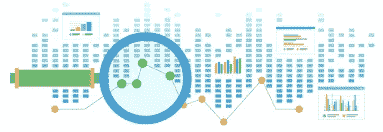
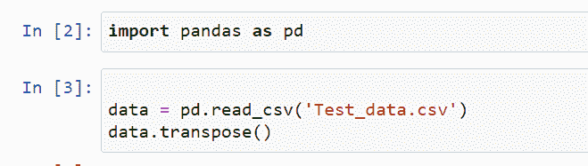
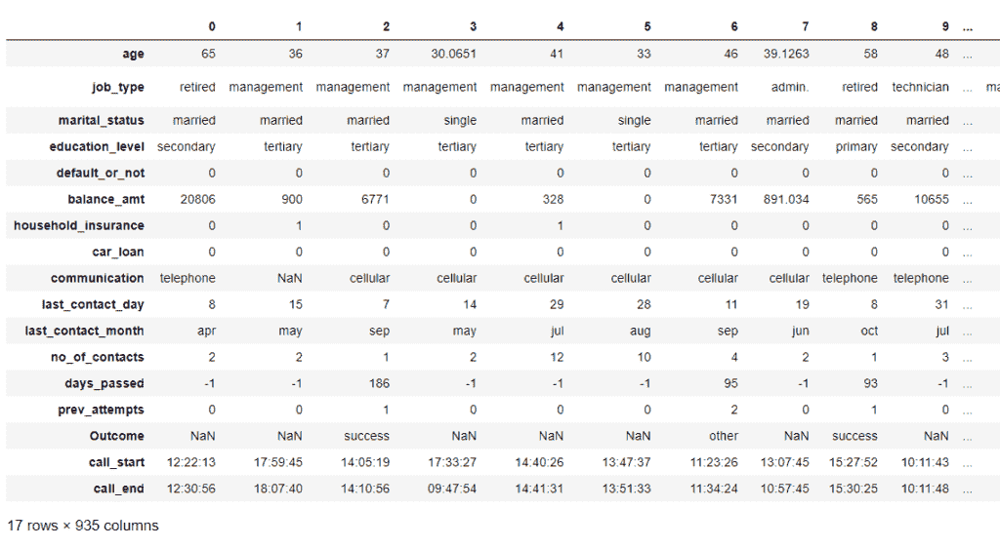
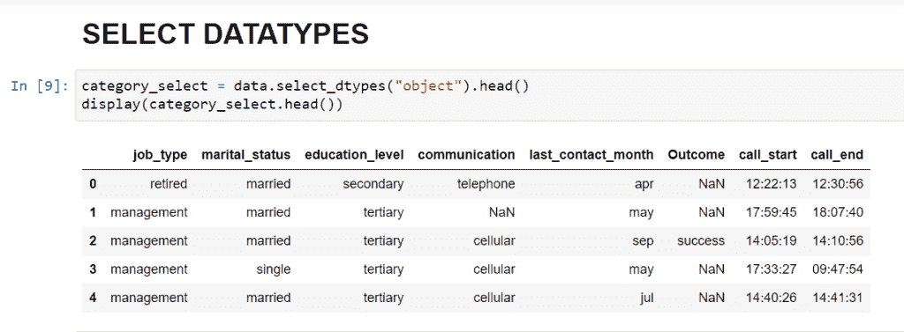
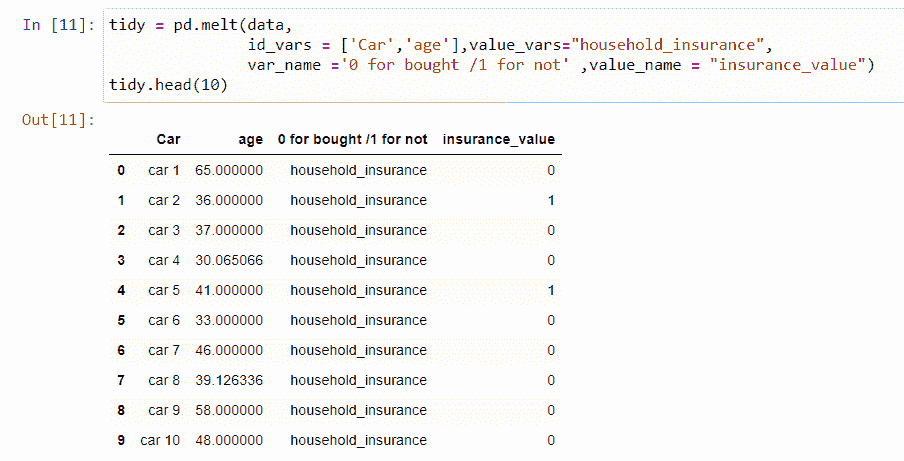
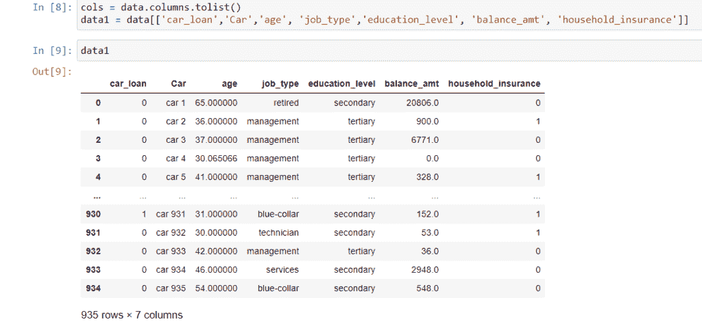
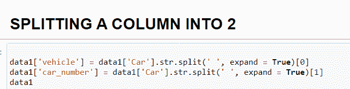
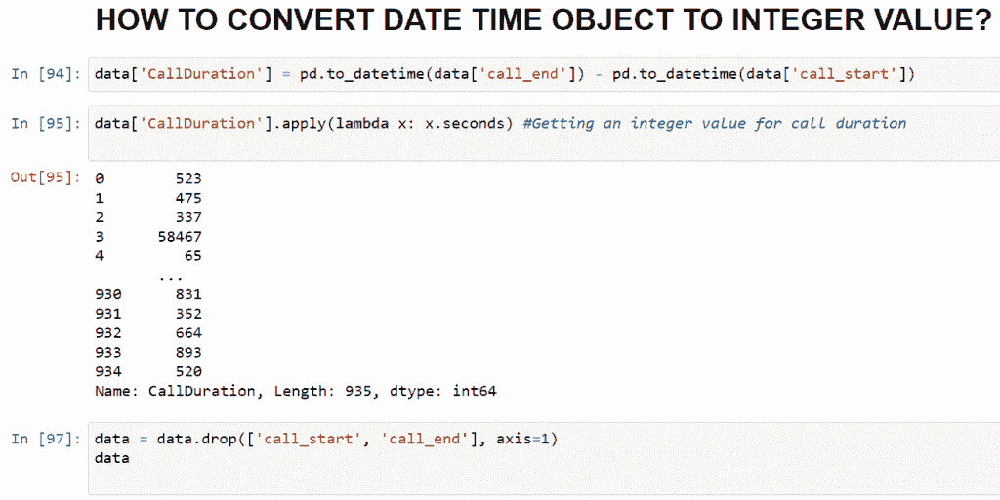

# Python 熊猫:数据分析的强大工具

> 原文：<https://medium.com/geekculture/python-pandas-a-powerful-tool-for-data-analytics-96edc5f59ccb?source=collection_archive---------19----------------------->

# 嘿极客们！这是我关于熊猫图书馆的新博客，这是一个面向数据科学学习者的深度工具。

将数据集转换成对项目有价值的部分并不困难。这需要深入的调查和研究，了解数据中你感兴趣的部分。

Python 使您能够以多种方式接触数据。其中之一，也是我最喜欢的是它的熊猫图书馆。正如它的名字让我兴奋一样，它接受 JSON、CSV、XLSX 等所有类型的数据的灵活特性，以及像切片/标签索引、时间序列函数等许多奇特的功能，都有助于我进行数据分析。

这里我有一些非常有用的命令，可以帮助你更好地分析数据。

首先，我们需要导入数据集

EDA 在处理大型数据集时变得更加困难。这里有一些快速的 DS hacks 来帮助你！

# select_dtypes()

此函数使您能够选择数据帧中的列及其数据类型。这样，您可以根据列**数据类型**创建许多有用的数据子集。

听起来很有趣？让我用代码展示给你看

# 融化()

***melt()*** 函数用于将数据帧从宽格式转换为长格式。它可以将多个列作为表的标识符，并允许您使用两个非标识符列(变量和值)来观察测量的变量。

# columns.tolist()

另一个在数据管理和分析中最常见的有趣实践是将 columns *obj* 数据类型转换为 list。因为与对象相比，修改列表更容易，所以这种方法可以帮助我们只提取那些对目标列有很大影响的列，或者改变数据帧中列的顺序。

# str.split()

在熊猫的帮助下，我们可以用 ***str.split()*** 方法将单个字符串拆分成多个列。这意味着它将返回不同列中所有分隔字符串的数据框。通过在函数中指定*分隔符*的值，可以很容易地做到这一点。当没有写分隔符时，空白被当作输入。

# 到日期时间()

处理数据科学中的日期时间功能也非常重要，因为它需要正确的格式和值来定型模型。

该函数将 *datetime* 参数作为输入参数，并将其转换为 python datetime 对象。

**λ函数**:

它们是可以带多个参数(*)但只返回一个表达式( ***主体部分*** )的无名函数(匿名)。与普通函数相比，这些函数执行速度更快。*

**

*在上面的例子中，我们将 ***call_start*** 和 ***call_end*** 列合并为一列，即 ***call_duration*** ，然后调用 lambda 函数，借助 *x.seconds()* 函数将 datetime 对象值转换为整数。*

*帖子最初通过数据科学中心社区发布*

*[https://www . datasciencecentral . com/profiles/blogs/python-pandas-an-in-depth-tool-for-data-analytics](https://www.datasciencecentral.com/profiles/blogs/python-pandas-an-in-depth-tool-for-data-analytics)*

*笔记本链接:[Data-science/ds hacks . ipynb at main ToobaAhmedAlvi/Data-science(github.com)](https://github.com/ToobaAhmedAlvi/Data-science/blob/main/DSHacks.ipynb)*

*我会带来一些更有趣的技巧。在那之前保持联系。:)*