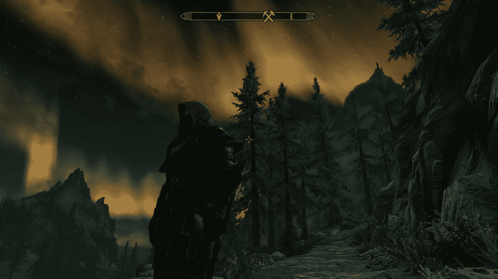

# Python 熊猫:为我的 Skyrim 文章收集数据

> 原文：<https://medium.com/geekculture/python-pandas-scraping-data-for-my-skyrim-article-456c0a6fcdbd?source=collection_archive---------13----------------------->

Copyright Bethesda Softworks LLC

在 medium.com 之外，我写了关于如何构建你的 RPG 角色的视频游戏策略。当我在写关于 Skyrim 的第四篇文章时，我注意到我不断地从公共维基上一遍又一遍地复制和输入相同的数据，这已经成为一项乏味的任务。

对于一个将编程作为爱好的人来说，如果我容忍这样做，我将背叛我的个人价值观…