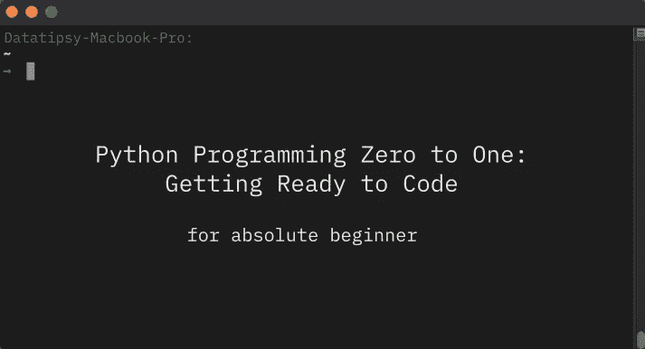
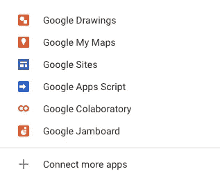
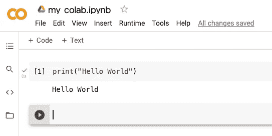
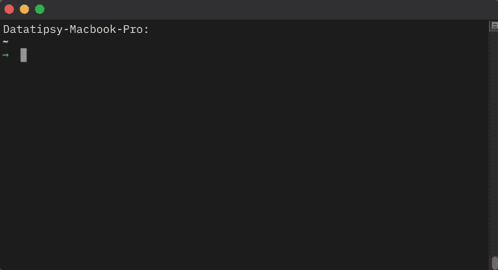
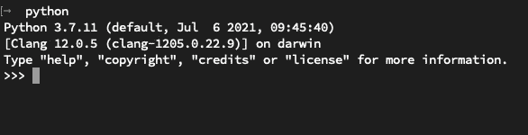
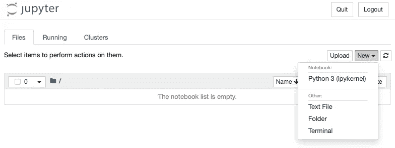
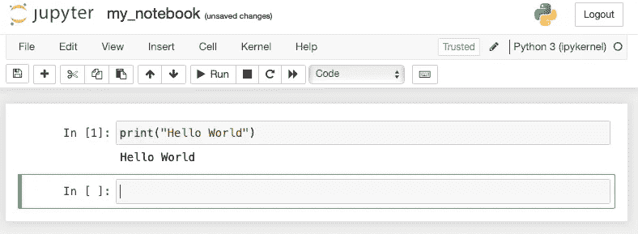
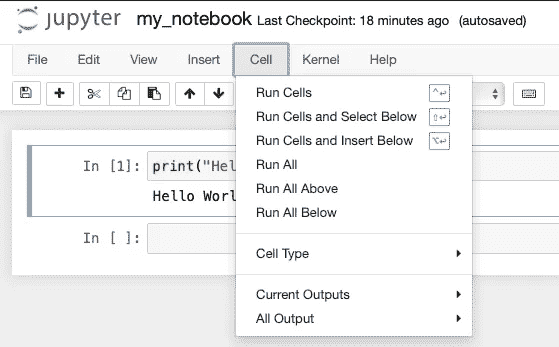
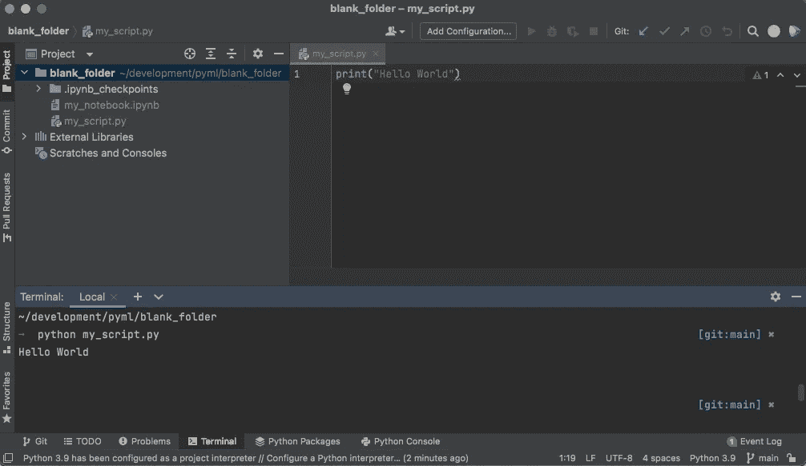

# Python 编程零到一:准备编码

> 原文：<https://medium.com/geekculture/python-programming-zero-to-one-getting-ready-to-code-9f43a7d1ba3f?source=collection_archive---------55----------------------->



对于那些完全不了解 Python 编程的人，恭喜你，你已经决定尝试一些新的东西。特别是对于那些非技术背景的人来说，学习编码并不容易。否则软件工程师不会有这么高的工资。

学习几天甚至一年的代码不会让你从零到英雄，尽管在线课程已经宣传过了。我只希望这至少能让你从零到一。

说够了，让我们开始吧。

…

这里我将介绍以下工具以及如何使用它开始编码:

*   谷歌的 Colab
*   命令行
*   Jupyter 笔记本
*   皮查姆

**1)谷歌的 Colab**

最快的编码方式是通过谷歌的 Colab。您只需进入 Google Drive，然后点击新建>更多>连接更多应用。然后找到**协作室**并安装。


Google Drive Homepage

然后再次单击新建>更多。然后点击谷歌协同实验室。



还有 TADA！你可以马上在 Colab 中编写代码



Google Colaboratory

我们称之为`notebook`(。ipynb)，一个将代码组织成多个单元文件。

您可以在单元格中编写 Python 代码，然后按 S*shift+Enter*来运行单元格中的代码。您将在运行的单元格下获得代码的输出。您可以通过按下按钮**+代码**(在**+文本**旁边)来添加更多单元格。

如果在一个单元格中定义一些变量并运行它，该变量可以在所有单元格中重用。举个例子，

```
a = 1 + 3
```

运行上述单元将不会显示任何内容。但是，运行下面的单元格将显示 4 作为输出，因为在运行上面的单元格后，值 4 保存在变量`a`下。

```
print(a)
```

4

如果你完全不知道我在说什么，请访问 https://www.codecademy.com，在那里你可以免费学习基本的 Python。或者，你可以在 YouTube 上搜索“Python 入门”，你会找到足够的资源让你入门。

如果你在学习 Python 的过程中遇到困难，欢迎加入我们的讨论，在这里提问[https://discord.gg/EcM9MkBxWH](https://discord.gg/EcM9MkBxWH)

**2)命令行**

这是管理文件、虚拟环境、库等的一个非常重要的工具。如果你还不知道它们是什么，你不必担心。

在 Mac 上，打开一个名为`Terminal`或`iTerm`的程序，只需用*命令+空格键*打开 Spotlight 搜索，就能找到它。



Terminal

在 Windows 上，您可以使用*窗口键+ X* 或在窗口搜索中键入 *cmd* 来打开`Command Prompt`。

**2.1 文件管理命令行**

在这里你可以做很多事情。

您可以使用`ls`列出当前目录中的文件和文件夹(键入`ls`然后*输入*)。

```
ls
```

你会在根目录下看到很多东西，包括桌面文件夹。

您可以使用`cd`将目录切换到您的目标文件夹，就像从图形用户界面(GUI)双击您的文件夹一样。在下面的例子中，您将移动到桌面上名为`your_folder`的文件夹中。

```
cd Desktop/your_folder
```

如果你再次`ls`，你会看到`your_folder`里面的文件和文件夹。如果有`your_subfolder`，你也可以搬进去。

```
cd your_subfolder
```

您可以使用`cd ..`(带 2 个点)在当前目录之外移动一步。如果您在`your_folder`中，运行命令后您将在`Desktop`中。可以用`cd`(不带任何点)移回根目录。

你可以用命令行做更多的事情，你可以使用关键字`Command Line`在线查找更多信息。

**2.2 编写 Python 代码的命令行**

在你[下载](https://www.python.org/downloads/)安装 Python 之后，你将能够在终端中编写 Python 代码。

```
python
```

通过键入`python`和 *Enter，*您的终端将变成一个 python 控制台，您可以在这里编写 Python 代码。



Python Console

这仅适用于简短的 Python 代码样本或实验。要退出 Python 控制台，键入`exit()`然后*回车。*

如果您已经将 Python 代码收集到一个文件中(。py)，您也可以在终端中运行它。这里我们假设文件名为`my_script.py`

```
python my_script.py
```

**3) Jupyter 笔记本**

Jupyter notebook 是另一个写代码的工具。它与 Colab 非常相似，但它位于本地(您的物理计算机)，而 Colab 位于云上。这类似于 Excel 对 Google Sheet。个人比较喜欢 Jupyter 笔记本，因为运行速度更快。

首先，我们需要安装`PIP`，这是一个安装其他 python 库的工具，包括我们可以使用 Jupyter Notebook 的`jupyterlab`。为此，请遵循[说明](http://python -m ensurepip --upgrade)。

一旦你有了匹普，你就能跑了

```
pip install jupyterlab
```

这将为您安装必要的库。完成后，我建议您创建一个新文件夹，用于存储与 Python 项目相关的文件。下面的例子是在桌面中创建一个名为`my_python_project`的文件夹的命令行。

```
cd Desktop
mkdir my_python_project
```

然后，使用此命令打开 Jupyter 笔记本。

```
jupyter notebook
```

这将打开一个具有以下界面的 web 浏览器。你可以点击*新建> Python 3* 创建一个新的笔记本。



Jupyter homepage



Jupyter notebook

恭喜你！现在你可以在 Jupyter 笔记本上编码了。

您可以使用按钮+添加新的单元格，或者使用剪刀符号删除单元格。点击*运行所有*可以运行所有单元格，如下图所示。



Run All Option

要重启笔记本并清除输出，请使用内核>重启并清除输出。这将删除变量中存储的所有值。当事情开始变得混乱时，这是有用的。

回到终端，你会看到它变成了 Jupyter 笔记本服务器。你需要保持它运行，停止它意味着关闭笔记本服务器，你将无法访问或编辑你的笔记本。

如果你需要关闭你的电脑或者关闭你的终端，你只需要在你的目标目录下使用`jupyter notebook`命令重新打开服务器。

您可以将笔记本导出为`.py`文件并运行。

PyCharm

PyCharm 适合对 Python 稍微熟悉一点的人。您需要[下载 PyCharm](https://www.jetbrains.com/pycharm/download/#section=mac) ，并创建一个文件夹作为项目。您可以创建和查看项目中的所有文件，可以使用终端和其他有用的功能，如调试、虚拟环境等。



当你有信心走出 Jupyter 笔记本世界，创建一个更复杂的项目时，请直接进入 PyCharm。网上有很多教程你可以看看。