# 如何使用 Seaborn Python 库制作统计数据可视化的交互式绘图

> 原文：<https://medium.com/geekculture/python-seaborn-statistical-data-visualization-in-plot-graph-f149f7a27c6e?source=collection_archive---------3----------------------->

By- SANDEEP KUMAR PATEL

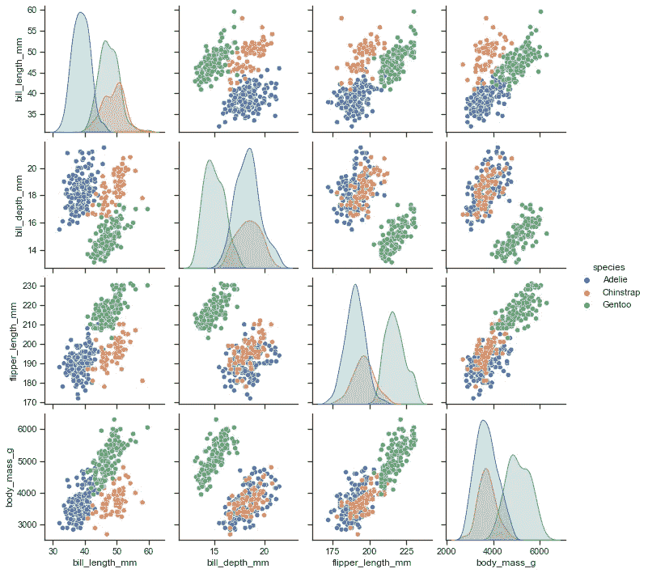

# 海生的

Seaborn 是一个基于 matplotlib 的 Python 数据可视化库。它提供了一个高层次的界面来绘制有吸引力的和信息丰富的统计图形。
关于这个库背后的思想的简要介绍，你可以阅读介绍性笔记。请访问安装页面，了解如何下载该软件包并开始使用。您可以浏览示例库，看看可以用 seaborn 做些什么，然后查看教程和 API 参考来了解如何做。
要查看代码或报告错误，请访问 GitHub 资源库。一般支持问题在 Stackoverflow 或 discourse 上最常见，这些网站为 seaborn 提供了专门的渠道。

在这篇文章中，我们试图创建一个绘图各种选项在 seaborn 图书馆提供的最有效的方式来绘图和可视化我们的数据离开

# 带误差带的时间序列图

**seaborn 使用的组件:**`[**set_theme()**](https://seaborn.pydata.org/generated/seaborn.set_theme.html#seaborn.set_theme)``[**load_dataset()**](https://seaborn.pydata.org/generated/seaborn.load_dataset.html#seaborn.load_dataset)``[**lineplot()**](https://seaborn.pydata.org/generated/seaborn.lineplot.html#seaborn.lineplot)`

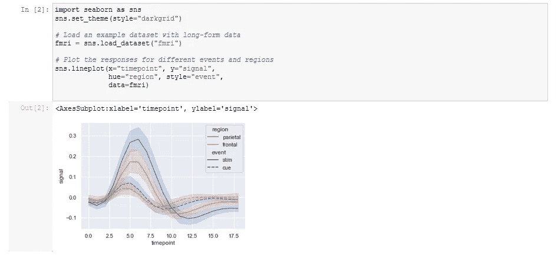

# 具有连续色调和大小的散点图

**使用的海鹏组件:**、`[**set_theme()**](https://seaborn.pydata.org/generated/seaborn.set_theme.html#seaborn.set_theme)`、`[**load_dataset()**](https://seaborn.pydata.org/generated/seaborn.load_dataset.html#seaborn.load_dataset)`、`[**cubehelix_palette()**](https://seaborn.pydata.org/generated/seaborn.cubehelix_palette.html#seaborn.cubehelix_palette)`、`[**relplot()**](https://seaborn.pydata.org/generated/seaborn.relplot.html#seaborn.relplot)`

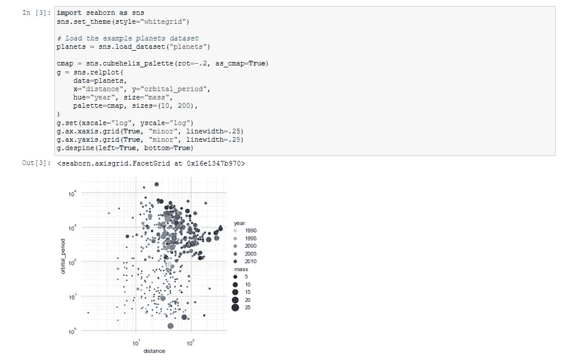

# 小型多重时间序列

**使用的海鹏组件:**、`[**set_theme()**](https://seaborn.pydata.org/generated/seaborn.set_theme.html#seaborn.set_theme)`、`[**load_dataset()**](https://seaborn.pydata.org/generated/seaborn.load_dataset.html#seaborn.load_dataset)`、`[**relplot()**](https://seaborn.pydata.org/generated/seaborn.relplot.html#seaborn.relplot)`、`[**lineplot(**](https://seaborn.pydata.org/generated/seaborn.lineplot.html#seaborn.lineplot)`

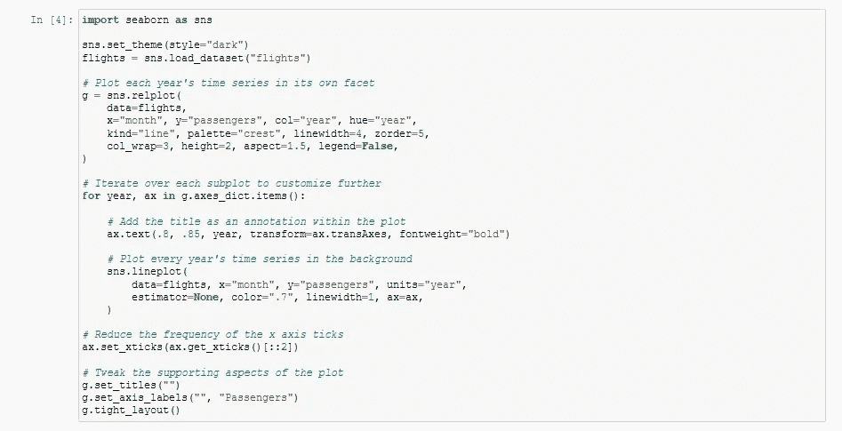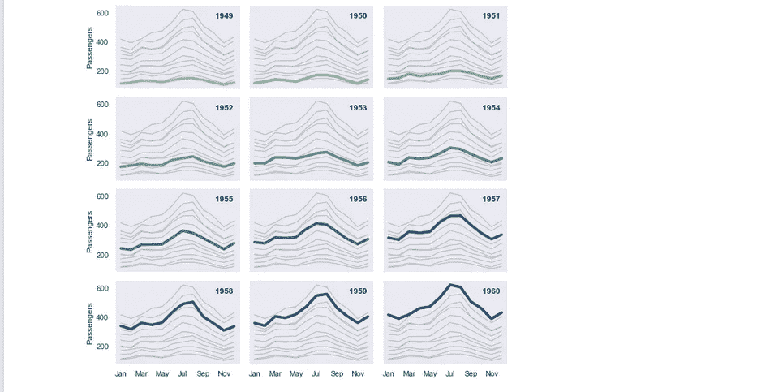

# 带观察值的水平箱线图

**使用的海博组件:**、`[**load_dataset()**](https://seaborn.pydata.org/generated/seaborn.load_dataset.html#seaborn.load_dataset)`、`[**boxplot()**](https://seaborn.pydata.org/generated/seaborn.boxplot.html#seaborn.boxplot)`、`[**stripplot()**](https://seaborn.pydata.org/generated/seaborn.stripplot.html#seaborn.stripplot)`、`[**despine()**](https://seaborn.pydata.org/generated/seaborn.despine.html#seaborn.despine)`

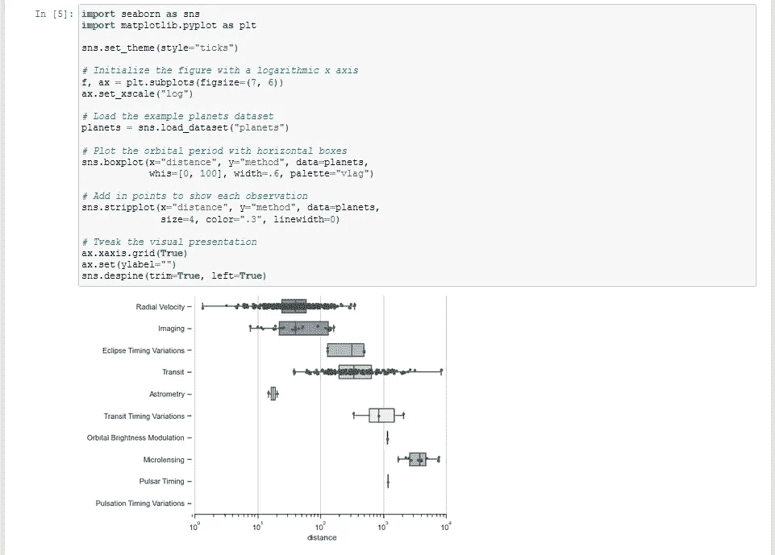

# 边缘分布的线性回归

**seaborn 组件使用:**`[**set_theme()**](https://seaborn.pydata.org/generated/seaborn.set_theme.html#seaborn.set_theme)``[**load_dataset()**](https://seaborn.pydata.org/generated/seaborn.load_dataset.html#seaborn.load_dataset)``[**jointplot()**](https://seaborn.pydata.org/generated/seaborn.jointplot.html#seaborn.jointplot)`

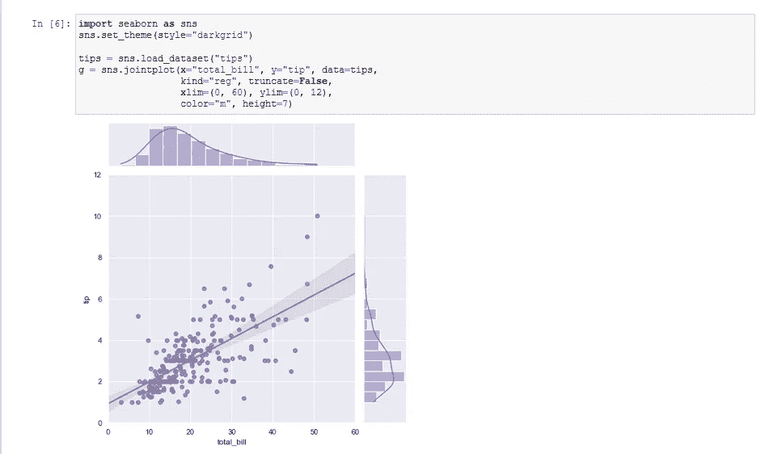

# 具有不同点大小和色调的散点图

**使用的海鹏组件:** `[**set_theme()**](https://seaborn.pydata.org/generated/seaborn.set_theme.html#seaborn.set_theme)`、`[**load_dataset()**](https://seaborn.pydata.org/generated/seaborn.load_dataset.html#seaborn.load_dataset)`、`[**swarmplot()**](https://seaborn.pydata.org/generated/seaborn.swarmplot.html#seaborn.swarmplot)`

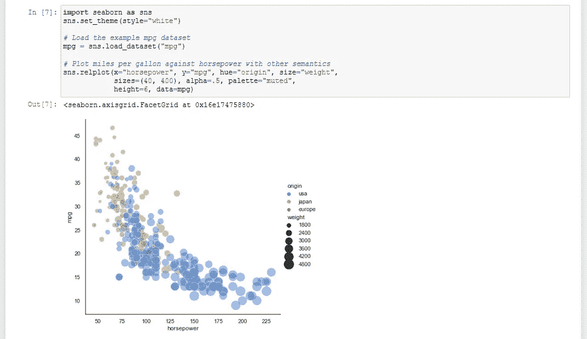

# 分类变量散点图

**使用的 seaborn 组件:**、`[**set_theme()**](https://seaborn.pydata.org/generated/seaborn.set_theme.html#seaborn.set_theme)`、`[**load_dataset()**](https://seaborn.pydata.org/generated/seaborn.load_dataset.html#seaborn.load_dataset)`、`[**swarmplot()**](https://seaborn.pydata.org/generated/seaborn.swarmplot.html#seaborn.swarmplot)`

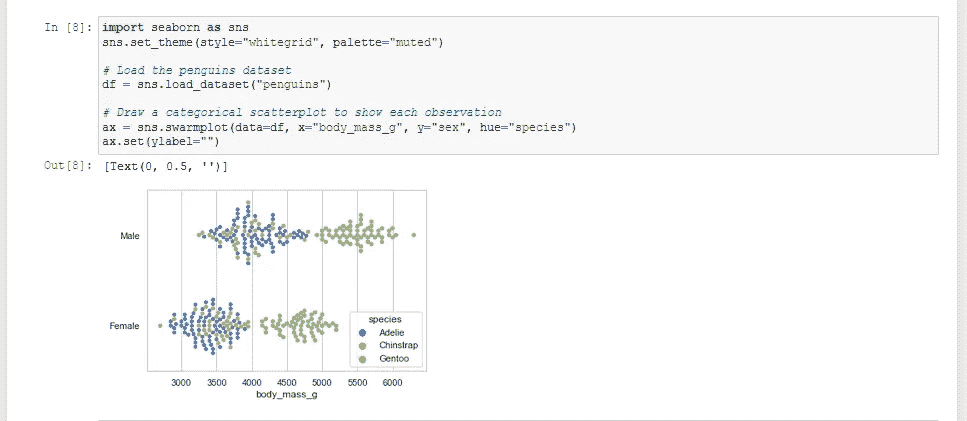

# 带观察的小提琴图

**seaborn 使用的组件:**、`[**set_theme()**](https://seaborn.pydata.org/generated/seaborn.set_theme.html#seaborn.set_theme)`、`[**violinplot()**](https://seaborn.pydata.org/generated/seaborn.violinplot.html#seaborn.violinplot)`

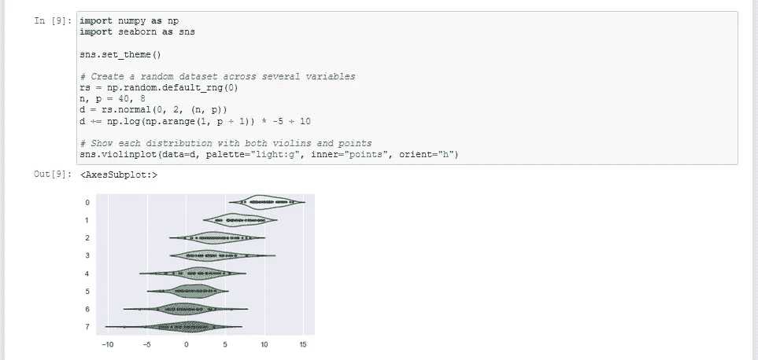

# 具有边缘直方图的平滑核密度

**seaborn 使用的组件:**`[**set_theme()**](https://seaborn.pydata.org/generated/seaborn.set_theme.html#seaborn.set_theme)``[**load_dataset()**](https://seaborn.pydata.org/generated/seaborn.load_dataset.html#seaborn.load_dataset)``[**JointGrid**](https://seaborn.pydata.org/generated/seaborn.JointGrid.html#seaborn.JointGrid)`

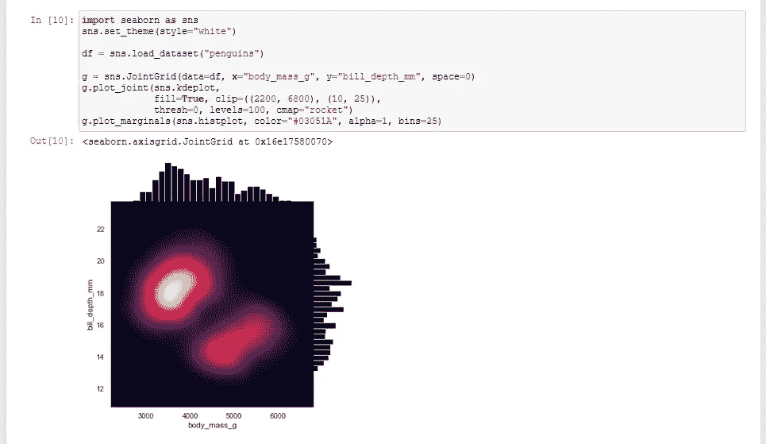

# 带注释的热图

**使用的海鹏组件:**、`[**set_theme()**](https://seaborn.pydata.org/generated/seaborn.set_theme.html#seaborn.set_theme)`、`[**load_dataset()**](https://seaborn.pydata.org/generated/seaborn.load_dataset.html#seaborn.load_dataset)`、`[**heatmap()**](https://seaborn.pydata.org/generated/seaborn.heatmap.html#seaborn.heatmap)`

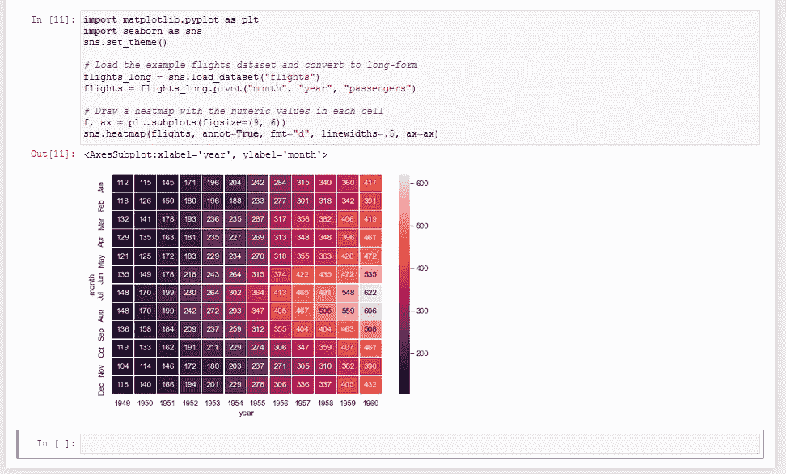

# 绘制大型分布图

**使用的 seaborn 组件:**、`[**set_theme()**](https://seaborn.pydata.org/generated/seaborn.set_theme.html#seaborn.set_theme)`、`[**load_dataset()**](https://seaborn.pydata.org/generated/seaborn.load_dataset.html#seaborn.load_dataset)`、`[**boxenplot()**](https://seaborn.pydata.org/generated/seaborn.boxenplot.html#seaborn.boxenplot)`

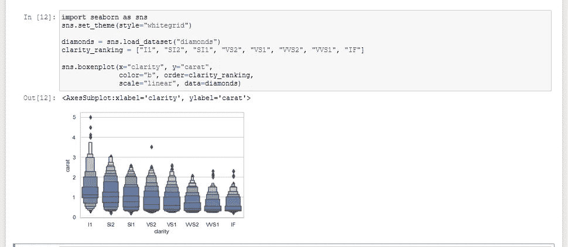

# 具有不同点大小和色调的散点图

**seaborn 组件使用:**`[**set_theme()**](https://seaborn.pydata.org/generated/seaborn.set_theme.html#seaborn.set_theme)``[**load_dataset()**](https://seaborn.pydata.org/generated/seaborn.load_dataset.html#seaborn.load_dataset)``[**relplot()**](https://seaborn.pydata.org/generated/seaborn.relplot.html#seaborn.relplot)`

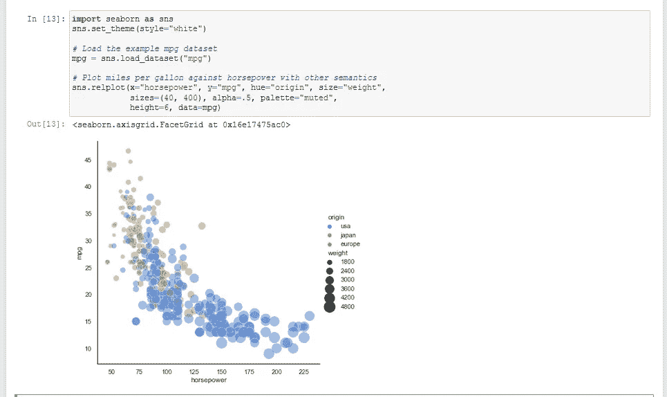

# 对数标度的堆积直方图

**使用的海鹏组件:**、`[**set_theme()**](https://seaborn.pydata.org/generated/seaborn.set_theme.html#seaborn.set_theme)`、`[**load_dataset()**](https://seaborn.pydata.org/generated/seaborn.load_dataset.html#seaborn.load_dataset)`、`[**despine()**](https://seaborn.pydata.org/generated/seaborn.despine.html#seaborn.despine)`、`[**histplot()**](https://seaborn.pydata.org/generated/seaborn.histplot.html#seaborn.histplot)`

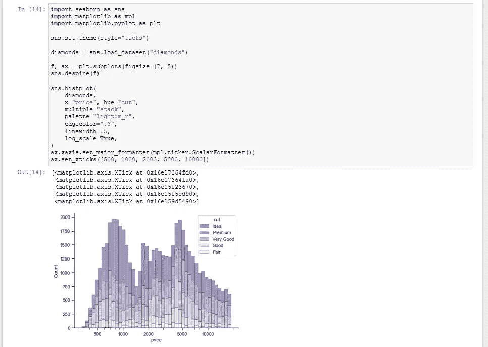

# 配对分类图

**使用的 seaborn 组件:**、`[**set_theme()**](https://seaborn.pydata.org/generated/seaborn.set_theme.html#seaborn.set_theme)`、`[**load_dataset()**](https://seaborn.pydata.org/generated/seaborn.load_dataset.html#seaborn.load_dataset)`、`[**PairGrid**](https://seaborn.pydata.org/generated/seaborn.PairGrid.html#seaborn.PairGrid)`、`[**despine()**](https://seaborn.pydata.org/generated/seaborn.despine.html#seaborn.despine)`

# 在大量面上绘图

**seaborn 使用的组件:** `[**set_theme()**](https://seaborn.pydata.org/generated/seaborn.set_theme.html#seaborn.set_theme)`，`[**FacetGrid**](https://seaborn.pydata.org/generated/seaborn.FacetGrid.html#seaborn.FacetGrid)`

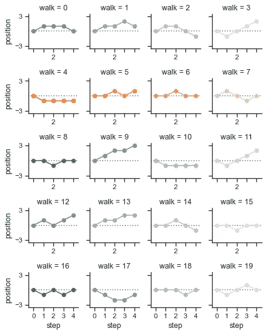

# 宽格式数据集中的紫色图

**使用的海博组件:**、`[**load_dataset()**](https://seaborn.pydata.org/generated/seaborn.load_dataset.html#seaborn.load_dataset)`、`[**violinplot()**](https://seaborn.pydata.org/generated/seaborn.violinplot.html#seaborn.violinplot)`、`[**despine()**](https://seaborn.pydata.org/generated/seaborn.despine.html#seaborn.despine)`

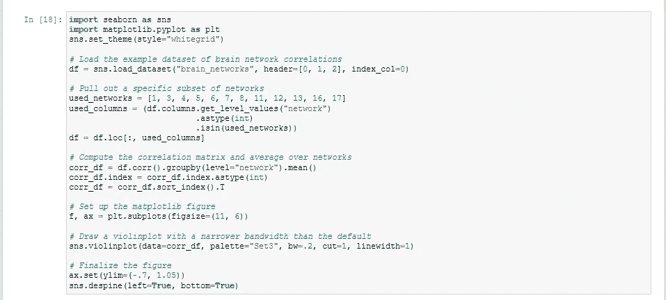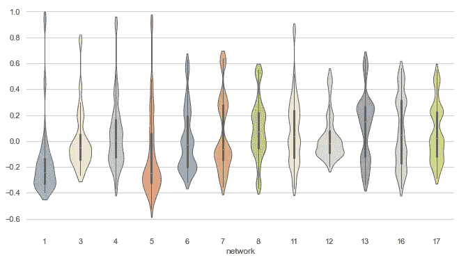

# 带观察的小提琴图

**seaborn 使用的组件:**、`[**set_theme()**](https://seaborn.pydata.org/generated/seaborn.set_theme.html#seaborn.set_theme)`、`[**violinplot()**](https://seaborn.pydata.org/generated/seaborn.violinplot.html#seaborn.violinplot)`

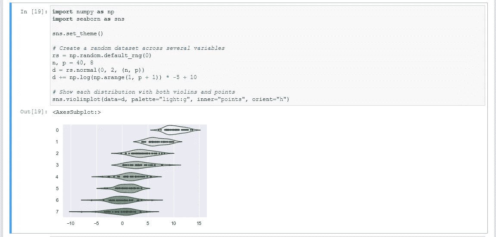

# 多元素二元图

**使用的海鹏组件:**`[**set_theme()**](https://seaborn.pydata.org/generated/seaborn.set_theme.html#seaborn.set_theme)``[**scatterplot()**](https://seaborn.pydata.org/generated/seaborn.scatterplot.html#seaborn.scatterplot)``[**histplot()**](https://seaborn.pydata.org/generated/seaborn.histplot.html#seaborn.histplot)``[**kdeplot()**](https://seaborn.pydata.org/generated/seaborn.kdeplot.html#seaborn.kdeplot)`

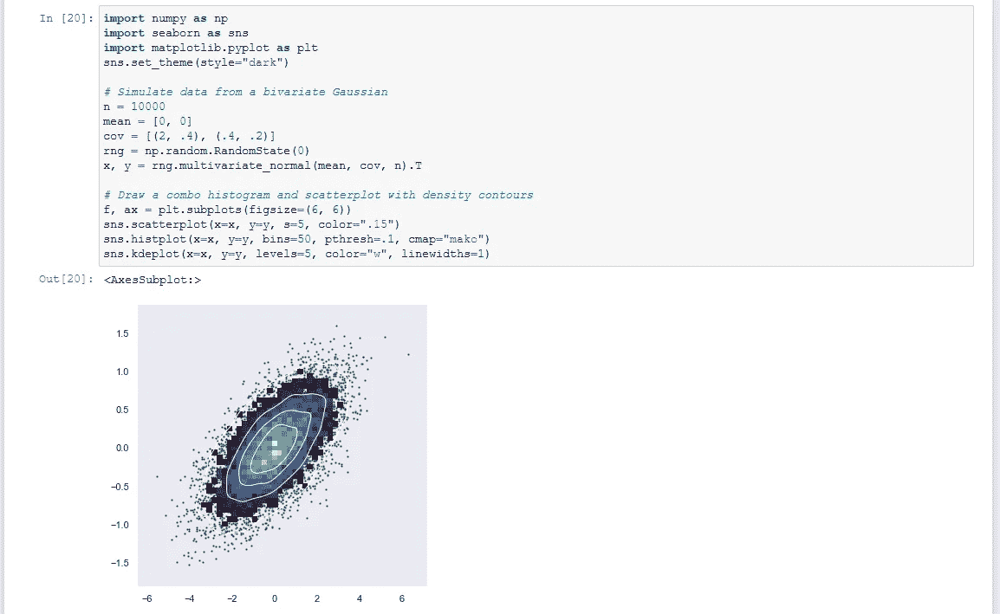

# 条件核密度估计

**使用的海博组件:**、`[**load_dataset()**](https://seaborn.pydata.org/generated/seaborn.load_dataset.html#seaborn.load_dataset)`、`[**displot()**](https://seaborn.pydata.org/generated/seaborn.displot.html#seaborn.displot)`

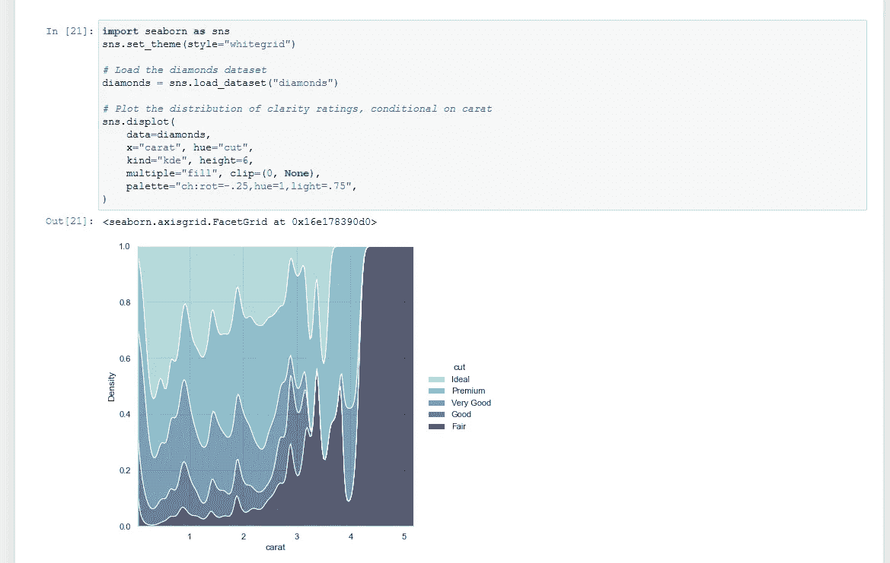

**了解更多详情-**

 [## seaborn:统计数据可视化——seaborn 0 . 11 . 1 文档

### Seaborn 是一个基于 matplotlib 的 Python 数据可视化库。它为绘图提供了一个高级接口…

seaborn.pydata.org](https://seaborn.pydata.org/) 

**感谢您抽出时间……..！！！**