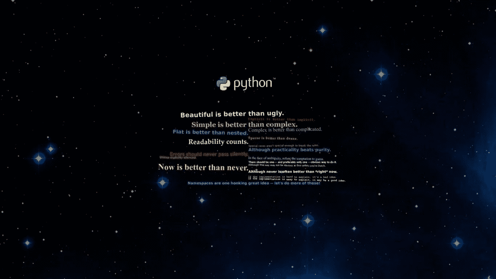
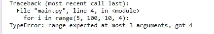

# Python 系列:范围函数的威力

> 原文：<https://medium.com/geekculture/python-series-the-power-of-range-function-bb0de763eb0e?source=collection_archive---------20----------------------->



一次一个函数地揭开 Python 的神秘面纱。Python 是一种美丽而强大的编码语言，我将分解其中的一些函数，让你更好地理解它们能做什么。在本文中，我将介绍 python 中的 range 函数以及您可以用它做的强大的事情。这是本系列的第一篇文章，我希望您会喜欢阅读和实现这些代码。

**范围**()是 **Python 的内置函数。**默认情况下**范围**()函数返回一个数字序列，默认情况下从 0 开始，递增 1(默认情况下)，在指定的数字前停止。range 类型表示一个不可变的数字序列，通常用于在 for 循环中循环特定的次数。

## 选择你的战士:

**类**范围(停止)
类**范围(开始、停止[、步进])**

**示例:**

```
for i in range(5):
    print(i)....................Output...............
0
1
2
3
4
```

在上面的例子中，你会注意到指定的数字没有被指定。这是因为您告诉 for 循环遍历 0–5 范围内的所有数字，而不打印 5。它将在指定的次数处停止迭代。给定的数字绝不是生成序列的一部分。所以基本上 *range(5)* 生成 5 个值 *range(10)* 生成 10 个值；长度为指定数的序列中项目的合法索引。

可以让范围从另一个数字开始，或者指定一个不同的增量(甚至是负数；这被称为“步骤”)。

**示例:**

```
#when you specify two numbers in the range function, it sees the #first number as start number i.e start from the range of this #number and include it, and the second number as end number i.e end #the range here but don't include this number.for i in range(5, 10):
    print(i)....................Output..................
5
6
7
8
9
............................................
#when you specify three numbers in the range function, the last #number is considered step; increment by the last number instead of #the default which is one.for i in range(0, 10, 3):
    print(i)......................Output...................
0
3
6
9
...............................................
#you can also do increment for negative numbersfor i in range(0, -10, -3):
    print(i).....................Output....................
0
-3
-6
-9
...............................................for i in range(-10, -100, -30):
    print(i)......................Output....................
-10
-40
-70
................................................
```

如果你在 range 函数内加上四个数字…你自己…实际上，你会得到这个:



要迭代序列的索引，可以将 *range()* 和 [*len()*](https://www.guru99.com/python-string-length-len.html#:~:text=len()%20is%20a%20built,provide%20the%20number%20of%20elements.) 组合起来，如下所示:

```
a = ['reader', 'is', 'doing', 'amazingly', 'well']
**for** i **in** range(len(a)):
   print(i, a[i]).....................Output......................
0 reader
1 is
2 doing
3 amazingly
4 well
..................................................
#a[i] is indexing the list a with the number i
```

如果只打印一个范围，会发生奇怪的事情:

```
print(range(10))........................Output...............
range(0, 10)
.............................................
```

在许多方面，由`*range()*`返回的对象表现得好像它是一个列表，但事实上，它不是。它是一个对象，当你对它进行迭代时，它返回所需序列的连续项，但是它并不真正生成列表，因此节省了空间。

我们说这样一个对象是 [iterable](https://docs.python.org/3/glossary.html#term-iterable) ，也就是说，它适合作为函数和构造的目标，这些函数和构造期望从某个对象获得连续的项目，直到供应耗尽。我们已经看到，`[for](https://docs.python.org/3/reference/compound_stmts.html#for)`语句就是这样一个构造，而采用 iterable 的函数的一个例子是`[sum()](https://docs.python.org/3/library/functions.html#sum)`:

```
print(sum(range(4)))  # 0 + 1 + 2 + 3....................Output.................6
..........................................
```

与常规列表或元组相比，range 类型的优势在于 range 对象将始终占用相同(少量)的内存，而不管它所代表的范围大小(因为它只存储开始、停止和步长值，根据需要计算单个项目和子范围)。

Range 对象提供了包含测试、元素索引查找、切片和对负索引的支持等功能。

**示例:**

```
r = range(0, 20, 2)#if 11 is in the range of the numbers above print True otherwise #print Falseprint(11 in r)
...........Output..........
False
...........................#if 10 is in the range of the numbers above print True otherwise #print Falseprint(10 in r)
..................Output.......
True
...............................#print the index of the number 10 in the range aboveprint(r.index(10))
..................Output.......
5
...............................#print the number in the position of 5 in the range of values we have in the variable rprint(r[5])
..................Output..........
10
..................................#print the numbers that is indexed from the start position to index of 5print(r[:5])
...............Output..............
range(0, 10, 2)
...................................#print the last number of rprint(r[-1])...............Output................
18
.....................................
```

范围实现了除串联和重复之外的所有[常见的](https://docs.python.org/3/library/stdtypes.html#typesseq-common)序列操作(因为范围对象只能表示遵循严格模式的序列，而重复和串联通常会违反该模式)。

您也可以使用 range 的反转功能；它从后面执行操作

示例:

```
for i in reversed(range(8)):
    print(i)....................Output..............
7
6
5
4
3
2
1
0
........................................
```

最后，也许你对如何从一个范围中获取一个列表感到好奇。以下是解决方案:

```
print(list(range(10))).....................Output.................
[0, 1, 2, 3, 4, 5, 6, 7, 8, 9]
............................................print(list(range(1, 11))).....................Output.................
[1, 2, 3, 4, 5, 6, 7, 8, 9, 10]
............................................print(list(range(0, 30, 5))).....................Output.................
[0, 5, 10, 15, 20, 25]
............................................print(list(range(0, 10, 3))).....................Output.................
[0, 3, 6, 9]
............................................print(list(range(0, -10, -1))).....................Output.................
[0, -1, -2, -3, -4, -5, -6, -7, -8, -9]
............................................print(list(range(0))).....................Output.................
[]
............................................print(list(range(1, 0))).....................Output.................
[]
............................................
```

## **需要牢记的事情**

*   范围构造函数的参数必须是整数(要么是内置的`[int](https://docs.python.org/3/library/functions.html#int)`，要么是任何实现了`__index__`特殊方法的对象)。如果省略*步骤*参数，则默认为`1`。如果省略*开始*参数，则默认为`0`。如果*步骤*被写成数字 0，`[ValueError](https://docs.python.org/3/library/exceptions.html#ValueError)`上升。
*   对于正*步*，范围`r`的内容由公式`r[i] = start + step*i`确定，其中`i >= 0`和`r[i] < stop`。
*   对于负的*步骤*，范围的内容仍然由公式`r[i] = start + step*i`决定，但是约束是`i >= 0`和`r[i] > stop`。
*   如果`r[0]`不满足值约束，范围对象将为空。范围确实支持负索引，但是这些被解释为从正索引所确定的序列的末尾开始索引。
*   包含大于`[sys.maxsize](https://docs.python.org/3/library/sys.html#sys.maxsize)`的绝对值的范围是允许的，但某些特性(如`[len()](https://docs.python.org/3/library/functions.html#len)`)可能会提高`[OverflowError](https://docs.python.org/3/library/exceptions.html#OverflowError)`。

感谢你的阅读，我希望这篇文章能让你学到一两件事。如果您有任何问题，可以发表评论，可以通过电子邮件(minaomobonike@gmail.com)与我联系。