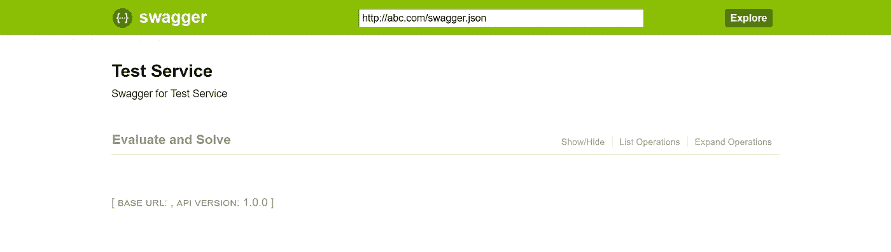
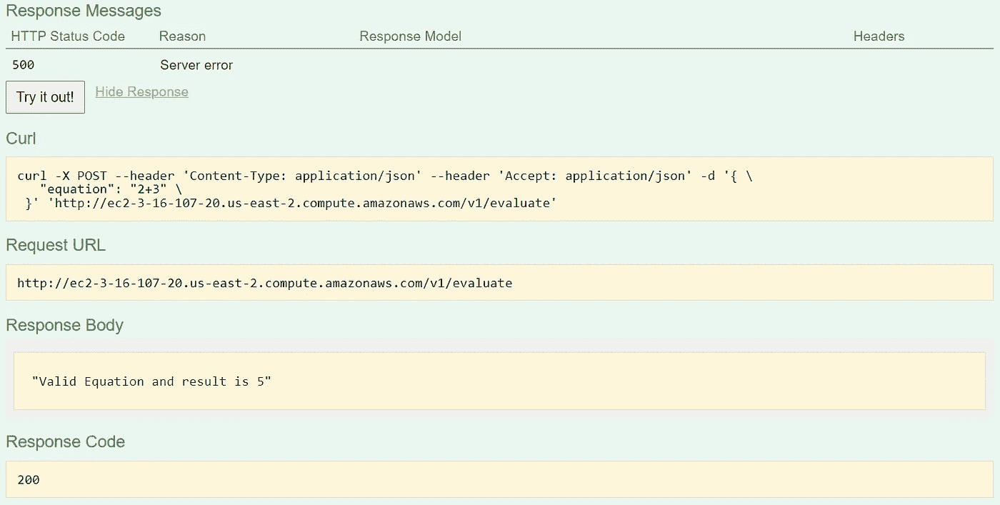
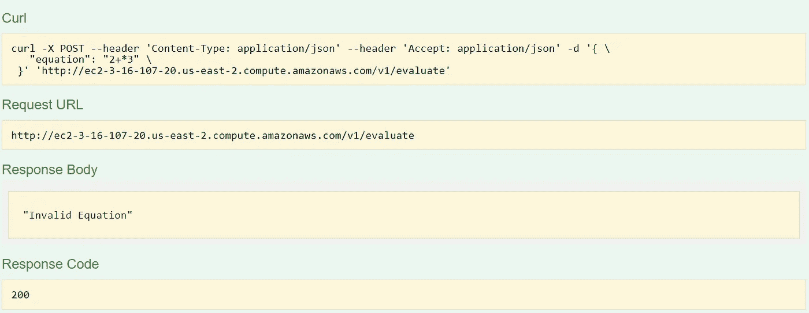

# Python 源代码混淆

> 原文：<https://medium.com/geekculture/python-source-code-obfuscation-6b97f88a460d?source=collection_archive---------0----------------------->

## 加密你的 Python 代码以避免逆向工程。


Photo by [Mauro Sbicego](https://unsplash.com/@maurosbicego?utm_source=unsplash&utm_medium=referral&utm_content=creditCopyText) on [Unsplash](https://unsplash.com/s/photos/encryption?utm_source=unsplash&utm_medium=referral&utm_content=creditCopyText)

> 在软件开发中，**模糊处理**是指故意创建人类难以理解的源代码的行为。代码经常被混淆，以保护知识产权或商业秘密，并防止攻击者*逆向工程*一个专有软件程序。

*加密程序的部分或全部代码是一种混淆方法。*

在 Python 中，有多个可用的包，使用它们您可以混淆您的代码库并保护您的知识产权。

*   [**pyarmor**](https://pypi.org/project/pyarmor/) —十六进制编码的完全混淆；显然不允许只对变量/函数名进行部分模糊处理。
*   [**python-minifier**](https://pypi.org/project/python-minifier/)—缩小代码并混淆函数/变量名。
*   [**pyminifier**](https://pypi.org/project/pyminifier/) —擅长混淆函数、变量、文字的名称；也可以像 pyarmor 一样执行十六进制编码(压缩)。问题:模糊处理后，代码可能包含语法错误，无法运行。

在研究过程中，我发现了另一种使用 [Cython](https://cython.org) 混淆我的 Python 代码的方法，这种方法非常有用，很难进行逆向工程。

*模糊处理* *是 Cython 软件包提供的众多特性之一*。Cython 是一个**优化静态编译器**，它可以将你的`.py`模块转换成高性能的 C 文件。生成的 C 文件可以毫不费力地编译成本地二进制库。编译完成后，没有办法将编译后的库还原成可读的 Python 源代码。

让我向您介绍使用 Cython 进行 Python 源代码模糊处理的步骤。我们将使用一个简单的项目来展示这一点。

## 演示代码混淆的示例代码

我已经编写了一个基于 python Flask 的小代码，它将数字方程作为输入，验证该方程，如果有效，就解析该方程。没有什么逻辑，只是为了教程的目的。这个想法是为了展示业务逻辑的代码混淆。

## 码基数

*   [https://github.com/mohammedvaghjipurwala/code_obfuscation](https://github.com/mohammedvaghjipurwala/code_obfuscation)

代码回购看起来像…

```
.
├── README.md
├── __init__.py
├── main.py
├── routes.py
├── swagger.yml
├── src
│   ├── __init__.py
│   └── solver.py
└── compile.py
```

## 代码走查

*   `main.py`:这个文件是 flask 引导文件，flask app 通过这个文件启动。
*   `routes.py`:该文件托管应用程序提供的所有 API 路由
*   `swagger.yml`:这个文件存放 API 细节，可以通过浏览器以格式化文档的形式访问。
*   `src/solver.py`:这个文件承载了验证等式的业务逻辑，如果有效，就求解等式。
*   `compile.py`:这个文件托管了从`.py`文件构建`.so`文件的代码库。

[https://github.com/mohammedvaghjipurwala/code_obfuscation/blob/main/compile.py](https://github.com/mohammedvaghjipurwala/code_obfuscation/blob/main/compile.py)

## 代码执行

要运行 Flask 应用程序，请在终端中执行以下命令

```
python main.py
```

现在，您可以使用 URL 访问 Swagger API 文档

```
http://<public-ip>/ui
```



Swagger



Success Response



Error Response

## 运行 compile.py

根据您使用的 Python 版本，运行:

```
python compile.py build_ext --inplace
```

…或者，对于 Python 3:

```
python3 compile.py build_ext --inplace
```

上述命令将在您的`.py`源文件旁边生成`.so`和`.c`文件:

```
.
├── README.md
├── __init__.py
├── main.py
├── routes.py
├── swagger.yml
├── src
│   ├── __init__.py
│   ├── solver.py
│   ├── solver.c
│   └── solver.cpython-37m-x86_64-linux-gnu.so
└── compile.py
```

`.c`文件是用于生成`.so`文件的中间源，这些文件是您想要分发的二进制模块。在 Windows 上构建时，这些文件可能会有`.pyd`扩展名。

成功构建后，您可以删除`.pyc,` `.c`和`.py`文件，只保留`.so`文件。为此添加了一个方法。

请注意`.so`-文件在其名称中包含目标平台(例如，在我的 MacOS 上为`darwin`)。显然，编译的模块不是跨平台的。如果你把你的程序分发给 Ubuntu Linux 用户，你应该在 Linux 上编译它。否则你将无法加载这些二进制文件。因此，您必须为每个目标平台编译特定于平台的代码版本。

该脚本的触发器可以添加到支持构建应用程序包的安装文件或 docker 文件中。需要运输的最终包将具有模糊的知识产权，这真的很难反向工程。

## 参考

*   [https://www . techtarget . com/search security/definition/obfuscation](https://www.techtarget.com/searchsecurity/definition/obfuscation)
*   [https://medium . com/@ xpl/protecting-python-sources-using-cy thon-DCD 940 bb 188 e](/@xpl/protecting-python-sources-using-cython-dcd940bb188e)
*   [https://gist.github.com/ctokheim/6c34dc1d672afca0676a](https://gist.github.com/ctokheim/6c34dc1d672afca0676a)

如果你觉得这个博客有用，请鼓掌👏或者评论💬。欢迎任何反馈或建设性的批评🙌。

你可以在 [LinkedIn](https://in.linkedin.com/in/mohammed-vaghjipurwala-aab561b9) 或 [Twitter](https://twitter.com/mohammedhv) 或下面的评论区联系我。

> 快乐编码..！！！*💻*