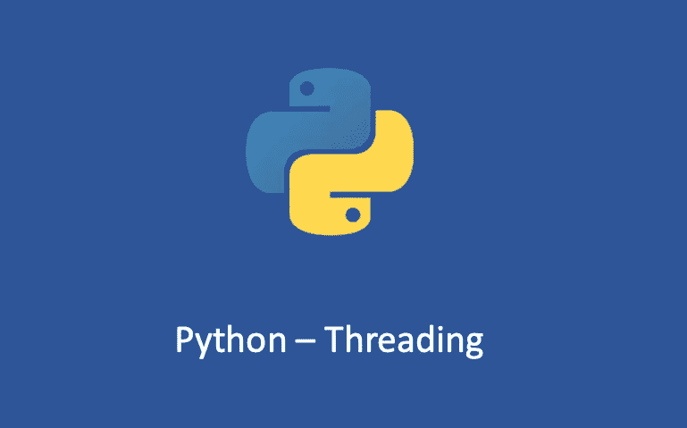

# python——python 3 中的线程，第一部分

> 原文：<https://medium.com/geekculture/python-threading-in-python3-part-one-cfadc174ceb8?source=collection_archive---------3----------------------->

## Python3 线程游戏攻略

# 什么是 Python 线程？

根据定义，线程是一个独立的执行流。你可能认为你可以同时运行两个线程，但是在 Python3 中，不同的线程实际上并不同时运行，它们只是出现在你面前，让你产生错觉。也就是说，不是所有的任务都可以…