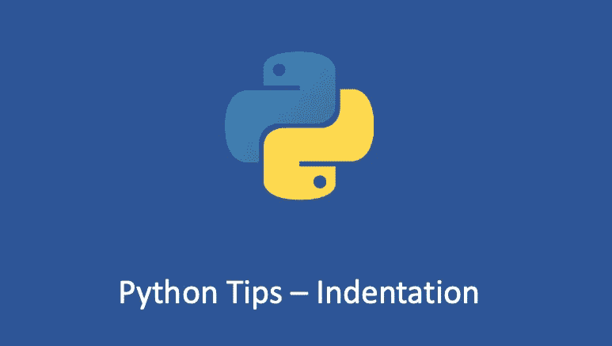

# Python 提示—缩进是如何工作的

> 原文：<https://medium.com/geekculture/python-tips-how-indentation-works-8c3953b98c1a?source=collection_archive---------5----------------------->

## Python 中你可能不知道的缩进规则

缩进是指代码行开头的空格。在其他编程语言中，代码中的缩进只是为了可读性，而 Python 中的缩进非常重要。Python 使用缩进来表示代码块。如果不对 Python 代码进行适当的缩进，您最终会看到…