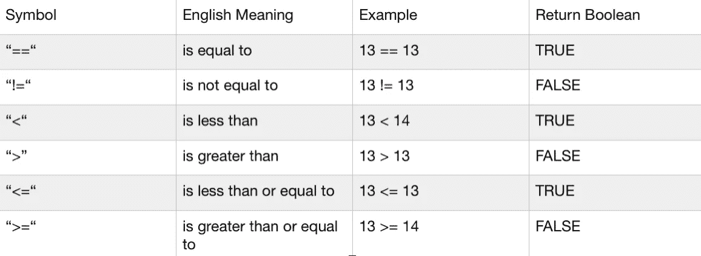
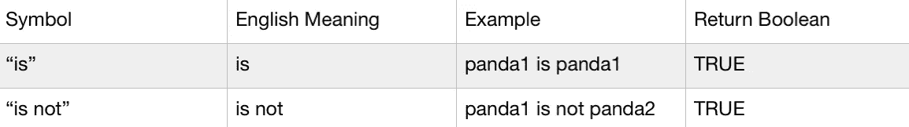

# Python 到 C++，数据科学家学习新语言的旅程——条件、条件语句和一个简单的计算器项目

> 原文：<https://medium.com/geekculture/python-to-c-a-data-scientists-journey-to-learning-a-new-language-conditions-conditional-49d823258436?source=collection_archive---------19----------------------->


# 介绍

亲爱的读者，欢迎回到 Python 到 C++系列的下一期。上次我们讨论了数字和字符串，特别是在 Python 和 C++编程语言中我们可以使用的一些方法。在本文中，我们将研究二进制条件句，它们在两种编程语言中的使用，我们将利用到目前为止所学的一切，用两种语言创建我们自己的简单计算器程序！下面是我们将用来学习条件句的全部代码:

[Python 原始代码](https://github.com/Daniel-Benson-Poe/Python_to_Cpp_Series/blob/main/Article_4/python/binary_conditionals.py)

[C++原代码](https://github.com/Daniel-Benson-Poe/Python_to_Cpp_Series/blob/main/Article_4/cpp/binary_conditionals.cpp)

# 情况

条件是告诉计算机我们想要检查某个陈述是真还是假的一种方式。这些语句将总是返回二进制值 true 或 false。例如，假设我有十三个苹果，我可以问你:“对还是错，我有十三个苹果。”同样，我可以让计算机检查条件“13 等于 13 吗？”或者“13 等于 12 吗”？为了告诉计算机我们想要检查一个条件并接收一个布尔值，我们使用了许多不同的符号:



Python 语言也有自己的特定条件符号，用于特殊情况，称为标识运算符。这些运算符用于检查两个变量、值或对象是否是同一个对象:



现在让我们来看看代码中的一些例子！

Python:

```
# Boolean Values
print(True)
print(False)# basic conditions
print(13 == 13)
print(13 == 12)
print(13 != 13)
print(13 != 12)
print(13 < 13)
print(13 < 14)
print(13 > 13)
print(13 > 12)
print(13 <= 13)
print(13 <= 12)
print(13 >= 13)
print(13 >= 14)
print(13 == 13)
print(13 == "Today")
print(13 != "Today")# Python specific conditions
panda1 = "Greg"
panda2 = panda1.copy()
panda3 = panda1
panda4 = "Mike"
print(panda1 is panda2)
print(panda1 is panda3)
print(panda1 is not panda4)
```

退货:

```
$ python3 binary_conditionals.py>> True
>> False
>> True
>> False
>> False
>> True
>> False
>> True
>> False
>> True
>> True
>> False
>> True
>> False
>> True
>> False
>> True
>> True
>> False
>> True
```

C++:

```
// boolean values
std::cout << true << std::endl;
std::cout << false << std::endl;// basic condition statements
std::cout << (13 == 13) << std::endl;
std::cout << (13 == 12) << std::endl;
std::cout << (13 != 13) << std::endl;
std::cout << (13 != 12) << std::endl;
std::cout << (13 < 13) << std::endl;
std::cout << (13 < 14) << std::endl;
std::cout << (13 > 13) << std::endl;
std::cout << (13 > 12) << std::endl;
std::cout << (13 <= 13) << std::endl;
std::cout << (13 <= 12) << std::endl;
std::cout << (13 >= 13) << std::endl;
std::cout << (13 >= 14) << std::endl;// std::cout << (13 == "Today") << std::endl;
// std::cout << (13 != "Today") << std::endl;
```

退货:

```
$ g++ -o binary_conditionals binary_conditionals.cpp
$ ./binary_conditionals>> 1
>> 0
>> 1
>> 0
>> 0
>> 1
>> 0
>> 1
>> 0
>> 1
>> 1
>> 0
>> 1
>> 0
```

从上面的代码中可以立即看出 Python 和 C++之间的一些差异。首先，虽然 Python 语言允许您在字符串和数字类型之间进行比较，但是如果您试图比较这两种类型，C++将会抛出错误。第二，Python 返回明确的真和假布尔值，而 C++返回 0 和 1。虽然两者仍被视为布尔值，但 C++将布尔值 0 编码为假，将 1 编码为真。

# 条件语句

条件语句是一种检查是否满足特定条件的方法，并根据返回的布尔值确定程序中接下来要运行的代码。其中最基本的是 if…else 语句，在 if 语句之后检查一个条件。如果该条件返回 true，则运行 If 块中的代码。否则，将运行 else 块中的代码。让我们再次假设我有 13 个苹果。我可以说“如果我有 13 个苹果，我会给你 2 个，否则我会给你 3 个。”让我们看看这在代码中是什么样子的。

Python:

```
# Conditional Statements
a = True
b = Falseif a == True:
    print("Hello readers")
else:
    print("a not true")if b == True:
    print("Hello again readers")
else:
    print("b not true")
```

退货:

```
$ python3 binary_conditionals.py>> Hello readers
>> b not true
```

C++:

```
// Conditional statementsbool a = true;
bool b = false;if (a == true) {
    std::cout << "Hello readers\n";
}
else {
    std::cout << "a not true\n";
}if (b == true) {
    std::cout << "Hello again readers\n";
}
else {
    std::cout << "b not true\n";
}
```

退货:

```
$ g++ -o binary_conditionals binary_conditionals.cpp
$ ./binary_conditionals>> Hello readers
>> b not true
```

如果我们想要检查不止一个条件，我们可以使用 if…else if…else 语句。该语句将从检查 if 块中的条件开始。如果不满足该条件，它将继续前进并检查下一个块中的条件，否则如果。如果满足这个条件，它将运行这个块中的代码，然后移出 if…else if…else 语句，进入下一个代码。如果这里不满足条件，它将根据您想要检查的条件的数量移动到下一个 else if 块或 else 块。在 Python 中，else if 语句被写成 elif，而在 C++中，它被写成完整的 else if。这方面的例子如下。

Python:

```
c = 5if c > 10:
    print("c is greater than 10")
elif c > 5:
    print("c is greater than 5 but less than 10")
elif c > 0:
    print("c is greater than 0 but less than 5")
else:
    print("c is a negative number")print("input any number you want")
d = int(input())if d > 1000:
    print("d is greater than 1000")
elif d > 500:
    print("d is greater than 500 but less than 1000")
elif d > 100:
    print("d is greater than 100 but less than 500")
elif d > 0:
    print("d is greater than 0 but less than 100")
else:
    print("d is a negative number")
```

退货:

```
$ python3 binary_conditions.py>> c is greater than 0 but less than 5
>> input any number you want
>> 55
>> d is greater than 0 but less than 100
```

C++:

```
int c = 5;if (c > 10){
    std::cout << "c is greater than 10\n";
}
else if (c > 5){
    std::cout << "c is greater than 5 but less than 10\n";
}
else if (c > 0){
    std::cout << "c is greater than 0 but less than 5\n";
}
else{
    std::cout << "c is a negative number\n";
}int d;std::cout << "Type in a whole number\n";
std::cin >> d;if (d > 1000){
    std::cout << "d is greater than 1000\n";
}
else if (d > 500){
    std::cout << "d is greater than 500 but less than 1000\n";
}
else if (d > 100){
    std::cout << "d is greater than 100 but less than 500\n";
}
else if (d > 0){
    std::cout << "d is greater than 0 but less than 100\n";
}
else{
    std::cout << "d is a negative number\n";
}
```

退货:

```
$ g++ -o binary_conditionals binary_conditionals.cpp
$ ./binary_conditionals>> c is greater than 0 but less than 5
>> Type in a whole number
>> 55
>> d is greater than 0 but less than 100
```

我们也可以使用复杂的条件语句，在决定运行下一个代码块之前，检查多个条件。一个例子是，“如果我有 13 个苹果，而你没有苹果，我会把我的一半给你。”一些代码示例如下所示。

Python:

```
# Complex conditional statementse = 200
f = 6if e < 500 and e > 100:
    print("e is between 100 and 500")
elif e < 100 and e > 0:
    print("e is between 0 and 100")
elif e < 0:
    print("e is negative")if f > 100 or f < 0:
    print("f is either greater than 100 or is a negative number")
elif f < 100 or f > 0:
    print("f is either less than 100 or is a positive number")
```

退货:

```
$ python3 binary_conditions.py>> e is between 100 and 500
>> f is either less than 100 or is a positive number
```

C++:

```
// Complex conditional statementsint e = 200;
int f = 6;if (e < 500 && e > 100)
{
    std::cout << "e is between 100 and 500\n";
}
else if ( e < 100 && e > 0)
{
    std::cout << "e is between 0 and 100\n";
}
else if (e < 0)
{
    std::cout << "e is negative\n";
}if (f > 100 || f < 0)
{
    std::cout << "f is either greater than 100 or is a negative number\n";
}
else if (f < 100 || f > 0)
{
    std::cout << "f is either less than 100 or is a positive number\n";
}
```

退货:

```
$ g++ -o binary_conditionals binary_conditionals.cpp
$ ./binary_conditionals>> e is between 100 and 500
>> f is either less than 100 or is a positive number
```

# 简单计算器项目

今天我们将编写一个计算器，它可以对两个给定的数进行简单的计算，包括加、减、乘、除。这个计算器将通过命令行运行，并要求用户输入两个数字和他们想要的操作符。我们将用 Python 和 C++两种语言编写这个项目，将到目前为止我们在本系列中学到的大部分内容结合在一起:输出、用户输入、处理数字、数学运算和条件。我们开始吧！

完整的原始代码可以在这里找到:

[原始 Python 代码](https://github.com/Daniel-Benson-Poe/Python_to_Cpp_Series/blob/main/Article_4/python/simple_calculator.py)

[原始 C++代码](https://github.com/Daniel-Benson-Poe/Python_to_Cpp_Series/blob/main/Article_4/cpp/simple_calculator.cpp)

我们将从打印出我们程序的基本介绍开始。这将欢迎用户使用这个程序，并告诉他们这个程序是什么以及它是如何工作的。

Python:

```
print("Welcome to the basic calculator!")
print("You will first choose two numbers")
print("Then you will tell me what calculation you")
print("wish to perform on those two numbers by")
print("typing in the symbol corresponding to that calculation")
print("For instance if you wanted to add the numbers 2 and 4 together")
print("you would give me the number 2 and 4")
print("then when prompted give me the symbol '+'.")
print("After a quick behind-the-scenes calculation")
print("I will give you the answer.")
```

退货:

```
$ python3 simple_calculator.py>> Welcome to the basic calculator!
>> You will first choose two numbers
>> Then you will tell me what calculation you
>> wish to perform on those two numbers by
>> typing in the symbol corresponding to that calculation
>> For instance if you wanted to add the numbers 2 and 4 together
>> you would give me the number 2 and 4
>> then when prompted give me the symbol '+'.
>> After a quick behind-the-scenes calculation
>> I will give you the answer.
```

C++:

```
std::cout << "Welcome to the basic calculator!\n";
std::cout << "You will first choose two numbers,\n";
std::cout << "then you will tell me what calculation you\n";
std::cout << "wish to perform on those two numbers by\n";
std::cout << "typing in the symbol corresponding to that calculation.\n";
std::cout << "For instance if you wanted to add the numbers 2 and 4 together\n";
std::cout << "you would give me the numbers 2 and 4\n";
std::cout << "then when prompted give me the symbol '+'.\n";
std::cout << "After a quick behind-the-scenes calculation\n";
std::cout << "I will give you the answer.\n";
```

退货:

```
$ g++ -o simple_calculator simple_calculator.cpp
$ ./simple_calculator>> Welcome to the basic calculator!
>> You will first choose two numbers
>> Then you will tell me what calculation you
>> wish to perform on those two numbers by
>> typing in the symbol corresponding to that calculation
>> For instance if you wanted to add the numbers 2 and 4 together
>> you would give me the number 2 and 4
>> then when prompted give me the symbol '+'.
>> After a quick behind-the-scenes calculation
>> I will give you the answer.
```

接下来，我们将收集用户所需的输入，包括他们希望用于计算目的的两个数字以及他们所需的计算。

Python:

```
# Start by gathering user input
print("Input your first number here: ")
num_1 = int(input())# Get user's second number
print("Input your second number here: ")
num_2 = int(input())# Get user's desired calculation
print("Insert the symbol corresponding to your desired calculation")
print("using the symbols +, -, /, or *: ")
c = input()
```

返回:

```
$ python3 simple_calculator.py>> Input your first number here:
>> 4
>> Input your second number here:
>> 2
>> Insert the symbol corresponding to your desired calculation
>> using the symbols +, -, /, or *:
>> *
```

C++:

```
// Start by gathering user inputdouble a;
double b;// Get user's numbersstd::cout << "Input your first number here: \n";
std::cin >> a;
std::cout << "Input your second number here: \n";
std::cin >> b;// Get user's desired calculationstd::cout << "Insert the symbol corresponding to your desired calculation\n";
std::cout << "using the symbols +, -, /, or *: \n";
char c;
std::cin >> c;
```

退货:

```
$ g++ -o simple_calculator simple_calculator.cpp
$ ./simple_calculator>> Input your first number here:
>> 4
>> Input your second number here:
>> 2
>> Insert the symbol corresponding to your desired calculation
>> using the symbols +, -, /, or *:
>> *
```

接下来，我们将使用一系列 if…else if…else 语句来检查用户所需的计算并执行所述计算。

Python:

```
# calculate the user's requestif c == '+':
    calc = num_1 + num_2
elif c == '-':
    calc = num_1 - num_2
elif c == '/':
    calc = num_1 / num_2
elif c == '*':
    calc = num_1 * num_2
else:
    print("You entered an invalid character, please try again...")
    quit()
```

C++:

```
// Calculate the user's requestdouble calc;
if (c == '+')
{
    calc = a + b;
}
else if (c == '-'){
    calc = a - b;
}
else if (c == '/'){
    calc = a / b;
}
else if (c == '*'){
    calc = a * b;
}
else{
    std::cout  << "You entered an invalid character, please try again...\n";
    return 0;
}
```

最后，我们将通过输出计算的最终结果来结束我们的程序。

Python:

```
print(calc)
```

退货:

```
16
```

C++:

```
std::cout << calc << std::endl;
return 0;
```

退货:

```
$ g++ -o simple_calculator simple_calculator.cpp
$ ./simple_calculator>> 16
```

…如此简单，我们已经用 Python 和 C++创建了一个简单的计算器程序！在这里可以找到原始 Python 代码，在这里可以找到 C++代码。亲爱的读者，再次感谢你加入我的旅程。如果您对上面使用的任何一种方法感到困惑，请随意查看我在 Python 到 C++系列中的前三篇文章。我希望你喜欢，我期待着在下一期中再次见到你！一如既往，重复它，快乐编码。