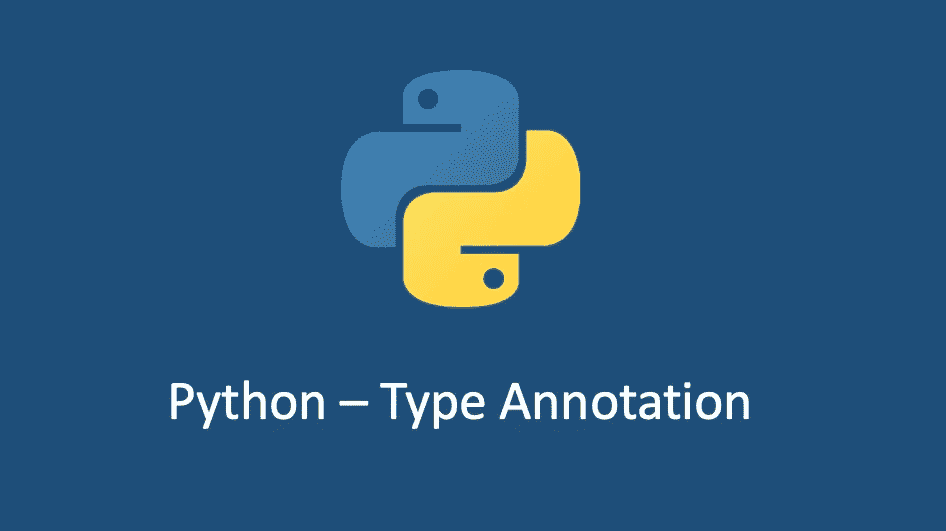

# Python 变量的类型注释

> 原文：<https://medium.com/geekculture/python-type-annotation-for-variables-606177840d7b?source=collection_archive---------5----------------------->

## Python 类型注释深入研究

静态和动态类型是软件工程中的一个热门话题。每个人都有自己简单的方式。Python 作为一种动态类型语言，使得程序不需要指定变量的类型，这一点不会改变。不过 python 创始人`Guido van Rossum`在 python3.5 中引入了一个类型系统，允许开发者…