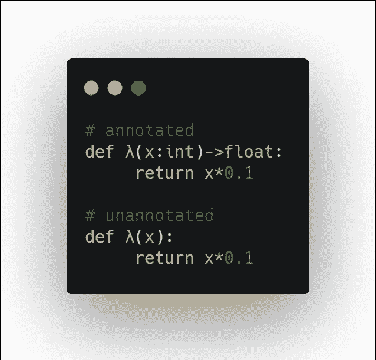
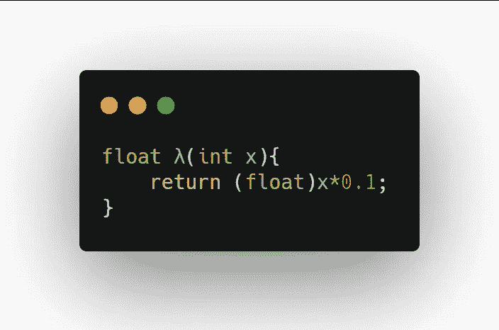
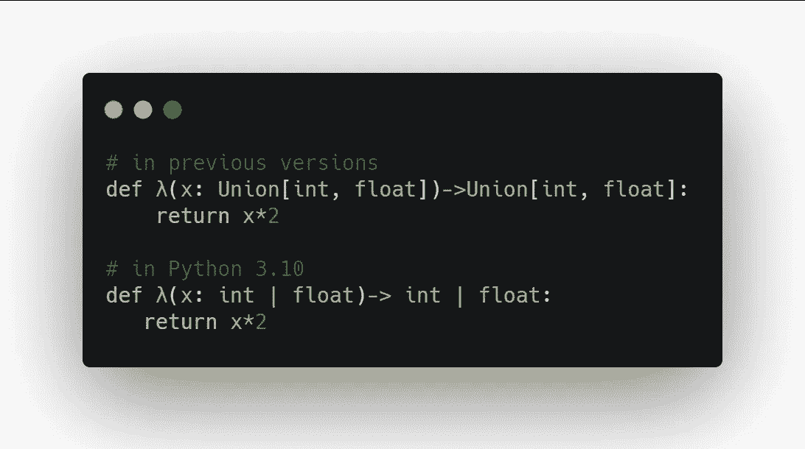

# Python 类型化注释

> 原文：<https://medium.com/geekculture/python-typed-annotations-1e3f3f5f6841?source=collection_archive---------6----------------------->


Python 3.10 刚刚在今年 4 月 10 日宣布了他们的[版本](https://docs.python.org/3.10/whatsnew/3.10.html)。大多数更新都是为了改善开发人员的体验和代码库的可维护性。

我们享受了编写 Python 代码的乐趣，因为它有可读的语法和用户友好的语言设计。很明显，这是为了摆脱通常在其他语言(如 C++或 Java)中使用的类型前缀。请记住，C++和 Java 都是编译语言，它们必须有一套语法规则来映射到您可以执行的机器代码上。但是 Python 是一种动态类型语言，解释器可以通过[鸭子类型](https://bityl.co/6LB9)——*的概念推断出我们在函数中调用的实体的类型，如果它走路像鸭子，叫声像鸭子，那么它一定是鸭子*。这给了我们很大的空间来关注算法，而不是担心表达代码逻辑的晦涩的编程语法。这对于相对较小的项目来说是可以的，在这些项目中，我们可以只注释掉函数(或方法)中期望的参数类型。但是与人一起构建一个可维护的软件系统需要一个比注释掉他们的功能期望更好的解决方案。

在我们讨论 Python 中的类型化注释之前，让我们先欣赏一下其他语言中类型前缀的优雅，这样我们就可以知道什么时候注释我们的代码。尽管类型前缀会引入语法开销，但它内置于语言中是有原因的:(1) [解析](https://bityl.co/6LBU)，以及(2) [类型安全](https://bityl.co/6LBT)。在某种程度上，类型前缀保护我们的函数期望接受的类型和它返回的类型，因为我们通常可以把函数想象成一个接受和返回某些东西的黑盒。通过对其他编译语言施加类型限制，它使我们能够保持代码的意图性，我们可以保证它服务于它的目的。因此，我们不仅可以清楚地写(和读)什么进出我们的函数，还可以确保我们的函数接受我们指定的正确类型。

但是我们怎样才能让它适应 Python 呢？这就是类型注释的用武之地。

在接下来的章节中，我们将探索 Python 3.10 支持的类型注释的一些特性。在我们开始之前，下面是我们如何用 Python 注释一个简单的函数:



正如我们在`λ`函数的注释版本中看到的，它接受一个整数值`x`并返回一个类型为`float`的值，而未注释的版本可能需要猜测`λ`函数期望什么。考虑用 C++编写的相同函数:



Python 中类型注释的主要好处是可读性和静态分析。Python 3.5 版本上的 [PEP 484](https://www.python.org/dev/peps/pep-0484/) 指出，尽管 Python 可能支持运行时类型检查，但 Python 仍将是一种动态语言。

# 什么是静态分析，我们如何在 Python 中进行静态分析？

静态分析工具是一种无需执行程序即可轻松检测漏洞的方法。这提供了对我们代码的深入了解，而不需要执行它们，从而自动维护代码质量。静态分析工具还可以在早期自动发现安全问题。到目前为止一切都很好，但是我们如何在我们的 IDE 上使用它呢？

存在几种类型的静态分析，它们有不同的目的，从样式分析到未使用的代码检测。[这里有一篇我找到的文章](https://luminousmen.com/post/python-static-analysis-tools)，探讨了 Python 静态分析的生态系统。

现在，让我们来看看 Python 3.10 中类型注释的一些特性。

## 新型联合算子



新的 union 操作符被接受为`isinstance()`和`issubclass()`函数的第二个参数，如下所示:

```
>>> isinstance(1, int | str)
True
```

## 改进的 TypeAlias 注释

Python 中的类型别名现在可以显式表达了。比较:

```
# in previous versions
StrCache = 'Cache[str]'  # a type alias
LOG_PREFIX = 'LOG[DEBUG]'  # a module constant
```

和

```
# in Python 3.10
StrCache: TypeAlias = 'Cache[str]'  # a type alias
LOG_PREFIX = 'LOG[DEBUG]'  # a module constant
```

更多请看:[docs.python.org/3.10/whatsnew/3.10.html](https://docs.python.org/3.10/whatsnew/3.10.html)。

# 外卖食品

虽然类型注释可能会引入语法开销，但它提高了代码的可读性，从而保持了我们的意图完整。作为开发人员，我们希望我们的代码库易于使用，难以误用。

*最初发布于*[*https://dcode . hash node . dev*](https://dcode.hashnode.dev/python-typed-annotations)*。*