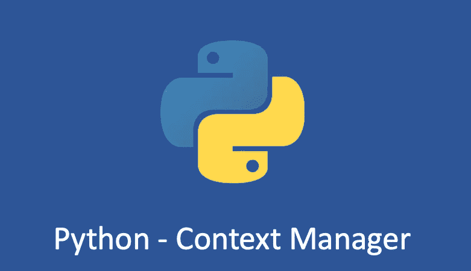

# Python 了解“with”和上下文管理器

> 原文：<https://medium.com/geekculture/python-understand-with-and-context-manager-cee64590e8f?source=collection_archive---------3----------------------->

## Python 上下文管理器详细解释

如果你有阅读源代码的习惯，可能会看到一些优秀的代码经常出现“`with`”关键字语句。一般用在什么场景？今天，我们来谈谈 Python 中的`with`和`context managers`。