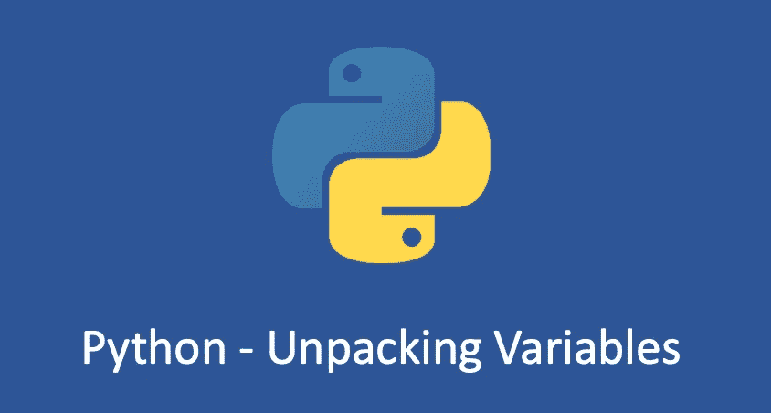

# Python 变量解包

> 原文：<https://medium.com/geekculture/python-variable-unpacking-a5d0ed284011?source=collection_archive---------4----------------------->

日常一点 Python 知识！

在 Python 中，“变量解包”是一种特殊的赋值操作。它允许你一次将一个 iterable 对象的所有成员(比如`list`、`set`)赋给多个变量。

可以使用未命名的参数传递变量，也可以传递任意数量的变量，而无需定义变量的数量。在 python 中，可以传递关键字和…