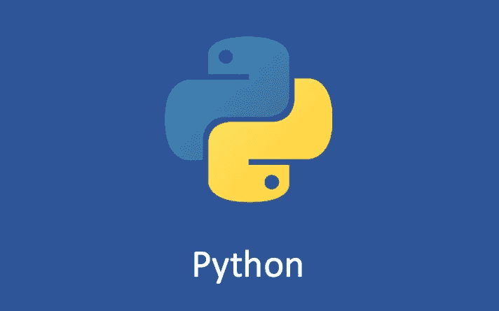

# Python 变量和赋值

> 原文：<https://medium.com/geekculture/python-variables-and-assignments-3f68c7981156?source=collection_archive---------12----------------------->

## 有用的 Python 基础知识

Python 是一种独特的语言，与 C 语言有很大的不同。很多 Python 新手经常说不理解变量和赋值。

学过 C 的人都知道，在给一个变量赋值的时候，你需要先指定数据类型，同时，它会打开一个内存使用的区域…