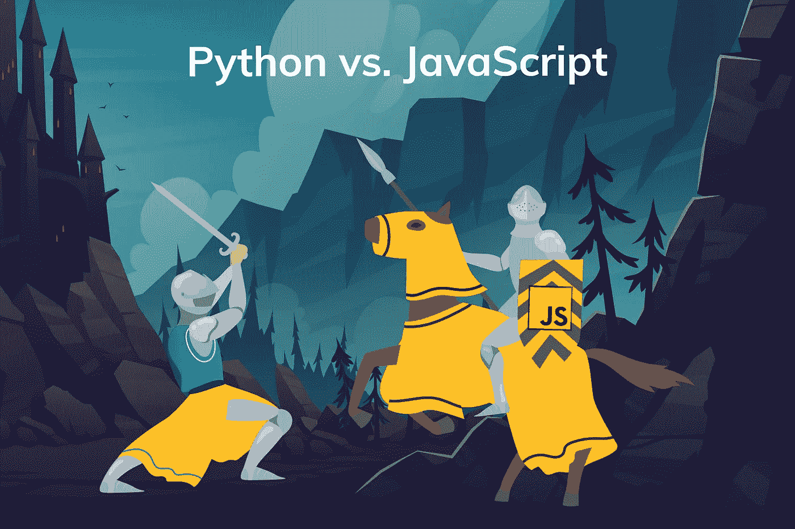

# python vs JavaScript:2022 年选择什么

> 原文：<https://medium.com/geekculture/python-vs-javascript-what-to-choose-in-2021-d084167c468f?source=collection_archive---------1----------------------->

软件开发行业是动态的，易变的。从事软件开发至少几年的人，看到了一大堆变化。有些技术像 Python 一样在极短的时间内如暴风骤雨般地加入了竞争，并获得了广泛的欢迎，而有些技术像 Pascal 一样没有得到太多的认可就永远消失了。因此，在一个人职业生涯的开始…