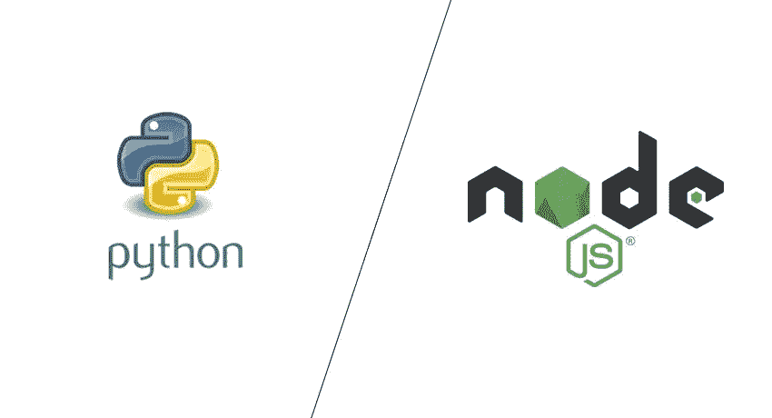

# Python 与 NodeJS——哪个最适合您的 Web 应用程序？

> 原文：<https://medium.com/geekculture/python-vs-nodejs-which-is-best-for-your-web-application-bd21a33da0eb?source=collection_archive---------6----------------------->

Python vs NodeJS — Which is Best for your Web Application?

Python 和 Node.js 是后端开发最流行的两种技术。两者有什么区别？在这篇文章中找到答案。

# 什么是 Python

*   Python 是一种解释型高级通用编程语言。它的设计理念强调代码的可读性，并使用了显著的缩进。
*   它的语言结构和面向对象的方法旨在帮助程序员为小型和大型项目编写清晰的逻辑代码。

# Python 用于

*   Web 开发
*   数据分析和机器学习
*   自动化和脚本
*   软件测试和原型制作

# Python 为什么这么受欢迎？

*   简单易学
*   支持性 Python 社区
*   Python 库和框架

# 现在谁在用 Python？

*   英特尔、IBM、NASA、皮克斯、网飞、脸书、摩根大通、Spotify 和许多其他大公司都在使用 Python。
*   它是谷歌的四种主要语言之一，而谷歌的 YouTube 主要是用 Python 编写的。Reddit、Pinterest 和 Instagram 也是如此。
*   最初的 BitTorrent 客户端也是用 Python 编写的。它被用作脚本语言来控制行业标准的 3D 建模和动画工具 Maya。

# 什么是 NodeJS

*   Node.js 是一个开源、跨平台的后端 JavaScript 运行时环境，运行在 V8 引擎上，在 web 浏览器之外执行 JavaScript 代码。

# NodeJS 用于

*   API 和命令行工具
*   流媒体网络应用
*   实时网络应用
*   微服务

# NodeJS 为什么这么受欢迎？

*   JavaScript 无处不在
*   非阻塞输入输出范例
*   开源 NPM 知识库
*   适合微服务
*   上市时间

# 现在谁在用 NodeJS？

*   由于 NodeJS 对于开发应用程序非常有效，许多大公司都将其作为主要的 Javascript 代码。
*   这些公司包括网飞、特雷罗、贝宝、LinkedIn、沃尔玛、优步、美国宇航局、Mozilla、火狐、雅虎和 GoDaddy

# Python 和 NodeJS 的主要区别

*   节点。Js 是建立在 Google Chrome Javascript 引擎上的服务器端平台，而 Python 是一种面向对象的高级动态多用途编程语言。
*   Node 更适合 web 应用和网站开发，而 Python 最适合后端应用、数值计算和机器学习。
*   Nodejs 使用 JavaScript 解释器，而 Python 使用 CPython 作为解释器。
*   节点编程语言最适合异步编程，而 Python 不是异步编程的最佳选择。
*   节点。Js 最适合小型项目，而 Python 最适合开发大型项目。
*   比较 Node.js 和 Python，Node 最适合内存密集型活动，而 Python 不适合内存密集型活动。

# 什么时候用 Python？

*   Python 有一个开源数据分析工具、web 框架和测试工具的库。因此，它的生态系统是所有编程社区中最大的之一。
*   Python 是新程序员最容易理解的语言，因为社区提供了许多入门资源。这种语言也在大学里教授，并被用于使用对初学者友好的设备，比如 Raspberry Pi。
*   与 Node.js 相比，Python 具有一致性、稳定性和易用性。它是开发科学应用、大数据解决方案和政府项目的首选。

# 什么时候用 Node js？

*   由于 Node.js 是一个基于 Chrome 的 JavaScript 运行时的平台，它有助于开发构建可扩展的网络应用程序。它使用事件驱动的非阻塞 I/O 模型，这使它成为开发数据密集型实时应用程序的理想选择。
*   与 Python 相比，Node.js 提供了更好的性能和速度。这是开发消息或聊天应用程序的理想解决方案。它对于开发依赖于处理速度的高负载应用程序和电子商务网站也很有用。

# 结论

*   如果您熟悉 JavaScript，那么 Node.js 对您来说将是一个简单的学习任务，但是如果您完全是编程新手，那么 Python 将很容易理解这些概念。
*   Python 用于后端应用，而 Node.js 用于 web 开发和 web 应用。所以，两者同等重要。
*   两者永远不能互相替代，因为两者在某些方面都表现得很好。
*   两者都适合大规模，两者都可能在某些时候滞后，但 Node.js 比 Python 更快，因为它有一个由 Google 支持的 V8 引擎。

感谢阅读。如果你发现这篇文章有用，别忘了**鼓掌**和**与你的朋友和同事分享。如果你有任何问题，请随时联系我。**与我联系👉**[**LinkedIn**](https://linkedin.com/in/hiteshmishra708)**，**[**Github**](https://github.com/hiteshmishra708)**:)****