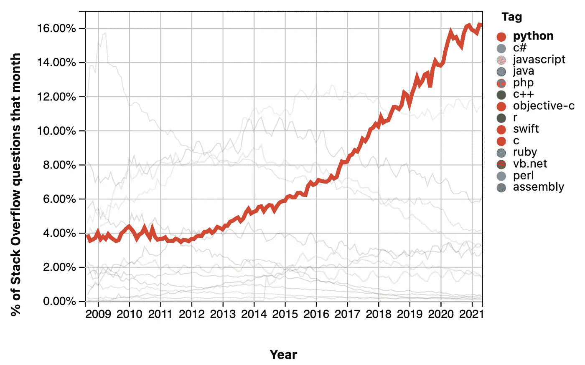
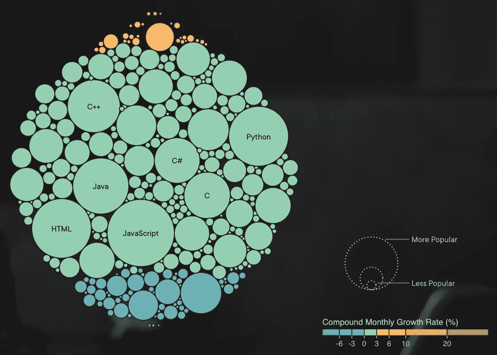
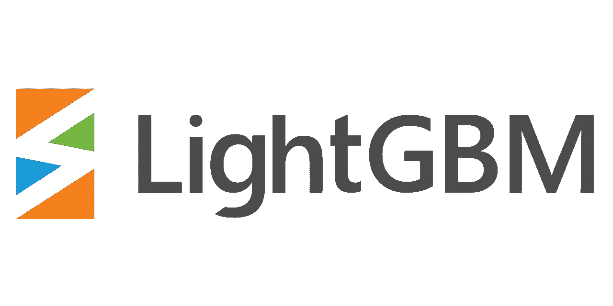
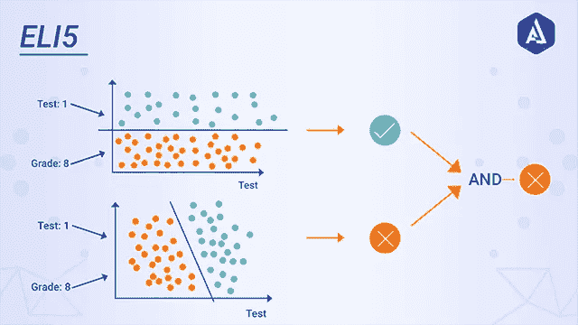
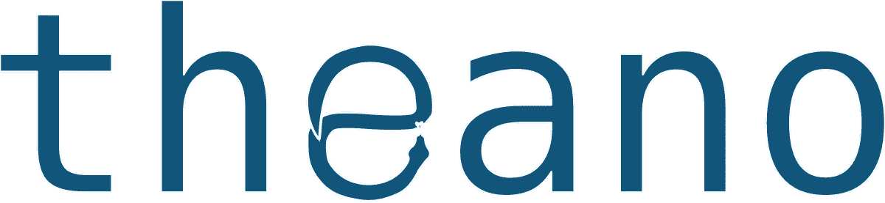
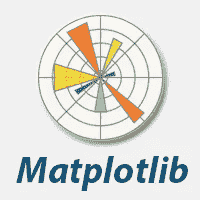
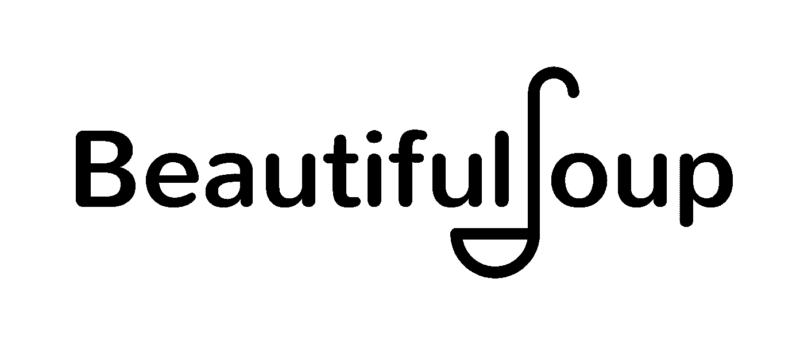

# Python？为什么！

> 原文：<https://medium.com/geekculture/python-why-b49c19521100?source=collection_archive---------39----------------------->

## 编程语言系列

## 理解为什么掌握 Python 是值得的。

本文将从定义我对文化的理解开始，为什么理解 Guido Van Rossen(又名 Python 创建者)的愿景是相关的，他在创建期间的愿景如何影响 Python 的现状，如何衡量他的愿景的价值，谁可以从这种语言和一些有趣的技术中受益，以根据您的好奇心或需求进行更深入的挖掘。

The name Python actually comes from this BBC television comedy sketch. If you enjoy absurdism, very witty jokes, dark humor, depth, satire, irony, the unexpected, and surrealism, do yourself a favor and check them out, currently available on Netflix, and this image belongs to [Digital Bits](https://thedigitalbits.com/columns/my-two-cents/072919-1200), thanks for sharing it. There is an example of a sketch later in the article.

文化可以根据上下文有多种含义，在这个特定的上下文中，我是这样想的，它是创始人和随后的第一批雇员对整个组织工作方式的影响，是看到然后模仿的行为，是统治每个人行为方式的未说的指导方针，所有这些都来自于所有随后的雇员从他们的领导身上看到的模仿的行为模式。

Guido Van Rossen 项目是在从事一个已经消亡的项目(ABC 编程语言)后开始的，在随后的工作中，他意识到 ABC 语言背后的一些想法的价值以及他如何能够在其上更好地编码，然后在 20 世纪 80 年代末，他开始制作 Python，其实现始于 1989 年 12 月，并于 1991 年首次发布为 Python 0.9.0。

想一想，记住任何时候你试图让一个想法发生，执行一个计划，这有多难，尤其是当它与任何能立即给你某种满足感的事情无关时，它只是一个遥远空间的牵强想法，只有你知道。在这种情况下，是什么推动你前进。

这是一种愿景的力量，一种来自内部的能量，如果在一个得到认可的支持性环境中会更好，虽然这是他在工作之外做的一个兼职项目，但在工作中，他们认为他做的事情很酷，他可以做他喜欢做的事情，同时他继续管理自己的职责。好的，他的动力来源是对编写别人会发现有用的代码的热情，这是最终使 Python 如此成功的能量。

他在创造和发展这种语言时，通过自己的态度将这种心态嵌入到语言中，现在这种心态已经成为 Python DNA 的一部分，正是这种心态让 Python 在经济的许多领域找到了一席之地，也是为什么有如此多的开源软件免费供所有令人惊叹的库使用。

This is a Monty Python sketch, Nietsche getting a yellow card from Confucious after accusing him of having no free will. Socrates scoring from a pass from Archimedes, after a successful flick from Heraclitus. Hegel is arguing with Confucious that reality is merely an a priori adjunct of non-absolutist ethics, Kant, by the categorical imperative, is holding that ideal logic exists only in the imagination and Marx’s claim it was offside. Thanks to [Netflix](http://netflix.com) for the image, you can find their movies and comedy series there.

如何衡量一个愿景的价值，虽然有很多有偏见和武断的方法来衡量 Python 的价值，但有非常简单的方法来实现任何东西的价值，那就是看它的受欢迎程度，但是受欢迎的东西真的值得吗？在我看来，不完全是，它是由谁来看它对什么有用，如果它符合你的需求，任何流行的东西对你都是相关的，在向你展示 Python 已经可以做什么之前，我将展示这种语言目前进展如何。

任何事物的存在都需要有人去创造它，任何事物的生存都需要有人不断地使用它，任何事物的繁荣都需要很多人不断地使用它，同时帮助它进一步发展。

**凭证号 1**

You can see quite clearly on this graph that there is a steadily rising amount of people asking questions related to programming in Python at least in proportion to the total amount of users in StackOverflow. This graph belongs to [Insights StackOverflow](https://insights.stackoverflow.com/trends?tags=java%2Cc%2Cc%2B%2B%2Cpython%2Cc%23%2Cvb.net%2Cjavascript%2Cassembly%2Cphp%2Cperl%2Cruby%2Cswift%2Cr%2Cobjective-c), I recommend following the link.

**证明号 2**

This graph belongs to [PluralSight and is their technology index](https://www.pluralsight.com/tech-index/software-development), it gathers its data from Github, Stack Overflow, Google AdWords, Youtube, Google Search, Indeed, Dice, and Reddit. If you are a beginner trying to convince yourself why Python, do yourself a huge favor and follow these sources, in them, you will find from projects to major open-source software, the holy grail for all your first questions, videos that explain how to solve your problems, job openings and a thriving community of like-minded people.

这一切看起来很棒，但你可能想知道我能用它做什么？嗯，比我所知道的要多得多，想想看，Python 3 版本最初是在 2008 年发布的，但是很多人用 Python 2 做了很多东西，花了 12 年才最终停止使用。

那你是谁会觉得这个有用呢？如果你是一名软件工程师、数学家、数据分析师、科学家、会计师、网络工程师、企业家，任何一个有着与移动文件、将文件移动到服务器、更改名称相关的繁重工作的人，无论是孩子还是成人，都可以尝试学习编程。Python 可能是你所需要的，让你的生活变得更简单，让你更容易被雇佣，或者只是帮助你以不同的方式思考。这是第一部分关于文化和愿景有意义的时刻。

All praise Python! and thanks [Raspberrypi Documentation](https://www.raspberrypi.org/documentation/usage/python/) for sharing this great image.

因为这个项目在开源如此普遍之前就开始了，并且是一个有远见的人做了一些东西，希望它能对其他人有用，它确实坚持了这种语言背后的文化，让其他有远见的非常聪明的人使用 Python 来创造这个想法，然后与世界分享！也就是说，所有那些枯燥、乏味、需要花费你多年时间才能实现的部分，与你的需求无关，在这里是不可能实现的，可以获得，可以免费使用，这就是为什么 Python 被认为是一种高级语言，因为所有的深层实现部分都已经在语言的更深层预制好了，你不需要费心去想。

接下来是一些令人惊叹的库供您检查和使用，请记住，每次您只需要为您的问题而烦恼，您就站在杰出的伟人的肩膀上，他们为这种语言付出了时间，已经完成了如此多的实现，以至于完成复杂任务所需的时间大大减少了，加上这些库的帮助，您每次使用 python 都会获得一生的帮助。

下一部分的结构首先是提到库或框架的名称，然后是从他们自己的网页引用的任务声明，以及刚才提到的开源项目的位置。

## **惊人的图书馆检查:**

[Thanks, Tensorflow for this image!](https://www.tensorflow.org/about)

> “TensorFlow 是一个端到端平台，使您可以轻松构建和部署 ML 模型。”——【https://www.tensorflow.org/about 

 [## 张量流

### 面向所有人的开源机器学习框架 C++ 156k 84.9k TensorFlow 文档 Jupyter Notebook 4.6k…

github.com](https://github.com/tensorflow) 

Thanks, [Wikipedia](https://en.wikipedia.org/wiki/Scikit-learn) for this image!

> "简单有效的预测数据分析工具."——【https://scikit-learn.org/stable/ 

 [## scikit-learn/scikit-learn

### scikit-learn 是一个基于 SciPy 构建的用于机器学习的 Python 模块，在 3-Clause BSD…

github.com](https://github.com/scikit-learn/scikit-learn) 

Thanks, [Pallawi](https://pallawi-ds.medium.com/ai-starter-everything-you-need-to-know-about-keras-to-build-your-first-deep-learning-model-c8d27385344) for the image!

> “Keras 是为人类设计的 API，不是为机器设计的。Keras 遵循减少认知负荷的最佳实践:它提供一致和简单的 API，最大限度地减少常见用例所需的用户操作数量，并提供清晰和可操作的错误消息。它还有大量的文档和开发人员指南。”—[https://keras.io/](https://keras.io/)

 [## keras-team/keras

### Permalink 无法加载最新的提交信息。在不久的将来，这个存储库将再次用于…

github.com](https://github.com/keras-team/keras) 

Thanks, [freeCodeCamp](https://www.freecodecamp.org/news/the-ultimate-guide-to-the-numpy-scientific-computing-library-for-python/) for the image!

> "用 Python 进行科学计算的基础包."—[https://numpy.org/](https://numpy.org/)

 [## 数字/数字

### NumPy 是使用 Python 进行科学计算所需的基础包。它提供:一个强大的 N 维…

github.com](https://github.com/numpy/numpy) 

Thanks, [Pytorch](https://pytorch.org/) for the image!

> "一个开源的机器学习框架，加速了从研究原型到生产部署的过程."—[https://pytorch.org/](https://pytorch.org/)

 [## 皮托赫/皮托赫

### PyTorch 是一个 Python 包，它提供了两个高级特性:张量计算(像 NumPy)和强大的 GPU…

github.com](https://github.com/pytorch/pytorch) 

Thanks [LightGBM](https://github.com/microsoft/LightGBM) for the image!

> “LightGBM 是一个梯度推进框架，使用基于树的学习算法。它被设计为分布式和高效的，具有以下优点:
> 
> ——训练速度更快，效率更高。
> 
> -更低的内存使用率。
> 
> -精确度更高。
> 
> -支持并行、分布式和 GPU 学习。
> 
> -能够处理大规模数据。”——[https://lightgbm.readthedocs.io/en/latest/](https://lightgbm.readthedocs.io/en/latest/)

 [## 微软/LightGBM

### LightGBM 是一个梯度推进框架，使用基于树的学习算法。它被设计成分布式的…

github.com](https://github.com/microsoft/LightGBM) 

Thanks, [Akira](https://www.akira.ai/glossary/eli5/) for the image!

> “ELI5 是一个 Python 库，它允许使用统一的 API 来可视化和调试各种机器学习模型。它内置了对几种 ML 框架的支持，并提供了一种解释黑盒模型的方法。”—[https://eli5.readthedocs.io/en/latest/](https://eli5.readthedocs.io/en/latest/)

 [## TeamHG-Memex/eli5

### ELI5 是一个 Python 包，它有助于调试机器学习分类器并解释它们的预测。它提供了…

github.com](https://github.com/TeamHG-Memex/eli5) 

Thanks, [Delft Students on Software Architecture](https://se.ewi.tudelft.nl/desosa2019/chapters/scipy/) for the image!

> “它提供了许多用户友好和有效的数值例程，如数值积分，插值，优化，线性代数和统计例程。”——【https://scipy.org/scipylib/ 

 [## 科学/科学

### SciPy(读作“叹息派”)是一款面向数学、科学和工程的开源软件。它包括模块…

github.com](https://github.com/scipy/scipy) 

Thanks, [Wikidata](https://www.wikidata.org/wiki/Q7777252) for the image!

该库将被 Aesara 取代。

> Aesara 是一个 Python 库，允许定义、优化和高效评估涉及多维数组的数学表达式——【https://aesara.readthedocs.io/en/latest/ 

 [## aesara-devs/aesara

### Aesara 是一个 Python 库，允许定义、优化和有效地评估数学表达式…

github.com](https://github.com/aesara-devs/aesara) 

Thanks, [DW](https://www.dw.com/en/china-plans-huge-national-park-for-pandas/a-42885348) for this amazing image!

> 这是一个灵活而强大的 Pythonm 数据分析/操作库，提供了与 R data.frame 对象、统计函数等类似的标记数据结构—[https://pandas.pydata.org/](https://pandas.pydata.org/)

 [## 熊猫-发展/熊猫

### pandas 是一个 Python 包，它提供了快速、灵活、富于表现力的数据结构，旨在使与…

github.com](https://github.com/pandas-dev/pandas) 

Thanks, [Javatpoint](https://www.javatpoint.com/matplotlib) for this image!

> " Matplotlib 是一个全面的库，用于在 Python 中创建静态、动画和交互式可视化."——[https://matplotlib.org/stable/](https://matplotlib.org/stable/)

 [## matplotlib/matplotlib

### Matplotlib 是一个用于在 Python 中创建静态、动画和交互式可视化的综合库。检查…

github.com](https://github.com/matplotlib/matplotlib) 

Thanks, [Funthon](https://funthon.wordpress.com/2017/05/21/beautiful-soup-4/) for the image!

> “Beautiful Soup 是一个 Python 库，用于从 HTML 和 XML 文件中提取数据。它与您喜欢的解析器一起工作，提供导航、搜索和修改解析树的惯用方式。它通常能为程序员节省数小时或数天的工作。”—[https://www.crummy.com/software/BeautifulSoup/bs4/doc/](https://www.crummy.com/software/BeautifulSoup/bs4/doc/)

 [## beautifulsoup4

### 美汤是一个库，可以很容易的从网页上抓取信息。它位于 HTML 或 XML 之上…

pypi.org](https://pypi.org/project/beautifulsoup4/) 

Thanks, [Wikipedia](https://en.wikipedia.org/wiki/Flask_(web_framework)) for the image!

> "用于构建 web 应用程序的 Python 微框架."—[https://flask.palletsprojects.com/en/2.0.x/](https://flask.palletsprojects.com/en/2.0.x/)

 [## 托盘/烧瓶

### Flask 是一个轻量级的 WSGI web 应用程序框架。它旨在使入门变得快速而简单，具有…

github.com](https://github.com/pallets/flask) 

Thanks, [FullStackPython](https://www.fullstackpython.com/django.html) for the image!

> "有期限的完美主义者的网络框架."——【https://www.djangoproject.com/ 

 [## 姜戈/姜戈

### Django 是一个高级 Python Web 框架，它鼓励快速开发和干净、实用的设计。感谢…

github.com](https://github.com/django/django) 

在这篇文章的最后，我将分享 Python 的原理，希望在听到这些原理后，所有这些项目的本质都是有意义的，并且很明显看到为什么 Python 如此受欢迎，为什么用 Python 制作这些框架或库的这么多杰出人士的愿景找到了他们的家。

> 漂亮总比难看好。
> 
> 显性比隐性好。
> 
> 简单比复杂好。
> 
> 复杂总比复杂好。
> 
> 扁平的比嵌套的好。
> 
> 疏比密好。
> 
> 可读性很重要。
> 
> 特例不足以特殊到打破规则。
> 
> 虽然实用性战胜了纯粹性。
> 
> 错误永远不会无声无息地过去。
> 
> 除非明确沉默。
> 
> 面对暧昧，拒绝猜测的诱惑。
> 
> 应该有一种——最好只有一种——显而易见的方法来做这件事。
> 
> 尽管这种方式一开始可能并不明显，除非你是荷兰人。
> 
> 现在总比没有好。
> 
> 虽然从来没有比现在更好。
> 
> 如果实现很难解释，这是一个坏主意。
> 
> 如果实现很容易解释，这可能是一个好主意。
> 
> 名称空间是一个非常棒的想法——让我们多做一些吧！
> 
> —蒂姆·彼得斯