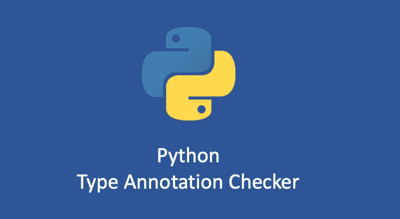

# Python 编写类型注记检查器

> 原文：<https://medium.com/geekculture/python-write-type-annotation-checker-cdbdaaab22a6?source=collection_archive---------5----------------------->

## 如何实现 Python 类型注释检查器

我在之前的文章里讲过 Python [变量类型注释](/geekculture/python-type-annotation-for-variables-606177840d7b)、[容器类型注释](/geekculture/python-type-annotation-for-containers-7f58414eb4c8)和[函数类型注释](/geekculture/python-type-annotation-for-functions-and-class-2e8e3148e376)。我希望你已经学会了如何结合类型注释和`mypy`工具来为你的代码执行静态类型检查。