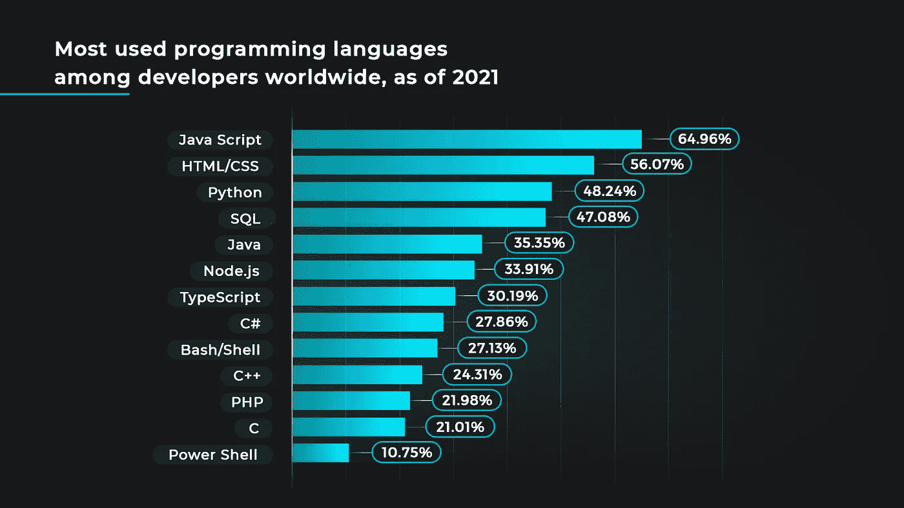
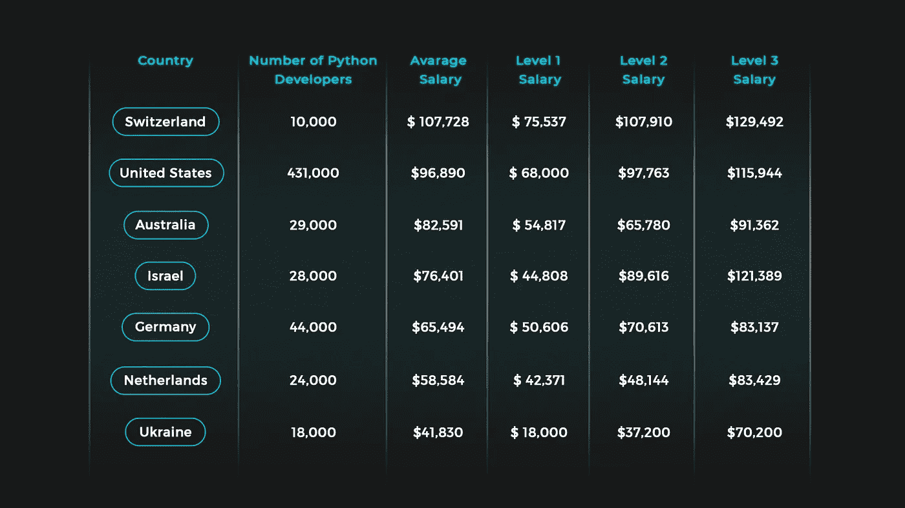

# Python 在全球的受欢迎程度以及美国 Python 开发人员的薪水与其他国家相比

> 原文：<https://medium.com/geekculture/pythons-global-popularity-and-u-s-python-developer-salaries-vs-other-countries-d1b53ae8774?source=collection_archive---------14----------------------->

毫无疑问，Python 是一种受高度支持和受欢迎的语言，其全球开发者社区超过 1000 万人。几十年来，公司和开发者一直信任 Python 用于他们的软件开发项目，包括游戏和网络应用程序、大数据、机器学习和人工智能。

其受欢迎程度可以从其目前拥有的 [29.48 %](https://pypl.github.io/PYPL.html) 的市场份额中得到证明，在最新的 PYPL 排行榜上轻松占据榜首。此外，它也是最常用的语言之一，如下图所示。一些在重大项目中使用 Python 的顶级公司包括网飞、Dropbox 和 Paypal。

根据 [LinkedIn 的一项调查](https://www.linkedin.com/search/results/people/?geoUrn=%5B%22102264497%22%5D&keywords=python%20developer&origin=FACETED_SEARCH&sid=EjW)，仅美国就有大约 431，000 名 Python 开发者，但这个数字仍然不能满足高需求。然而，在这个地球村，公司现在从世界任何地方雇佣开发人员。

在质量有保证的情况下，主要问题是，与世界其他地方相比，一个 Python 程序员在美国挣多少钱？

影响这一点的一个主要因素是每个国家的开发者数量。因此，我们将把这些统计数据和本文将要讨论的每个国家的工资包括在内。然而，在开始之前，这里有一些影响 Python 程序员工资的其他因素。

# 影响全球 Python 开发人员工资的因素。

虽然 Python 编程的工作可能是相同的，但是在不同的环境下为不同的公司或国家工作的开发人员不会挣得一样多。影响 Python 薪酬的因素包括专业知识、能力范围、公司规模等等。以下是 Python 程序员具体挣多少钱的一些决定因素。

## 核心能力

一个人的工资可以取决于他们的核心能力。最重要的是 Python 框架，AI 和机器学习的经验，熟悉 ORM 和库，版本控制，以及对 HTML5，CSS3，JavaScript 多进程架构的良好掌握。

## 软技能

当 python 们在专业层面上与客户和同事有着良好的人际关系时，他们就准备好有效地处理项目，提高他们的回报。

## 解决问题的诀窍

这是不言而喻的，因为开发人员是问题的解决者。因此，天生的亲和力和解决问题的天赋肯定会让他们赚得更多。

## 额外的能力

当开发人员熟悉和熟悉 Java、C++、Javascript、机器学习和人工智能操作能力等时，公司会很感激。

## 位置

一个国家、州或城市中可用的 Python 开发人员的数量也在决定公司愿意向开发人员支付多少费用方面发挥了重要作用。

## 生活费用

美国平均生活成本指数 [70.95](https://worldpopulationreview.com/country-rankings/cost-of-living-by-country) 。因此，预计美国的工资会高于生活成本较低的国家。

# 美国与世界 Python 薪资对比

除了平均年收入之外，这种比较还将详细说明三种主要工作级别的差异，从而更清楚地描绘 Python 编程工作的工资。

# Python 开发人员在美国的工资

开发者数量:43.1 万

Python 程序员平均年薪:[$ 96890/年](https://www.glassdoor.com/Career/python-developer-career_KO0,16.htm)

*   大三学生:每年 6.8 万美元
*   中间值:97，763 美元/年
*   老年人:115，944 美元/年

# 欧洲 Python 开发人员的工资

由于大多数欧洲国家的生活费用较低，大多数开发人员的收费通常比美国低得多。为了客观地看待这一点，以下是一些欧洲国家的 Python 编程工资数据:

*   **德国 Python 开发者的平均工资**

开发者人数:44，000 人

平均年收入:[$ 65494](https://www.glassdoor.com/Salaries/germany-python-developer-salary-SRCH_IL.0,7_IN96_KO8,24.htm)。

*   初级:50，606 美元/年
*   中间值:70，613 美元/年
*   老年人:83137 美元/年

Python 开发人员在美国的工资比德国平均工资高出约 2500 美元。此外，德国最高收入者的收入明显低于美国中等收入者。

*   **瑞士 Python 开发人员的平均工资**

瑞士的年平均工资是 107728 美元。

*   初级:75537 美元/年
*   中间值:107，910 美元/年
*   老年人:129，492 美元/年

与美国相比，瑞士的工资要高得多。

*   **荷兰 Python 软件工程师的平均工资**

开发者人数:24000 人

平均年薪:[$ 58584](https://www.glassdoor.com/Salaries/netherlands-python-software-developer-salary-SRCH_IL.0,11_IN178_KO12,37.htm)。

*   初级:42371 美元/年
*   中间值:48，144 美元/年
*   老年人:83429 美元/年

这里的开发人员挣得比美国少。

*   **乌克兰 Python 开发人员的平均工资。**

开发者人数:18000 人

平均年薪:41830 美元/年

*   初级:18000 美元/年
*   中级:37200 美元/年
*   老年人:70，200 美元/年

乌克兰收入最高的人和美国收入最低的人几乎一样。

# 以色列 Python 程序员工资

开发者人数:28000 人

平均年薪:[$ 76401.72](https://www.glassdoor.com/Salaries/israel-python-software-developer-salary-SRCH_IL.0,6_IN119_KO7,32.htm)。

*   初级:44808 美元/年
*   中层:89，616 美元/年
*   老年人:121，389 美元/年

虽然他们的全国平均工资低于美国，但高级开发人员在以色列挣得更多。

# Python 开发人员在澳大利亚的工资

开发者人数:29，000 人

年均工资为[82，591 美元](https://www.glassdoor.com/Salaries/australia-python-software-developer-salary-SRCH_IL.0,9_IN16_KO10,35.htm)。

*   初级:54817 美元/年
*   中等:65，780 美元/年
*   高年级:91362 美元/年

与美国相比，澳大利亚的 Python 编程工作报酬较低。

# 一览表

下表总结了上述信息，并根据平均年薪对各国进行了排名。

# 为什么在乌克兰招聘

在乌克兰出类拔萃可以为您节省数千美元，显著提高您的生产力和效率。同时，您可以放心，您的产品将完美完成，不会影响质量。乌克兰提议:

*   3000 多名 Python 工程师随时可用。
*   不同国家的巨蟒小组高效合作。
*   80%的乌克兰程序员精通英语。
*   4000 多家 IT 组织提供世界一流的 web 解决方案。

# 轮到你了

知道 Python 程序员在全世界挣多少钱可以让你选择以更低的成本开始你的项目。Newxel 可以帮助你建立你的软件开发团队，甚至在乌克兰建立一个 R&D 中心。[联系我们](https://newxel.com/#contact)了解更多信息。