# Python 最好的可视化库——Seaborn

> 原文：<https://medium.com/geekculture/pythons-top-visualization-library-seaborn-80758d336c04?source=collection_archive---------19----------------------->

Python 有许多方法来创建漂亮的视觉效果，但是用漂亮的图形来探索数据的最简单和最有效的库必须是 Seaborn。

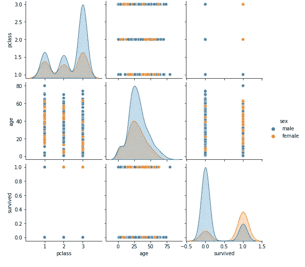

pairplot on the titanic dataset

如果你想快速开始，这里有一份来自 Datacamp 的 [Seaborn 备忘单](http://datacamp-community-prod.s3.amazonaws.com/263130e2-2c92-4348-a356-9ed9b5034247):

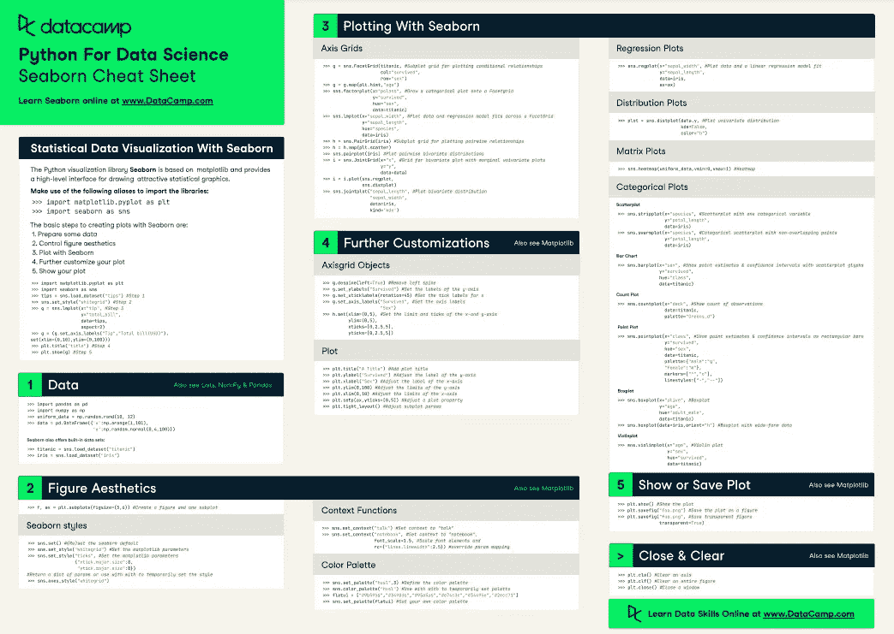

Source D[atacamp](http://datacamp-community-prod.s3.amazonaws.com/263130e2-2c92-4348-a356-9ed9b5034247)

正如我们在备忘单中看到的，根据我们的数据类型和我们试图分析的内容，我们可以创建图表的“类别”:

*   **回归** & **线性** — regplot，lineplot，lmplot
*   **分布** —分布图，历史图
*   **分类**—柱状图、箱线图、紫线图、散点图、计数图
*   **矩阵** —热点图、聚类图

让我们从每个部分选择一些图表，看看我们是否能从我们的 2 个数据集找到任何有趣的分析:

*   **泰坦尼克号**——泰坦尼克号上的乘客信息，关注幸存者
*   **小费** —关注小费金额的餐厅顾客信息

让我们安装 seaborn，并使用所需的库来设置我们的 Jupyter 笔记本

# **设置**

1.  通过 Windows 命令行或 Anaconda shell 安装 Seaborn

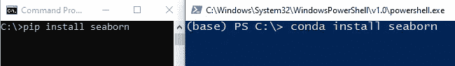

Command line or Anaconda Shell

2.加载我们的 Jupiter 笔记本——导入熊猫、seaborn 库和我们的两个示例数据集

```
import seaborn as sns
import pandas as pdtitanic = sns.load_dataset("titanic")
tips = sns.load_dataset("tips")
```

检查我们数据的前 5 行

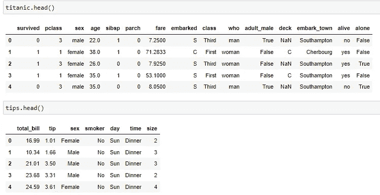

## Seaborn 地块

对于我们的大多数图，所需的参数通常为以下格式:

> **sns。** plottype( **数据**=数据帧， **x =** 列名， **y =** 列名)

# 回归和线形图

## regplot

我们从回归图(regplot)开始，分析**小费**数据，看看小费数量和账单金额之间有什么关联

```
sns.**regplot**(data = tips, x = "total_bill",y = "tip" )
```

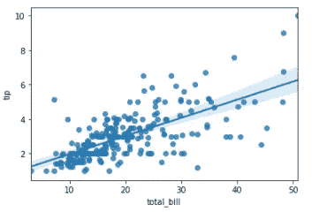

Regression plot (regplot)

从 **regplot** 中，我们注意到这里确实存在相关性，账单总额越大，小费也就越多，但是如果我们想要包含第三个变量，reg plot**reg plot**不能给我们任何进一步的细分。

为此，让我们尝试 **lmplot** ()并添加一个“吸烟者”作为**色调**，这将在一个轴上创建 plot 2 回归图

```
sns.**lmplot**(data = tips, x = “total_bill”,y = “tip” , hue = “smoker”)
```

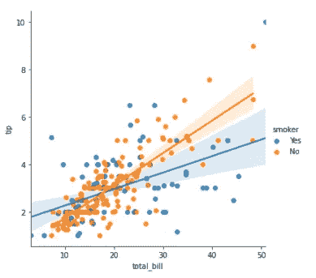

Regression plot (lmplot)

太棒了。我们可以看到，随着账单的增加，不吸烟者(与吸烟者相比)给的小费更多

# 分配

对于分布图或直方图，我们只需要一个 **x 值**，它将被分桶(或装箱)到设定的范围并进行计数

**显示屏**

一个很好的分布图是**显示图**，在这里我们可以分析泰坦尼克号上的“年龄”分布。然后我们可以把“性别”作为一种**色调**包括进来，看看男女年龄的区别

```
sns.**displot**(data = titanic , x = "age" , hue = "sex", hue_order = ['female', 'male'])
```

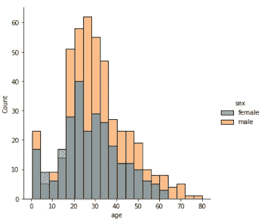

Distribution plot (displot)

**显示**显示船上大多数人的年龄在 18-35 岁之间，通过**色调**我们可以看到船上有更多的男性(相对于女性)和更多的老年男性

我们还改变了这里的**色调顺序**，将女性颜色放在前面，男性放在第二位(试一下没有**色调顺序**的情况，看看默认顺序)

## **明确的**

对于分类图，我们有很多，所以让我们展示一些我经常使用的关键点

## 箱线图

```
sns.boxplot(data = titanic, x = "sex", y= "age")
```

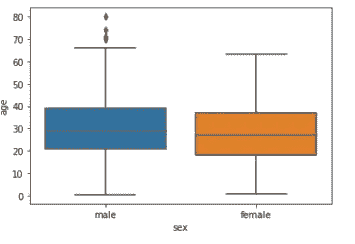

Categorical (boxplot)

箱线图显示了一些与显示图类似的信息，但是我们也可以看到一些男性年龄(大约 68 岁以上)的异常值

## 紫罗兰花

让我们看看能否用我最喜欢的一个情节——小提琴情节——来增强盒子情节

```
sns.violinplot(data = titanic, x = "sex", y="age")
```

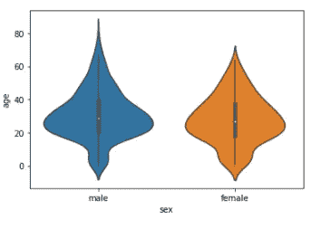

Categorical (violinplot)

好吧！现在我们可以看到一些年龄的密度，但是如果我们添加另一列“幸存”作为**色调**会怎么样

```
sns.violinplot(data = titanic, x = “sex”, y=”age”,hue = “survived”, split=True)
```

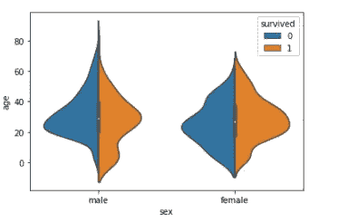

Categorical (violinplot with hue and split)

好的，这在一张图中是相当多的，让我们来分解它，我们将“幸存”添加到**色调**和**分割** (split = True)图的中间，以便更好地进行比较。

有很多东西需要分析，但快速浏览一下就会发现，年轻的雄性看起来有更高的存活率

# [数]矩阵

## 热图

我在矩阵列表中最有用的图是**热图**，特别是在查看相关矩阵时。

**注意**:我们可以使用 **corr** ()快速创建一个关联矩阵

```
titanic.corr().head()
```

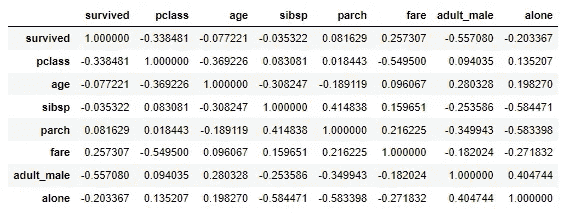

Correlation matrix of titanic dataset

我们现在可以创建这些相关性的热图

```
sns.heatmap(data = titanic.corr())
```

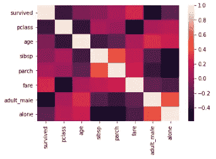

Matrix (heatmap)

这看起来很好，但我们可以做得更好:

*   将我们的值设置在 0 ->1 之间，这样我们可以更好地看到最小值和最大值( **vmin** / **vmax** )
*   注释(**不能**)块内的值
*   改变调色板看颜色变化更好( **cmap** )，可以在 [Seaborn 网站](https://seaborn.pydata.org/tutorial/color_palettes.html)上找到不同的调色板

```
sns.heatmap(data = titanic.corr(), vmin = -1, vmax = 1, annot=True , cmap = "Spectral")
```

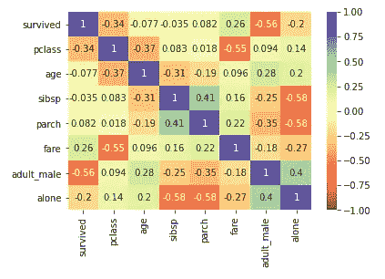

Matrix (heatmap with annot and cmap)

从这张热图中我们看到了一些微小的正相关和负相关，但一些关键的是单独的**和**成年雄性**之间的**正相关**和**成年雄性**和**幸存**之间的**负相关****

# 结论

我们只强调了 Seaborn 中可用的几个情节，但希望本文中的示例将为您提供一个良好的基础。

一旦你对 Seaborn 感到更舒服了，看看他们的[画廊](https://seaborn.pydata.org/examples/index.html)和教程部分，更好地定制你的[图](https://seaborn.pydata.org/tutorial.html)

所有代码和数据都可以在我们的 [github](https://github.com/Slyth3/Python-vs-R/tree/main/Python) 上找到