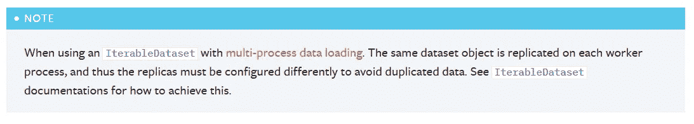
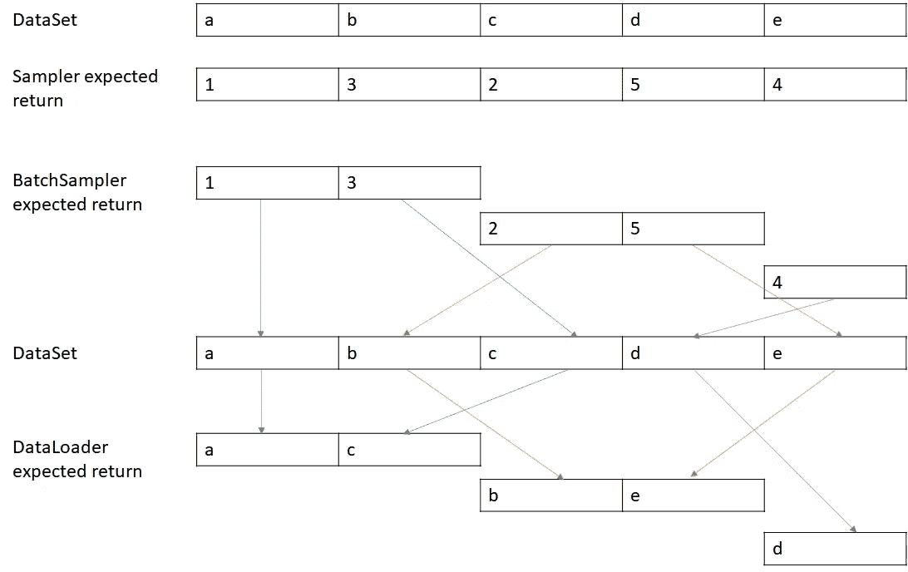
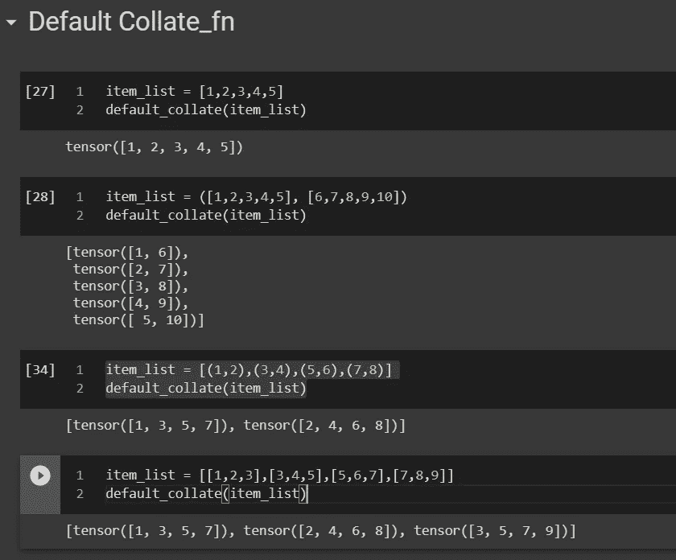
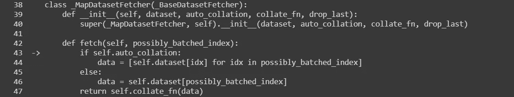
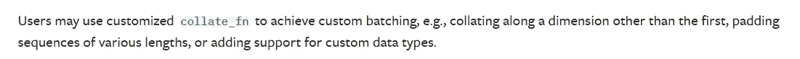
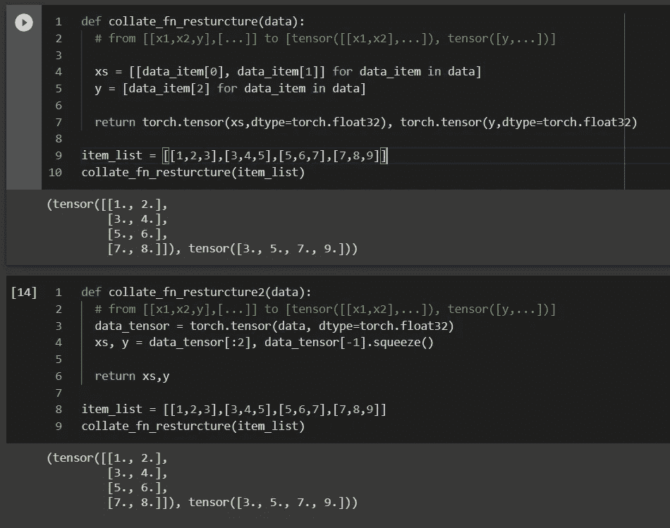
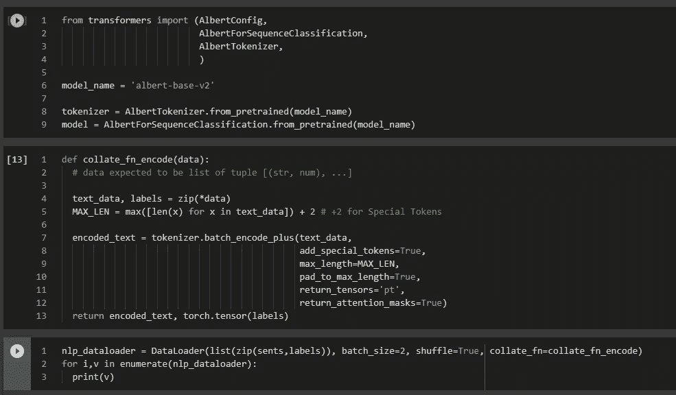
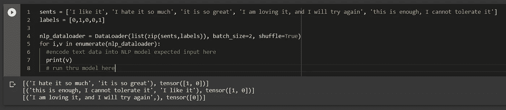

# PyTorch 数据集、数据加载器、采样器和 collate_fn

> 原文：<https://medium.com/geekculture/pytorch-datasets-dataloader-samplers-and-the-collat-fn-bbfc7c527cf1?source=collection_archive---------1----------------------->

# 目的

有些情况下，我有一些数据集不是严格意义上的数字，也不一定适合张量，所以我一直在试图找到一种方法来管理我的数据加载，而不仅仅是将输入传递给 PyTorch Dataloader 对象，并让它自动为我对批处理进行采样，我已经这样做了多次，所以我想更深入地研究一下，并在这里分享它，作为我未来参考的记录。

# 主要参考

PyTorch 官方参考:

 [## torch.utils.data - PyTorch 1.8.1 文档

### 构造函数最重要的参数是，它指示要从中加载数据的数据集对象。PyTorch 支持…

pytorch.org](https://pytorch.org/docs/stable/data.html) 

# 主要类别/功能

## 数据集(及其子类)

这并不总是必要的，特别是我们的数据集通常是列表、Numpy 数组和张量类对象的形式，这是因为数据加载器可以将你的数据包装在某种数据集中。

***数据集对象是做什么的？***

它被认为是封装数据源的对象以及如何访问数据源中的项目。

***什么场合会创建自定义数据集？***

对于我的一些场景，数据来自多个来源，需要组合在一起(比如多个 csv 文件、数据库)，或者可以在数据加载器迭代之前静态应用数据转换。

***文档中提到的 2 类数据集是什么？***

根据文档，有两种类型的数据集，一种是可迭代式的，另一种是地图式的。

在文档中，它说 iterable 样式的数据集将实现 __iter__()而 map 样式的数据集将实现 __getitem__()和 __len__()。

人们可以参考实现这两种类型数据集的一些官方示例:

 [## torch . utils . data . dataset-py torch 1 . 8 . 1 文档

### docs]class Dataset(Generic[T _ co]):r " " "表示 a :class:`Dataset '的抽象类。所有数据集…

pytorch.org](https://pytorch.org/docs/stable/_modules/torch/utils/data/dataset.html#Dataset) 

另一方面，文档明确提到对于 iterable 风格的数据集，数据加载器如何采样数据取决于数据集的 __iter__()的实现，并且不支持数据集中的混洗、自定义采样器或自定义批量采样器。

在我深入探讨这种差异之前，有必要了解一下数据加载器是如何对数据进行采样的。

但是请注意，从文档中可以看出:



## 数据加载器

这是帮助我们从数据源中抽取数据的主要工具，以我有限的理解，这些是关键点:

1.  管理多进程获取
2.  以小批量方式从数据集中抽取数据
3.  用 collate_fn()转换数据
4.  引脚内存(针对 GPU 内存性能)

***data loader 如何采样数据？***

高层次的想法是，它检查数据集(迭代器/映射)的样式，并通过调用 __iter__()(对于迭代器样式的数据集)或采样一组索引并查询 __getitem__()(对于映射样式的数据集)进行迭代

## 取样器

定义数据加载器如何从数据集中提取样本，它仅用于地图样式的数据集(同样，如果是迭代样式的数据集，则由数据集的 __iter__()对数据进行采样，并且不应使用采样器，否则数据加载器会抛出错误)

***采样器实际上做什么？***

它将为整个数据集生成一系列索引，考虑数据源["a "、" b "、" c "、" d "、" e"]，采样器应生成与数据集长度相同的索引，例如[1，3，2，5，4]。

## 批量取样器

BatchSampler 的目标是接受一个样本对象(其中有一个 __iter__()返回索引序列)，并准备如何生成批量索引。

使用上面的同一个示例，如果采样器的 __iter__()返回[1，3，2，5，4]，默认实现将把索引序列分解为 batch_size，假设是 2，那么它将返回[ [1，3]，[2，5]，[4] ](注意，假设数据加载器的“drop_last”参数为 False，则返回最后一项[4])

数据加载器将获取该批索引序列，并逐批抽取样本，这将产生["a "、" c"] | ["b "、" e"] | ["d"]



Without discussing on collate_fn, the process is expected to be something like this

## collate_fn()

这是数据转换发生地方，通常不需要为此费心，因为有一个默认的实现，它适用于像 list 这样的简单数据集。

**默认整理 _ fn**

默认的 collate_fn()做了什么，我们可以读取这个[源代码文件](https://github.com/pytorch/pytorch/blob/master/torch/utils/data/_utils/collate.py)的实现。

看几个例子有个感觉，注意 collate_fn()的输入是一批样本:



对于示例 1，它所做的是将输入转换为张量

对于示例 2，批处理是 2 个列表的元组，它返回一个张量列表，每个张量从原始元组的每个列表中获得 1 个项目

对于样本 3 和 4，输入看起来像具有多个属性的典型数据形式。考虑情况 4，如果每条记录的第 3 个元素是标签，前 2 个元素是输入数据属性，则张量的返回列表不能被模型直接使用，其中优选的返回可以是:

```
[tensor([[1,2], [3,4], [5,6], [7,8]]), tensor([3,5,7,9])]
```

站点说明:对于 pandas DataFrame，dataloader 会通过 _MapDatasetFetcher 类中的 fetch 函数将数据传递到一个列表中，因此我们也可以将其视为列表示例。



possiblely_batched_index is a list like [1, 3]

PyTorch 文档给出了以下用例:



第一个例子是“沿着第一维之外的维度排序”，我的理解是，当你希望批处理数据被不同地分组时，与默认的 collate 函数相比。

```
Preferred: 
[tensor([[1,2], [3,4], [5,6], [7,8]]), tensor([3,5,7,9])]v.s.Default:
[tensor([1,3,5,7]), tensor([2,4,6,8]), tensor([3,5,7,9])]
```

实现方式如下:



the 1st use list and 2nd one use tensor slicing.

我相信这是定义自定义 collate_fn()最常见的用例

对于填充序列的第二个示例，其中一个用例是 NLP 的 RNN/LSTM 模型。对于一批句子，当我们随机抽样时，我们会得到不同长度的一批句子，因为我们正在执行批处理操作，我们需要将较短的序列填充到最长的序列中。一种选择是填充到预定义的最大长度，这应该是变压器模型的情况，但在过去，当使用 RNN/LSTM 时，减少填充的数量将是首选，因为它节省了模型在无意义的填充令牌上运行的处理时间。

可能还有一个用例我会考虑将代码放入 collate_fn 中，如下例所示，我将文本句子转换为 collate_fn 中的 Transformer 预期的批处理输入。



这不是唯一的方法，可以将文本数据保存在数据集中，一旦数据加载器返回，就在传递给模型之前处理数据



这是一个选择的问题，但有一个潜在的影响，那就是性能。因为数据加载器通过多个工作线程支持多进程，这意味着 collate_fn()中的代码可以自然地享受多工作线程的性能提升。

# 最后的话

写这篇文章是令人满意的，但并不那么愉快，令人满意的部分是更深入地探索整个数据加载管道以及如何在代码的不同部分实现逻辑的思考过程。不那么令人愉快的部分是时间的延长和无法完成这篇文章，因为我一直看到更多的写作和探索。

希望这能帮助我未来的自己以及其他一些人

如果内容有错误或者你有更好的建议，请随时告诉我。