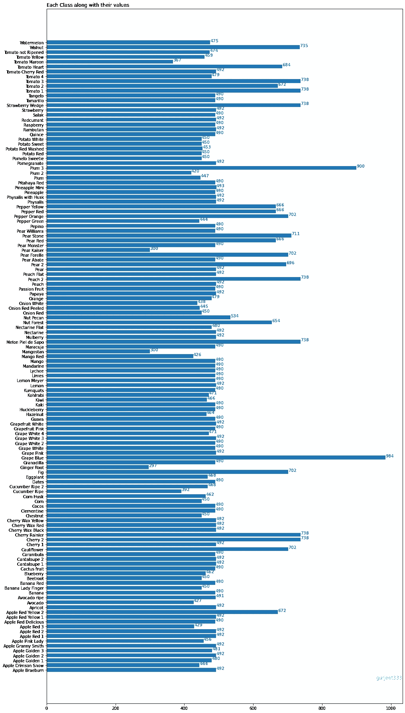
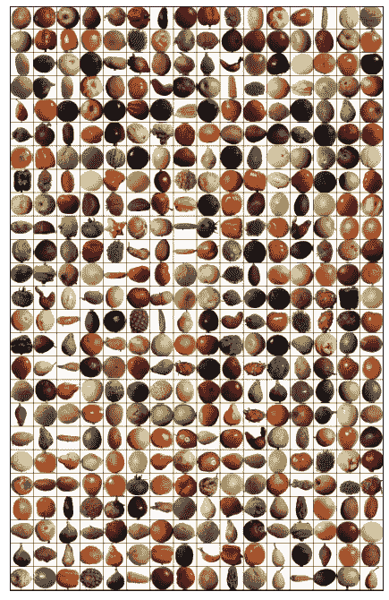
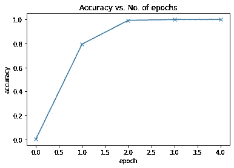
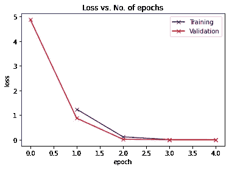
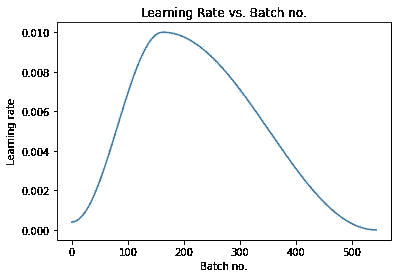

# PyTorch —在 5 分钟内训练 Fruit 360 分类器

> 原文：<https://medium.com/geekculture/pytorch-training-fruit-360-classifier-under-5-mins-23153b46ec88?source=collection_archive---------10----------------------->

## 在 Kaggle 上可用的 Fruit 360 数据集上实现了 CNN 神经网络

Photo by [ja ma](https://unsplash.com/@ja_ma?utm_source=medium&utm_medium=referral) on [Unsplash](https://unsplash.com?utm_source=medium&utm_medium=referral)

我们经常面临这样一种情况:在试图提高神经网络的准确性时，我们最终会使模型过度适应训练数据。当我们运行测试数据的模型时，这导致了不良的预测。因此，我采用了一个数据集，并应用这些技术，不仅提高了精度，而且还处理了过拟合问题。

在本文中，我们将使用以下技术在不到 5 分钟的时间内训练一个最先进的模型，以实现对来自 Fruit 360 数据集的图像进行分类的 95%以上的准确率:

1.  **数据扩充**
    数据分析中的数据扩充是通过添加已有数据的稍微修改的副本或从已有数据中新创建的合成数据来增加数据量的技术。它充当正则化器，有助于在训练机器学习模型时减少过拟合。
2.  **批量标准化**
    批量标准化是一种用于训练深度神经网络的技术，它将每个小批量的输入标准化到一个层。这具有稳定学习过程和显著减少训练深度网络所需的训练时期的效果。
3.  **学习率计划**
    学习率计划旨在通过根据预定义的计划降低学习率来调整训练期间的学习率。常见的学习率时间表包括基于时间的衰减、阶跃衰减和指数衰减。
4.  **权重衰减**
    我们使用权重衰减来保持权重较小，避免爆发渐变。因为权重的 L2 范数被添加到损失中，所以除了损失之外，网络的每次迭代将尝试优化/最小化模型权重。这将有助于保持权重尽可能小，防止权重增长失控，从而避免爆炸梯度。
5.  **梯度裁剪**
    使用梯度裁剪可以防止神经网络中的梯度爆炸。渐变裁剪限制了渐变的幅度。有许多方法来计算梯度裁剪，但一个常见的是重新调整梯度，使他们的规范最多是一个特定的值。
6.  **自适应优化器**
    该系列优化器用于解决梯度下降算法的问题。它们最重要的特点是不需要调整学习率值。实际上，一些库——比如 Keras——仍然允许你手动调整它来进行更高级的测试

# 关于数据集

水果在当今世界非常普遍——尽管有大量的快餐和精制糖，水果仍然是广泛消费的食物。举一个例子，在生产水果的过程中，可能需要对它们进行分类。传统上是机械地执行，今天，基于深度学习的技术*可以*增强甚至接管这一过程。

# 目录

1.  [简介](#f4a1)
2.  [数据预处理](#a300)
    2.1 [导入所需库](#168a)
    2.2 [下载数据集](#724f)
3.  [探索数据集](#7860)
    3.1 [训练和测试数据集包含多少幅图像？](#96bf)
    3.2 [数据集包含多少个输出类？](#4567)
    3.3 [来自数据集的图像张量的形状是什么？](#39ef)
    3.4 [你能确定属于每一类的图像数量吗？](#1f6f)
4.  [应用数据扩充](#d0b6)
    4.1 [构建数据转换](#776c)
    4.2 [将转换应用于数据集](#c7bf)
    4.3 [拆分数据集](#0a35)
5.  [访问少量样本图像](#e4e1)
6.  [访问 GPU](#c779)
7.  [配置模型](#05e1)
8.  [模型训练和结果](#3755)
    8.1 [训练前设置参数](#1d3d)
    8.2 [运行模型 4 个周期](#e4d6)
    8.3 [精度 vs 周期数](#1c8d)
    8.4 [损失 vs 周期数](#0090)
    8.5 [学习率与批次号](#0f3d)
9.  [预测](#81ec)
10.  [总结](#6dde)
11.  [参考文献](#febf)

# №1:简介

图像总数:90483。

训练集大小:67692 个图像(每个图像一个水果或蔬菜)。

测试集大小:22688 幅图像(每幅图像一个水果或蔬菜)。

班级人数:131 人(水果和蔬菜)。

图像尺寸:100x100 像素。

同一种水果的不同品种(例如苹果)被存储为属于不同的类。

# №2:数据预处理

## 导入所需的库

因为我们用 PyTorch 来构建神经网络。我一次性导入了所有相关的库。

## 下载数据集

在我们运行任何探索之前，数据集必须被加载到数据加载器。我们使用 PyTorch 中的 ImageFolder 将图像加载到数据加载器中。

# №3:探索数据集

## 问:训练和测试数据集包含多少幅图像？

## 问:数据集包含多少个输出类？

## 问:来自数据集的图像张量的形状是什么？

让我们打印一个样本图像及其类别和标签。

## 问:您能确定属于每个类别的图像数量吗？

# №4:应用数据扩充

## 构建数据转换

我们将首先编写转换函数，以便可以实现数据扩充。

请随意尝试其他参数，如 tt。tt 随机旋转。随机调整，tt。颜色抖动(我已经在代码中添加了它们)

## 将变换应用于数据集

我们构建的转换需要应用于训练和测试数据集。**注意** —我们不在测试数据集中应用数据扩充。

## 分割数据集

我们将使用来自训练集的 20%的验证集。为了确保每次都得到相同的验证集，我们将 PyTorch 的随机数生成器设置为种子值 43。

# №5:访问样本

让我们使用 Torchvision 的 make_grid helper 函数来可视化一批数据。

你能通过观察给所有的图片贴上标签吗？尝试手动标记数据的随机样本是估计问题难度和识别标记错误(如果有的话)的好方法

# №6:访问 GPU

如果您的执行平台连接到 NVIDIA 制造的图形处理器，您可以使用图形处理器(GPU)来更快地训练您的模型。按照以下说明在您选择的平台上使用 GPU:

*   Google Colab:使用菜单选项“运行时>更改运行时类型”，并从“硬件加速器”下拉列表中选择“GPU”。
*   Kaggle:在侧边栏的“设置”部分，从“加速器”下拉列表中选择“GPU”。使用右上角的按钮打开侧边栏。
*   Binder:运行 Binder 的笔记本不能使用 GPU，因为支持 Binder 的机器没有连接到任何 GPU。
*   Linux:如果你的笔记本电脑/台式机有 NVIDIA GPU(显卡)，确保你已经安装了 NVIDIA CUDA 驱动程序。
*   Windows:如果你的笔记本电脑/台式机有 NVIDIA GPU(显卡)，请确保你已经安装了 NVIDIA CUDA 驱动程序。macOS: macOS 与 NVIDIA GPUs 不兼容
*   如果您无法访问 GPU 或者不确定它是什么，不要担心，您可以在没有 GPU 的情况下执行本教程中的所有代码。

让我们从安装和导入所需的库开始。

现在，我使用`DeviceDataLoader`函数将训练和验证加载器加载到 GPU

# №7:配置模型

## 设置精度函数和图像基类

两者都是通用函数，无论数据集如何，都不需要进行任何更改。这两个函数是计算准确性的辅助函数，实现了计算模型的训练和验证损失的损失函数。

## 实现批处理规范化和删除

我们使用`nn.Squential`将神经网络的各层链接在一起。为了简化理解，我在代码中添加了注释。**注意**——这里我在每一层的末尾使用`nn.BatchNorm2d`模块实现了批量规范化。

## 训练时实现权重衰减、梯度裁剪、Adam 优化器

模特在训练前的表现似乎很差。如下所示，由于模型试图随机猜测输出，因此模型的精度低于 1%。

# №8:训练模型和结果分析

## 训练前设置参数

## 运行模型 4 个时期

我们在 4 分钟内的 4 个时期内取得了非常好的准确性。这就是我们实现的所有技术的力量。

## 精确度与纪元数量

## 损失与时代

由于训练和验证损失不是发散而是收敛，这表明我们没有过度拟合我们的模型

## 批次号的学习率

正如所料，学习率从一个低值开始，并在 30%的迭代中逐渐增加到最大值 0.01，然后逐渐减少到一个非常小的值。

# №9:预测

让我们在测试数据集上测试模型预测

验证精度超过了 **98%** ，我们编写了一个获取图像并应用于模型的辅助函数

我们现在测试样本图像上的预测

# №10:摘要

以下是本教程中用于提高模型性能和减少训练时间的不同技术的总结:

*   **数据扩充**:我们在从训练数据集中加载图像时应用了随机变换。具体来说，我们将每个图像填充 4 个像素，然后随机截取大小为 100 x 100 像素的图像，然后以 50%的概率水平翻转图像。
*   **批量归一化**:在每个卷积层之后，我们增加了一个批量归一化层，对前一层的输出进行归一化。这有点类似于数据归一化，只是它应用于图层的输出，而平均值和标准差是学习参数。
*   **学习率调度**:我们不使用固定的学习率，而是使用学习率调度器，它会在每一批训练后改变学习率。在训练期间有许多改变学习率的策略，我们使用了“一个周期学习率策略”。
*   **权重衰减**:我们在优化器中加入了权重衰减，这是另一种正则化技术，通过在损失函数中加入额外的项来防止权重变得过大。
*   **渐变裁剪**:我们还增加了渐变裁剪，有助于将渐变的值限制在一个很小的范围内，以防止在训练过程中由于大的渐变值而导致模型参数发生不希望的变化。
*   **Adam optimizer** :我们使用了 Adam optimizer，而不是 SGD(随机梯度下降)，它使用了动量和自适应学习率等技术来加快训练速度。还有许多其他优化器可以选择格式并进行实验。

# №11:参考

*   我的笔记本可以在这里访问
    [https://jovian . ai/hargurjeet/fruit-360-分类-v1-2204a](https://jovian.ai/hargurjeet/fruit-360-classification-v1-2204a)
*   [https://jovian . ai/learn/deep-learning-with-py torch-zero-to-gans/lesson/lesson-5-data-augmentation-regularity-and-resnets](https://jovian.ai/learn/deep-learning-with-pytorch-zero-to-gans/lesson/lesson-5-data-augmentation-regularization-and-resnets)
*   [https://towards data science . com/7-tips-to-choose-the-best-optimizer-47 bb9c 1219 e](https://jovian.ai/outlink?url=https%3A%2F%2Ftowardsdatascience.com%2F7-tips-to-choose-the-best-optimizer-47bb9c1219e)
*   [https://androidkt . com/how-to-apply-gradient-clipping-in-py torch/](https://jovian.ai/outlink?url=https%3A%2F%2Fandroidkt.com%2Fhow-to-apply-gradient-clipping-in-pytorch%2F)
*   [https://medium . com/analytics-vid hya/deep-learning-basics-weight-decay-3c 68 EB 4344 e 9](https://jovian.ai/outlink?url=https%3A%2F%2Fmedium.com%2Fanalytics-vidhya%2Fdeep-learning-basics-weight-decay-3c68eb4344e9)
*   [https://towards data science . com/learning-rate-schedules-and-adaptive-learning-rate-methods-for-deep-learning-2c8f 433990 D1](https://jovian.ai/outlink?url=https%3A%2F%2Ftowardsdatascience.com%2Flearning-rate-schedules-and-adaptive-learning-rate-methods-for-deep-learning-2c8f433990d1)
*   [https://machine learning mastery . com/batch-normalization-for-training-of-deep-neural-networks/](https://jovian.ai/outlink?url=https%3A%2F%2Fmachinelearningmastery.com%2Fbatch-normalization-for-training-of-deep-neural-networks%2F)
*   【https://neptune.ai/blog/data-augmentation-in-python 

我真的希望你们能从这篇文章中学到一些东西。随意👏如果你喜欢你所学的。如果有什么需要我帮忙的，请告诉我。