# 如何为公司网站建立问答机器人

> 原文：<https://medium.com/geekculture/q-a-bot-for-company-website-347222fa4702?source=collection_archive---------5----------------------->

## 我们如何创建一个问答机器人，使用网站的数据来回答用户的问题

客户和信息资源之间的交互过程的自动化，以及从文本语料库中检索必要的信息，是信息技术中最有前途和最令人感兴趣的领域之一，因为它有助于显著降低成本并加快与各种信息源(文档档案、书籍、网站等)的交互。IT 行业在人工智能和深度学习的帮助下，已经达到了自动化搜索发展的最新阶段。现在，我们可以构建具有强大泛化能力的复杂非确定性解决方案。

在文本语料库中搜索信息的一个流行场景是问答系统(QAS)。这些系统允许用户快速回答他们感兴趣的关于一般主题或特定领域的问题。以下是自动信息检索领域的研究人员对 QAS 的看法:“对于人机交互来说，自然语言是人类最好的信息访问机制。因此，与搜索引擎相比，问答系统(QAS)具有特殊的意义和优势，被认为是满足用户信息需求的语义搜索的最终目标。

Quantum 已经研究了这一领域，并创建了一个问答机器人，可以使用来自网站的数据来回答用户的问题。在研究中，我们使用了 NLP 领域的最先进的解决方案，语义搜索测试了该解决方案对于不同用例的稳定性，并构建了一个具有 web 接口的管道，用户可以通过该管道与实现的服务进行交互。

在本文中，您将看到解决该问题的方法的描述、各种系统组件的评估、将这些组件合并到单个管道中的想法，以及对此类系统的可能性和局限性的分析。

# 体系结构

我们的 bot 由两部分组成:服务器和模型。每个都是 docker 容器，它们之间的通信通过 docker 桥网络进行。您可以在图 1 中看到该应用程序的方案。

本解决方案的范围:

1.  从网站内容创建文本语料库。
2.  为接收到的问题选择合适的上下文。
3.  在每种情况下预测问题的答案。
4.  选择并返回最佳答案。

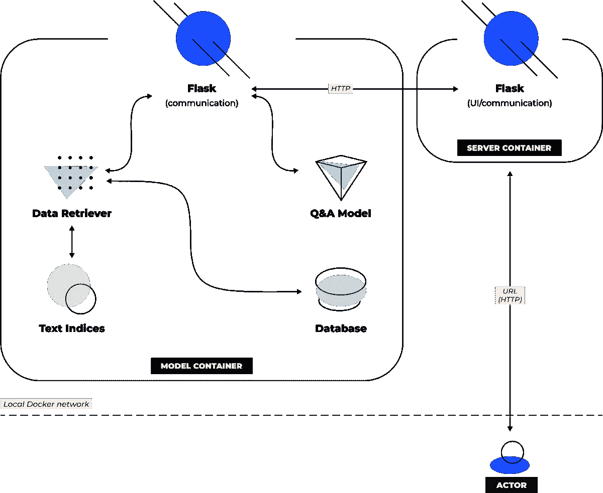

Figure 1\. Application scheme

用户使用 GUI 与服务器容器通信。GUI 是用 Flask/Dash 写的。当用户输入一个问题并点击“提交”按钮时，在服务器容器上生成一个对模型的请求。

模型容器使用 Flask 接收请求，并在检索器中形成查询，检索器是一个用于搜索与输入文本意义相似的文档的模型。检索器从本地存储中读取文本和文本的索引，并返回前 K 个最合适的上下文，以及每个上下文的检索器分数，其中 K 是检索器的超参数。

使用来自检索器的上下文，服务创建 K 个问题-上下文对，并将每对发送到 Q&A 模型推理。该模型返回答案和每个答案的置信度得分。

接下来，模型容器从建议的答案中选择一个答案。它通过 HTTP 向服务器容器发送一个带有这个答案的响应，服务器容器中的服务在 web 界面上显示信息。

# 数据集

为了评估我们的解决方案的性能，我们使用了几个开源数据集，并从 Quantum 网站收集了一个小样本的问题和上下文。以下是对开源数据集的描述:

[**小队 2.0**](https://rajpurkar.github.io/SQuAD-explorer/)

斯坦福问答数据集(SQuAD)是一个阅读理解数据集，由一组维基百科文章上的众包工作者提出的问题组成。每个问题的答案都是相应阅读文章中的一段文字，或者说是一段，或者这个问题可能是无法回答的。SQuAD2.0 将 SQuAD1.1 中的 100，000 个问题与超过 50，000 个无法回答的问题相结合，这些问题由众包工作人员以敌对的方式编写，看起来与可回答的问题相似。

[news QA](https://github.com/Maluuba/newsqa)

NewsQA 是一个具有挑战性的机器理解数据集，包含超过 100，000 个人工生成的问答对。众包工作人员根据 CNN 超过 10，000 篇新闻文章提供问题和答案，答案由相应文章的文本组成。

## **量子站点数据集**

为了形成我们自己的问题和背景数据集，我们从 Quantum 网站上获取了一些页面，并从中提取了有意义的文本。

我们决定使用具有更具体含义的页面的上下文——站点第一页(主页、[团队](https://quantumobile.com/services/dedicated-team)、[专业知识](https://quantumobile.com/expertise/ai-and-machine-learning/)等)上的概括信息。)对于我们的目的来说是相当弱的。

因此，选择了以下页面:

*   来自[案例研究页面](https://quantumobile.com/portfolio/case-studies/)的一些项目。
*   第[页](https://quantumobile.com/portfolio/rd-projects/)中的一些项目描述。
*   来自[新闻页面](https://quantumobile.com/insights/news)的一些文章。
*   来自[职业页面](https://quantumobile.com/careers/vacancies)的职位描述。

结果，收集了 30 个上下文。每个情境有 1-4 个问题，总共 100 个问题。问题的主要要求是答案的简洁和明确，这样我们就可以准确地为机器人评估制定基本原则。

# 工具

在这一章中，描述了我们使用的建模工具。在文本语料库上获得问题答案的解决方案包括两个部分:

*   基于上下文的问答模型 NLP 模型采用特定格式的问题-上下文对，并根据提供的上下文为该问题生成有意义的答案。
*   检索器—从整个文本语料库中检索最相关的上下文的模型。

# 基于上下文的问答模型

问答模型—一种自然语言模型，一种经过训练的神经网络，可以根据输入的单词序列来预测单词或序列。如今，这样的模型解决了自然语言处理领域中一些最重要的任务，比如机器翻译和问答系统的构建。问答问题有几种模型，但我们选择了基于上下文的模型。这些模型接收问题本身和上下文作为输入——一段你可以从中得到答案的文本。这些模型更容易推断，既可以用于一般主题，也可以用于专门领域——这只是你给模型的上下文的问题。

在最初寻找解决方案的阶段，我们选择了两种问答模式。他们两人都有预先训练好的砝码，并且在通用基准测试中取得了好成绩。每个型号的简要说明如下。最初，我们也考虑过其他开源模型，但这两个模型都有预先训练好的权重，它们的代码库在我们的管道中实现起来最方便。

[**统一 QA**](https://github.com/allenai/unifiedqa)

基于 T5 并在许多开源数据集上训练的问答模型。它有几种不同复杂性和大小的选项，从 242 MB 到 42 GB 不等。UnifiedQA 基于带有递归分类头的 T5 生成模型。这种模型的优势之一是，它可以针对不同格式的问题进行训练:提取型—当答案在上下文中明确而准确地找到时；抽象型—当答案应该根据上下文中的信息而不是从一段上下文中获得时；多项选择型—当答案可以从答案列表中选择时；是/否型—当用户希望答案为“是”或“否”时。

**一种最先进的解决方案，在类似于我们的管道中使用了预先训练好的模型。该模型也有几个选项—基本和大型，每个选项都在该任务中常用的某个数据集上进行训练。该模型的主要特点是创建它是为了在各种上下文中搜索信息。该模型接收几个问题-上下文对，在潜在空间中为每个生成编码向量，将这些向量连接成一个向量，并回答问题。**

**首先，我们决定确定哪种问答模型能更好地回答来自开源数据集的问题，以及我们的问题。为了做到这一点，我们放弃了上下文检索的问题，并为模型提供了正确的问题-上下文对。我们确定，在开源数据集上，UnifiedQA 的最轻版本与 FiD 具有相同的度量值。与此同时，FiD 在我们的数据集上的表现要差得多——它的答案不太符合实际情况，尽管就意义而言，UnifiedQA 的差异不是很大。这样，为了构建我们的管道，我们使用了 UnifiedQA 模型。**

**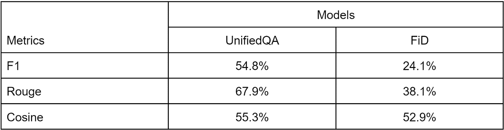**

**You can find metrics on our dataset in Table 1.**

# **取回的人**

**检索是管道的一部分，负责为问题找到合适的上下文，然后 QA 模型将从中生成答案。最初，我们为这部分管道找到了几种解决方案。有现成的文本编码解决方案和方法可以用来从头开始实现自己的检索器。**

**我们决定使用[Pyserini](https://github.com/castorini/pyserini/)——Python 工具包，用稀疏和密集的表示进行可再现的信息检索研究。该工具包中的密集检索(使用 [Faiss](https://github.com/facebookresearch/faiss) searcher)基于对文本的 transformer 编码表示的最近邻搜索。**

**我们选择 Pyserini 是因为它比其他解决方案更适合我们的任务。其优点:**

*   **语义搜索，与匹配搜索相对。**
*   **与使用基于大型 DL 模型的解决方案相比，选择速度更快。**
*   **经过训练的模型的可用性。**
*   **扩展文本语料库时，将新建立的索引与旧索引连接起来的能力。**

# **建设管道**

**在第一次修改 bot 的时候，我们面临的问题是，如果上下文中没有正确答案，模型给出的是一个没有意义的答案，而这个答案的模型置信度可以相当高。周期性地，这个分数比从正确的上下文中得到的答案的分数要高。**

**当使用多上下文预测时，这显著降低了准确性。即使检索器正确地将最高等级之一分配给适当的上下文，该上下文中的模型也能正确回答。我们通过分别观察问答模型和检索器的质量来发现这个问题。我们发现，从基于上下文的管道(没有检索器)获得的答案比从上下文无关的管道获得的答案更有意义。在图 2 中，您可以看到检索器对数据集中每个问题的正确上下文给出了哪个等级。对于我们的数据集，我们看到 97%的上下文在前 5 个结果中，91%在前 2 个结果中。**

**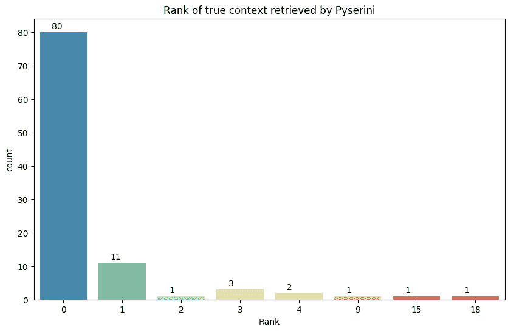**

**Fig. 2\. What rank is given by the retriever to the correct context**

**在图 3 中，您可以看到随着上下文数量的增加，模型的质量下降了多少。尽管合乎逻辑的是期望质量应该增加直到达到极限。**

****

**Fig. 3\. Mean metrics for each count of contexts.**

**为了解决这个问题，我们考虑了以下方法:**

*   **上下文组合——使用随机抽样，我们从少量选定的上下文中创建重叠组，将该组中的所有上下文连接成一个大文本，并将该文本用作新的上下文。我们这样做了几次，得到了一个新的大上下文列表。**
*   **另一种计算答案可信度分数的方法。它是我们从与问题-上下文对列表相对应的答案列表中选择一个答案的分数。我们考虑了各种选择:**

**—令牌的平均置信度:**

**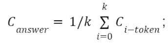**

**—用上下文的检索器分数对答案置信度进行加权:**

**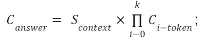**

**—方法 1 和方法 2 的组合:**

**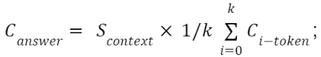**

**—使用上下文的检索器分数的 softmax 对答案置信度进行加权:**

**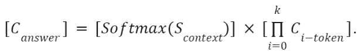**

**我们在第二种方法的最后一个变体上停止了，因为它给出了度量的显著增加。这种方法的直觉很简单——我们选择选项，被检索者收到的联合概率，AMC 模型是所有答案中最高的。现在，我们可以在图 4 中查看度量对上下文数量增加的依赖。随着检索器选择的上下文数量的增加，质量上升到某个阈值并且不变。显然，对于大型文本语料库，图 3 和图 4 之间的差异会更大。**

**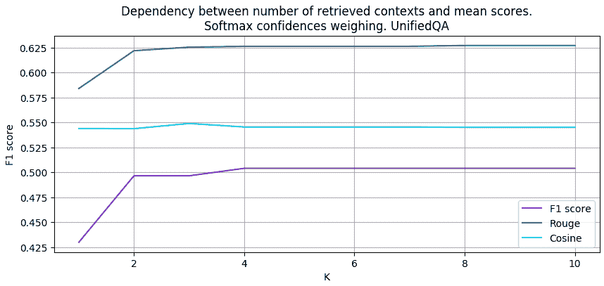**

**Fig. 4\. Mean metrics for each count of contexts. Using Softmax weighting**

**我们还探讨了问题措辞对机器人反应质量的影响。这项研究分两步进行——提取性和抽象性问题。**

**在第一步中，我们准备了 2 个数据集——第一个数据集中的问题有在上下文中完全遇到的单词和句子结构。在第二个问题中，我们用同义词替换了这些词，并改变了问题的措辞。**

**首先，我们把检索器放在一边，看看 UnifiedQA 模型在必须通过同义词寻找答案时的表现。您可以在表 2 中找到不同模型版本的基于上下文的推理的平均度量。度量值下降了大约相同的量，就好像我们使用了一个上下文无关的管道。**

**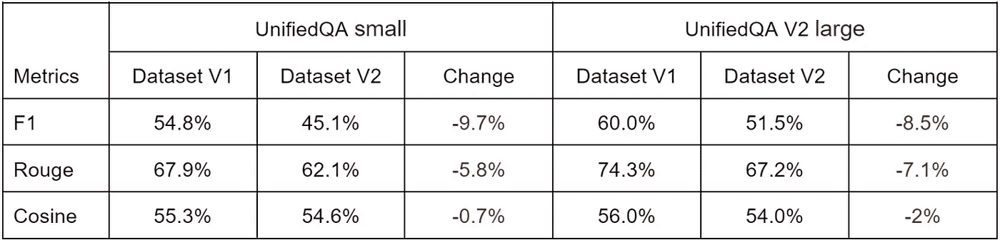**

**Table 2\. Models' evaluation for context-based inferences.**

**图 5 显示了检索器对数据集 1 和 2 中每个问题的正确上下文给出的等级。我们可以看到，用同义词替换单词并不会对检索者产生太大影响。**

**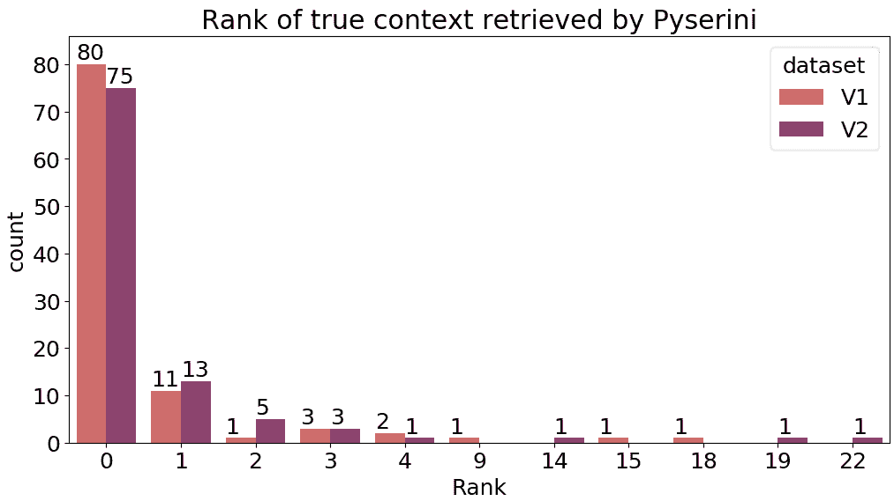**

**Fig. 5\. Count of ranks given by the retriever to the correct contexts for two versions of questions**

**在表 3 中，您可以看到 UnifiedQA 的上下文无关推理的比较。**

**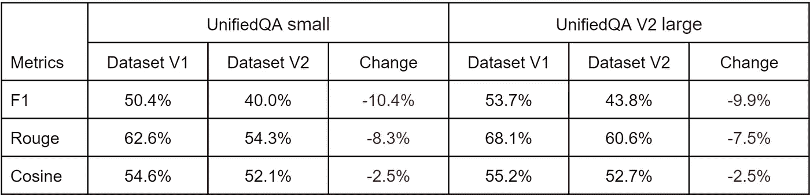**

**Table 3\. Models' evaluation for context-free inferences.**

**因此，我们的问答机器人在一定程度上受到同义词和重构的影响，尽管它没有破坏整个服务。**

# **结果**

**在使用 Pyserini 构建了 Quantum 站点上收集的上下文索引并实现了应用程序方案之后，我们得到了一个带有 web 界面的问答系统，它可以回答关于我们站点的问题。您可以在图 6 中看到一个例子。**

**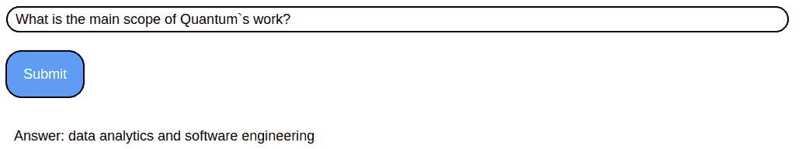**

**Figure 6\. Web GUI and usage example.**

**谈到使用这个机器人的限制，我们可以强调几个重要的意见:**

*   **问题的措辞影响了机器人的质量。在问题中出现与上下文的必要部分完全一致的单词和语音结构提高了质量。这主要适用于问答模型的工作，但也适用于检索器。同时，随着模型复杂度的增加，用同义词替换单词仍然会影响质量。**
*   **上下文应该清晰，意义明确。过于抽象的上下文会导致模型产生不合逻辑的响应。**
*   **bot 不能将来自多个上下文的响应收集到一个逻辑响应中。此外，如果部分答案位于上下文的不同部分，QA 模型也不能很好地响应问题。**
*   **更复杂的模型更符合逻辑地回答抽象的问题，尽管并不总是正确的。**
*   **文本格式对于回答的质量至关重要。所有上下文和问题都必须在生产中转换到正确的寄存器。如果不是首字母缩写，则不允许大写。清理垃圾字符的文本也是可取的。**

> **由 Ruslan Babudzhan 撰写，Kostyantin Isaienkov 校对**