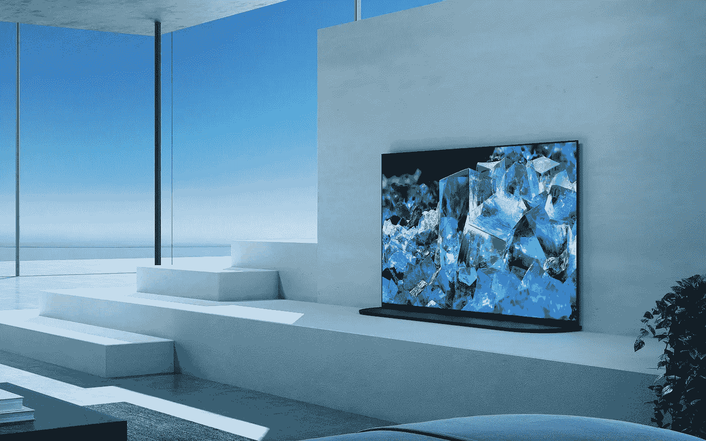

# QD-有机发光二极管:它能在 2022 年带来电视市场的重组吗？

> 原文：<https://medium.com/geekculture/qd-oled-can-it-bring-about-a-tv-market-shake-up-in-2022-1753dfd908bf?source=collection_archive---------14----------------------->

## 这两种情况都有原因，下面是可能性的样子

Samsung and Sony will offer QD-OLED TV models in 2022, the first of their kind and the first TVs based on new display tech in a decade. (Image: Sony)

现在，CES 2022 似乎已经成为遥远的记忆——用科技媒体的术语来说，整整一个月的感觉是不是很荒谬？—但电视产品类别中最热门的话题是，QD-有机发光二极管电视机和显示器将在未来几年推出…