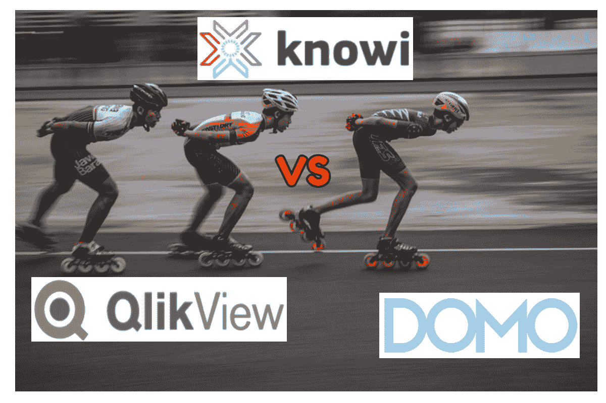
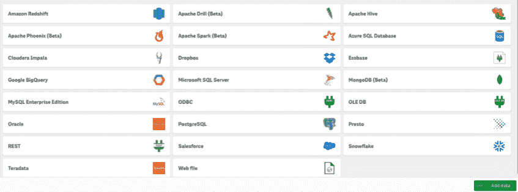
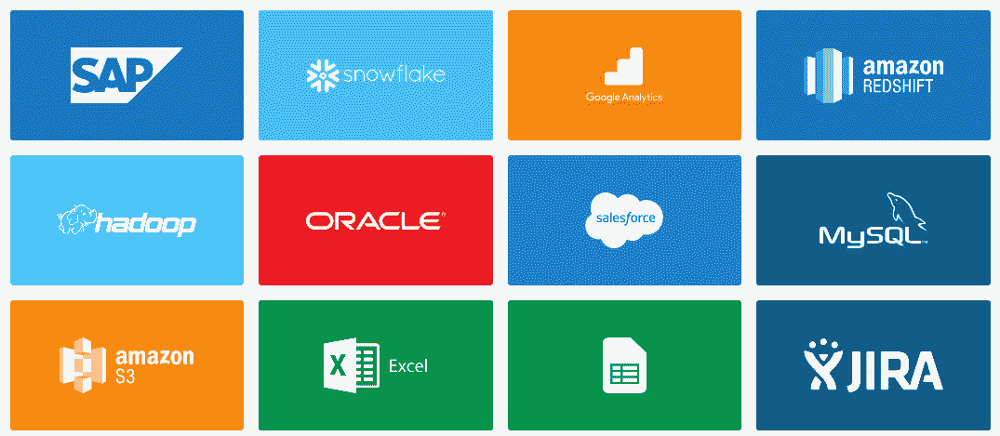
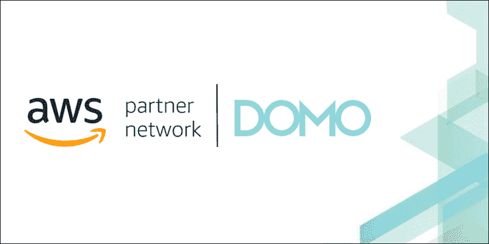
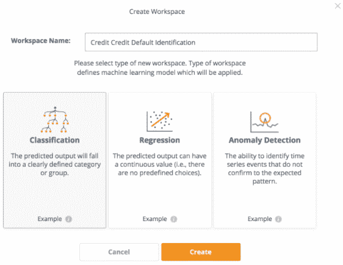
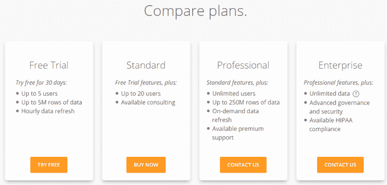
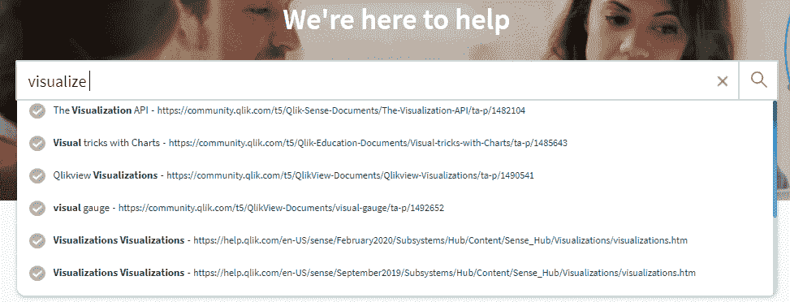
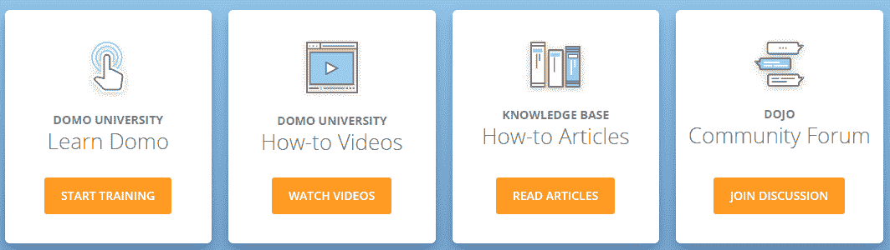

# QlikView vs Domo vs Knowi

> 原文：<https://medium.com/geekculture/qlikview-vs-domo-vs-knowi-d17fe7379645?source=collection_archive---------41----------------------->

三方比较，了解哪一个是最好的商务智能工具。

在选择商业智能工具时，您会对市场上各种各样的选择感到困惑。目前大约有 5，678，234，987 种 BI 工具，但是您会希望选择一种来帮助您实现所有数据可视化目标。在本文中，我们挑选了三个常见的 BI 工具，即 QlikView、Domo 和 Tableau，以帮助您了解它们在不同核心领域的相互比较。然后，您将能够判断并选择一个来帮助您更有效地实现数据可视化目标。

Image by Author

# 介绍

2019 年，全球商业智能和商业分析软件市场价值为 1931.4 亿美元，预计到 2027 年将达到 4209.8 亿美元。如今，46%的小型企业将商业智能工具的虚拟网络功能作为其商业战略的核心要素。这表明企业已经对 BI 系统产生了信心。

QlikView、Domo 和 Knowi 都是 BI 工具的好例子。 [QlikView](https://help.qlik.com/en-US/qlikview/May2021/Content/QV_HelpSites/what-is.htm) 上市已久，其次是 [Domo](https://www.domo.com/) 。 [Knowi](https://www.knowi.com/) 是一家相对较新的初创公司，正试图与 QlikView 和 Domo 竞争，并展示了商业智能的未来。

这些 BI 工具之间没有太多的比较。我们决定对 QlikView、Domo 和 Knowi 进行三方面的比较，以了解它们彼此的情况。在进行比较之前，让我们先对每个工具做一个概述。

# QlikView

QlikView Logo

[QlikView](https://help.qlik.com/en-US/qlikview/May2021/Content/QV_HelpSites/what-is.htm) 是 Qlik 于 1993 年创立的商业智能工具。它用于数据集成和从原始数据中提取知识。QlikView 提供了引导式数据探索，用于从数据中发现真知灼见。它使用户能够快速创建和交付交互式引导分析仪表板和应用程序。

有了 QlikView，您可以提问和回答您的问题，并遵循您独特的见解之路。它还能让你和你的同事协作做出决定。

QlikView 附带一个专利关联引擎，可动态生成新的数据视图。它还压缩数据并将其保存在内存中，供多个用户即时浏览。对于内存无法容纳的大型数据集，QlikView 可以与数据源建立直接连接。QlikView 为所有类型的数据提供了一种关联体验，无论这些数据存储在何处。

# 多莫

Domo Logo

Domo 是一个基于云的工具，用于创建仪表盘。它是由乔希·詹姆斯在 2010 年创立的。Domo 是为所有业务用户设计的，无论他们的技术专长如何，都可以从数据中提取洞察力并做出更好的决策。

Domo 提供了一个业务管理平台，用户可以从一个平台访问和执行数据分析和报告。它还为 CEO、It、财务、营销和销售等角色提供定制解决方案。Domo 还提供了各种数据源的连接器，如脸书、Google Sheets、Twitter、Excel、Salesforce 和 Zendesk。

Domo 是第一个运行整个组织的业务云自助服务解决方案。它汇集了回答关键业务问题所需的数据、人员和见解，以促进快速决策，从而提高业务绩效。

# Knowi

Knowi Logo

[Knowi](https://www.knowi.com/) 是一个统一的商业智能平台，它缩短了原始数据和基于证据的行动之间的距离。Knowi 通过使用数据虚拟化来消除通过 ETL 过程获取数据的需要，从而实现了这一点。这使它成为不同于 QlikView 和 Domo 等其他工具的独特 BI 解决方案。Knowi 还支持与 NoSQL 数据库的本机集成，允许用户直接分析非结构化数据，这是传统 BI 工具所不提供的功能。这消除了移动数据所需的繁琐、昂贵且耗时的步骤。

Knowi 也有一个自然语言 BI 平台，方便搜索驱动的分析。你可以用英语问你的数据问题，即时得到答案。Knowi 成立于 2015 年，其客户范围从新兴的初创公司到全球财富 500 强企业。

# QlikView vs Domo vs Knowi

在这一部分，我们将讨论这三种 BI 工具的比较。将考虑以下 12 个核心领域:

*   部署
*   用户友好性
*   表演
*   连接/集成
*   形象化
*   基于搜索的分析
*   警报/异常检测
*   机器学习
*   嵌入式分析
*   多源连接
*   定价
*   客户支持

# 部署

QlikView 有基于云的版本和内部版本。用户可以根据自己的需求自由选择版本。

Domo 纯粹是一个基于云的工具。这意味着您只能在网络浏览器上使用它。

Knowi 支持云和内部部署。它不支持桌面安装。Knowi 的企业用户可以选择内部、云或混合部署选项。因此，Knowi 为三个 BI 平台提供了最广泛的部署选项。

# 用户友好性

QlikView 的界面有许多工具和选项，因此，对于新用户来说可能有点难以接受。

Domo 的界面易于使用，因此，它提供了很好的用户体验。它还提供了拖放功能，使用户可以轻松地创建可视化效果。

Knowi 有一个直观的和可定制的用户界面。然而，它为数据工程师提供的用户界面非常复杂，用户可能需要一段时间来适应。

因此，在这三个 BI 工具中，Domo 在用户友好性方面表现出色。

# 表演

QlikView 将数据存储在内存中，以加快访问速度。对于大型数据集，QlikView 直接从其数据源访问它们。

Domo 有一个快速查询引擎，可以让用户快速从洞察到行动。Domo 在云中完成所有的处理。但是，这在某些情况下会导致速度变慢。Domo 将你的数据上传到他们的云中，这有时会导致等待数据同步。没有直接连接到数据库的选项。

Knowi 提供了一个虚拟化概念，可以将查询下推到底层数据源，或者存储查询结果以进行异步处理。它消除了繁琐的 ETL 步骤，缩短了原始数据和操作之间的距离。与 QlikView 和 Domo 相比，这使得 Knowi 成为速度最快、可扩展性最强的 BI 工具。

# 连接/集成

QlikView 可以使用 Qlik 连接器连接到各种数据源。无论您的数据存储在云中还是本地，您都可以快速将其加载到 QlikView 中。安装 QlikView 连接器非常简单，不需要额外配置。也可以通过 API 集成与 R 连接。

QlikView Data Sources (Source-qlik.com)

就像 QlikView 一样，Domo 可以连接到各种数据源。它配有预建的 1000 多个数据连接器。没有本地连接的数据源可以通过 Domo Workbench 连接器或 API 来访问。

Domo Data Connectors (Source-www.domo.com)

Knowi 支持与超过 36 个结构化和非结构化数据源的集成。它还具有对 NoSQL 数据源的本机支持，因此用户不必安装第三方驱动程序和“关系化”数据。它还提供了一个强大的 REST API 集成来连接 API 和连接来自不同来源的数据。理论上，Knowi 可以连接到它本身提供的 30 多个数据源之外的任何数据源，前提是这些数据源能够连接到它们。

Knowi Data Sources (Source-knowi.com)

# 形象化

QlikView 支持不同类型的可视化以及仪表图和图表的可视化形式。QlikView 提供的所有可视化效果都属于比较图表、关系图表、构成图表和分布图表。您可以使用 QlikView 创建条形图、饼图、散点图、折线图、网格图和其他类型的可视化效果。

Domo 也是一个很好的 BI 工具，用于创建有吸引力的和可伸缩的可视化。它支持 150 多种图表类型的数据可视化，包括数据科学图表、跨周期图表和网格图表，这些图表都由 Domo 的可视化引擎提供支持。它附带了许多预构建页面，能够根据数据输入进行自我组装。它的卡片生成器工具为用户提供了构建可视化的拖放功能。

Knowi 允许其用户创建可定制的仪表板和可视化。Knowi 用户还可以使用 JavaScript 创建定制的可视化，以满足他们的特定需求。它支持 30 多种可视化，您可以使用这些可视化来直观地呈现您的数据。

Domo 是三个 BI 工具中可视化数量最多的。

# 自然语言处理

QlikView 和 Domo 缺乏自然语言处理能力。Knowi 称之为“基于搜索的分析”，允许用户用简单的英语对他们的数据提出问题。它使用自然语言处理，允许用户用简单的英语从他们的数据中键入问题，并立即获得答案，类似于谷歌的搜索功能，并结合分析。这是针对非技术业务用户，以方便地访问他们的知识数据和获得洞察力。

最近，Knowi 还在 Slack 和微软团队中引入了基于搜索的分析，这使其成为市场上独一无二的 BI 工具。通过将 Slack 和 Team 的直观消息用户界面与 Knowi 基于搜索的分析相结合，它使用户能够直接从这些应用程序中提出问题，并获得即时答案。答案可以是图表和数据的形式。

自然语言处理是自助分析的一个新领域，与 Domo 和 QlickView 相比，Knowi 目前拥有明显的优势。

# 警报/异常检测

QlikView 不向用户提供异常检测和警报功能。Qlik 仅向 Qlik Sense 用户提供此功能，Qlik Sense 是其另一款 BI 工具。

Domo 用户可以获得不同类型的提醒，例如，新客户提醒、销售基准、收入增加/减少等。它允许用户配置自定义警报，以便在数据更改、特定 KPI 更改、指标达到特定阈值等情况下收到通知。

Knowi 提供提醒，帮助用户了解数据或业务的最新变化。在检测到特定阈值、条件和数据异常后，会实时发送警报。警报可以通过电子邮件、Slack 或 webhook 发送。

就警报和异常检测而言，Domo 和 Knowi 都很出色。它们允许用户设置和接收有关其业务中重要变化的警报。例如，Knowi 的时序异常检测警报会在检测到数据中不符合预期行为的异常模式时通知您。这在各种用例中都很有用，例如欺诈检测、监控网络流量、安全监控等等。

# 机器学习

QlikView 不支持任何机器学习算法。这意味着您无法使用 QlikView 创建和训练机器学习模型。

Domo 具有 Auto ML 特性，可以提供自动洞察。它由 Sagemaker 提供动力。通过这一功能，你可以告诉 Domo 你需要对数据的哪些部分进行洞察和预测，然后 Domo 会自动对你的数据应用不同的机器学习模型。这使得 Domo 用户可以轻松地执行分类、预测和预测任务。

Image Source: aws.amazon.com

Knowi 支持分类、回归分析和时序异常检测机器学习用例。用户可以使用引导式数据准备向导准备数据、创建和训练 ML 模型。他们还可以保存模型并将其应用于现有数据集。

Knowi Machine Learning Algorithms (Source-knowi.com)

虽然 Domo 和 Knowi 支持机器学习，但 QlikView 不支持。我们可以比较 Domo 和 Knowi 在如何实现和支持机器学习方面的差异。Domo 依靠第三方工具亚马逊 Sagemaker 在其平台中实现机器学习功能。相比之下，Knowi 已经实现了对机器学习特性的本机支持，以及通过基于 REST API 的接口插入任何 ML 的附加选项。

# 嵌入式分析

QlikView 不支持嵌入式分析。Qlik 通过其另一款产品 Qlik Sense 提供这一功能。

Domo 支持嵌入式分析，以帮助其用户向客户和合作伙伴交付数据体验。Domo 用户可以创建自助式仪表盘，然后将其直接嵌入到网站、门户和应用中。这使得他们能够轻松地向客户传达见解。

Knowi 通过众多选项支持嵌入式分析。它允许用户生成仪表板的 URL，并将其嵌入到外部应用程序中。Knowi 用户还可以创建仪表板的安全 URL，使用参数来控制向客户公开的数据类型。它的单点登录 API 功能有助于系统中的用户进行令牌交换，以映射到具有用户权限的 Knowi。

Domo 和 Knowi 支持嵌入式分析，但 QlikView 不支持。我们还可以在嵌入式分析方面比较 Domo 和 Knowi。就嵌入式分析而言，Knowi 优于 Domo。它提供了多种选项来将仪表板和可视化嵌入到外部应用程序中。此外，它的安全 URL 和 SSO 功能提供了数据安全性，因为它确保用户只能看到他们应该看到的数据。

# 多源连接

QlikView 支持四种主要连接类型，即内部连接、左外部连接、完全外部连接和右外部连接。您可以使用这些连接来合并来自多个源的数据，并连贯地查看它们。

Domo 支持四种主要的连接类型，即内连接、左外连接、全外连接和右外连接。除此之外，它还支持循环连接。您可以使用这些连接将来自多个平台的数据合并到一个数据集中。

Knowi 支持跨多个数据源的不同类型的连接，以合并和存储结构化和非结构化的组合数据。这些联接的示例包括内部联接、左外部联接、全外部联接、右外部联接和循环联接。Knowi 使用内部连接作为默认的连接类型。连接操作是基于数据源中的公共字段执行的。Knowi 的 REST API 集成允许您连接到 API 并跨多个数据源连接数据。

# 定价

QlikView 提供两种定价方案，个人版(免费)和企业版。个人版适合个人用户，而且是免费的。要了解企业版许可选项的更多信息，请联系 QlikView。

Domo 的定价可以根据平台的使用情况进行定制，比如用户数量和数据刷新率。它有一个 30 天的免费试用计划和三个其他基于订阅的计划，即标准，专业和企业。

Domo Pricing Plans (Source-improvado.io)

Knowi 有三种定价方案，即基本版、团队版和企业版。每个计划都配有全面的入职培训和技术支持。它还为创业公司和非营利组织提供折扣。Knowi 对需要用户等的电子邮件报告不收费。在其他系统中。

# 客户支持

QlikView 有两个支持级别，基本和企业。基本级别包括电话支持、产品更新、实时聊天和工作时间技术支持、自助门户、知识库、论坛、网络研讨会和视频。企业级包括基本级的所有服务，外加针对关键问题的 24/7 全天候服务、针对不太关键的问题的 9 小时全天候服务、针对专家和认证工程师的业务关键型服务级别协议，以及根据客户需求提供的产品发布和升级建议。

QlikView Knowledge Base (Source-qlik.com)

Domo 还为其用户提供了各种支持选项。Domo 用户在周一至周五上午 7 点至下午 6 点(MST)通过实时聊天、电话和电子邮件获得支持。它还支持多语言。Domo 还有一个知识库，用户可以在那里接收支持文章，还有一个名为 Dojo 的在线社区，用户可以在那里相互交流和交换想法。Domo 还提供高级支持服务，包括定制服务和更快的响应时间。

Domo Support Options (Source- domo.com)

Knowi 有一个知识库，用户可以在那里键入他们的问题，并以文章的形式获得答案。当键入问题时，用户获得可能回答他们问题的热门文章建议。Knowi 还为其客户指派了一名客户服务主管，帮助他们进行实施、培训并解决他们的支持需求。它也有一个服务台和在线聊天的客户支持。

Knowi Knowledge Base (Source-knowi.com)

# QlikView vs Domo vs Knowi-最终想法

从上面的讨论中，您可以看出这三种 BI 工具中的每一种都是独一无二的，各有利弊。

[QlikView](https://help.qlik.com/en-US/qlikview/May2021/Content/QV_HelpSites/what-is.htm) 适合寻求引导式分析解决方案的公司，以帮助他们更深入地了解数据，从而做出更好的决策。如果您是个人或经营小型企业，并且需要一个简单的基本 BI 工具来执行基本的商业智能任务，请选择 QlikView。它的个人版是免费的，可以帮助个人和小企业执行简单的商业智能任务。QlikView 很成熟(成立于 90 年代中期)，但与 Domo 和 Knowi 相比，感觉有些过时。

[Domo](https://www.domo.com/) 为所有行业中需要从一个平台管理整个组织的公司提供服务。它有利于构建仪表板，并与组织内的所有团队共享访问权限。它提供了一个单一的仪表板，企业中所有级别的个人都可以在其中访问数据并获得深刻的见解以进行决策。可以说，Domo 在这三者之间提供了最好的用户界面，甚至可以被很少或没有技术技能的人使用。

如果您需要一个能够连接到多个数据源并从所有类型的数据(包括结构化和非结构化数据)中提取洞察力的商业智能解决方案，请选择 [Knowi](https://www.knowi.com/) 。与其他两个相比，Knowi 是最新的一个，它提供了一种解决分析问题的现代方法。在这三者中，它最有潜力改变商业智能的面貌。