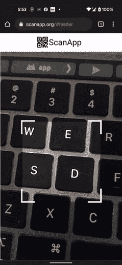
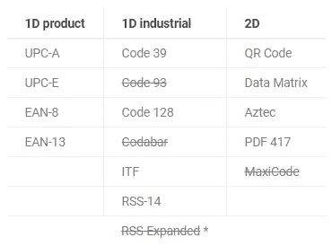
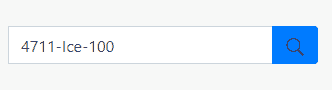
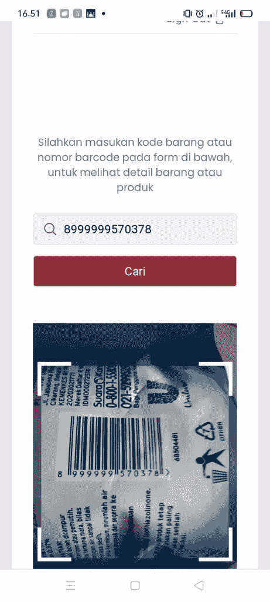

# 使用带 html5-qrcode 的网络摄像头的 QR 和条形码扫描仪

> 原文：<https://medium.com/geekculture/qr-and-barcode-scanner-using-webcam-with-html5-qrcode-a8d6dd4822a5?source=collection_archive---------1----------------------->


你好，朋友们好，再次和 mantan 程序员在一起。这次我们将讨论如何使用网络摄像头读取 QR 和条形码。赛亚裙狄斯尼蒙古那坎图书馆[html 5-二维码](https://github.com/mebjas/html5-qrcode)阅读吧。

这款条形码扫描仪在创建读取产品条形码的应用程序时非常有用。扫描仪通常用于使销售产品更容易，并加快销售交易。

我们将介绍几个例子:

1.  html 5-二维码是什么？
2.  html 5-二维码的优势
3.  支持的代码格式
4.  履行

你也可以学习下面的教程:

[Laravel 中数据表的实现](https://temanngoding.com/implementasi-datatables-di-laravel/)

[登录和注册 JWT 的工作流程](https://temanngoding.com/alur-kerja-login-and-registrasi-with-jwt/)

[Javascript 教程:将时间 am pm 转换为 24 小时](https://temanngoding.com/tutorial-javascript-convert-waktu-am-pm-to-24-jam/)

# html 5-二维码是什么？

html5qrcode 是一个库，用于读取 QR 码、条形码和其他常见的代码扫描功能，并将其集成到您的 web 应用程序中。这个库支持网络摄像头，所以当我们使用手机进行交易时会更容易。



[https://github.com/mebjas/html5-qrcode](https://github.com/mebjas/html5-qrcode)

# html 5-二维码的优势

*   支持使用智能手机(Android / IOS)中的集成网络摄像头或相机轻松扫描。
*   支持从智能手机上的文件或默认相机中扫描代码。
*   **最近新增的**支持多种格式的条码扫描。
*   支持两种 API:

`Html5QrcodeScanner` —带 UI 的端到端扫描仪，集成不到十行代码。

`Html5Qrcode` —一组强大的 API，您可以用来构建您的 UI，而无需担心相机设置、处理权限、读取代码等问题。

# 支持的代码格式

读取可以做的代码是使用库 [Zxing-js](https://github.com/zxing-js/library) 。这里我提供一些可读的代码:



[https://github.com/zxing-js/library](https://github.com/zxing-js/library)

# 履行

我们只是在执行案件。在这里，我们将致力于一个使用网络摄像头读取条形码的项目。您可以创建一个表单来搜索商品代码。这里我举个例子。

```
<div class="input-group">
    <input type="text" name="kode_barang" id="kode_barang" class="form-control" placeholder="Cari Kode Barang/ Barcode">
          <div class="input-group-append">
                <button class="btn btn-primary" id="btnsearch" type="button">
                <svg  x="0px" y="0px"
                width="20" height="20"
                viewBox="0 0 50 50"
                style=" fill:#000000;"><path d="M 21 3 C 11.621094 3 4 10.621094 4 20 C 4 29.378906 11.621094 37 21 37 C 24.710938 37 28.140625 35.804688 30.9375 33.78125 L 44.09375 46.90625 L 46.90625 44.09375 L 33.90625 31.0625 C 36.460938 28.085938 38 24.222656 38 20 C 38 10.621094 30.378906 3 21 3 Z M 21 5 C 29.296875 5 36 11.703125 36 20 C 36 28.296875 29.296875 35 21 35 C 12.703125 35 6 28.296875 6 20 C 6 11.703125 12.703125 5 21 5 Z"></path></svg>
                </button>
         </div>
</div>
```

那么它将看起来像这样:



这个输入表单将用来显示我们之前扫描过的代码。

接下来我们使用 html5-qrcode 库。要使用这个库，你必须使用 JavaScript 代码。

```
<script>
const html5QrCode = new Html5Qrcode("qr-reader");
const qrCodeSuccessCallback = (decodedText, decodedResult) => {
    /* handle success */
    console.log(`Scan result: ${decodedText}`, decodedResult);
    document.getElementById('kode').value=decodedText;
    // ...
    html5QrcodeScanner.clear();
};
const config = { fps: 10, qrbox: 250 };// Select front camera or fail with `OverconstrainedError`.
// html5QrCode.start({ facingMode: { exact: "environment"} }, config, qrCodeSuccessCallback);
html5QrCode.start({ facingMode: { exact: "user"} }, config, qrCodeSuccessCallback);}
</script>
```

要使用前置或后置摄像头，您必须使用以下代码:

**前置摄像头:**

```
html5QrCode.start({ facingMode: { exact: "user"} }, config, qrCodeSuccessCallback);
```

**背部摄像头**

```
html5QrCode.start({ facingMode: { exact: "environment"} }, config, qrCodeSuccessCallback);
```



有了这个库，我们可以轻松读取二维码和条形码。

因此，我能传达的这个指南，可能对你们所有人都有用。

***谢了。***