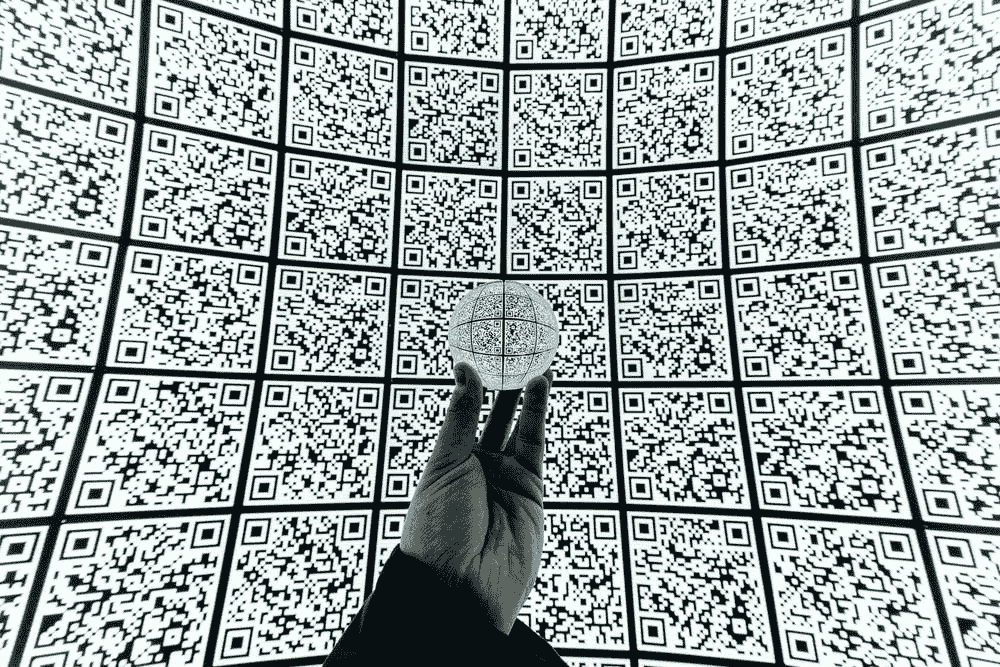

# 二维码认证

> 原文：<https://medium.com/geekculture/qr-code-authentication-3a83c7800a3e?source=collection_archive---------1----------------------->

## API 安全性

## 可用性、安全性和隐私

[Mitya Ivanov](https://unsplash.com/@aka_opex) at [https://unsplash.com/photos/2HWkORIX3II](https://unsplash.com/photos/2HWkORIX3II)

使用 QR 码进行身份验证的情况越来越多。主要原因是它在安全性和可用性之间提供了良好的平衡。但是在这两者之间找到合适的平衡是困难的！过度的可用性会让用户很开心但也很脆弱。过度的安全会让用户安全但被激怒。然而不是…