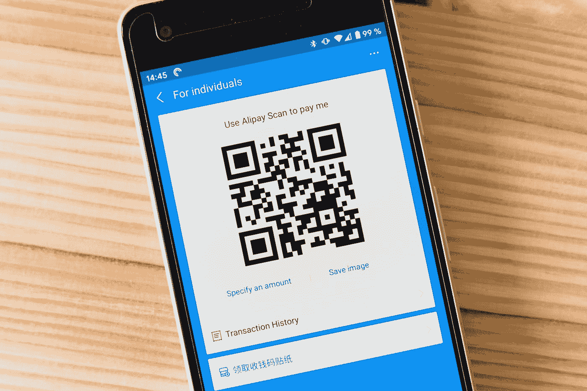
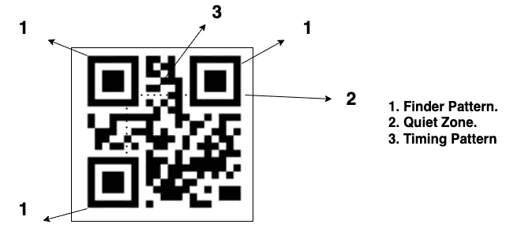
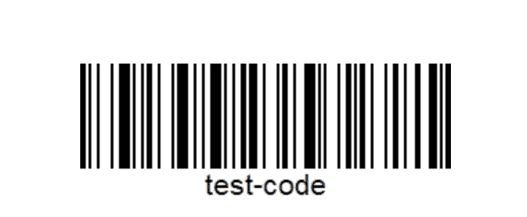

# 二维码，我们来试着理解一下。

> 原文：<https://medium.com/geekculture/qr-code-lets-try-to-understand-it-e646c2b94c6b?source=collection_archive---------3----------------------->

## 理解快速反应代码，每个人都应该知道，因为这是未来。

首先首先二维码代表快速响应码，查看下图，你会明白我们在说什么。在过去的几年里，我们都见证了二维码在各个不同层面的兴起。每当我们去杂货店、加油站或任何其他我们想购买商品的地方，我们通常会在那里找到一个二维码。

```
**Table of content
·** [**Introduction**](#9fda) **·** [**QR code**](#115e) **∘** [**QR Code Architecture**](#5e11) **∘** [**Regions**](#6960) **·** [**Bar Code**](#2062) **∘** [**Storage**](#50ff) **∘** [**Error detection**](#44f5) **∘** [**360 readability**](#e88c) **·** [**Reed Soloman Codes**](#ccb7) **·** [**Final thoughts**](#c8cc) **·** [**About The Author**](#43ab)
```

# 介绍

当我们购买像 t 恤这样的特定产品时，我们可以看到它们的价格标签上有一个条形码，类似于二维码。我们将在这篇文章中讨论这两个问题，以便您了解 QR 码如何工作的内部功能。下一次，当我们看到放在杂货店的代码时，我们不仅仅是想知道。



Photo by [Markus Winkler](https://unsplash.com/@markuswinkler?utm_source=medium&utm_medium=referral) on [Unsplash](https://unsplash.com?utm_source=medium&utm_medium=referral)

让我们从讨论二维码开始，然后将它与条形码进行比较。

# 二维码

快速响应码或 QR 码可以定义为用于存储数据以便于访问的编码代码。现在，数据可以是任何东西，从网站的 URL、信用卡信息，甚至是 Wi-Fi 连接。二维码背后的议程是让最终用户的生活变得轻松。

任何人都可以生成他们的个性化二维码，你不需要成为一个组织来生成二维码，因为有成千上万的在线资源可以用于相同的目的。例如，让我们假设，我正在一个会议上做报告，现在在会议结束时，我希望与会者与我联系。唯一的办法就是分享一些我的社交媒体句柄的随机网址。我可以向他们展示我的二维码，而不是展示 10 个不同的链接，这些二维码可以用任何最新的智能手机摄像头或任何扫描仪应用程序扫描。这将把他们直接带到我的投资组合网站，在那里他们可以优雅地与我联系。



Image 1: Created and edited by the author.

二维码有一个特定的模式，可以在任何特定的方向扫描，它是方向不可知的。有许多元素，例如，由 1 捐赠的方形框(图 1)有助于扫描仪从任何方向对齐或扫描 QR 码。

与一维矩阵的条形码相比，QR 码是存储大量数据的二维矩阵。智能手机的出现增加了二维码的接受度。

## QR 码架构

QR 码有一个静区(图 1 中箭头 2)，用于区分 QR 码及其周围环境，便于任何扫描仪扫描。三个正方形(图 1 中的箭头 1)用于对齐，并允许扫描仪定位 QR 码。对于更高的二维码版本，除了三个主要的查找器之外，还有小的对齐方块。这些取景器图案都是相同的尺寸。

为了找到二维码可以累积的数据存储，可以通过以下公式进行计算，因此它直接取决于二维码的版本，即从版本 1.0 到版本 40。公式如下。

```
4 X Version number + 17 dots on each side.
```

## 地区

从技术上讲，任何 QR 码都有两个区域，即功能区和编码区。功能区包括定时模式、查找模式和对准模式。扫描器使用定时模式来了解 QR 码的版本以及位的定时。我们已经在前面的章节中讨论了查找器和对齐模式，它告诉 QR 码有关对齐的信息，并给予最终用户在任何方向扫描的自由。

谈到嵌入区域，它也有一个特定的标准，指导扫描仪轻松解码数据。前四个字节表示存储数据的编码模式，可以是数字、字母数字、字节、汉字等。这些旁边的单元格表示数据存储的长度，再次重复以存储数据。因为它们是用二进制表示的，在我们的 QR 码中用 0(白色)和 1(黑色)表示。该区域以数据模式的结尾以及纠错码结束，纠错码有助于在 QR 码部分损坏的情况下进行解码。

此外，安静区非常重要，因为它有助于确保扫描仪能够将 QR 码与任何失真或背景区分开来。

# 条形码



Image generated from [https://barcode.tec-it.com/](https://barcode.tec-it.com/)

另一方面，条形码是用于存储数字数据的一维矩阵。在 QR 码产生之前，条形码已经存在于市场中，并且具有良好的市场份额。许多商店仍然使用条形码轻松地将产品信息扫描到系统中，而不是手动输入，同时计费。

条形码的问题导致了对二维码的需求。因此，现在是了解条形码面临的挑战的时候了。

## 储存；储备

因为条形码是一维矩阵，所以与二维矩阵相比，存储的数据显然不是那么庞大。此外，与数字、字母数字、汉字等相比，条形码仅存储数字数据。二维码中的可用选项。

## 误差检测

如果在条形码被损坏或部分擦除的情况下，条形码不能被扫描，则错误检测不符合条形码。二维码则不是这样，因为即使二维码被部分损坏，也很容易被扫描。

## 360°可读性

与 QR 码不同，条形码在任何方向都不可扫描。我们需要把它扫描到一个特定的方向，否则它会引起一个问题。如今，我们甚至可以用手机上的扫描仪应用程序扫描条形码。还记得我们的 QR 码中的取景器图案(图 1 中的箭头 1)吗？这种图案让我们可以随心所欲地向任何方向扫描。

# 里德·所罗门码

Reed Soloman 码将是本文的最后一个主题，尽管可以对 QR 码进行大量的研究，但了解 Reed Soloman 码是最起码的。

为了定义 Reed Soloman 码，我们可以说它们是非二进制 BCH 的一个重要子集，在数字通信和数据存储中具有广泛的应用。

*   存储设备
*   无线网络
*   迷你光盘
*   光盘（Compact Disc 的复数）
*   DVD
*   蓝光光盘
*   二维码
*   DSL 和 WiMAX 等数据传输技术。
*   广播系统

纠错码是对数据进行编码的聪明方法，即使部分数据被破坏，最终用户也可以对数据进行解码。因此，我们可以说编码是一个添加错误代码并发送给用户的过程，然后通过消除错误并获得原始消息来解码。

# 最后的想法

所以我希望你们都很清楚，每当我们扫描二维码时，它到底描述了什么。在研究你的代码事件之前，我对我的手机摄像头如何通过扫描二维码来检测不同的信息感到有点困惑。

当然，我已经成为 QR 码清单端到端开发的大师，并且状态良好，只要我想，我就可以开始工作。

许多知名公司都是围绕二维码的力量而建立的，你也可以探索、利用二维码的力量，这样你就可以围绕它进行创新。

当然，如果你知道一些关于二维码的有趣事实，请在评论中分享，我们会很乐意听到的

# 关于作者

Apoorv Tomar 是一名软件开发人员，也是 Mindroast 的一员。你可以在[推特](https://twitter.com/apoorvtomar_)、 [Linkedin](https://www.linkedin.com/in/apoorvtomar/) 、[电报](https://t.me/ApoorvTomar)和 [Instagram](https://www.instagram.com/apoorvsinghtomar/) 上和他联系。订阅[简讯](https://www.mindroast.com/newsletter)获取最新策划内容。不要犹豫在任何平台上说“你好”,只需说明你在哪里找到我的资料