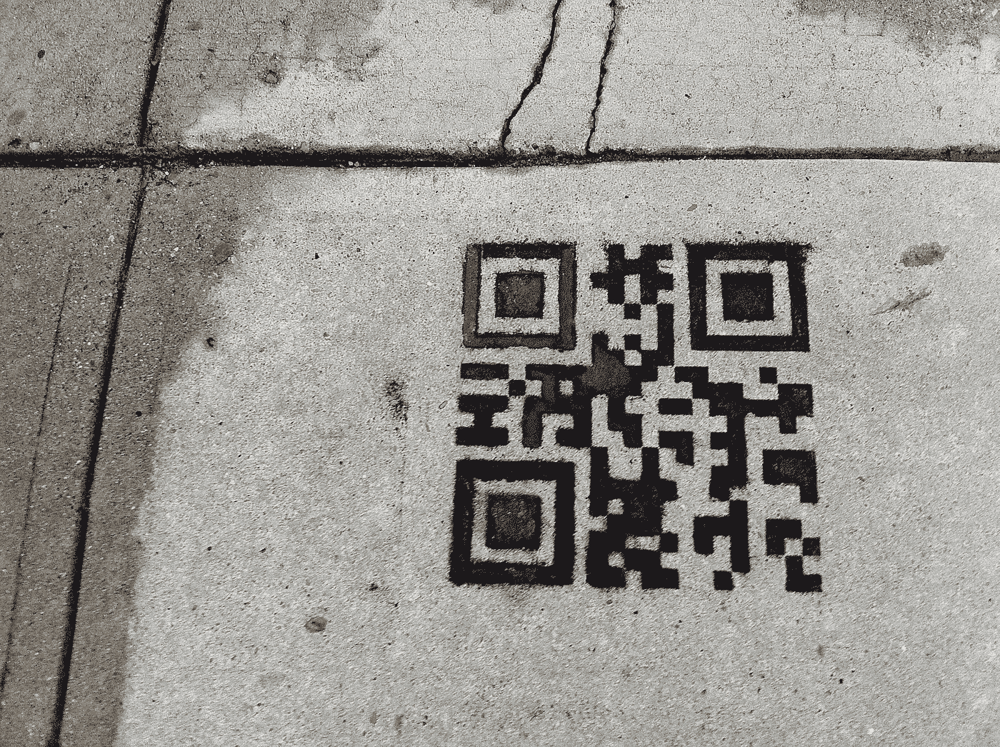
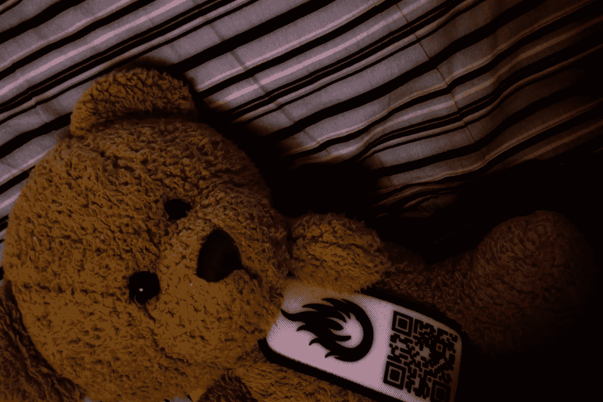
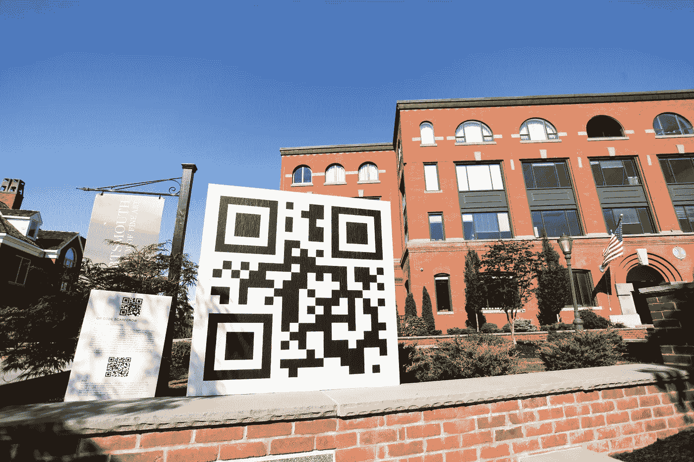
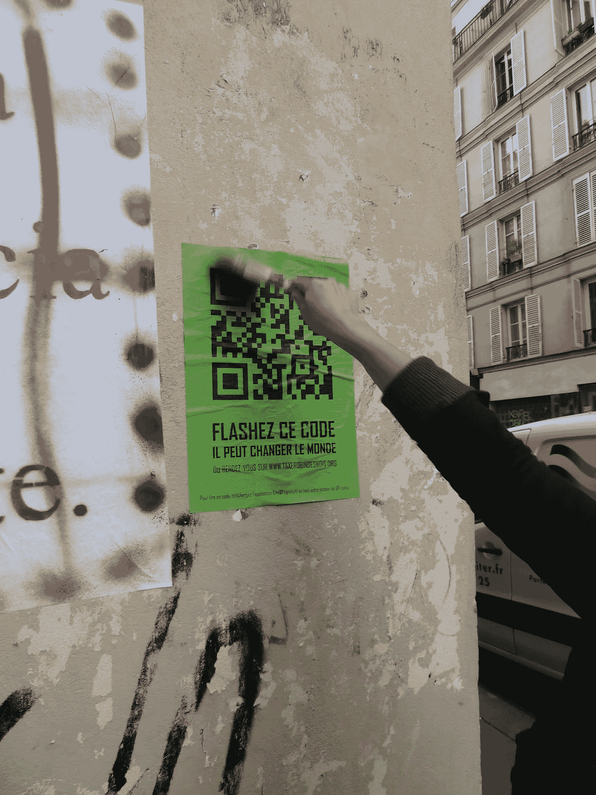

# 非营利用途的二维码

> 原文：<https://medium.com/geekculture/qr-codes-for-nonprofit-use-2973edb9cef1?source=collection_archive---------16----------------------->

## **如何使用二维码进行连接和接合**

**二维码不仅仅是时髦的设计。这是一项技术，可以为非营利组织提供吸引公众的创造性可能性。**

@ [**Sean MacEntee**](https://www.flickr.com/photos/smemon/) Flickr

这是一个使用二维码的想法列表，目的是将人们聚集在一起，为了一个良好的事业而联系和动员。

1.**使用二维码……建立身份**

二维码可以帮助锁定一个特定的群体，只接触其成员，无论他们在物理上彼此靠近还是团结在虚拟社区中。

这些守则可以张贴在社区的聚会场所和/或社区成员最常去的地方。因此，这些标志对外人来说仍然是不可发现的或无意义的，同时提供了一种强烈的身份感和社区成员的归属感。

想法:

-使用二维码连接邻居或住在附近的其他人；

-将二维码放在专门的诊所，以便将有类似健康问题的病人联系起来；

*   放置符号或彩色编码的 QR 标志，以帮助弱势人员(例如:无证移民或家庭暴力受害者)找到彼此并加入支持网络；

@ [**Golan Levin**](https://www.flickr.com/photos/golanlevin/) Flickr

-使用 QR 码，以便在镇压环境中协调民权运动。

**2。使用二维码以便…标记&查找**

QR 码可用于存储关于经常旅行和/或迷路的物体和生物的基本信息:物体、植物、动物甚至人类。

想法:

**-** 在你留在公共场所作为礼物送给陌生人的物品上贴上二维码[(图书穿越](http://www.bookcrossing.com/)就是一个很好的例子)。

= >对于创建全球交换链和“向前支付”游戏非常有用。

@ [**esbie**](https://www.flickr.com/photos/13886756@N03)Flickr

-给宠物或野生动物佩戴二维码手环；

-在马克杯或其他日常物品上打印二维码，捐赠给无家可归者。

这个标签应该与露宿街头者的重要信息联系起来，这样有助于社会工作者下次遇到同一个人时更有效地行动。

**3。使用二维码以便…连接 WOR(左)DS**

二维码使得不依靠语言提示就能上网成为可能。这在与残疾人或文盲一起工作时尤其有用。

想法:

**-** 使用二维码将无法阅读视频、新闻和/或健康、教育和人权相关图片的人重新定向。

4.**使用二维码以便……变绿**

二维码可以延长你的信息的寿命，并有助于保护环境。

想法:

-在建筑物和其他具有较长使用寿命的空间和物体上放置二维码:车辆、墙壁、门、架子、椅子、桌子等。

-不要分发纸质传单，而是在杯子、包、t 恤或鼠标垫等回收物品上印刷二维码。

5.**使用二维码以便…参与**

二维码可能有助于吸引冷漠的城市居民。这个想法是鼓励人们移动和相互交流。

想法:

*   将宣布最新消息的二维码贴在你的实体墙上(无论是博物馆、图书馆、画廊、社区中心等)，以鼓励访客通过亲自出席来了解最新消息。

@ [Bill Couch](https://www.flickr.com/photos/wcouch/) Flickr

-破冰:首次见面的人可能会佩戴带有社交媒体资料链接的二维码标签。这个想法是，在能够扫描代码之前，在身体上相互靠近并开始对话。

*   游戏化:找到并扫描一个二维码，以解开隐藏在象形图中的信息，从而进入下一关*。*

**

*@ [Oxfam France](https://www.flickr.com/photos/oxfamfrance/) Flickr*

*对社会负责的寻宝游戏类型的游戏和活动的范围是巨大的:完成一场比赛，完成一次历史启发的寻宝，回收 x 数量的东西，拍摄一座遗产建筑，执行一项微型志愿任务，等等。*