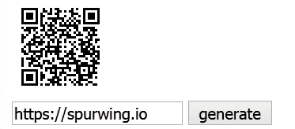

# 用于日程安排和预订的 QR 码

> 原文：<https://medium.com/geekculture/qr-codes-for-scheduling-and-bookings-8b060a8c4684?source=collection_archive---------15----------------------->


QR 码允许我们将信息嵌入/编码为图像，我们都知道这是一个由较小的黑白方块填充的大方块。二维码背后的科学和数学并不容易，但 YouTube 上有大量的文章和视频解释了这一过程。


所有现代手机都有一个内置的二维码扫描仪，可以解码信息。如果编码数据只是文本，你的手机会显示信息，但如果是一个网址，它会提示你在浏览器中打开它。这是推广你的网站或项目的好方法。但我们也可以用它来嵌入电子邮件地址或特殊的应用程序事件。

你可以使用我们的开源 [GitHub 库](https://github.com/SpurwingIO/Appointment-Scheduling-Widgets/tree/main/QRCode)，它允许你使用各种参数生成二维码，[现场演示在这里](https://spurwingio.github.io/Appointment-Scheduling-Widgets/QRCode/)。



文件`index.html`包含将纯文本编码成 QR 码图像的 JavaScript 代码。

```
function update_qrcode(text) {
  text = text.replace(/^[\s\u3000]+|[\s\u3000]+$/g, '');
  console.log(text, text.length)
  document.getElementById('qr').innerHTML =
    create_qrcode(text, 4, 'M', 'Byte', 'UTF-8');
};function create_qrcode(text, version, ECL, mode, mb) {
  qrcode.stringToBytes = qrcode.stringToBytesFuncs[mb];
  let qr = qrcode(version || 4, ECL || 'M');
  qr.addData(text, mode);
  qr.make();
  // return qr.createImgTag();
  return qr.createSvgTag();
};
```

默认设置允许您对 62 个字符进行编码，这对于一个简单的 URL 或消息来说已经足够了。如果您需要对较长的文本进行编码，您可以使用此[参考表](https://www.qrcode.com/en/about/version.html)查看设置(`version`和`ECL`)。我们用来生成二维码的库是[这个](https://github.com/kazuhikoarase/qrcode-generator)。

由于 QR 码可以对 URL 进行编码，我们可以对指向我们的预约安排或可用性页面的链接进行编码。例如，我们在 Spurwing 上的页面允许用户预订演示电话:[https://www.spurwing.io/contact](https://www.spurwing.io/contact)

同样，您可以对您的电子邮件地址进行编码`mailto:ilya@spurwing.io`当扫描该二维码时，您的设备将提示您打开电子邮件应用程序，在收件人栏中输入您的电子邮件。

# 结论

二维码是一项奇妙的技术发明。不幸的是，它们在西方(还)不是很常见，但在亚洲，它们被疯狂地使用。