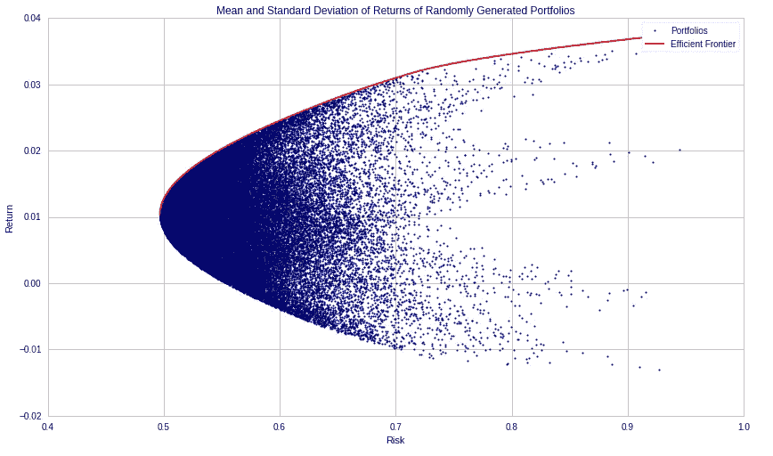
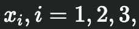
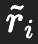
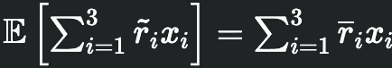
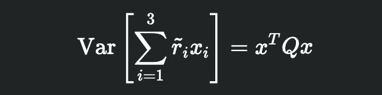
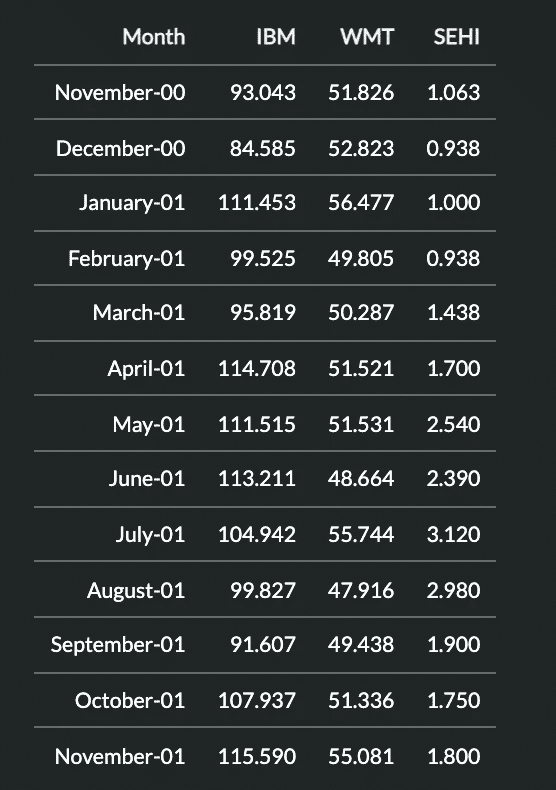

# 朱莉娅的定量金融学；Markowitz 投资组合优化问题

> 原文：<https://medium.com/geekculture/quantitative-finance-in-julia-the-markowitz-portfolio-optimization-problem-26cb1a8d187b?source=collection_archive---------19----------------------->



[https://hudsonthames.org/portfolio-optimisation-with-portfoliolab-mean-variance-optimisation/](https://hudsonthames.org/portfolio-optimisation-with-portfoliolab-mean-variance-optimisation/)

老练的机构投资者占据了量化金融的领域，这确实是一个误称。或鲸鱼，这是加密货币行话中通常的称呼。

令人欣慰的是，散户投资者尽管倾向于数学，但可能确实会通过明智地使用数学和代码来部署量化金融的方法。

如今，随着交易应用如此普及，提取相关数据并进行处理并不困难。

这一次，我们将通过 **Julia 的 **JuMP** 库来探索这样一个任务。**

我将带领读者，解释各种概念和代码块。

[](https://jump.dev/JuMP.jl/stable/) [## 简介跳转

### JuMP 是嵌入在 Julia 中的用于数学优化的特定领域建模语言。它目前支持…

跳转. dev](https://jump.dev/JuMP.jl/stable/) 

# 什么是马科维茨投资组合优化？

这个问题本身并不新鲜。

事实上，这是一个古老的故事。和金钱的概念一样古老。

> *It* ***的概念是收益最大化，同时风险最小化。***

这里的核心任务是**如何分配投资组合**，以一种让你达到特定回报水平的方式，同时将亏损的可能性降至最低。

夏普比率进一步证明了这一概念。

[](https://www.investopedia.com/terms/s/sharperatio.asp) [## 如何使用夏普比率分析投资组合的风险和回报

### 夏普比率是由诺贝尔奖获得者威廉·夏普提出的，用于帮助投资者理解回报…

www.investopedia.com](https://www.investopedia.com/terms/s/sharperatio.asp) 

它是根据经济学家哈里·马科维茨在 1952 年发表的一篇名为“投资组合选择”的论文命名的。

[](https://www.jstor.org/stable/2975974?origin=crossref) [## JSTOR 上的投资组合选择

### 杂志信息金融杂志出版所有主要金融领域的领先研究…

www.jstor.org](https://www.jstor.org/stable/2975974?origin=crossref) 

# 朱莉娅中的马科维茨投资组合优化。

假设，通过**基本面分析**，我们已经确定了一些具有坚实长期基本面的公司，并且看起来将在未来几个月显著增长。

我们希望投资他们的股票。

> *我们将如何在这些不同的股票中分配我们的持股，以最大化我们的风险调整回报？*

朱莉娅的教程建议投资 1000 美元在 3 只股票上。

国际商业机器公司**(IBM)**、沃尔玛 **(WMT)** 、南方电气 **(SEHI)。**

我们投资的时间跨度为一年，观察股价如何以一个月为间隔波动。

我们希望达到两个目标。

> *1。月回报率为 5%，即 50 美元。*
> 
> *2。尽可能减少损失。*

我们有三个假设。

> *1。没有最小批量。(最低交易量为 1 股)。*
> 
> *2。我们不从事卖空交易。*
> 
> *3。零交易成本。*(使用罗宾汉)

在数学符号中，我们用以下方式表示变量。

# 定义退货的表达式



每种的数量

**x:** 每只股票的金额。

**I:**IBM、WMT 和 SEHI 的决策变量。



returns

**r:** 月收益率的随机变量。(在这种特殊情况下为 0.05)



Expected returns

因此，投资组合的预期收益用这种格式表示。

# 定义风险的表达方式

Markowitz 在他的论文中给出了一个正式的证明，即风险最好通过最小化投资组合中的方差来管理。

我们将不在这里引用证据，而只是把它当作一个被证实的事实。

它由下面的表达式表示。


其中 sigma 代表 I 对 j 的**协方差**

通过协方差矩阵 **Q** 实现了更简洁的表示格式。



# 将语句转化为优化问题

我们现在可以正式定义我们的优化表达式，以及必要的约束。


每个表情的含义:

1.  **最小化目标函数(投资组合的方差)**
2.  **最高起始金额为 1000 美元。**
3.  每个月的回报应该是 50 美元或更多。
4.  我们不能分配负数的美元去买股票。

# 朱莉娅代码

我们现在将开始我们的回溯测试，提供这个数据集。



```
**#Import libraries#**using JuMP
import Ipopt, Statistics**#Creating the dataset#**stock_data = [
    93.043 51.826 1.063;
    84.585 52.823 0.938;
    111.453 56.477 1.000;
    99.525 49.805 0.938;
    95.819 50.287 1.438;
    114.708 51.521 1.700;
    111.515 51.531 2.540;
    113.211 48.664 2.390;
    104.942 55.744 3.120;
    99.827 47.916 2.980;
    91.607 49.438 1.900;
    107.937 51.336 1.750;
    115.590 55.081 1.800;]  **#13x3 array**
```

计算月回报

```
stock_returns = Array{Float64}(undef, 12, 3) for i in 1:12 
    stock_returns[i, :] = (stock_data[i + 1, :] .- stock_data[i, :]) ./ stock_data[i, :] end stock_returns**#returns#<
12×3 Matrix{Float64}:
 -0.0909042   0.0192374    -0.117592
  0.317645    0.0691744     0.0660981
 -0.107023   -0.118137     -0.062
 -0.0372369   0.00967774    0.533049
  0.197132    0.0245391     0.182197
 -0.0278359   0.000194096   0.494118
  0.0152087  -0.0556364    -0.0590551
 -0.0730406   0.145487      0.305439
 -0.0487412  -0.140428     -0.0448718
 -0.0823425   0.0317639    -0.362416
  0.178261    0.0383915    -0.0789474
  0.0709025   0.0729508     0.0285714
>**
```

获得表示收益的随机变量 **r** 和协方差矩阵 **Q** 。

```
r = Statistics.mean(stock_returns, dims = 1)
Q = Statistics.cov(stock_returns)<**1×3 Array{Float64,2}:
 0.0260022  0.00810132  0.07371593×3 Array{Float64,2}:
 0.018641    0.00359853  0.00130976
 0.00359853  0.00643694  0.00488727
 0.00130976  0.00488727  0.0686828
>**
```

现在我们有了所有需要的变量，我们可以将它们输入到我们的求解器中。

```
**#Use the Ipopt optimizer#** portfolio = Model(Ipopt.Optimizer)**#Suppress unnecessary output, while solver works through different combinations#**set_silent(portfolio)**#Objective function & and constraints#**@variable(portfolio, x[1:3] >= 0)
@objective(portfolio, Min, x' * Q * x)
@constraint(portfolio, sum(x) <= 1000)
@constraint(portfolio, sum(r[i] * x[i] for i = 1:3) >= 50)
optimize!(portfolio)
objective_value(portfolio)
<******************************************************************************
This program contains Ipopt, a library for large-scale nonlinear optimization.
 Ipopt is released as open source code under the Eclipse Public License (EPL).
         For more information visit [https://github.com/coin-or/Ipopt](https://github.com/coin-or/Ipopt)
******************************************************************************22634.41784988414
>
```

**目标值**被给定为**。46860 . 68668686666**虽然这是一个与我们的问题无关的数字，但我们可以把它理解为**“整个可行域的最大下界”。**

文章前面的图片会提供一些直观的解释。

这是一个数学概念。

最后，为了解决我们的问题，我们提取我们应该投入这三只股票的金额，以使风险调整后的回报最大化。

```
value.(x)<
**3-element Array{Float64,1}:
 497.04552984986384
   0.0             
 502.9544801594811**
>
```

最终结果显示

> ***【497 美元】给 IBM***
> 
> ***【0 美元到沃尔玛】***
> 
> ***【南方电气】503 美元***

由此，我们展示了一个马科维兹投资组合优化的例子。