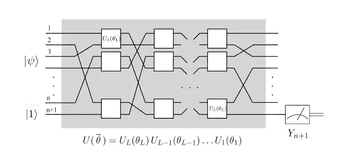
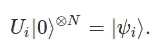
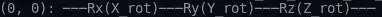
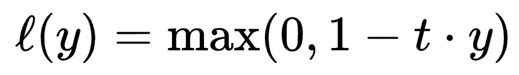
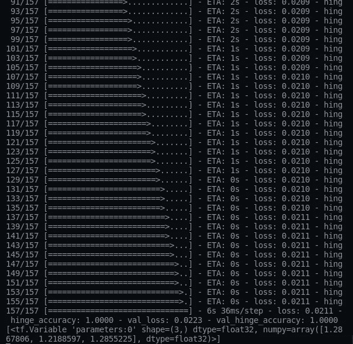
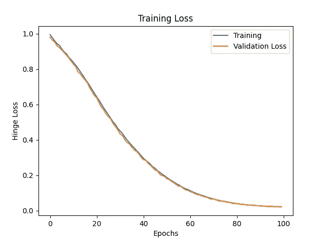

# 量子神经网络|轻松阅读

> 原文：<https://medium.com/geekculture/quantum-neural-networks-effortless-reading-eab00c81c962?source=collection_archive---------19----------------------->

我们将探索量子神经网络(QNN)在一个非常简化的方式，涵盖所有的基本概念，将创造一个抓取的影响。作为一个初学者，我会试着用最少的数学知识让你理解，以获得更好的概述。

阿密特·尼哈德


Photo by [Alina Grubnyak](https://unsplash.com/@alinnnaaaa?utm_source=unsplash&utm_medium=referral&utm_content=creditCopyText) on [Unsplash](https://unsplash.com/s/photos/neural?utm_source=unsplash&utm_medium=referral&utm_content=creditCopyText)

## 介绍

[人工神经网络](https://en.wikipedia.org/wiki/Artificial_neural_network) (ANN)一直是一种慷慨的算法，整个深度学习领域都在此基础上站稳脚跟。人工神经网络由相互连接的神经元集合组成。网络中的每个神经元都可以通过连接相互分享信息，这在生物学上被称为大脑中生物神经元的[突触](https://www.britannica.com/science/synapse#:~:text=Synapse%2C%20also%20called%20neuronal%20junction,is%20called%20a%20neuromuscular%20junction.)。如今，许多新的模型都建立在具有最先进性能的神经网络架构之上。

## 安的快速概述

神经网络由相互连接的群体神经元组成，相互传递信息。人工神经网络是受人脑机制启发的想法，它也提出了类似于人工神经网络的行为。下图中的圆形节点代表人工神经元。箭头是将信息从一个神经元传递到另一个神经元的连接。[深度神经网络](https://en.wikipedia.org/wiki/Deep_learning#:~:text=A%20deep%20neural%20network%20(DNN,the%20input%20and%20output%20layers.&text=Each%20mathematical%20manipulation%20as%20such,model%20complex%20non%2Dlinear%20relationships.)包含输入层、隐藏层和输出层。隐藏层是具有所有可能的连接场景的完全连接的层。让我们继续讨论一些关于人工神经网络的基本术语。我就不深究了。希望你熟悉神经网络和深度学习。

1.  **神经元**:神经元是涉及一些数学运算的节点。当输入传递给它时，它将输入乘以权重，输出通过激活函数传递给其他神经元。
2.  **连接**:连接是神经元之间传递信息的媒介。
3.  **权重**:权重是人工神经网络模型的可学习参数之一。它决定了输入对输出的影响程度。它在网络的隐藏层中转换输入的数据。它告诉了神经元之间连接的强度。
4.  **前馈网络**:基本神经网络，其中信息仅在一个方向上移动，即正向。这是一个无环网络
5.  **递归神经网络**:RNN 递归神经网络是香草神经网络的一种变体，它被创建来使用隐藏层来记忆或记忆信息，这有助于记忆关于序列的信息。它允许重复使用以前的输出作为输入。递归神经网络的一些应用是神经机器翻译、聊天机器人、情感分析等。
6.  **卷积神经网络**:卷积神经网络是专门为处理像素数据而设计的。主要是侧重于图像数据。其中将像素值乘以权重并将它们相加称为卷积。卷积神经网络的应用是对象检测、图像分类等。
7.  **反向传播**:反向传播与前馈相反，通过调整可训练参数来执行反向传递。反向传播使用链式法则来执行反向传播。简单地说，反向传播计算损失函数相对于权重的梯度。

为了理解量子神经网络部分，你需要理解神经网络的基础知识及其工作原理。因此，不在经典神经网络上浪费太多时间，让我们把注意力主要放在量子神经网络上。

我已经单独创建了关于量子机器学习基础的文章，请在进一步进行之前阅读它们。

[](https://amitnikhade.medium.com/) [## Amit Nikhade - Medium

### 阅读媒体上 Amit Nikhade 的文章。量子人工智能爱好者|机器人|物联网| Python | Julia…

amitnikhade.medium.com](https://amitnikhade.medium.com/) 

## 量子神经网络导论

量子和经典神经网络的一个主要区别是[并行计算](https://en.wikipedia.org/wiki/Parallel_computing)。除了一些变化之外，量子神经网络类似于经典神经网络。他们在[量子机器学习](https://en.wikipedia.org/wiki/Quantum_machine_learning)中担任较新的班级。该模型部署在[量子计算机](https://www.technologyreview.com/2019/01/29/66141/what-is-quantum-computing/)上，利用叠加、干涉、纠缠等量子特性进行计算。它们的主要优势包括加速训练和处理。QNN 算法是[变分量子算法的子类。](https://arxiv.org/abs/2012.09265)

量子神经网络包括由参数化门操作组成的量子电路。

## 涉及的步骤

首先，输入首先被编码为量子态，然而，在经典计算中，我们做同样的事情，这被称为在输入到网络之前嵌入[输入。编码是使用特征映射完成的，我在上一篇关于量子嵌入的文章中已经简要解释过。此外，编码被传递到由参数化门组成的变分模型，并且该模型通过最小化损耗而针对特定任务被优化。总之，测量已经完成，我们得到了一个输出。](/mlearning-ai/quantum-embedding-qml-e5204e0b6ef2?source=---------0----------------------------)

让我们更深入地研究一下上面的步骤


量子神经网络用于指代变分或[参数化的量子电路。](https://arxiv.org/abs/1906.07682)量子神经网络中感知器的替代物是减少参数大小的量子位。这次我们将考虑上图。其包括特征图、变分模型和测量。其中 x 个输入是经典数据形式，首先必须使用特征图将其嵌入到[希尔伯特空间](https://mathworld.wolfram.com/HilbertSpace.html#:~:text=A%20Hilbert%20space%20is%20a,finite%2Ddimensional%20Hilbert%20spaces%20include)中的量子态中。状态准备过程允许将输入数据编码到量子位上，作为[叠加](https://whatis.techtarget.com/definition/superposition#:~:text=Superposition%20is%20the%20ability%20of,the%20English%20physicist%2C%20Thomas%20Young.)中的量子状态。编码可以是不同的类型，我已经在我以前的帖子中解释过了，你可以在我的网站上看到它们。量子位元现在纠缠在一起，一个状态的改变会影响其他状态。此外，它们被送入变分模型，即由一系列参数化门组成的量子变分电路，如用于旋转的 RY 门和用于纠缠的[CNOT](https://en.wikipedia.org/wiki/Quantum_entanglement)。最后，后处理步骤执行测量，测量输出的奇偶性。旋转的参数被修改，直到并且除非电路得到期望的结果。测量本身充当激活功能。



[ai.googleblog.com](https://2.bp.blogspot.com/-G8imF5FJ3yc/XBbmWPCzRkI/AAAAAAAADoc/54rzFFb0jHkEHyXdPdnUm5mhmNLkzmpnQCLcBGAs/s640/image1.png)

在图中，|ψ〉是期望的状态，|1〉是读出的量子位，Yn+1 是测量值。网络中的盒子是量子门，它用同时并最终改变的参数来改变初始化量子位的状态。

输入被编码成各种状态，量子位在状态| 0\u⊙被初始化。当状态流经电路时，量子位元的状态就会改变。



Unitary transformation

假设量子位状态被初始化，我们执行依赖于参数θi 的酉变换 Ui(θi)。这些在学习期间被调整，使得读出量子位上的 Yn+1 的测量趋向于产生|ψi 的期望标签。只有当矩阵的逆矩阵等于其伴随矩阵时，该矩阵才被称为酉矩阵。

## 履行

让我们尝试用 Python 编写 QNN。


我们需要安装张量流量子。

以下是安装步骤。你需要安装 Python 3。

首先，我们将创建一个 python 环境。

```
conda create -n ENV_NAME python**=**3
```

接下来，我们将激活它。

```
conda activate ENV_NAME
```

另外，我们将安装[tensor flow](https://www.tensorflow.org/)v 2 . 4 . 1 包

```
pip3 install --upgrade pip
pip3 install tensorflow==2.4.1
```

最后，安装 TensorFlow 量子包

```
pip3 install -U tensorflow-quantum
```

**进口包装**

```
**import** **numpy** **as** **np**
**import** **matplotlib.pyplot** **as** **plt**
**import tensorflow_quantum as tfq
import tensorflow as tf
import cirq
import sympy
import random**
```

**创建一个量子位**

这里我们使用了网格量子位，[网格量子位](https://quantumai.google/reference/python/cirq/devices/GridQubit)有一行和一列，表示它们在网格上的位置。

```
qubit = cirq.GridQubit(0,0)
```

**创建列车测试**

为附加训练和测试分割创建单独的列表。

```
train, test = [], []
train_label, test_label = [], []
```

通过将数据编码为量子电路来准备数据，将它们分成训练和测试数据，将它们转换为[张量](https://en.wikipedia.org/wiki/Tensor)，并将它们附加到我们在开始时创建的列表中。

```
def prepare_data(n1, n2): for _ in range(n1): rdm_data = random.uniform(0,0.1) if random.random() < 0.5 else         random.uniform(0.9,1) cir = cirq.Circuit() cir.append([cirq.X(qubit)**rdm_data]) train.append(cir) if rdm_data < 0.5: train_label.append(1) else: train_label.append(-1) for _ in range(n2): rdm_data = random.uniform(0,0.1) if random.random() < 0.5  else     random.uniform(0.9,1) cir = cirq.Circuit() cir.append([cirq.X(qubit)**rdm_data]) test.append(cir) if rdm_data < 0.5: test_label.append(1) else: test_label.append(-1)return tfq.convert_to_tensor(train), np.array(train_label), tfq.convert_to_tensor(test), np.array(test_label)train, train_target, test, test_target = prepare_data(len_of_train, len_of_test)
```

**创建电路**

该电路由执行量子位旋转的门操作组成。

```
def assemble_circuit(qubit): x = sympy.symbols('X_rot') y = sympy.symbols('Y_rot') z = sympy.symbols('Z_rot') c = cirq.Circuit() c.append(cirq.rx(x).on(qubit)) c.append(cirq.ry(y).on(qubit)) c.append(cirq.rz(z).on(qubit)) return c
```

**定义精度函数**

[hinge_accuracy](https://keras.io/api/metrics/) metric 可以正确处理[-1，1]。

```
def hinge_accuracy(y_true, y_pred): y_true = tf.squeeze(y_true) > 0.0 y_pred = tf.squeeze(y_pred) > 0.0 result = tf.reduce_mean(tf.cast(y_true == y_pred, tf.float32)) return result
```

**创建模型读数**

```
qubit = cirq.GridQubit(0,0)
model_readout = [cirq.X(qubit)]
```

**剧情电路**

```
plt_circuit = assemble_circuit(qubit)
print(plt_circuit)
```



Circuit

**创建混合量子模型**

我们将创建输入、输出层。将电路转换成张量流量子层，并定义我们将优化的测量算子。使用具有参数移位微分器的参数化量子电路层。通常测量是不确定的。我们的预测值是 1 到 1 之间的实数。参数化量子电路是一种可以自由调节其参数的量子电路。使用 Adam 优化器和铰链损耗编译模型。微分器类允许您定义计算电路梯度的算法。

```
inputs = tf.keras.Input(shape=(), dtype=tf.dtypes.string)
output = tfq.layers.PQC(assemble_circuit(qubit), model_readout, repetitions=64, differentiator=tfq.differentiators.ParameterShift(), initializer=tf.keras.initializers.Zeros)(inputs)model = tf.keras.models.Model(inputs=inputs, outputs=output)model.compile(optimizer=tf.keras.optimizers.Adam(lr=0.0001), loss=tf.keras.losses.hinge, metrics=[hinge_accuracy])# Traininghistory = model.fit(train, train_target, epochs=100, batch_size=32, validation_data=(test, test_target))
```



Hinge loss (Where (t) is the actual target and (y) is the predicted value)

对于此处的铰链损耗，您需要[-1，1]中的数据，正如铰链损耗所预期的那样，也需要铰链精度。

**训练时间**



Training Insights

## 表演



太好了，你已经到达目的地了。希望你喜欢我的解释，我试着从理论上让它更容易理解。

## 结论

即使在今天，量子计算也没有限定我们希望它完成的操作和计算任务。量子机器学习优于经典机器学习，但不是在所有术语和问题上。我们需要更多的进步来达到量子水平，因为它可以产生技术奇迹。如果使用得当，量子计算具有将想象的世界转化为现实的能力。

如果你觉得这些作品很有见地，不要忘了点击“鼓掌”,跟我一起关注 medium.com。

原载于[amitnikhade.com](https://amitnikhade.com/)

## 参考

这些参考资料对我帮助很大，也浏览了一遍。

[](https://ai.googleblog.com/2018/12/exploring-quantum-neural-networks.html) [## 探索量子神经网络

### 自成立以来，谷歌人工智能量子团队一直致力于理解量子计算在机器中的作用…

ai.googleblog.com](https://ai.googleblog.com/2018/12/exploring-quantum-neural-networks.html) [](https://quantumai.google/cirq/tutorials/variational_algorithm) [## 量子变分算法| Cirq |谷歌量子人工智能

### 在本教程中，我们使用 Cirq 中的变分量子本征解算器(VQE)来优化一个简单的伊辛模型。尝试…

quantumai.google](https://quantumai.google/cirq/tutorials/variational_algorithm) [](https://www.tensorflow.org/quantum) [## 张量流量子

### TensorFlow Quantum (TFQ)是一个量子机器学习库，用于混合量子经典模型的快速原型制作

www.tensorflow.org](https://www.tensorflow.org/quantum) 

## 关于我

**拜访我:**[**【https://amitnikhade.com/】**](https://amitnikhade.com/)

[](https://www.linkedin.com/in/theamitnikhade/) [## Amit Nikhade -人工智能工程师-自由职业者| LinkedIn

### 在我的杯子里装了很多咖啡，为普通智力革命而工作。我是一个 AI 爱好者，一个博主，还有…

www.linkedin.com](https://www.linkedin.com/in/theamitnikhade/) [](https://github.com/AmitNikhade) [## AmitNikhade -概述

### 🂮 |人工智能和机器人爱好者|机器学习、深度学习、NLP、物联网、机器人| LinkedIn…

github.com](https://github.com/AmitNikhade)