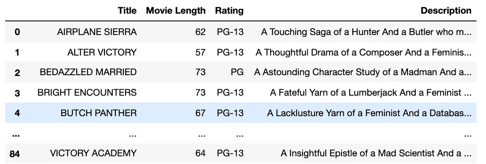
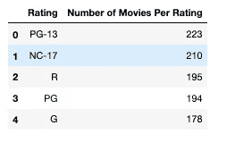
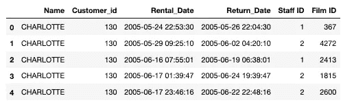

# 使用 SQL Alchemy 查询 SQL 数据库

> 原文：<https://medium.com/geekculture/querying-an-sql-database-with-sql-alchemy-370d6393d5f0?source=collection_archive---------7----------------------->


Senior Alchemy Scientist

# 目录

1.  [**概述**](#d754)
2.  [**催化剂**](#ce1f)
3.  [**选择语句**](#1b58)
4.  [**哪里，像不像，和与**](#A853)
5.  [**分组依据、排序依据、计数**](#da57)
6.  [**加入操作**](#6f2d)
7.  [**结论**](#8177) **(并链接到我的 Github 和 Metis )**

通过下面的链接，你可以找到这篇文章的两篇后续文章，涵盖更多的 SQL 炼金术操作。

[**电影时代的炼金术**](https://jimmygardner-415.medium.com/alchemy-in-the-age-of-film-2f8116d9e254)**[**更多 SQL 炼金术工具**](https://jimmygardner-415.medium.com/more-tools-for-your-sql-alchemy-3eb0a7d41458)**

# **概观**

**炼金术在古代或很久以前出现，承诺将铅等普通金属变成黄金等“贵金属”。对许多人来说，混合了灵性和伪科学的炼金术变成了一项热爱的工作。虽然这篇文章与实际的炼金术无关，但在这种变革性的追求中还是有可取之处的。在描述 sql 炼金术的威力及其将“普通”python 代码转化为“高贵”SQL 查询的能力时，我们将以此为动机。**

# **催化剂**

**像大多数混合物一样，必须有一个催化剂，在这种情况下，我们将使用 python 库 SQL Alchemy 来驱动 Python 脚本和 SQLite 数据库之间的交互。这是必要的进口货，**

```
import sqlalchemy as db
from sqlalchemy import create_engine
```

**从这里我们必须建立联系。在下面的例子中，我们将连接并查询一个包含虚拟电影租赁店信息的数据库。**

****

**Engine Architecture**

```
cnx = create_engine('sqlite:///sqlite-sakila.db').connect()
metadata = db.MetaData()# When your establish a connection to your database, you need to make sure your python script is in the same directory as your database. 
```

**发生了什么事？简而言之，一个叫做“反思”的过程正在发生。在上面的第一行代码中，我们实例化了一个引擎对象，然后使用 connect()方法连接到我们的数据库。第二行代码创建一个元数据对象，**

> **因此，元数据对象包含 SQLAlchemy 认为数据库可能是什么样子的想法。它通常由反射或您创建的表对象填充(可能通过声明性基本扩展)。”**

****

**既然 SQL Alchemy“知道”了数据库的样子，我们就可以使用 python 语法编写查询了。首先我们使用 SQL Alchemy 的**表**方法连接到我们想要查询的表。**

```
film = db.Table('FILM', metadata, autoload=True, autoload_with=cnx)
```

**现在，我们可以在进行查询时使用“FILM”作为我们的参考表。**

# **SELECT 语句**

**为了避免长的查询表达式，我喜欢把我的查询分成一个基本查询和一个最终查询。因此，首先让我们从“电影”表中选择“标题”、“长度”、“评级”和“描述”。所以我们调用数据库对象上的**选择**方法。这是语法，**

```
# SQL Alchemy Syntax 
base_query =  db.select([film.columns['title'],film.columns['description'],film.columns['length'],film.columns['rating']] ResultProxy = cnx.execute(base_query)
ResultSet = ResultProxy.fetchall()# the select method takes in a list. 
# ResultProxy executes the query
# ResultSet retrieves the query and puts it in the form [(),(),...()]# SQL SYNTAXSELECT title, description, length, rating
from FILM 
```

**我喜欢把数据放入熊猫的数据框架中，假设我需要它来做进一步的分析，**

```
movie_data = pd.DataFrame(ResultSet,columns = ['title','description'])
movie_data
```

****

**Results of the SELECT query**

# **WHERE 子句，如运算符、and 和 AND 运算符**

**让我们在基本查询的基础上增加一些过滤数据的功能。假设我们的家庭中有一些敏感的成员(孩子),我们想阻止他们观看含有成人内容的电影。最重要的是，我们想限制电影的长度，这样我们就能吸引孩子们的注意力。因此，我们从上面的基本查询开始，然后将其扩充如下:**

```
#SQL Alchemy syntax query = base_query.where(db.and_(film.columns['length']<= 75, film.columns['rating'].like('%PG%')))# call the WHERE method on the base_query
# inside the WHERE method we use the AND_ method that comes with our metadata object.
# format for the and_ method is comma separated conditionals or in our case a boolean and the like operator# SQL syntaxSelect title, description, length, rating
from FILM 
where length <= 75 and rating like '%PG%' 
```

****

**Results of complex Query**

> **顺便说一下，如果您不熟悉数据库，那么通过打印出所引用的表的列名来启动 python 脚本可能会很有用。就此而言，知道数据库中所有表的名称也可能是有用的**

```
# finding column names in specific tablenames = db.Table('FILM',metadata, autoload=True, autoload_with=cnx)
column_names = [c.name for c in names.columns]#finding table names in database engine = create_engine('sqlite:///sqlite-sakila.db')
engine.table_names()#output column names for table 'FILM'['film_id','title','description','release_year','language_id',
'original_language_id','rental_duration','rental_rate','length',
 'replacement_cost','rating','special_features','last_update']# output table names for database['actor','address','category','city','country','customer','film',
 'film_actor','film_category','film_text','inventory','language',
 'payment','rental','staff','store']
```

# **分组依据、排序依据和计数**

**假设现在我们想要查看数据库中评级类型的分布。分级为“PG”、“PG-13”等。让我们使用 GROUP BY、ORDER BY 和 COUNT 来实现这一点，**

```
from sqlalchemy import func# SQL Alchemy syntaxbase_query=
db.select([film.columns['rating'],func.count(film.columns['rating']) .label('NumPer'])query = base_query.group_by(film.columns['rating']).order_by(db.desc('NumPer'))# SQL syntax select rating, count(rating) as 'NumPer'
from FILM 
group by rating 
order by 'NumPer' desc
```

****

**Results of Query**

> **关于上述查询的几点注意事项。就像在 SQL 语法中一样，您需要将聚合函数计数放在 select 语句中。DESC 函数也是元数据类的一个方法。也可以用。label()，这与在 SQL 语法中在聚合函数后使用别名“as alias_name”相同。这有助于缩短 SQL alchemy 中的查询。**

# **连接操作**

**如果您遇到一个包含多个表的数据库，使用 JOIN 操作一次从不同的表中提取数据可能会更好。比方说，我们想解决假设的租赁店中的纠纷。一位顾客，打电话给她夏洛特正在反驳一项指控，她没有归还她租的一部电影。当她声称归还胶卷时，正在值班的店员不在店里。因此，我们需要追踪客户姓名、租赁日期、声称的归还日期、当时值班的员工以及电影名称。让我们看看能否用 SQL 炼金术做到这一点，**

**首先，我们需要从 sqlalchemy 库中导入 **join** 和 **select** 。之后，我们需要连接到数据库中的三个不同的表，下面的代码块演示了这一点，**

```
from sqlalchemy import join
from sqlalchemy.sql import selectrental = db.Table('rental', metadata, autoload=True, autoload_with=cnx)inventory = db.Table('inventory', metadata, autoload=True, autoload_with=cnx)customer = db.Table('customer',metadata,autoload=True,autoload_with=cnx)
```

**接下来，我们编写 join 语句。我们的查询很长，所以我们要把它分开，**

```
first_join = rental.join(inventory, rental.c.inventory_id==inventory.c.inventory_id)
second_join = first_join.join(customer, customer.c.customer_id==rental.c.customer_id)# customer.c.customer_id is equivalent to customer['customer_id']
```

**接下来，我们编写 select 语句和我们可能需要的任何附加过滤器，**

```
statement = select([customer.c.first_name,rental.c.customer_id,rental.c.rental_date,rental.c.return_date,rental.c.staff_id,inventory.c.film_id]).select_from(jq)# customer.c.first_name is equivalent to customer['first_name']
```

**最后，我们将所有这些连接在一起，这样我们就可以执行查询，**

```
query = statement.where(customer.c.first_name == 'CHARLOTTE')ResultProxy = cnx.execute(query)ResultSet = ResultProxy.fetchall()# SQL SYNTAXselect first_name, rental_date, return_date, rental.customer_id , rental.staff_id,inventory.film_id
 from rental 
 join inventory
 on rental.inventory_id == inventory.inventory_id
 join customer 
 on rental.customer_id == customer.customer_id
 where customer.first_name == 'CHARLOTTE'
```

**以下是该查询的结果，**

****

**Customer Dispute Query**

**现在我们可以看看夏洛特是否真的归还了胶卷，以及当时值班的员工是否可以证实这一点。**

# **结论**

**简而言之，SQL alchemy 是一个有趣的工具，在构建 web 应用程序或分析 Pandas 中的数据时，它可以为您节省大量时间。我们可以直接从 python 脚本中查询，而不是使用 SQL 语法从数据库中查询，并直接进行分析。**

**感谢阅读！**

**还要特别感谢 [**梅蒂斯**](https://www.thisismetis.com/) ，给了我探索数据科学世界的工具。你可以通过下面链接到我的 [**Github**](https://github.com/Jgardner91) 查看我在那里完成的一些项目以及与本文相关的代码。**