# 使用 JAPA 访问者模式的任务语法树和补救代码味道

> 原文：<https://medium.com/geekculture/quest-syntax-tree-and-remedy-code-smell-using-japa-visitor-patterns-f023a89842cf?source=collection_archive---------35----------------------->

## 抽象语法树和 Java 解析器框架

## 简单的自动化:使用 Visitor 遍历抽象语法树

Structure of Abstract Syntax Tree — Java Parser Framework Visitor Pattern

# 范围

写这篇文章是为了帮助 ***初学者*** 和 ***中级*** 理解*抽象语法树*、 *Java 解析器框架*、*访问者模式*的结构。
上面的动画图显示了*应用程序接口* ( ***API*** )的 ***部分列表*** ，在本文中使用它们来演示如何使用访问者模式通过*自动化来处理*代码气味*。
文章以 ***现场动手*** 实例[[***GitHub***](https://github.com/ganesh-nag/AbstractSyntaxTree)]为后盾，具体编写并测试，解释各种组件如何交互及其用途。屏幕截图和解释有助于理解细微差别。*

# 先决条件(最低)

如果读者希望尝试一下，*这里有先决条件！*
*a . Spring Boot-Maven 依赖
Java parser-1 . 0 . 11 . jar
b . sonar cube-8.0
c . sonar-scanner-4 . 2 . 0 . 1873-windows
d . Eclipse IDE(或)您选择的任何 IDE
e . Java SE 平台 v1.8*

# 这篇文章的重点是什么？

## 一些基本的开始..

一个 Java 源文件(*)。java* )必须遵守 java 语言规范( ***JLS*** )。如果 ***不符合*** 与 ***JLS 规范*** ，声纳扫描仪之类的工具可以捕捉 ***代码气味*** ，并提供源文件中发现的不符合*的列表作为要遵守的 ***规则***
在这篇文章中我们用*声纳扫描仪*来扫描(*)。java)* 源文件和*声纳服务器*来获取在仪表板中发布的报告。*

## *术语？？*

**

*Terminology ??*

**a .***【可维护性】*** *下面的术语可以在声纳服务器仪表盘中看到。
(一)* ***代码气味，*** 是一个代码中与可维护性相关的问题。让它保持原样意味着维护者将很难对代码进行修改。在最坏的情况下，他们会被代码的状态弄得晕头转向，以至于在修改时会引入额外的错误。
*(二)* ***规则*** ，为每个问题提供了一个*唯一的规则号*和一个关于可维护性的问题描述。规则编号以 ***S.*** 规则具体到 ***Java SE 平台*** 大约是 ***547 到 date。*****

## **让我们了解手动与自动化**

*****手动*** 顾名思义，基于仪表盘中生成的声纳报告，源文件 ***的*作者/开发者*要按照 JLS 规范手动修正*** 的代码气味。
重新运行声纳扫描仪，并重新访问声纳服务器仪表板，查看是否已达到合规级别。
***自动化*** 在自动化中，*作者/开发者* ***无需*** 手动执行代码修正过程，而是使用 Java 解析器框架和访问者模式来*自动化*和*遍历*抽象语法树* ( ***AST*
*声纳扫描器*可以通过 ***编程方式*** 在需要时随时运行以捕获结果源代码，而*声纳服务器*的报告可以通过 ***WEB API*** 进行检索以进一步处理。*****

# *让我们通过几个用例来理解*

*本文将用代码示例演示 ***2 规则*** 。让我们首先理解规则，然后它应该给出一个自动化是如何完成的想法。*

# *用例 1*

## *1.**规则 *S1118* 规则***

*本规则状态、****实用程序类不应该有公共构造函数*** 。
a .这么说吧，a ( *)。java)* 文件用 ***静态*** 方法创建。
b .一个 ***类*** 用*静态方法调用为 *ClassName.methodName()* 。
c .即使没有指定构造函数，也有一个*隐式无参数*公共构造函数可用。
当源文件进行可维护性度量检查时，声纳扫描仪扫描并将结果上传到声纳服务器仪表板。这导致了规则 S1118 突出显示的问题。***

****什么是修复？**
***修复方法是，***
a .由于有一个隐式无参公共构造函数可用，所以通过自动化创建一个私有构造函数，并将其作为*成员插入到类中。这将确保实用程序类 ***不会使用 ***新的*** 操作符实例化*** 。
b .如果 ***作者/开发者*** 在 utility 类中创建了一个公共构造函数，那么通过自动化将构造函数的 ***修饰符*** 从 ***公共*** 改为 ***私有*** 。***

# *用例 2*

## *2.规则 S106*

*规则规定， ***“标准输出不应该直接用来记录任何东西”*** a .假设，a ( *)。java* 文件包含***system . out . println()***语句。
b .声纳扫描后，声纳服务器将突出显示规则 S106。*

***什么是修复？**
***修复是，*** a .**用 ***Logger*** 替换***system . out . println()***语句。
b .强烈建议定义和使用专用记录器。***

## *****自动化如何帮助实现上述修复？*****

***a.***【AST】***抽象语法树是源文件的树形表示。这里的**(*)。java)*** 源文件将以语法树结构查看。
b. ***访问者模式*** 是提供松散耦合和灵活性的行为设计模式。
访问者模式提供抽象语法树【应用程序接口】( ***API*** )访问源文件结构。本文顶部显示的 ***动画图*** 显示了可用于解决给定用例的最小 ***API*** 。***

## *****让我们访问几个 API 并了解它们的用途*****

1.  ******compilation unit*** Java 解析器对象会读取源文件( ***)。java*** )编译成一个编译单元。因此，编译单元对象包含按照 JLS 规范需要遵守的源代码。***
2.  ******class or interface declaration*** 一个编译单元包含一个 ***类*** *或* ***接口。*** 这叫做*类型声明*。每个 ***类*** *或* ***接口*** 包含**主体**，称为*主体声明*。***
3.  ******方法声明*** 一个体声明包含 ***方法*** 和 ***构造函数。******
4.  ******block stmt*** 一个 block 语句在一个 ***类*** *或* ***构造函数*** 中以花括号 ***{ }*** 开始和结束，它包含 ***语句*** 和 ***表达式******
5.  *****表达式 tmt** 表达式语句包含 ***表达式*** 。*例如:****name expr***。***

# ***让我们了解一下实际操作的代码和涉及的组件***

****a.* ***启动声纳服务器*** *这里我已经创建了声纳服务器执行作为一个插件项目，并将其添加到 Eclipse 中。也可以从安装文件夹的命令提示符下启动。****

***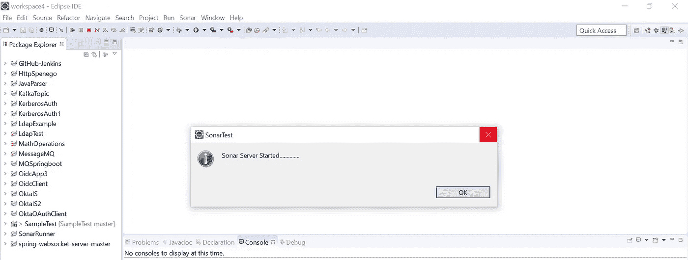***

***Sonar Server started***

****b.* ***声纳服务器仪表盘******

******

***Sonar Server Dashboard***

## ***SampleTest 项目[自动化之前]***

***c.***SampleApp.java*** 为了演示本文，我创建了下面的带有代码味道的源文件，它涵盖了前面章节中解释的**用例 1** 和**用例 2** 。
*这个源文件是在 eclipse* 中单独的 Java 项目 ***(样本测试项目)*** *中创建的。
*源文件****(SampleApp.java)****将被输入到另一个 Java 项目* ***(Java 解析器项目)*** *其中*将执行自动化*到*修复代码气味*。*****

***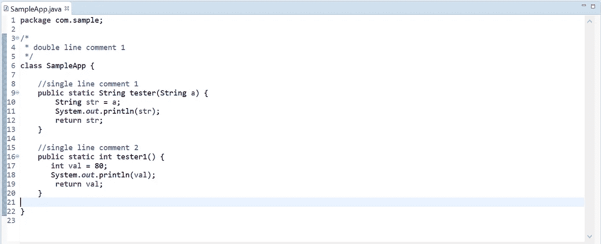***

***SampleApp.java — Before Automation***

## ***JavaParser 项目—自动化***

***d.***CheckCodeQuality.java 包含以下执行自动化的方法。*** *1。****createCompilationUnit()***方法会解析(*)。java)* 源文件来自 **SampleTest 项目**并创建一个编译单元。***

***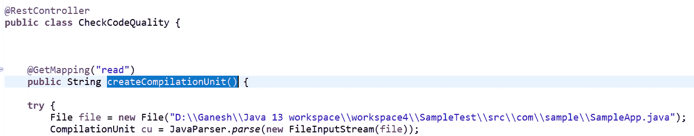***

***createCompilationUnit()***

***2.***runSonarScanner()***方法以编程方式执行 SonarScanner 进行扫描，并将结果上传到 Sonar 服务器。***

***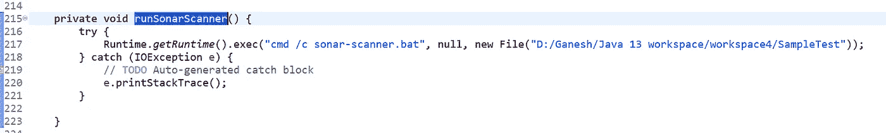***

******runSonarScanner()******

***3.***printSonarReport()***方法将连接到声纳服务器的 ***端口 9000*** 。它将使用 WEB API 来检索代码味道和规则结果。***

***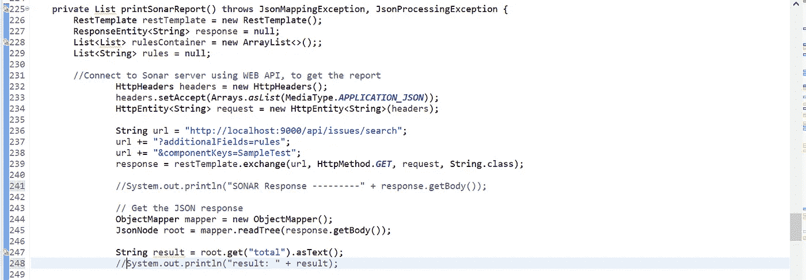***

******printSonarReport()******

***4. ***getClassesOfPackage("自定义访问者包的路径")*** 方法通过自动化读取专门为解决 ***用例 1*** 和 ***用例 2*** 而创建的不同访问者类。在这种情况下，它将读作***S1118 _ constructor visitor***和***S106 _ logger visitor***。***

***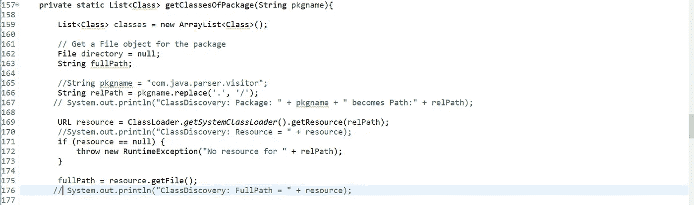***

******getClassesOfPackage()******

***5.**getHandler(List<List>List container，List【Class>handlers，CompilationUnit cu)** 该方法接受包含 ***listContainer*** 中的规则列表、 ***handlers*** 中的处理程序列表以及 ***编译单元*** 的参数。
它将迭代并从 **listContainer** 中提取一个规则名，并从处理程序列表中获取匹配的访问者。最后创建一个 visitor 的实例，并将其传递给***CompilationUnit . accept***(visitor，compilation unit)方法。这将启动自动化过程，访问者将遍历包含源代码的编译单元。java ),并寻找纠正代码味道的方法。纠正代码味道的智能在各自的 visitor 类中进行了检测。***

# ***规则实施***

## ******S1118 _ 施工方访客******

***下面的屏幕截图显示了 ***用例 1*** 是如何通过自动化处理和修复的。***

***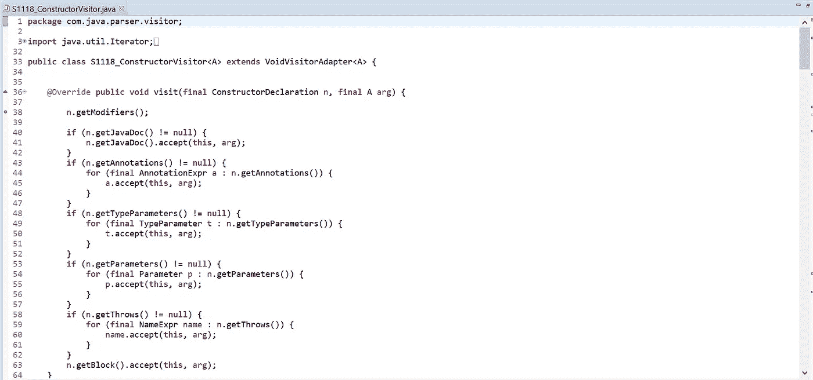***

******S1118_ConstructorVisitor.java*** — continued***

***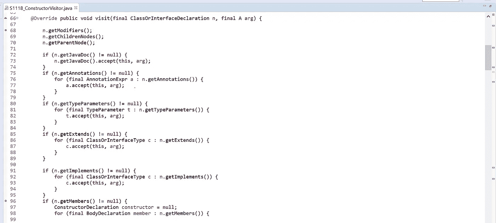***

******S1118_ConstructorVisitor.java*** — continued***

***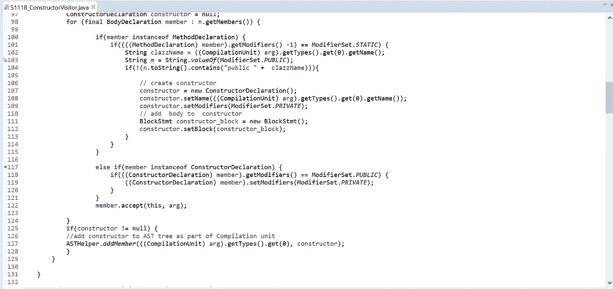***

******S1118_ConstructorVisitor.java*** — continued***

## ***S106_LoggerVisitor***

***下面的屏幕截图显示了 ***用例 2*** 是如何通过自动化处理和修复的。***

***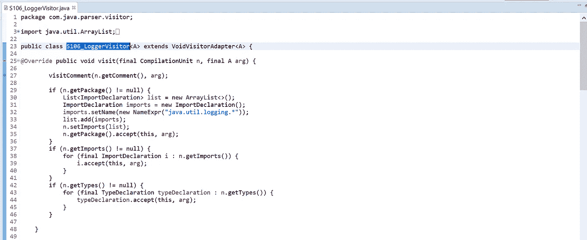***

***S106_LoggerVisitor.java — continued***

***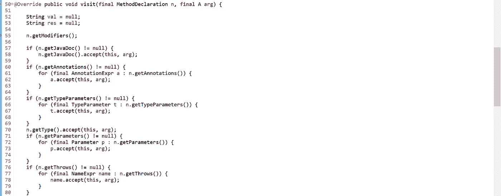***

***S106_LoggerVisitor.java — continued***

***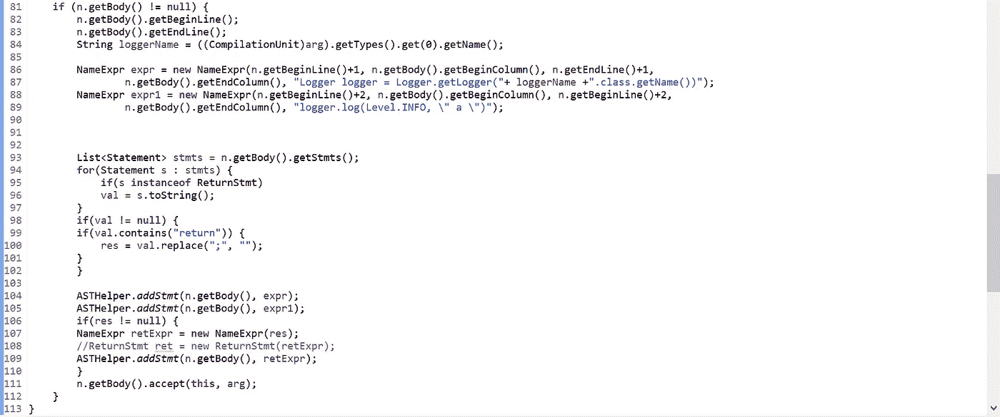***

***S106_LoggerVisitor.java — continued***

# ***让我们执行并观察自动化的运行！！***

***a. ***运行 Spring Boot 客户端*** *当 Rest 控制器收到请求时，自动化将启动。应用程序监听端口 8080。****

***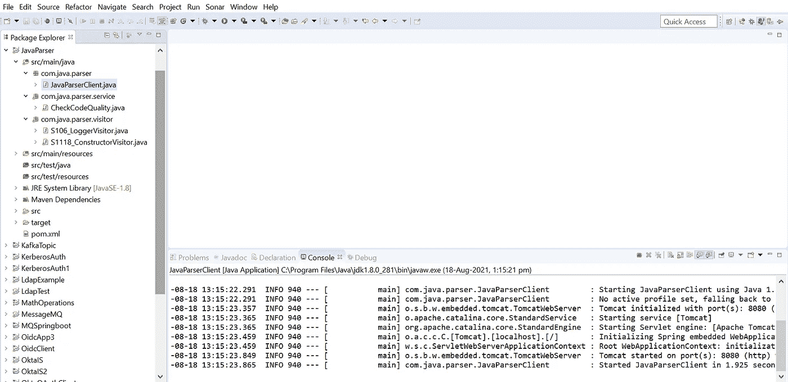***

***Spring Boot Application***

***b.*在* ***调试模式下启动浏览器*** *并指向网址****

******

***Request***

***c. ***声纳扫描仪扫描源文件并上传声纳服务器中的代码气味*** 下面的屏幕截图显示了在 ***SampleTest*** 项目中捕获的代码气味。
在 ***调试*** 模式中，我们正在执行代码以捕捉带有代码味道的屏幕截图，然后执行自动化来修复代码味道。***

***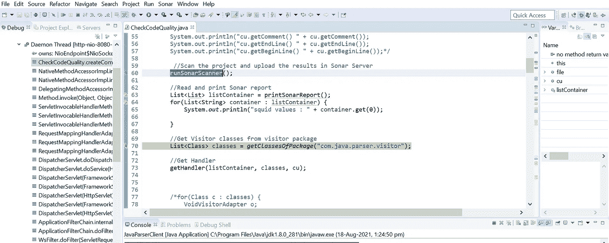***

***run Sonar Scanner***

***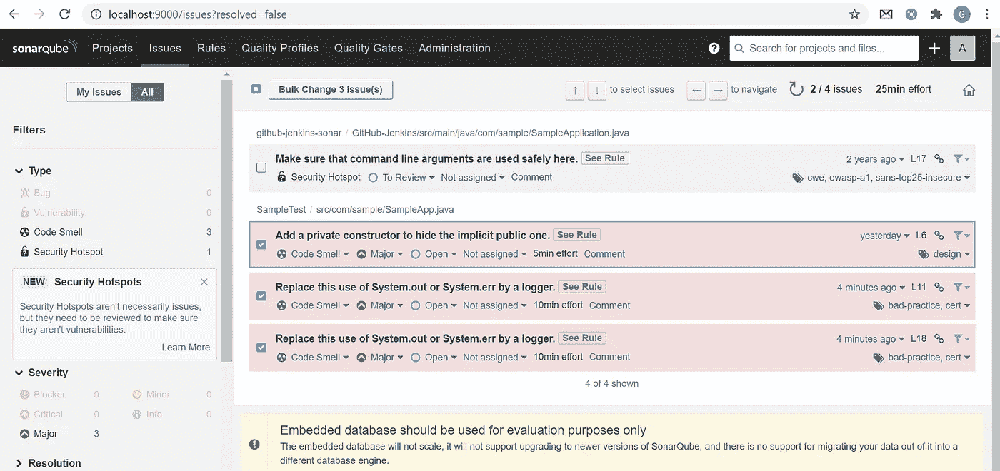***

***Code Smell -Issues shown***

***d. ***岗位自动化*** *你可以在下面的 2 个截图中看到，岗位自动化的代码是固定的，现在我们看到* ***的代码闻起来都是 0*** 和 ***质量关*** 已经通过 ***。******

***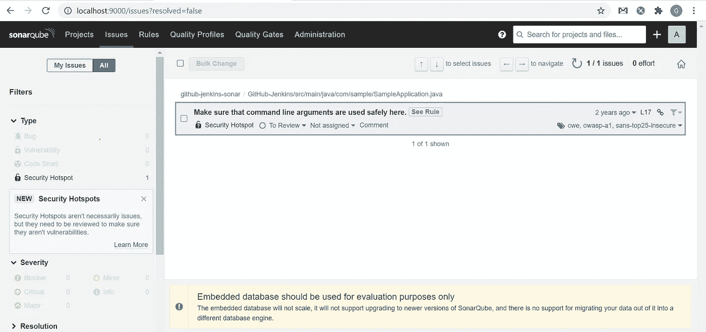***

***Code Smell — Issues fixed***

***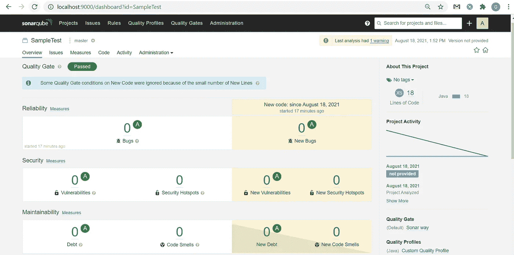***

***SampleTest project — Quality Gate Passed***

# ***最后，让我们看看我们的源文件***

## ***SampleApp.java[自动化之后]***

***下面的屏幕截图显示，根据 Java 语言规范 ***(JLS)*** ，遵循 ***规则 S1118*** 和 ***规则 S106*** *，post automation 代码已被修复。****

***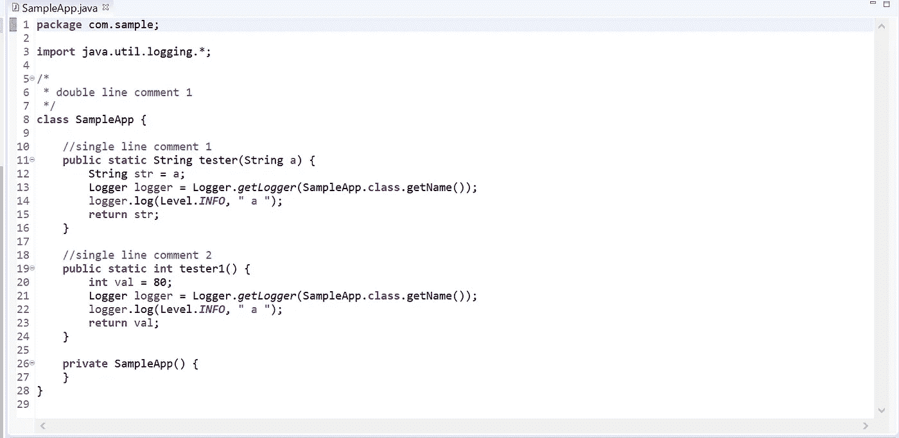***

***Final Cut — Source Code fixed through Automation***

# ***结论***

***在本文中，我们了解了抽象语法树、Java 解析器框架(JAPA)和访问者设计模式。我们还看了一些与 Java SE 平台及其自动化实现相关的 sonar 规则。我们以编程方式运行 Sonar Scanner 来扫描 Java 项目源代码，并将其发布在 Sonar 服务器上。我们还使用 WEB API 将报告检索到我们的应用程序，以使用访问者模式处理和修复代码味道。***

******发表于 2021 年 8 月 18 日******

> ******其他中等文章，*由*加内什*** 撰写***

***[合流平台:卡夫卡安全](https://ganeshblog.medium.com/confluent-platform-kafka-security-daec286f612d)***

> ***[异步 WebSocket 消息中间件和微服务](/nerd-for-tech/asynchronous-websocket-messaging-middleware-and-microservices-1a50a8f14e4b)***
> 
> ***[通过 CORS 将 Angular 与 Spring Cloud 建筑融合](/geekculture/amalgamate-angular-with-spring-cloud-architecture-through-cors-7f13b5fdb98f)***
> 
> ***[*多代理洞察 Apache Kafka 集群架构*](/geekculture/multi-broker-insights-into-apache-kafka-cluster-architecture-617b0abfc53e)***
> 
> ***[远程队列定义:IBM MQ v9.2](https://ganeshblog.medium.com/remote-queue-definition-ibm-mq-v9-2-c3ec4f568dab?source=user_profile---------5----------------------------)***
> 
> ***[Kubernetes Pods&Docker Containers:在 Windows 10 Home 中使用虚拟盒子旋转虚拟机](https://ganeshblog.medium.com/kubernetes-pods-docker-containers-spin-vm-using-virtual-box-in-windows-10-home-d3be783ff087?source=user_profile---------0----------------------------)***
> 
> ***[联合 OKTA IdP + WSO2 API 管理器作为 Spring boot 微服务集成的网关](https://ganeshblog.medium.com/federate-okta-idp-wso2-api-manager-as-gateway-to-spring-boot-microservices-integration-ba567567e81?source=user_profile---------1----------------------------)***
> 
> ***[将 IBM 业务流程管理器与混合 MobileFirst 应用程序集成](https://ganeshblog.medium.com/integrate-ibm-business-process-manager-with-hybrid-mobilefirst-application-5aed20841bf3?source=user_profile---------2----------------------------)***
> 
> ***[Kerberos v5:使用 Apache directory studio 在 Windows 10 Home 中进行 SSO 认证](https://ganeshblog.medium.com/kerberos-v5-sso-authentication-in-windows-10-home-using-apache-directory-studio-fb0151899185?source=user_profile---------3----------------------------)***
> 
> ***[整合服务提供商(sp)和 OKTA 身份提供商(IdP)](https://ganeshblog.medium.com/integrate-service-providers-sps-with-okta-identity-provider-idp-ce64a4e262ae?source=user_profile---------4----------------------------)***
> 
> ***[将 IBM WebSphere Service Registry and Repository 与 IBM Process Server 集成](https://ganeshblog.medium.com/integrate-ibm-websphere-service-registry-and-repository-with-ibm-process-server-f97eeb0e2ea?source=user_profile---------6----------------------------)***