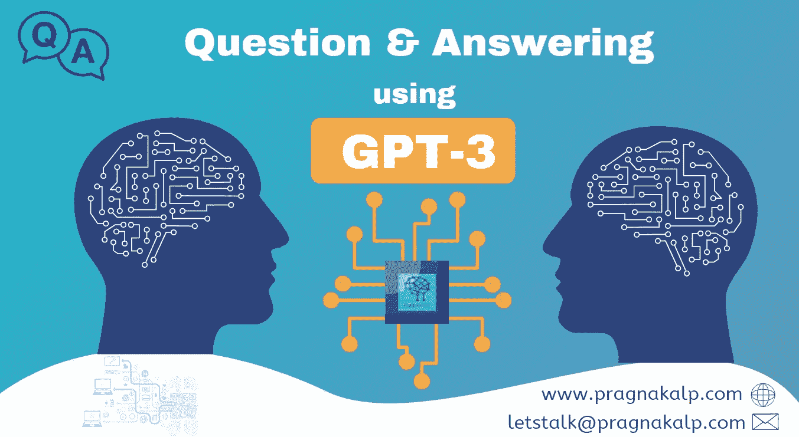
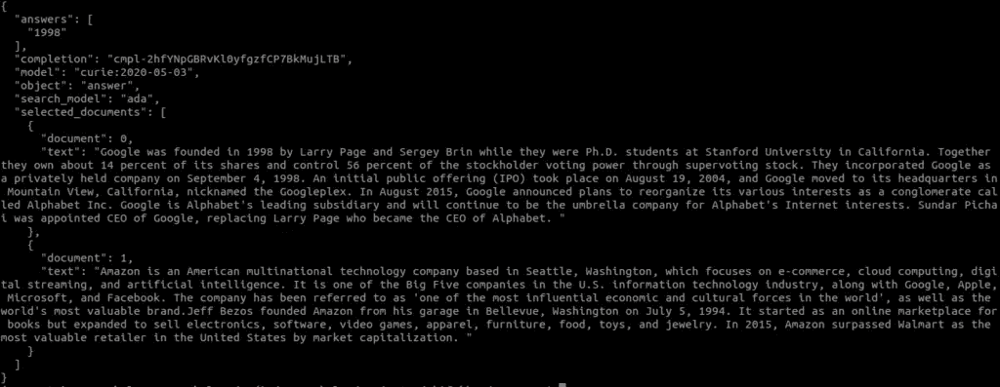
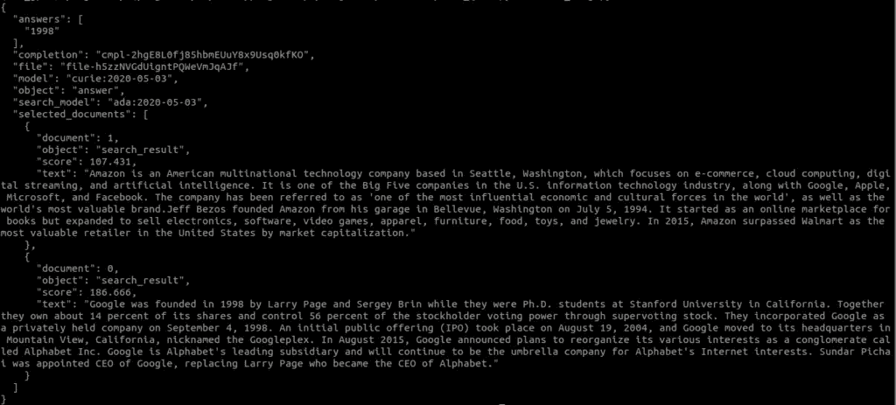

# 使用 GPT3 的问答系统

> 原文：<https://medium.com/geekculture/question-and-answering-system-using-gpt3-b4f8b6eae91c?source=collection_archive---------30----------------------->



自从 OpenAI 发射 GPT3 号以来，我们已经看到了许多使用 GPT 3 开发的具有各种功能的应用程序。

最近 GPT 3 号增加了[问答](https://beta.openai.com/docs/guides/answers)系统的新功能，我们带着它兜了一圈，检查它是如何工作的。

在我们的小数据实验中，这个系统看起来很有希望。它能从少量数据中非常准确地获取答案。未来，我们将尝试使用大量数据来检验它是如何工作的。

对于那些已经获得 GPT-3 访问权限并想尝试 GPT-3 的新问题回答系统的人，我们制作了这个小教程。

# 如何使用 GPT-3 问题回答

操场上没有 QnA，所以我们必须通过 API 使用它。为此，我们将使用 Python。

假设您的系统中已经安装了 Python、pip 和 virtualenv。如果没有，请首先这样做，然后按照以下步骤。

通过以下步骤创建并激活 virtualenv

```
virtualenv env_gpt --python=python3
source env_gpt/bin/activate
```

安装 OpenAI Python 绑定

```
pip install openai
```

要使用 GPT3 endpoint 执行问答，我们需要向 Open AI API 提供问题、一组文档(段落)和一些示例，它将生成答案。

我们可以以文档列表或文件的形式提供文档。

## 1.让我们探索一下如何使用文档列表来回答问题:

创建一个 python 文件，复制下面的代码，你需要把你的 OpenAI API 键值提供给 openai.api_key，然后运行文件。

```
import openai
openai.api_key = "YOUR-API-KEY"

document_list = ["Google was founded in 1998 by Larry Page and Sergey Brin while they were Ph.D. students at Stanford University in California. Together they own about 14 percent of its shares and control 56 percent of the stockholder voting power through supervoting stock. They incorporated Google as a privately held company on September 4, 1998\. An initial public offering (IPO) took place on August 19, 2004, and Google moved to its headquarters in Mountain View, California, nicknamed the Googleplex. In August 2015, Google announced plans to reorganize its various interests as a conglomerate called Alphabet Inc. Google is Alphabet's leading subsidiary and will continue to be the umbrella company for Alphabet's Internet interests. Sundar Pichai was appointed CEO of Google, replacing Larry Page who became the CEO of Alphabet.",
"Amazon is an American multinational technology company based in Seattle, Washington, which focuses on e-commerce, cloud computing, digital streaming, and artificial intelligence. It is one of the Big Five companies in the U.S. information technology industry, along with Google, Apple, Microsoft, and Facebook. The company has been referred to as 'one of the most influential economic and cultural forces in the world', as well as the world's most valuable brand. Jeff Bezos founded Amazon from his garage in Bellevue, Washington on July 5, 1994\. It started as an online marketplace for books but expanded to sell electronics, software, video games, apparel, furniture, food, toys, and jewelry. In 2015, Amazon surpassed Walmart as the most valuable retailer in the United States by market capitalization."]

response = openai.Answer.create(
 search_model="ada",
 model="curie",
 question="when was google founded?",
 documents=document_list,
 examples_context="In 2017, U.S. life expectancy was 78.6 years.",
 examples=[["What is human life expectancy in the United States?","78 years."]],
 max_tokens=10,
 stop=["\n", "<|endoftext|>"],
)

print(response)
```

在 document_list 中，您需要提供您的段落。

**openai。Answer.create()函数参数:**
**问题:**在此提供您输入的问题
**文档:**文档列表
**示例 _ 上下文:**包含段落或上下文的文本示例，用于为您提供的示例生成答案。
**示例:**提供示例对问题&答案
**停止:** API 将停止进一步生成令牌
**max_tokens:** 最终响应中允许的最大令牌数

执行该文件后，您将看到如下响应:



## 2.让我们看看如何使用存储在文件中的数据来回答问题:

您可以创建一个. jsonl(JSON 行)文件，其中每个 JSON 行包含“文本”字段和“元数据”字段(可选)。以下是简单的。jsonl 文件格式

```
{"text": "Hello OpenAI", "metadata": "sample data"}
```

让我们首先为 QNA 创建一个. jsonl 文件，创建一个 sample_qna.jsonl 并在其中复制以下代码:

```
{"text": Google was founded in 1998 by Larry Page and Sergey Brin while they were Ph.D. students at Stanford University in California. Together they own about 14 percent of its shares and control 56 percent of the stockholder voting power through supervoting stock. They incorporated Google as a privately held company on September 4, 1998\. An initial public offering (IPO) took place on August 19, 2004, and Google moved to its headquarters in Mountain View, California, nicknamed the Googleplex. In August 2015, Google announced plans to reorganize its various interests as a conglomerate called Alphabet Inc. Google is Alphabet's leading subsidiary and will continue to be the umbrella company for Alphabet's Internet interests. Sundar Pichai was appointed CEO of Google, replacing Larry Page who became the CEO of Alphabet.", "metadata": "Google"} {"text": "Amazon is an American multinational technology company based in Seattle, Washington, which focuses on e-commerce, cloud computing, digital streaming, and artificial intelligence. It is one of the Big Five companies in the U.S. information technology industry, along with Google, Apple, Microsoft, and Facebook. The company has been referred to as 'one of the most influential economic and cultural forces in the world', as well as the world's most valuable brand.Jeff Bezos founded Amazon from his garage in Bellevue, Washington on July 5, 1994\. It started as an online marketplace for books but expanded to sell electronics, software, video games, apparel, furniture, food, toys, and jewelry. In 2015, Amazon surpassed Walmart as the most valuable retailer in the United States by market capitalization.", "metadata": "Amazon"}
```

一旦您创建了 jsonl 文件，现在您需要上传该文件。要上传文件，请创建一个 python 文件名“upload_file.py”，复制以下代码并添加您的 API 密钥:

```
import openai
openai.api_key = "YOUR-API-KEY"

response = openai.File.create(
 file=open("sample_qna.jsonl"),
 purpose='answers'
)

print(response)
```

现在运行 upload_file.py 文件，您将得到如下类似的响应:

{
"bytes": 1691，
"created_at": 1616762542，
" filename ":" sample _ doc . jsonl "，
" id ":" file-H5 zznvgduigntpqwevmjqajf "，
"object": "file "，
"purpose": "answers"
}

根据上面的响应，我们需要文件 ID

下面是使用文件执行问题回答的代码

```
import openai
openai.api_key = "YOUR-API-KEY"

response = openai.Answer.create(
   search_model="ada",
   model="curie",
   question="when was google founded?",
   file="file-h5zzNVGdUigntPQWeVmJqAJf",
   examples_context="In 2017, U.S. life expectancy was 78.6 years.",
   examples=[["What is human life expectancy in the United States?","78 years."]],
   max_rerank=10,
   max_tokens=10,
   stop=["\n", "<|endoftext|>"]

)

print(response)
```

打开的参数。Answer.create()与我们上面看到的几乎相同，我们需要提供 file 参数而不是 document

file:指定上传文件后我们得到的文件 ID

**注意**:您可以指定文件或文档，但不能同时指定两者

您将得到以下响应:



正如我们所见，使用 GPT-3 建立 QnA 系统并不困难。我们对小文本数据的测试结果看起来也不错。

不过，我们发现生成结果需要一些时间，如果文本长度增加，可能需要更长时间。

我们将在接下来的日子里公布我们进一步的实验和学习。

我们使用 GPT-3 创建了[文本解释](https://www.pragnakalp.com/intent-classification-paraphrasing-examples-using-gpt-3/)、[意图分类](https://www.pragnakalp.com/intent-classification-paraphrasing-examples-using-gpt-3/)、[广告生成](https://www.youtube.com/watch?v=MAsjLIu3gPU)和许多其他应用。

*最初发布于* [*问答系统使用的是*](https://www.pragnakalp.com/question-answering-using-gpt3-examples/)*【gp 。*