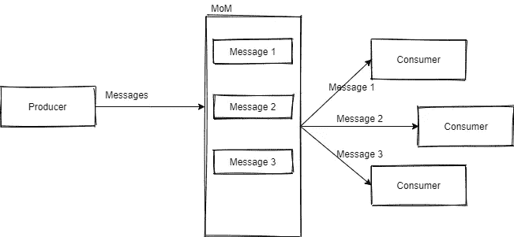
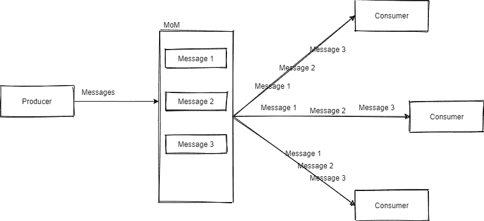
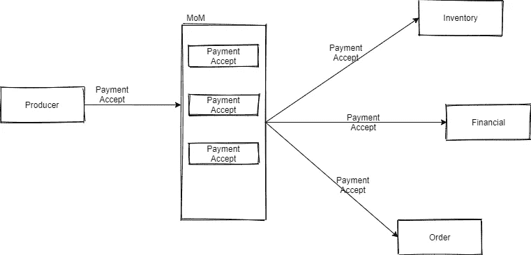
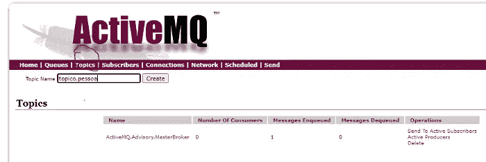
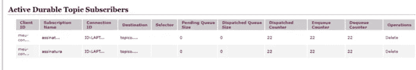

# Java、Spring Boot 和 Apache ActiveMQ 的队列与主题和示例

> 原文：<https://medium.com/geekculture/queues-vs-topics-and-examples-with-java-spring-boot-and-apache-activemq-d945c474bc3e?source=collection_archive---------7----------------------->

这篇文章是我不久前所做的一个关于生成和使用队列的例子的延续。这里的想法是展示使用队列和使用主题之间的区别。

## 交付模式的差异

队列中的使用者不会收到相同的消息。换句话说，每条消息只发送给一个使用者，如下例所示:



Apache ActiveMQ 本身有一个负载均衡器来做这件事。

另一方面，有了主题，就可以广播，向所有消费者传递信息，就像这样:



但是这有什么用呢？

想象一下有可能同时执行多个动作的场景，这非常有用。我举个经典的例子:一个网店，这个设计不言自明:



我不是这方面的专家，只是假设这些任务在这个场景中是独立的，并且单一类型的事件可以启动它们。

## 在 Apache ActiveMQ 中创建主题

在 activemq 控制台中，只需访问“主题”选项卡并创建一个新主题:



## 创建生产者

我总是从属性开始，所以我把它放在应用程序中。属性:

```
activemq.broker-url=tcp://localhost:61616
activemq.user=
activemq.password=
activemq.topic-name=topic.person
```

我上了一堂配置课:

```
@Configuration
@EnableJms
public class JmsConfig {

    @Value( "${activemq.url}" )
    private String brokerUrl;

    @Value( "${activemq.user}" )
    private String user;

    @Value( "${activemq.password}" )
    private String password;

    @Bean
    public ActiveMQConnectionFactory connectionFactory() {
        if ("".equals(user)) {
            return new ActiveMQConnectionFactory(brokerUrl);
        }
        return new ActiveMQConnectionFactory(user, password, brokerUrl);
    }

    @Bean
    public JmsListenerContainerFactory jmsFactoryTopic(ConnectionFactory connectionFactory,
                                                       DefaultJmsListenerContainerFactoryConfigurer configurer) {
        DefaultJmsListenerContainerFactory factory = new DefaultJmsListenerContainerFactory();
        configurer.configure(factory, connectionFactory);
        factory.setPubSubDomain(true);
        factory.setClientId("produtor");
        factory.setSubscriptionDurable(true);
        return factory;
    }

    @Bean
    public JmsTemplate jmsTemplateTopic() {
        JmsTemplate jmsTemplate = new JmsTemplate(connectionFactory());
        jmsTemplate.setPubSubDomain(true);
        return jmsTemplate;
    }
}
```

使用这个类的两个注释很重要，因为它们在 spring 的上下文中有帮助。还有一行值得注意:

*factory . set clientid(" producer ")；*

当连接到主题时，它创建生产者的 ID。
我还创建了一个类来发送消息:

```
@Component
@RequiredArgsConstructor
public class Producer {

    private final JmsTemplate jmsTemplate;

    @Value("${activemq.topic-name}")
    private String destinationTopic;

    public void send(Person person) throws JMSException {
        Gson gson = new Gson();
        String jsonPerson = gson.toJson(person);

        jmsTemplate.convertAndSend(destinationTopic, jsonPerson);
    }

}
```

好了，给话题留言就够了。

## 创造消费者

同样，我将从属性开始:

```
activemq.broker-url=tcp://localhost:61616
activemq.user=
activemq.password=
activemq.topic-name=topic.person
```

现在配置类:

```
@Configuration
@EnableJms
public class JmsConfig {

    @Value( "${activemq.broker-url}" )
    private String brokerUrl;

    @Value( "${activemq.user}" )
    private String user;

    @Value( "${activemq.password}" )
    private String password;

    @Bean
    public ActiveMQConnectionFactory connectionFactory() {
        if ("".equals(user)) {
            return new ActiveMQConnectionFactory(brokerUrl);
        }
        return new ActiveMQConnectionFactory(user, password, brokerUrl);
    }

    @Bean
    public JmsListenerContainerFactory jmsListenerContainerFactory(ConnectionFactory connectionFactory,
                                                       DefaultJmsListenerContainerFactoryConfigurer configurer) {
        DefaultJmsListenerContainerFactory factory = new DefaultJmsListenerContainerFactory();
        configurer.configure(factory, connectionFactory);
        factory.setPubSubDomain(true);
        factory.setClientId("meu-consumer");
        factory.setSubscriptionDurable(true);
        return factory;
    }

    @Bean
    public JmsTemplate jmsTemplate() {
        return new JmsTemplate(connectionFactory());
    }

    @Bean
    public JmsTemplate jmsTemplateTopic() {
        JmsTemplate jmsTemplate = new JmsTemplate(connectionFactory());
        jmsTemplate.setPubSubDomain(true);
        return jmsTemplate;
    }
}
```

***factory . setclientid(" my-consumer ")***行在连接到主题时创建一个 Id，***factory . setsubscriptiondurable(true)***行将消费者置于接收配置中，即使他们处于脱机状态。这意味着当他们连接时，他们会收到消息，因为代理知道他们是谁..

现在实际消耗的类:

```
@Slf4j
@RequiredArgsConstructor
@Component
public class ConsumerTopico {

    private final PersonRepository personRepository;

    @JmsListener( destination = "${activemq.topic-name}", subscription = "assinatura", selector = "test=false OR test is null")
    public void listen(String mensagem) {
        *log*.info(mensagem);
        Person person = new Person();
        try {
            Gson gson = new Gson();
            person = gson.fromJson(mensagem, Person.class);
            personRepository.save(person);
        }catch(Exception e){
            *log*.error(e.getMessage());
        }
    }

}
```

**subscription** 参数创建一个带有主题的订阅，因此主题将知道它应该向哪些消费者发送消息。但是，该订阅仅在该消费者第一次连接后注册。
现在只需创建其他消费者，输入 clientId 和签名即可，每个人都会收到这些消息(我在这里测试过)。

## 环境中的验证

要检查消费者是否正确，只需查看 Apache ActiveMQ adm 页面，通常在 http://localhost:8161，只需单击“管理 ActiveMQ 代理”，然后单击“订户”。在这个示例中，已经可以看到连接的消费者数量，以及他们是否拥有允许他们即使离线也能接收消息的持久连接:



完成了。