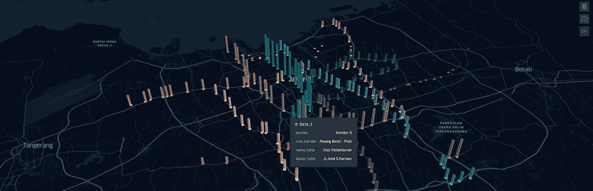

# 使用 Kepler.gl 实现快速简单的空间数据可视化

> 原文：<https://medium.com/geekculture/quick-and-easy-spatial-data-visualization-using-kepler-gl-3b5b83959997?source=collection_archive---------19----------------------->

Data Visualization of TransJakarta total passengers by route (Image by Author)

## 简单的步骤，但很酷的结果——使用 Jupyter 笔记本中的 Kepler.gl 可视化雅加达公交乘客统计数据

# 介绍

从大型数据集获得洞察力的最快方法之一是可视化它们。数据可视化帮助了我，因为…