# 使用 Python 上的生命周期网格进行快速公司诊断

> 原文：<https://medium.com/geekculture/quick-company-diagnosis-with-life-cycle-grids-on-python-7c19123cb9e3?source=collection_archive---------16----------------------->

一家公司的交易不仅是其当前状态的强大信息来源，也是一个洞察公司过去甚至未来的仓库。用我在 Python 上的实现来认识一下生命周期网格的应用方法…

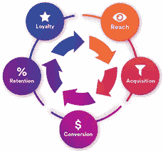

**简介**

想象一种情况，下一个报告期已经结束，你作为某公司的经理，收到销售的信息。例如，让我们以众所周知的 Kaggle [超市 2011-2014 年办公用品销售](https://www.kaggle.com/juhi1994/superstore)数据集为例。

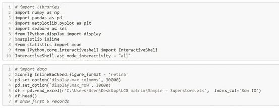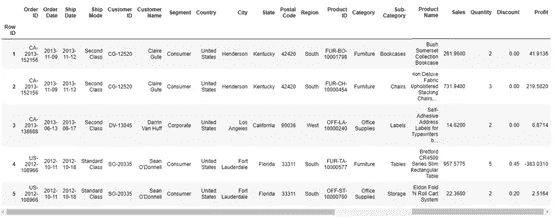

你可以在不同的类别和部分看到很多关于销售和盈利能力的信息。它们还包含各种见解，但现在让我们直接关注销售交易。值得注意的是，销售量是研究公司的人(外部和内部)首先感兴趣的事情。

接下来，让我们建立一个简单的按月销售动态图。

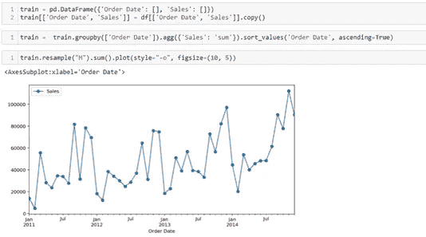

看起来一切都很成功——经过前两年的停滞期后，公司开始扩大规模，并开始明显增长。我们甚至可以通过任何自回归模型(无需详细的超参数调整)对未来做出简单的预测，例如 SARIMA。

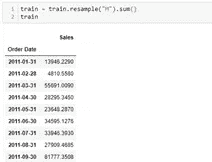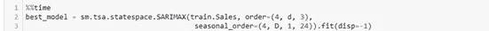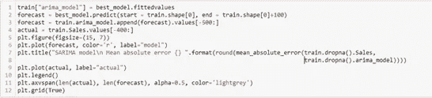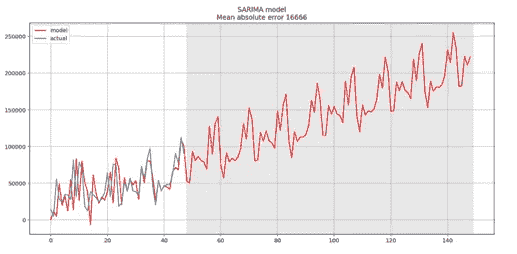

毫无疑问，成功就在前方，或者不是…让我们更深入地看看一家公司的销售交易。

**生命周期网格(LCG)矩阵**

**注:**一些材料摘自伟大的产品分析师的博客——analyzecore.com[和 ecommerce-in-ukraine.blogspot.com](https://www.analyzecore.com/2015/02/16/customer-segmentation-lifecycle-grids-with-r/)。

所以，在你生命周期网格之前 **(LCG)。**它基于客户的生命周期，客户的生命周期基于购买的频率和新近度(其来源是公司的销售交易——订单 ID、订单日期、客户 ID、销售额)。这种强大的客户细分方法的名称和概念给了 marketeer [Jim Novo](https://blog.jimnovo.com/2007/04/25/engagement-customers/) 。

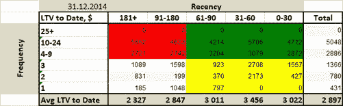

这个想法来自于 RFM 的分析， **LCG** 这是 [RF(M)](http://www.dbmarketing.com/2010/03/making-your-database-pay-off-using-recency-frequency-and-monetary-analysis/) 矩阵:

-在水平轴上，您查看最近(最近一次购买)；

-纵轴上，你看的是频率(购买次数)；

-在每个单元格中，您可以看到具有特定参数 R 和 F 的客户端数量；

——第二个表格中的每个单元格你看到 LTV 顾客通过参数 R 和 F 来确定日期(但对 LTV *的确定要严格一些，它是通过 R 和 F 的平均值来检查的)。

> ***- LTV(终身价值)根据边际贡献基数而非收入计算。**
> 
> 边际贡献或利润是收入和与销售的产品或服务直接相关的所有成本之间的差额。

彩色方块表示:

**绿色** —业务关键型客户，他们的新客户少于 90 天。这表明他们很可能会重复购买(最近的价格越低，他们就越有可能再次购买)他们的 **LTV 到目前为止**是巨大的；

**黄色**——需要进一步开发和增加频率的新客户，即参与购买转移到绿区；

**白色** —对业务不感兴趣的客户(一次性买家)，他们的最近交易超过 90 天，他们的 LTD 较低；

**红色** —可能失去业务的客户(作为一种选择，他们已经过了产品饱和期)。

建立了这样一个矩阵(包括各种产品类别)，我们可以立即回答许多问题。你可以在上面提到的博客中读到更多关于它在与客户群合作中的应用。

但是现在，我们将根据来自 **LCG 的一般信息，尝试了解公司已经发生和将要发生的事情。**

**用 Python 执行 LCG**

让我们做一些代码…

首先，我们将计算每个客户的最近度、频率和货币价值:

> **重要提示:**在每个订单的数据中，我们有多个包含$ sales 信息的条目(行)，因此这将是“订单 ID”的依赖聚合方法(参见下面的代码)

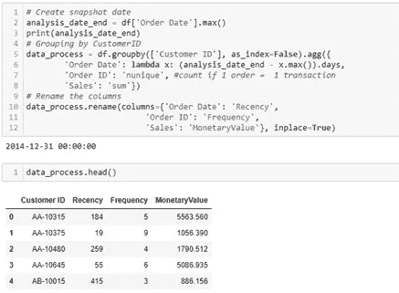

为 **LCG** 矩阵定义颜色函数:

接下来，我们将根据 Jim 概念中的近期和频率界限对每个客户进行细分。

> **重要提示:**需要根据过去的分布情况和每种业务类型来定义射频箱。

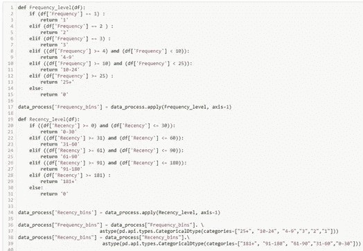

最后，将客户端组合成段，并使用以下代码创建 **LCG** 矩阵:

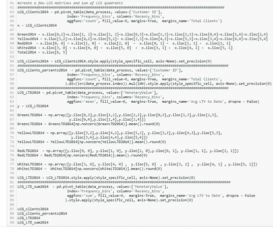

所以，我们得到 4 个 LCG 矩阵

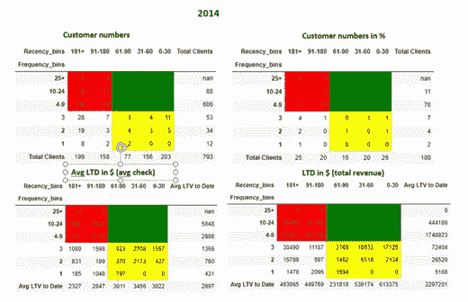

> **重要提示:**这些矩阵包括 2011 年至 2014 年的所有收入和客户信息，类似于累计总数。

现在，为了对公司历史和未来事件做出假设，我们应该启动 LCG 矩阵。这意味着需要了解动态，并在每年/每一时期创建这样的集合。

所以，我们需要从销售数据中减去 2014 年

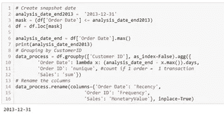

重复上面的代码，得到 2011 年、2012 年、2013 年每年的 **LCG** 的集合。

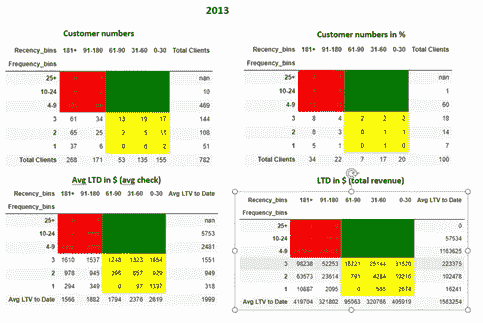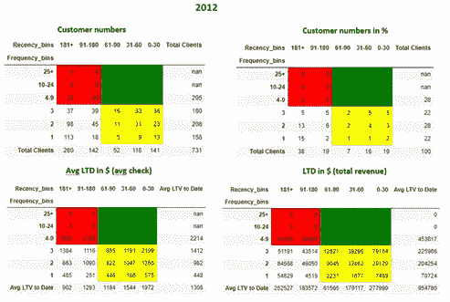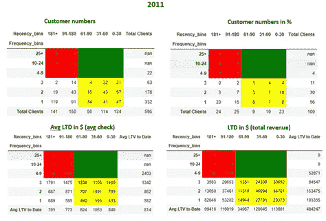

最后，我们将把**客户编号**和**Avg LTD(Avg check)**中的每个彩色象限合并到表格中，以查看同比变化。

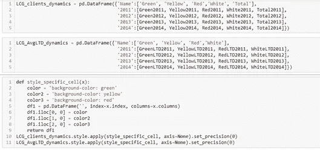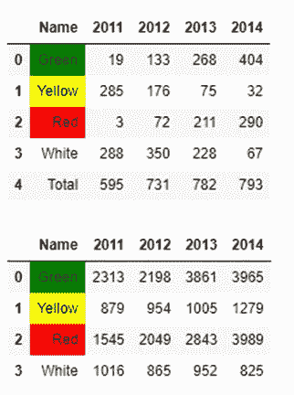

**快速诊断和结论**

2013–2014 年的收入增长与重复购买区(从黄色区流向绿色区)的客户数量增加以及 1 个客户带来的价值增加相关。

客户群并没有从 2012 年的 731 个客户增加到 2014 年的 793 个，也就是说，可以认为增长的驱动力是在保留和锁定客户方面的出色工作。同时，甚至有可能来自白色区域的客户被激活。营销/销售团队干得好！

2011 年和 2012 年之间的销售额/平稳期略有下降，这可能与绿区客户购买更便宜的商品(尽管客户数量增长，但平均支票下降)和开始向红区外流有关。

主要的担忧是，该公司很有可能面临有限的增长，并且明年销售额可能会下降:

*   客户群的增长在 2014 年几乎停止了+11 个客户；
*   2014 年新客户来源基本耗尽(黄白区)；
*   绿区的客户“老化”率很高，在向红区过渡时接近饱和(公司销售非必需品和非常规需求):

1.  平均支票的增长明显放缓，2013 年为+ 1663 美元，2014 年为+ 104 美元；
2.  2014 年，3965 美元的绿区支票相当于红区的近 3989 美元。

*   2014 年向新城市的扩张不再允许客户群有效增长。

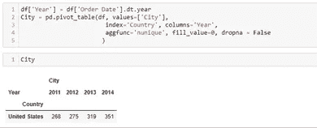

PS:通过不同的细分市场来构建 LCG 将会给你更多的洞察力。

感谢阅读！