# 介绍 Sidetable:熊猫的快速数据汇总

> 原文：<https://medium.com/geekculture/quick-data-summary-in-pandas-sidetable-introduction-8c35ac18c66c?source=collection_archive---------6----------------------->

## 本质上，Sidetable 是熊猫的*值计数*和*交叉表*的私生子，是为熊猫编写的扩展模块


Photo by [geralt](https://pixabay.com/users/geralt-9301/) from [pixabay](https://pixabay.com/)

在本文中，我将使用 Twitter 上的[平台](https://www.kaggle.com/gpreda/flat-earth-on-twitter)和 Kaggle 的 [IBM HR Analytics 员工流失&性能数据集。](https://www.kaggle.com/pavansubhasht/ibm-hr-analytics-attrition-dataset?select=WA_Fn-UseC_-HR-Employee-Attrition.csv)

使用*交叉表*、*分组依据*和*值计数*创建快速汇总可以很好地工作，但是有时创建更复杂的东西会太痛苦。让我们熟悉一下 Sidetable，这是一个为简化这个过程而创建的库！

[](https://python.plainenglish.io/pandas-rapid-reporting-quick-exploration-crosstab-b6511400c48e) [## 熊猫快速报告:快速探索，交叉表

### 使用熊猫进行快速探索、低调报道和分析的指南。

python .平原英语. io](https://python.plainenglish.io/pandas-rapid-reporting-quick-exploration-crosstab-b6511400c48e) 

因为它不是熊猫基地功能的一部分，我们必须在使用前安装它:

```
pip install sidetable
```

## **Sidetable.freq()**

*freq* 方法提供了一个系列或系列列表中唯一值的数量和分布的汇总。

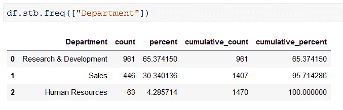

Screenshot by Author

两列也是如此:

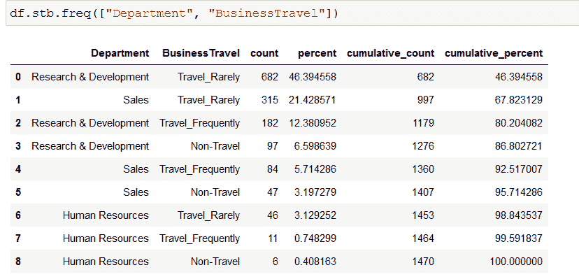

Screenshot by Author

请注意，汇总表基于“计数”列按降序排列。

如果您希望对特定的系列值求和而不是计数，您可以提供“value”参数来选择列。

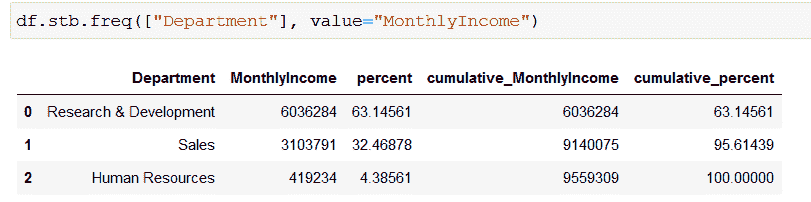

Screenshot by Author

问题可能是这样大的数字不是最容易读懂的。“style”参数——如果设置为 True——会使格式更漂亮，还会添加%符号！

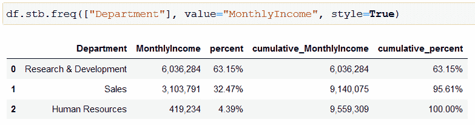

Screenshot by Author

## **Sidetable.count**

*计数*在你的数据框架中的每一列上创建一个简洁的摘要，列出唯一值的数量，最频繁和最不频繁的值，以及这些序列中数量最多和最少的项目的数量。

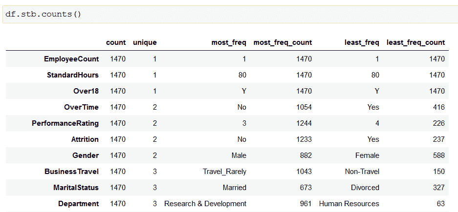

Screenshot by Author

如果在您的项目中有意义，您可能希望从计数摘要中排除某些类型的数据——“排除”参数可以帮助您做到这一点。指定类型的语法与 Pandas 中的相同。[选择 _ 类型](https://pandas.pydata.org/pandas-docs/stable/reference/api/pandas.DataFrame.select_dtypes.html)。

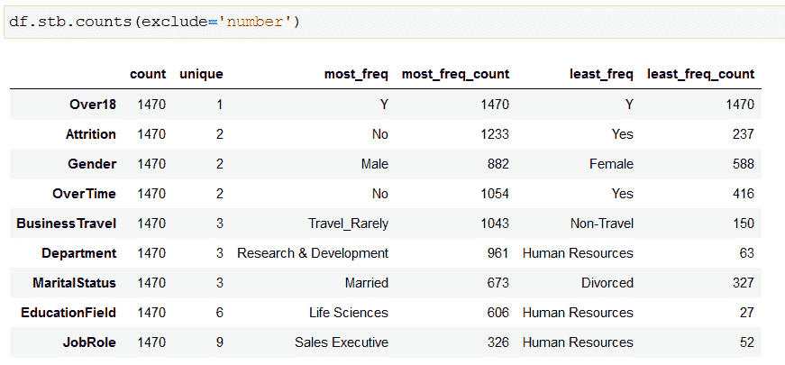

Screenshot by Author

> 如果你想让我保持咖啡因创造更多这样的内容，请考虑支持我，只要一杯咖啡。

[](https://buymeacoffee.com/zoltanguba2)

## 侧表.缺失

顾名思义，这个方法给出了每一列中缺失值的计数和百分比的汇总。这里也可以使用“style”参数，以获得更加用户友好的格式。

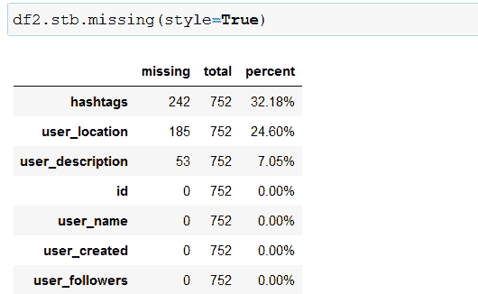

Screenshot by Author

如果您很幸运，您的数据中有大量的列没有值丢失，您可以通过使用“clip_0”参数选择不在丢失的摘要中显示这些列。

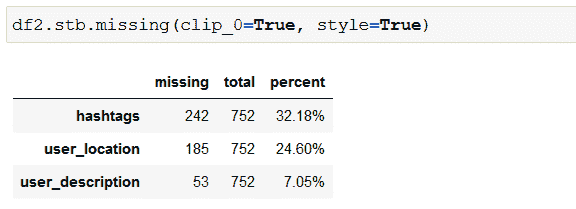

Screenshot by Author

## **侧表小计**

Groupby 与聚合函数结合使用可以提供很好的汇总，但是，有时小计行会非常有用。手动添加它们确实很麻烦，然而， *sidetable* 有一个内置的解决方案。

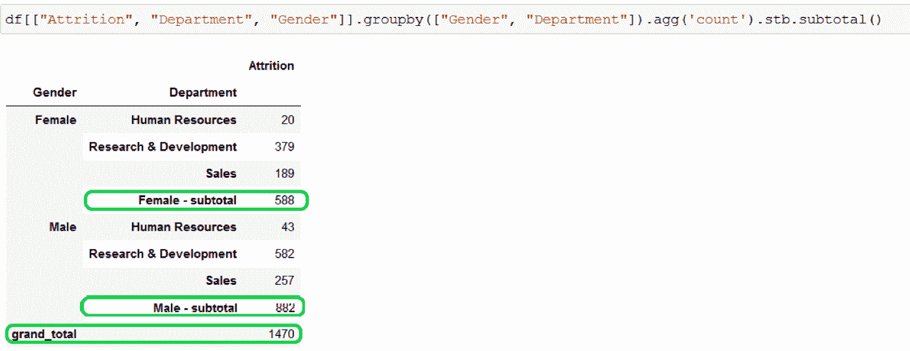

Screenshot by Author

默认情况下，该方法将分类汇总添加到所有级别的分组中:

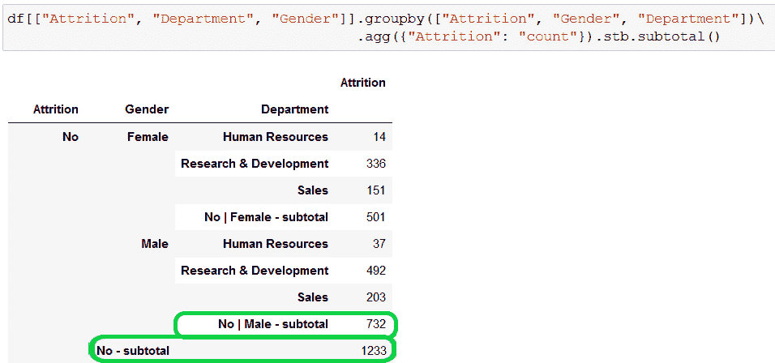

Screenshot by Author

如果您不需要将所有级别相加，您可以精确控制“sub_level”参数将包含哪些级别。

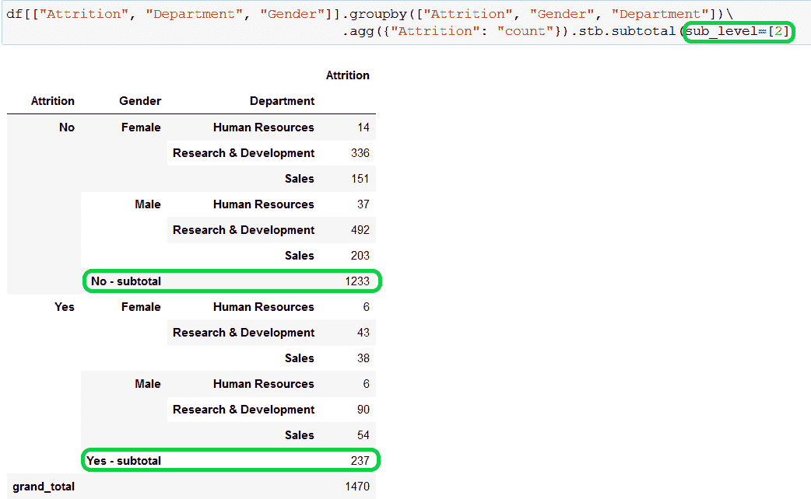

Screenshot by Author

## **侧平**

具有 multiindex 的数据帧可以很好地表示数据，但有时可能需要进行拼合，例如，如果您想将其保存到数据库表中。

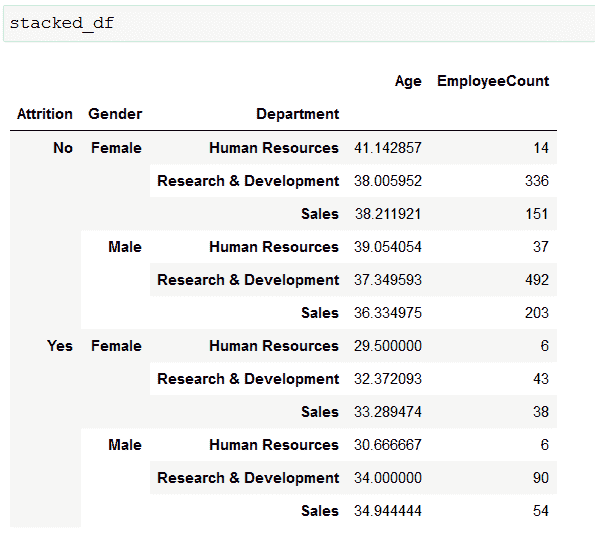

Screenshot by Author

*flatten* 方法将负责移除多索引，将数据点放入数据帧。

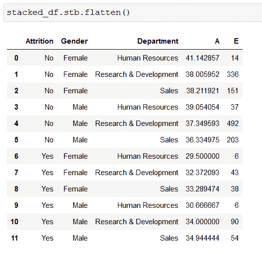

Screenshot by Author

感谢你阅读这篇文章！如果您需要快速创建汇总表，Sidetable 是一个非常有用的工具，我认为它值得更多的关注。请务必查看[文档](https://github.com/chris1610/sidetable)并尝试一下——我确信您会想到使用它的用例。