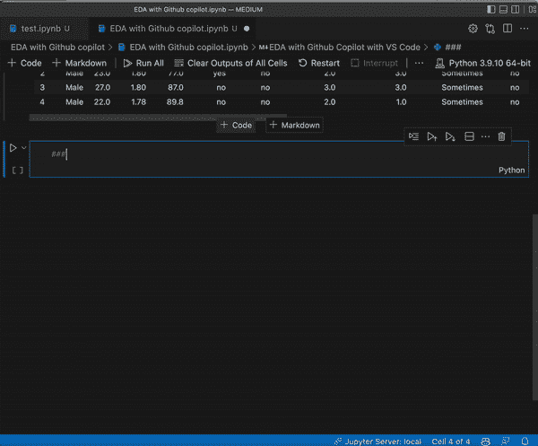
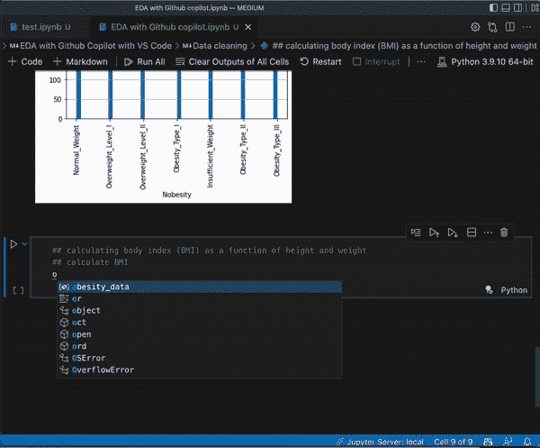
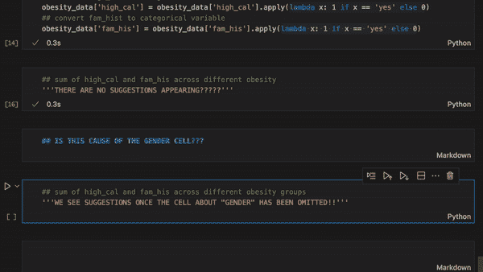
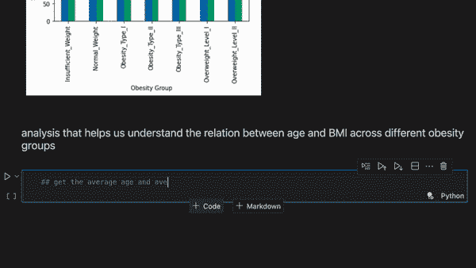

# AI 取代数据分析师？！

> 原文：<https://medium.com/geekculture/quick-eda-using-github-copilot-8c7005ce1cec?source=collection_archive---------10----------------------->

## 使用 GitHub Copilot 实现快速 EDA


几个月前我偶然发现了 GitHub Copilot，我对这个新工具感到惊讶。我很快加入了他们的等待名单，几周后…我成为了 GitHub Copilot 社区的一员！

我意识到，对于一些新的程序员来说，使用这样的工具可能会有些力不从心。因此，我写这篇博客是为了通过演示如何使用 Copilot 进行探索性分析来快速概述 Copilot。希望这可以作为一些新手的指南，让他们的编码体验更加精彩！

*注意:本文基于我作为数据分析师/数据科学家在 vs 代码中使用 python 的编码经验。*

1.  介绍
2.  数据集概述
3.  进一步分析
4.  结论
5.  两颗北极指极星

# 1.介绍

让我们先来了解一些关于 GitHub Copilot 的事情。这是 GitHub 和 OpenAI 的合作成果。Copilot 是在人类程序员编写的数十亿行代码上训练的语言模型。由于这种训练，当给定用自然语言编写的指令时，Copilot 能够生成几种语言的计算机代码。例如，你可以输入“写一个函数来反演二叉查找树”，它会为你做。该工具与以下允许您自动完成代码的 ide 兼容:


IDEs: PyCharm, VS Code, Neovim , JetBrains

# 2.数据集概述

这个数据集是从 UCL 机器学习库下载的。它包括根据墨西哥、秘鲁和哥伦比亚国家的饮食习惯和身体状况估计个人肥胖水平的数据(Fabio 等人，2019 年)。

我发现使用 copilot 相当简单。正如你在下面看到的，每次我输入一些东西或者只是转到下一行，Copilot 就开始在*灰色*中生成代码。95%的时候，我只需点击*键*或*回车*，代码就会自动填充。

下面，你可以看到我使用 Copilot 导入数据集，并得到它的快速概览。它可以帮助我们制作漂亮的情节。我在这里所做的只是键入注释:

```
*## nobesity is the dependent variable
## check distribution of nobesity*
```

我点击 tab，然后坐下来，看着它为我生成其余的，就像你现在正在做的一样；)



副驾驶不只是有编程方面的知识。它也有关于世界的一般知识。在下面这段代码中，我输入了:

```
## calculating body index (BMI)
```

Copilot 接下来做了剩下的工作，用代码正确地实现了身体质量指数公式！不仅如此，您还可以使用 Copilot 的精彩建议轻松绘制分布图和热图。对于这些，我键入了:

```
*## plot all variables*
```

而且，

```
*## get corr*
```



# 3.进一步分析

让我们尝试使用 lambda 函数来编码我们的一些分类变量。Copilot 可以为此生成几乎准确的代码。然而，我不得不做一些调整，例如将“是”改为“是”。问题是，这是 Copilot 本身的问题，还是我给它的指令的问题？有了 Copilot，就有了一种需要学习与系统沟通以获得最佳效果的感觉。也许，如果我指定了字符串应该如何格式化，它就会完成我想要的。

让我着迷的是副驾驶对性别的敏感程度。在任何单元格中键入“性别”，不再提供任何建议！所以，我猜当你需要副驾驶工作时，你需要避免“性别”这个词。



现在，让我们来分析一下肥胖人群与高血压、家族史之间的关系。使用此注释:

```
*## sum of high_cal and fam_his across different obesity groups*
```

副驾驶给了我们需要的代码。此外，它给了我们代码来巧妙地绘制这些结果。这类似于您在下面看到的片段。



Bar plots & Scatter plots

在编码会议的最后，我们尝试一些不那么非正式的东西。带着评论，

```
*## best way to plot BMI and age and obesity group*
```

我们可以看到一个非常丰富多彩和可解释的散点图(见上文)。这表明，写一个信息不丰富的评论，仍然可以给我们精确的结果。

# 4.结论

总之，这只是对 Copilot 能力的一点小小的了解。它可以生成有用的简短代码片段。它还可以生成几行高质量的代码。当然，它并不完美，在知道如何编写好的指令方面有一个学习曲线，但它肯定帮助我从某个地方开始，而不是被我的下一步卡住。

根据我的经验，我每天都使用 Copilot，这无疑为我节省了时间。我不再需要花太多时间在堆栈溢出上来寻找小熊猫问题的答案，比如“如何使用？多列聚集”。因此，如果您认为这是适合您的工具，那么欢迎体验新的编码体验！

# 5.两颗北极指极星

*   我相信 Copilot 对初学者来说是一个很好的工具，只要你真正努力去学习这门语言。不要让副驾驶成为拐杖。
*   下载 Visual Studio 代码的链接:【https://code.visualstudio.com】T2。可以给 python，jupyter notebook，Copilot 等等添加扩展..
*   你可以去 Github Copilot 的网站了解更多关于他们的工具，也可以访问 Copilot:【https://github.com/features/copilot/
*   副驾驶几周前还是免费的。现在，你可以免费试用 60 天。之后，每个用户每月 10 美元或每年 100 美元。

如果你想要上面 gif 的慢速版本，请点击下面的 YouTube 链接。请订阅我的媒体和 YouTube 频道，因为你的鼓励肯定会帮助我制作更多有趣的内容，这样我们就可以一起学习和分享❤

参考资料:

Palechor & Manotas，2019 年，根据哥伦比亚、秘鲁和墨西哥个人的饮食习惯和身体状况估计肥胖水平的数据集，数据简介，第 25 卷，104344，ISSN 2352–3409，[https://doi.org/10.1016/j.dib.2019.104344](https://doi.org/10.1016/j.dib.2019.104344)。