# 快速指南:梯度下降(批量对比随机对比小批量)

> 原文：<https://medium.com/geekculture/quick-guide-gradient-descent-batch-vs-stochastic-vs-mini-batch-f657f48a3a0?source=collection_archive---------14----------------------->

Photo by [Isaac Smith](https://unsplash.com/@isaacmsmith?utm_source=unsplash&utm_medium=referral&utm_content=creditCopyText) on [Unsplash](https://unsplash.com/s/photos/data?utm_source=unsplash&utm_medium=referral&utm_content=creditCopyText)

在这个故事中，我们将看看不同的梯度下降方法。你可能会有一些问题，比如“什么是梯度下降？”，“为什么我们需要梯度下降？”，“梯度下降法有多少种？”等等。到这个故事结束时，你将能够回答所有这些问题。但首先，我们将从线性回归模型开始。为什么？你很快就会知道了。

# 线性回归

您可能知道，线性回归是一种线性模型，这意味着它是一种发现或定义输入变量(x)和单个输出变量(y)之间的线性关系的模型。更一般地说，线性模型通过计算输入要素的加权和进行预测。数学上，线性回归模型表示为

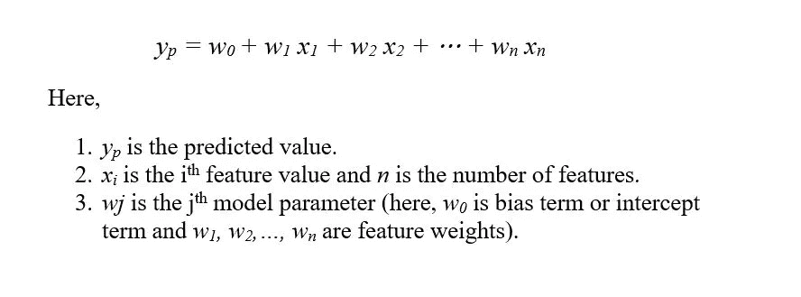

上述等式可以以矢量化形式表示为

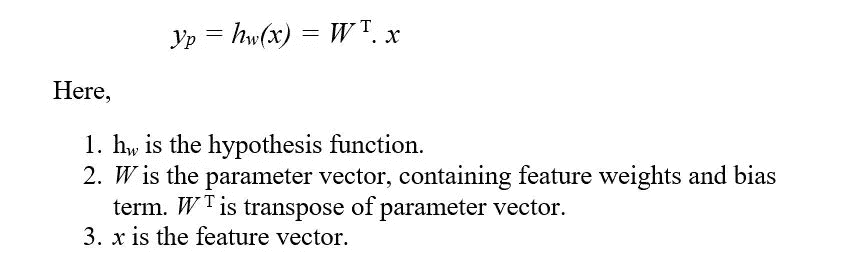

现在，为了训练这个线性回归模型，我们需要找到参数值，以便模型最适合训练数据。为了衡量模型与数据的吻合程度，我们将使用最常用的性能指标，均方根误差(RMSE)。使用以下成本函数计算线性回归模型的 RMSE

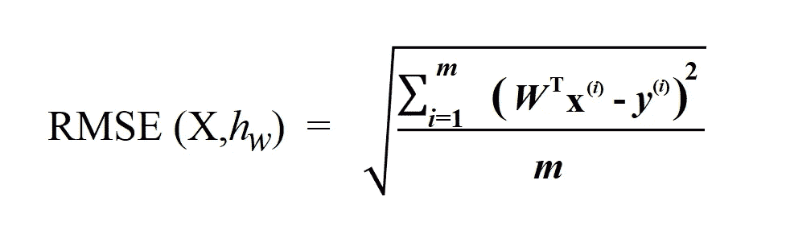

这里，

1.  x⁽ *ⁱ* ⁾是包含 iᵗʰ实例所有特征值的向量。
2.  *y* ⁽ *ⁱ* ⁾是 iᵗʰ实例的标签值。

所以我们需要做的是找到使 RMSE 最小的 ***W*** 的值。我们可以通过正规方程或者梯度下降来实现。

# 正规方程

可以使用数学等式来获得使成本函数最小化的 ***W*** 的值。这个方程称为标准方程，给出如下

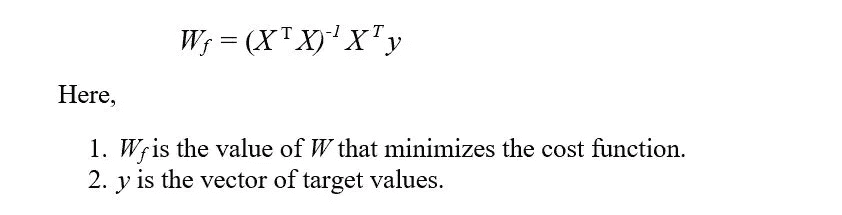

你可以注意到，在正规方程中，我们需要计算 Xᵀ.的倒数 x，它可以是一个相当大的有序矩阵(n+1)✕(n+1).这种矩阵的计算复杂度大约为 O(n)。这意味着如果特征的数量增加，那么计算时间将急剧增加。例如，如果要素数量增加一倍，计算时间将增加大约八倍。此外，当 Xᵀ.x 是奇异矩阵。

还有一种类似于正规方程的方法，SVD 方法。Scikit-Learn 的线性回归类使用 SVD 方法。在 SVD 方法中，不是计算逆，而是计算伪逆。奇异值分解方法的计算复杂度大约为 O(n)。因此，当特征数量增加一倍时，计算时间会增加四倍。由于伪逆总是为矩阵定义的，SVD 的时间复杂度优于前者，因此，SVD 方法优于正规方程方法。但是，这种方法仍然不够好。还有一些优化的余地。因此，我们来看另一种方法“梯度下降”。

# 梯度下降

梯度下降是一种寻找最优解的迭代优化算法。梯度下降可用于寻找使可微函数最小化的参数值。该算法背后的简单思想是迭代地调整参数以最小化成本函数。

在梯度下降法中，我们从参数的随机值开始。在每次迭代之后，我们朝着减少函数值的值移动，或者我们可以说，我们朝着函数的斜率下降或为负的方向移动(这就是为什么它被称为梯度下降)。

对于我们的例子，我们从随机值 *W.* 开始，随着我们一步一步地向前推进， *W* 的值逐渐提高，也就是说，我们一步一步地降低成本函数(RMSE)的值。每一步都被称为学习步骤。

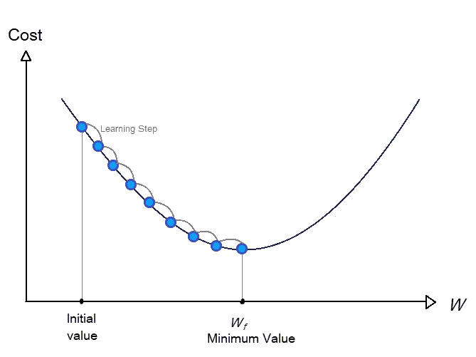

这里要注意的一点是，我们需要学习的步骤的大小非常重要。我们需要确定步长的大小，以便在更少的步骤中获得最佳值 *W* 步长的大小由超参数调用*的学习速率决定。*如果学习率太小，则该过程将花费更多时间，因为算法将经历大量迭代才能收敛。

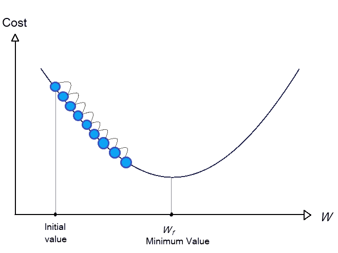

另一方面，如果学习率太大，与前面的步骤相比，您可能会增加成本函数值。

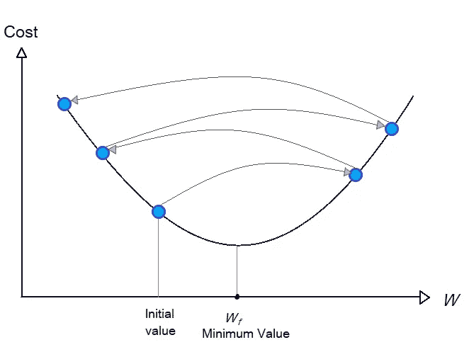

在函数具有不同的局部极小值和一个全局极小值的情况下，找到一个合适的学习率是一项相当艰巨的任务，因为你可能最终会在局部极小值处结束。但是，RMSE 成本函数是一个凸函数，这意味着它只有一个全局最小值。此外，函数是连续和平滑的，这给了我们优势。

在实现梯度下降时，我们需要计算代价函数相对于每个模型参数***【w】***[**【ⱼ】**](https://www.compart.com/en/unicode/U+2C7C)的梯度，也就是说，我们需要计算代价函数对模型参数的偏导数。由于对均方误差(均方根)的求导比 RMSE 更简单，并且它也解决了我们的目的，因为最小化均方误差也将最小化 RMSE(因为 RMSE 只是均方误差的平方根)，所以我们将使用均方误差作为成本函数。

关于模型参数***w***[**ⱼ**](https://www.compart.com/en/unicode/U+2C7C)的成本函数(MSE)的偏导数如下

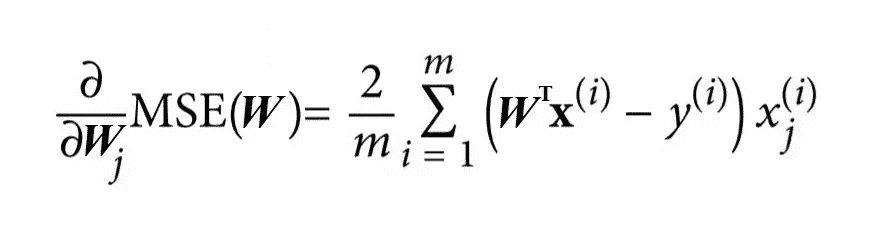

或者我们可以使用下面的等式直接计算梯度向量，该梯度向量包含每个模型参数的成本函数的所有偏导数。

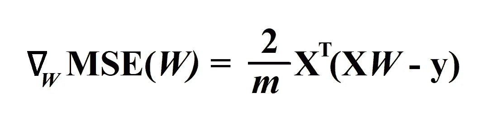

现在，我们得到了梯度向量，我们需要从参数向量 *W.* 中减去这个乘以学习率(用η表示)的梯度向量

现在我们要决定迭代的次数，也就是重复上述过程的次数，之后我们就会有解了。一个简单的方法是选择大量的迭代。迭代时，当梯度向量的范数变得非常小，小于一个叫做容差(用ϵ表示)的极小值时停止，或者你也可以在代价函数开始增加时停止。

> 注意:我们还需要在梯度下降之前执行特征缩放，否则将需要更长的时间来收敛。

梯度下降的类型

1.  批量梯度下降。
2.  随机梯度下降。
3.  小批量梯度下降。

# 批量梯度下降

上面我们看到的方法是分批梯度下降。正如你可能已经注意到的，在计算梯度向量∇ *w，*时，每一步都涉及对完整训练集 **X** 的计算。由于该算法使用整批训练集，因此称为批梯度下降。

在大量特征的情况下，批量梯度下降比正常方程方法或 SVD 方法表现得更好。但是在非常大的训练集的情况下，还是相当慢的。

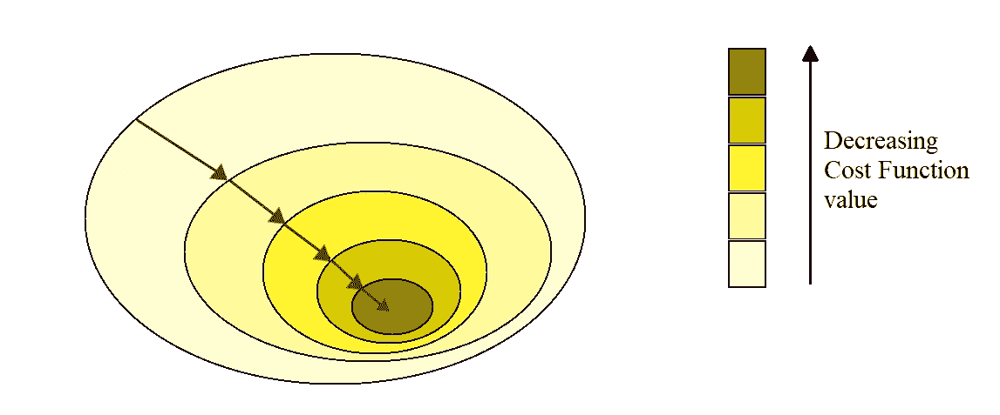

# 随机梯度下降

对于大型训练集，批量梯度下降变得非常慢，因为它使用整个训练数据来计算每一步的梯度。但随机梯度下降(SGD)的情况并非如此，因为在该算法中，从训练集中选择随机实例，并且仅使用该单个实例来计算梯度。这使得算法更快，因为它在每一步都必须处理非常少的数据。

由于 SGD 的随机性质，成本函数上下跳跃，仅平均下降。因此，很有可能最终的参数值是好的但不是最好的。

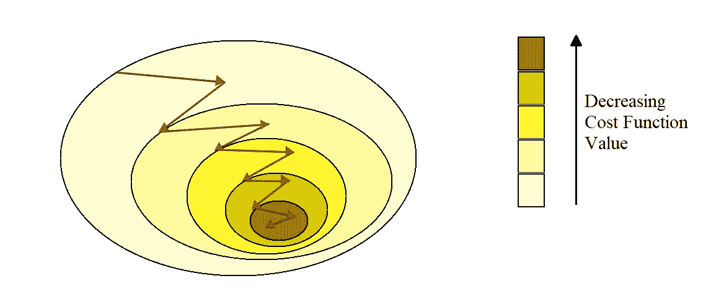

# 小批量梯度下降

这是我们要看的最后一个梯度下降算法。您可以将该算法称为批处理和随机梯度下降之间的中间地带。在该算法中，使用来自训练集的随机实例集来计算梯度。这些随机组被称为*小批量。*

小批量 GD 比 SGD 稳定得多，因此该算法将给出比 SGD 更接近最小值的参数值。此外，在使用小批量 GD 时，我们可以从矩阵运算的硬件(尤其是 GPU)优化中获得性能提升。

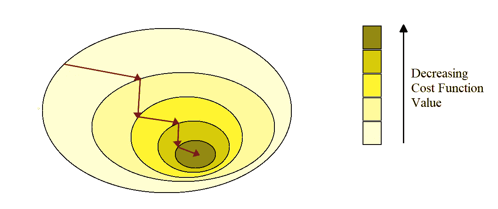

最后，小批量 GD 和随机 GD 将在最小值附近结束，批量 GD 将恰好在最小值处停止。但是 Batch GD 每走一步都要花很多时间。此外，如果我们使用一个好的学习时间表，随机 GD 和小批量 GD 将达到最小值。

所以现在，我认为你能够回答我在本文开始时提到的问题。如果你想看一个简单的 python 实现上述方法，这里是 [***链接***](https://github.com/tombro27/Gradient-Descent/blob/main/Gradient_Descent.ipynb) 。

