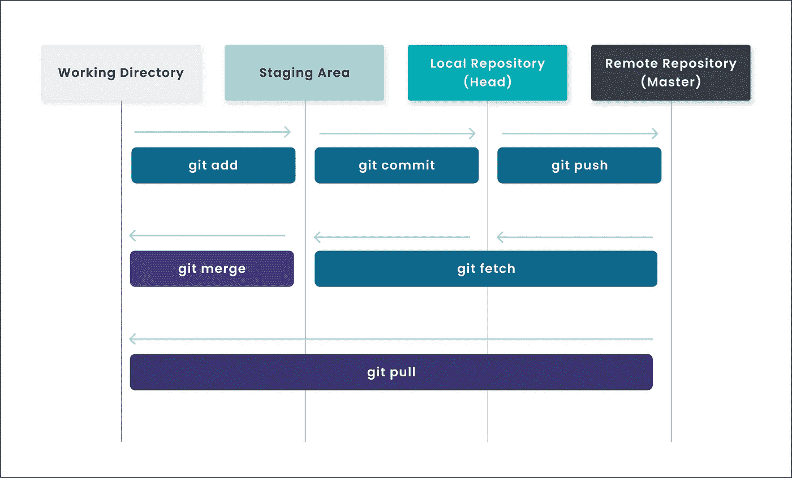

# Git 快速指南

> 原文：<https://medium.com/geekculture/quick-guide-to-git-937d0e4c6e69?source=collection_archive---------18----------------------->

## 面向初学者的 Git 基础

如果需要，您可以使用本文快速修改和复制粘贴 git 命令。这篇文章是给初学者的，由初学者写的，也是给初学者的。

# Git 是什么

Git 是跟踪任何一组文件中的变化的最酷的东西，在软件开发期间协调程序员之间的工作。开发人员依赖 Git 进行版本控制。

# 什么是版本控制？

> **版本控制**，也称为**源代码控制**，是跟踪和管理软件代码变更的实践。它记录了一个文件或一组文件随时间的变化，这样你可以在以后调用特定的版本。

Git 是一个 ***分布式版本控制系统*** 。所以 Git 不需要依赖中央服务器来存储项目文件的所有版本。相反，每个用户“克隆”一个存储库(一个文件集合)的副本，并且在他们自己的硬盘上拥有项目的*完整历史。这个克隆拥有原始版本的所有元数据，这些元数据存储在一个自托管服务器或 GitHub 等第三方托管服务上。*

## *关于 Git，需要记住几点:*

*   *维护不同版本的代码被称为版本控制。*
*   *版本控制存储完整的变更历史，如创建、删除、添加以及修改。*
*   *Git 使用分支来促进并发贡献。*
*   *它支持**可追溯性**，即使用诸如吉拉之类的缺陷跟踪软件来跟踪缺陷。*
*   *GitHub 允许我们在线托管存储库。所以 Git 和 GitHub 的区别在于 **Git 是**一个版本控制系统，让你管理和跟踪你的源代码历史，而 **GitHub 是**一个基于云的托管服务，让你管理 **Git** 库。*
*   *存储库:与项目相关的文件和文件夹的全部集合。*
*   *提交:代码的每个快照被称为一次提交。*
*   *拥有完整的本地历史使 Git 速度更快。*

**

*Git workflow*

# *Git 工作流程:*

*为了更好地理解 Git 命令，让我们首先理解 Git 工作流。*

## *Git 工作流中有四个基本元素:*

1.  ***工作目录***
2.  ***集结地***
3.  ***本地存储库***
4.  ***远程存储库***

**

***Git 有三种主要的状态(在工作目录中)，你的文件可以驻留在这三种状态中:***

1.  ***modified** 意味着您已经更改了文件，但是还没有将它提交到您的本地存储库中。*
2.  ***staged** 意味着您已经在当前版本中标记了一个修改过的文件，以进入您的下一个提交快照。*
3.  ***committed** 表示数据安全地存储在您的本地存储库中。*

**

*Git commands*

# *让我们看看一些最常用的 Git 命令:*

*   *`git init`命令在当前目录中创建新的 **Git** 存储库。*
*   *`git checkout -b <branch-name>`用于签出一个新的分支。*
*   *`git status`命令显示工作目录和暂存区的状态。*
*   *`git add .`命令将工作目录中所有新建和修改的文件添加到暂存区。*
*   *`git add *`命令将工作目录中所有新建、修改和删除的文件添加到暂存区。*
*   *`git add -u`命令只将工作目录中修改过的文件添加到暂存区。*
*   *`git commit -a -m "Message here"` 是一个命令，用于添加所有暂存到本地存储库的文件，并附带一条消息。`**-a**` *当有多个文件要提交时使用标志。**
*   *`git push origin <branch-name>`是一个命令，用于将本地存储库中所有提交的文件添加到远程存储库中。*
*   *`git log`是用于显示所有提交的命令。*
*   *`git fetch`是一个命令，用于将文件从远程存储库转移到本地存储库，但不转移到工作目录。*
*   *`git merge`是一个命令，用于将文件从本地存储库放入工作目录。*
*   *`git pull`是一个用于将文件从远程存储库直接放入工作目录的命令。相当于一个`git fetch`和一个`git merge`。*
*   *`git rm <file-name>`是用于从工作目录和暂存区删除文件的命令。*
*   *`gitignore`是一个文件，它包含我们不想推送到远程存储库的文件的名称。*

# *向 Git 添加文件的步骤:*

1.  *`pwd`查看当前工作目录。*
2.  *`git status`:查看变更后的文件。(以红色显示)*
3.  *将文件添加到暂存区`git add .`*
4.  *`git status`:检查暂存文件。(以绿色显示)*
5.  *提交临时区域中的文件，以便将它们添加到本地存储库`git commit -am "New files"`*
6.  *将文件推送到远程存储库`git push origin <branch-name>`*

## *那会让你精神抖擞。*

*希望你学到了一些东西！感谢您的阅读。*

**点击*👏*表示你的支持，并与其他媒体用户分享。**

*你可以在[***Twitter***](https://twitter.com/adilkhanforeal)**和**[***insta gram***](https://www.instagram.com/adilkhanforeal/)上找到我*

* [## Adil Khan - BBD 大学-印度北方邦勒克瑙| LinkedIn

### 在世界上最大的职业社区 LinkedIn 上查看 Adil Khan 的个人资料。Adil 有 1 个工作列在他们的…

www.linkedin.com](https://www.linkedin.com/in/iadilkhan/)*