# Kotlin 快速指南第 2 部分

> 原文：<https://medium.com/geekculture/quick-guide-to-kotlin-part-2-255499cb357a?source=collection_archive---------4----------------------->

## Android 编程语言

嗨，欢迎来到文章的第二部分。你也应该看看文章的第 1 部分。

 [## 科特林快速指南

### Android 编程语言

iadilkhan.medium.com](https://iadilkhan.medium.com/quick-guide-to-kotlin-8f340a0085ce) 

# 遗产

在 Kotlin 中，默认情况下，类是公共的和最终的，也就是说，它不开放继承。我们需要通过使用 **open** 关键字使其开放以供继承。

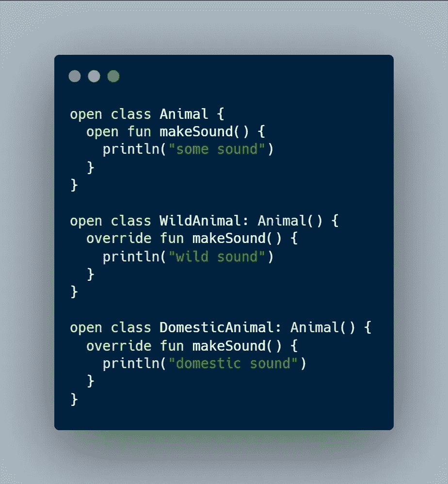

# 目标

对象的行为与 Java 中的静态行为相同。Object 类的成员和函数是单例的，不需要创建对象就可以调用。对象不能有构造函数，它支持继承。

为了以一种 Java 更容易阅读的方式公开某些 API 或字段，可以使用`@JvmStatic`注释。通过用`@JvmStatic`注释`object`中的字段或函数，它将编译成 Java 更容易使用的静态字段。

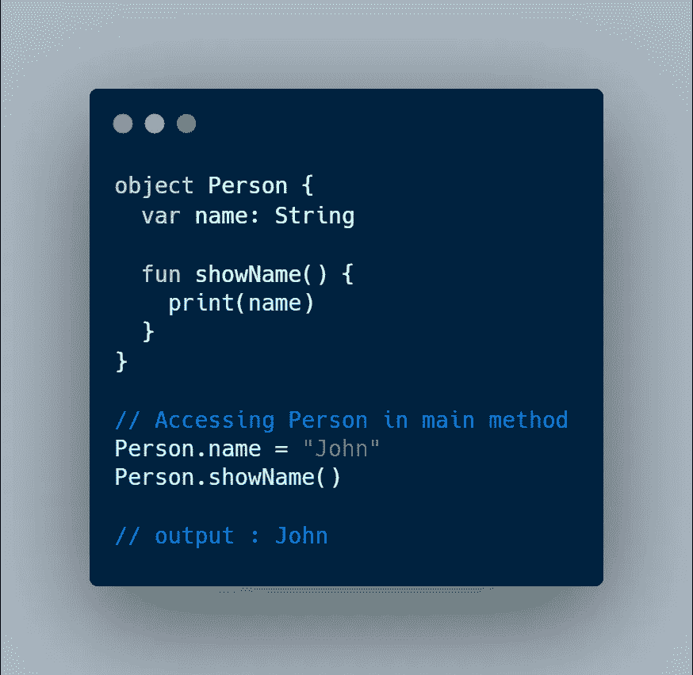

# 伴随物体

在 Kotlin 中，如果我们想要编写一个函数或类的任何成员，可以在没有类的实例的情况下被调用，那么我们可以在类中编写一个**同伴**对象的成员。因此，通过声明**伴随**对象，我们可以只通过类名访问类的成员(这不需要显式创建类的实例，类似于 java 中的 static)。

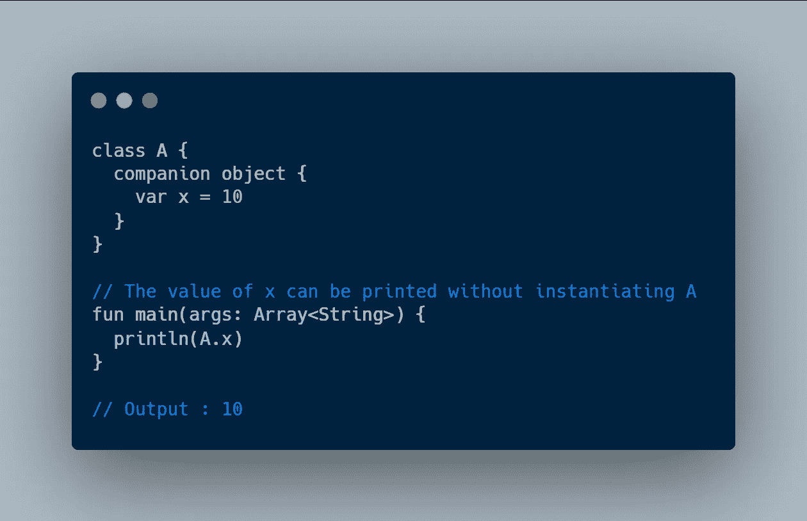

# 兰姆达斯

Lambda 是一个没有名字的函数。在 Kotlin 中，我们可以将函数作为参数传递，或者将函数作为参数返回。Lambda 在这种情况下很有用。

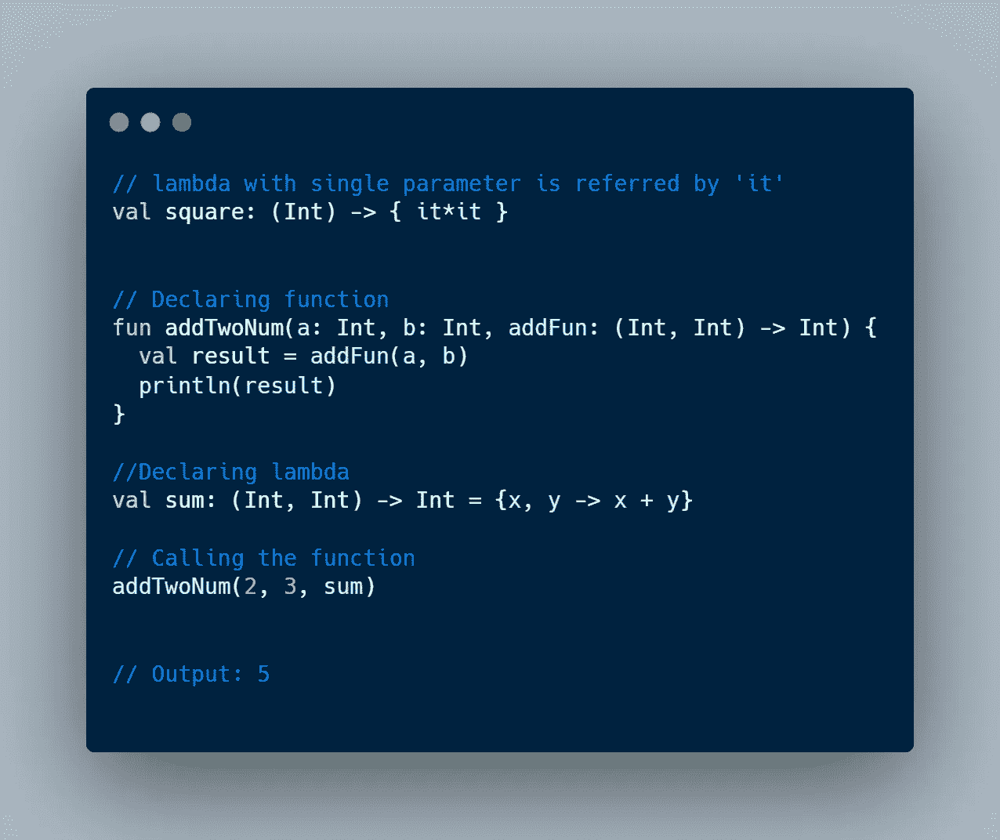

# 使用并应用

在 Kotlin 中，带有闭包的**用于初始化。 **with** 返回 lambda 结果，即 closure 的最后一条语句，而 **apply** closure 将该值返回给调用它的对象，即上下文对象。这些是范围函数。使用**和**以及**应用**时，可以使用**这个**关键字引用上下文对象。**

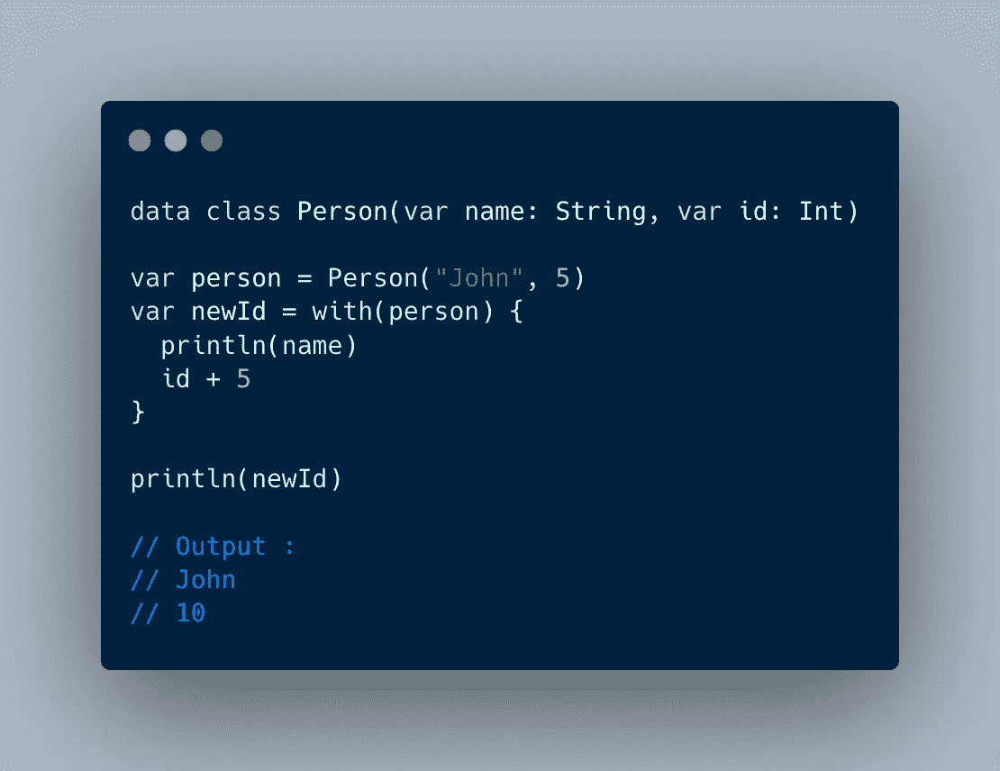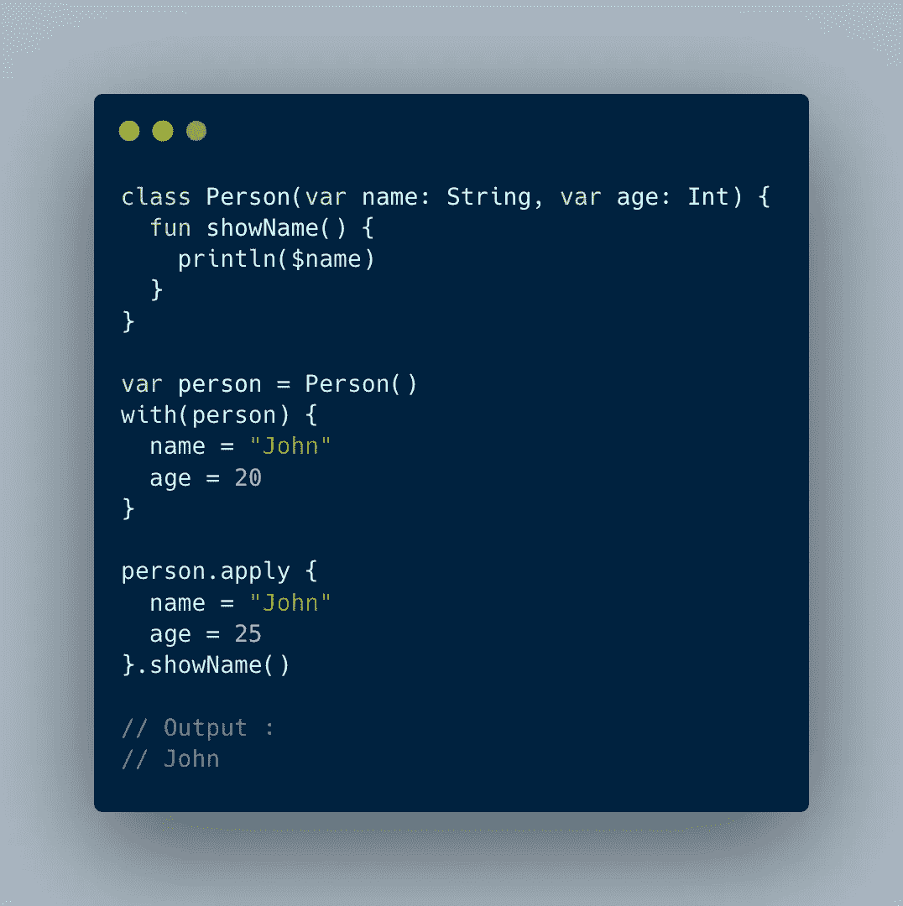

# 让

let 是一个作用域函数，可用于可空数据类型。它返回λ的值。使用 **it** 引用上下文对象。

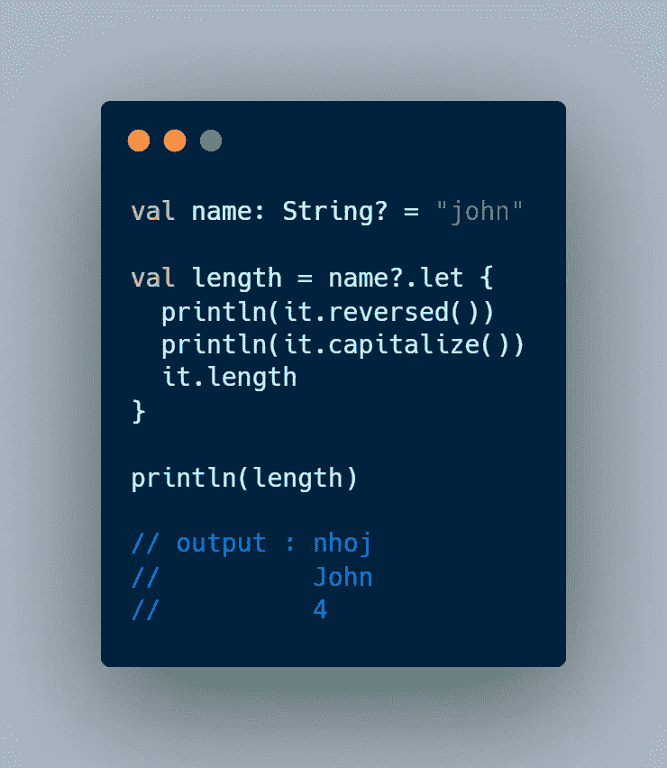

# 范围功能摘要

*   **with :** 如果我们要处理一个非空对象或者初始化它。
*   如果我们想处理一个可空的对象。
*   运行:如果我们想处理一个可空的对象。
*   **应用:**如果我们想初始化或配置一个对象。
*   **另外:**如果我们想执行一些额外的操作或配置。

# 列表和数组

在 Kotlin 中，我更喜欢使用可变列表而不是数组列表，因为现在可变列表在内部返回数组列表，但是这种实现在将来可能会改变，我们可能会在 Kotlin 中对数组列表进行一些增强。

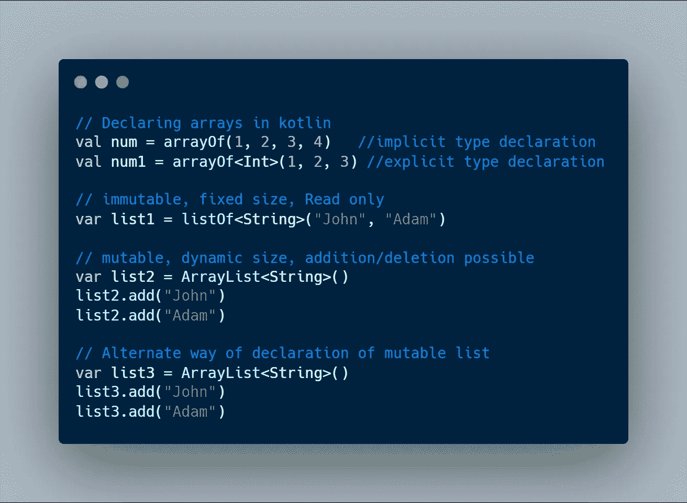

# 可见性修改器

*   **公共:**随处可达
*   **私有:**可在班级内部访问
*   **受保护:**可访问同一个包内的类&子类
*   **内部:**可在同一模块中访问

# 数据类

**任何**类都是 Kotlin 中每个类的超类。**任何**类都包含以下方法:

*   equals():布尔值
*   hashCode(): Int
*   toString():字符串
*   copy():数据类拥有上述所有方法和一个额外的 **copy()** 方法。

在数据类中，如果两个对象具有相同的内容，即使实际对象不同，equals 方法也会返回 true。

# 创建数据类的规则–

数据类必须满足以下要求，以确保一致性:

*   主构造函数至少需要一个参数。
*   所有主构造函数参数都需要标记为 *val* 或 *var* 。
*   数据类不能是抽象的、开放的、密封的或内部的。
*   数据类只能实现接口。

# toString()

该函数返回数据类中定义的所有参数的字符串。

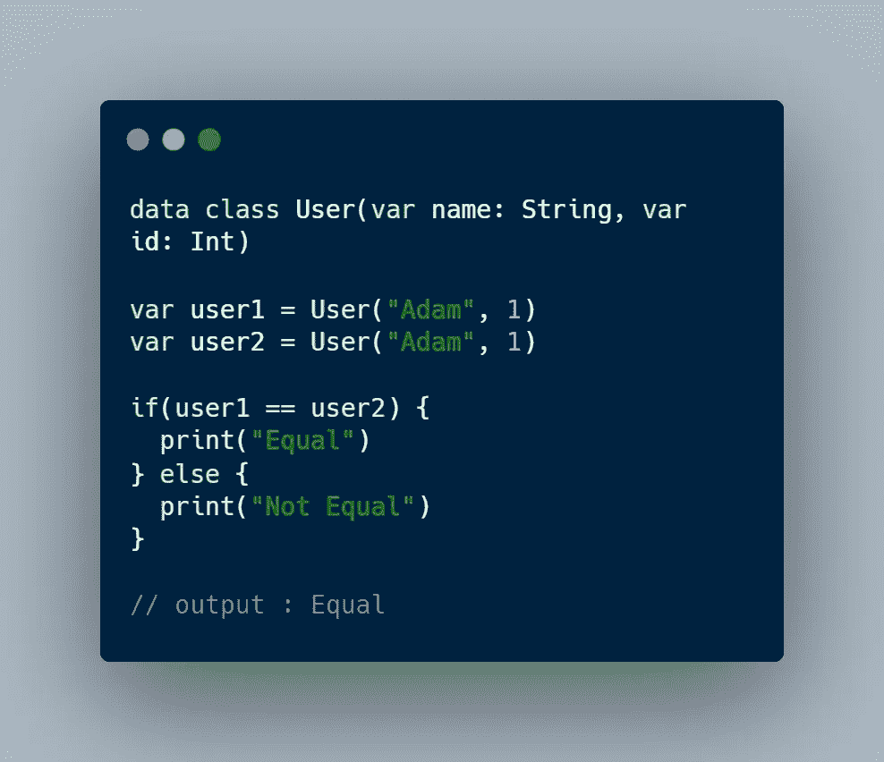

Data classes in Kotlin

# 过滤和映射

*   基本功能是过滤。
*   当用谓词调用 **filter()** 函数时，它返回与谓词匹配的集合元素。

**map()** 返回一个列表，其中包含将给定的变换函数应用于原始列表中每个元素的结果。

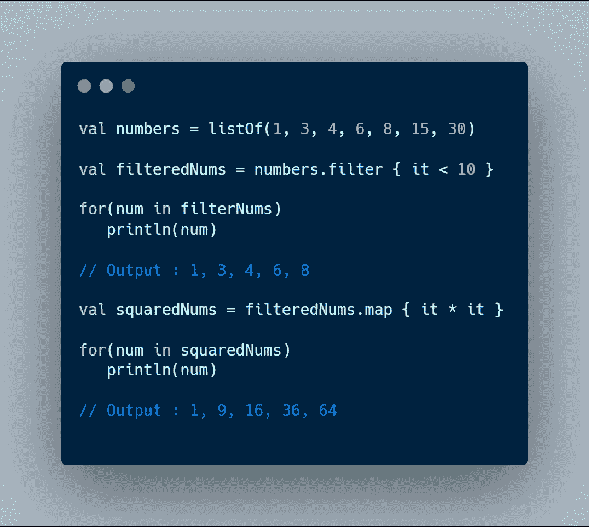

# 扩展ˌ扩张

Kotlin 让程序员能够**向现有类添加更多功能**，**而不继承它们**。这是通过称为**扩展**的功能实现的。当一个函数被添加到一个现有的类中时，它被称为**扩展函数**。

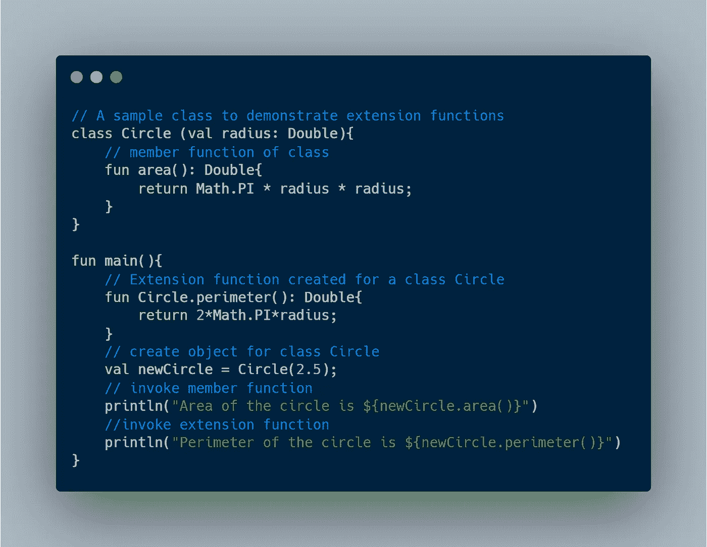

# 枚举类

在编程中，有时需要一个类型只有特定的值。为此，引入了枚举的概念。枚举是一个命名的常数列表。
在 Kotlin 中，像许多其他编程语言一样，一个**枚举**有它自己的专用类型，表示某个东西有许多可能的值。与 Java 枚举不同，Kotlin 枚举是**类**。

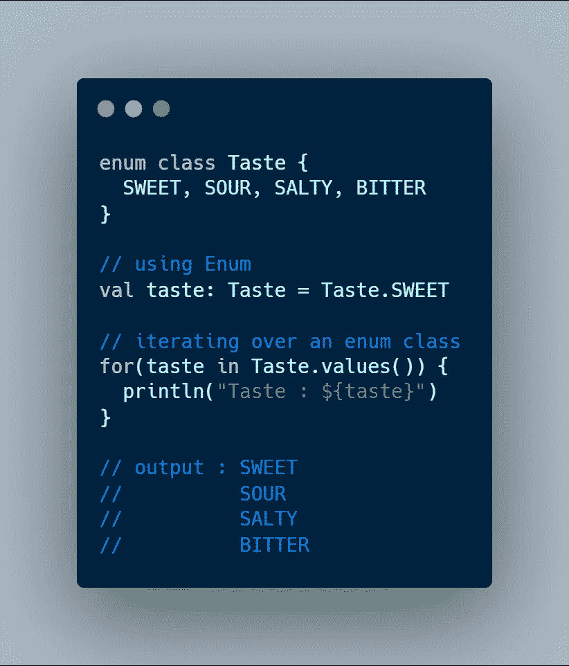

# 密封类

一个密封类在其内部定义了一组子类。当预先知道一个类型将符合一个子类类型时，就使用它。密封类通过限制在编译时而不是运行时匹配的类型来确保类型安全。

一个密封类的子类可以有多个实例。

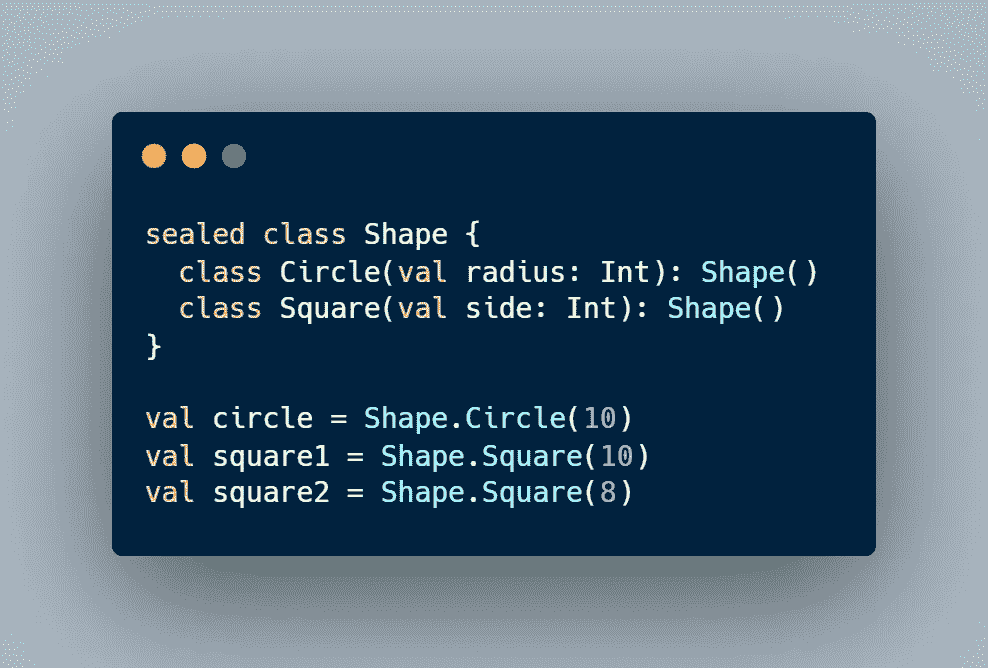

# 结论

这不是一篇关于 Kotlin 的深入文章，而是对该语言基础的粗略浏览。

希望你学到了一些东西！感谢您的阅读。

您可以在以下网址找到我:

[https://www.instagram.com/adilkhanforeal/](https://www.instagram.com/adilkhanforeal/)

https://twitter.com/adilkhanforeal

 [## Adil Khan -软件工程师 Android - Accedo.tv | LinkedIn

### 我是有超过 2.5 年经验的 android 开发人员。我也有一点 iOS(Swift)的经验。我喜欢建造…

www.linkedin.com](https://www.linkedin.com/in/iadilkhan/) 

*点击*👏表示你的支持，并与其他媒体用户分享。