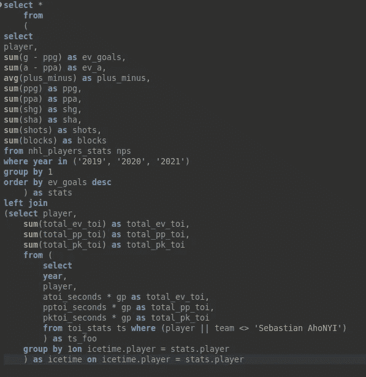
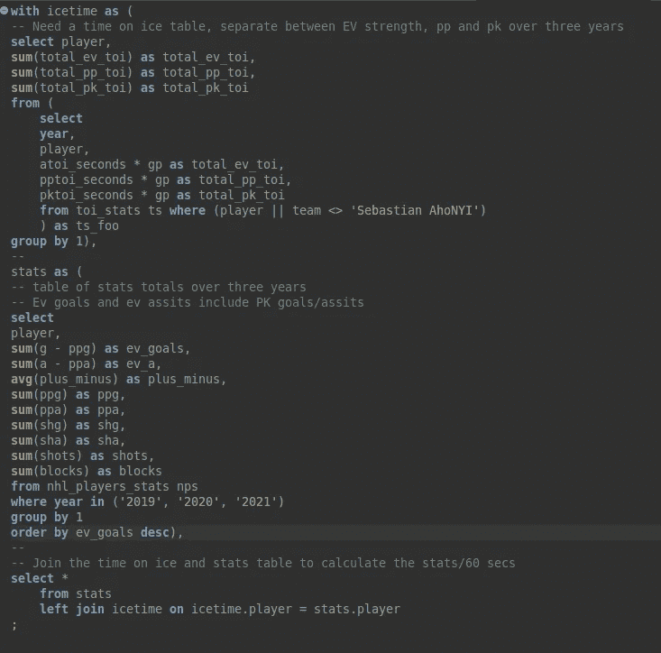

# SQL With 子句快速介绍

> 原文：<https://medium.com/geekculture/quick-intro-to-sql-with-clause-a218067d0ec8?source=collection_archive---------15----------------------->

您是否想过如何让 SQL 查询更具可读性？您曾经不得不在一个连接中多次重用同一个子查询吗？或者，您第一次在 SQL 查询中遇到了“With ”?然后继续阅读，发现 SQL 中的一个全新的可能性世界！

# **定义 With 子句**

从技术上讲，“With”子句被称为“常用表表达式”，或 CTE 的。我经历了惨痛的教训，在一次面试中没能提供任何关于“CTE”的描述，却发现在谷歌上搜索这个术语后，我一直在使用它！

这样一来，CTE 就是 SQL 中一个强大的工具:它们允许我们在查询中构建充当临时表的实体。或者作为复杂查询中可重用的子查询。甚至有可能以递归方式使用 CTE 的。CTE 的类似于视图，除了它们用于特定的用例(即在单个查询中)而不是可用于一般用途。

您的 SQL 版本的文档可能是了解“With”子句的特定语法的最佳地方，但是在 PostgreSQL 中，它使用起来非常简单，即使有多个 CTE:

```
WITH 
    *first_cte_name* as (*sql_query_here*),
    *second_cte_name* as (*sql_query_here)*SELECT ... FROM ... 
```

建立 CTE 的最基本的方法如上。只需将“With”子句添加到 SQL 查询中，将 CTE 命名为“as ”,并在括号内编写一个 SQL 查询。每个定义都用逗号分隔，直到最后一个定义。然后，像往常一样编写一个 SQL 查询。CTE 可以像任何桌子一样使用。它们可以在“FROM”中引用，在子查询中使用，或者与 SQL 查询中的现有表连接或垂直合并。

使用 CTE 语句不仅限于“选择”语句。它可以与各种语句一起使用，如 SELECT INTO、CREATE TABLE AS、CREATE VIEW、DECLARE、EXPLAIN、INSERT INTO … SELECT、PREPARE、UPDATE、DELETE。有关完整列表和适用的特殊语法，请参阅您的文档。

# 常用表表达式用例

CTE 主要用于提高可读性和简化 SQL 脚本的维护，因为我们能够重用它们。在某些情况下，它们还可以显著提高复杂查询的性能。

另一个值得一提的用例是递归 CTE(是的，SQL 中的递归！).

**CTE 的一个用例**

CTE 的方法有助于提高 SQL 脚本的可读性。以这个只有一个 join 的查询为例(使用关于玩家统计的 NHL 数据和冰上时间信息):



这是一个简单的查询。FROM 子句中有一个子查询，用于计算一组不同的玩家统计数据。该查询连接到另一个关于 icetime 信息的子查询。

现在，让我们看看使用 CTE 的构建的相同查询。



总行数稍微长了一点，但是现在我们在主查询中所做的事情更加清楚了。

它看起来已经很乱了，但是想象一下如果有几十个子查询呢？或者我们是否想重用子查询？在上面的例子中，对于体育数据，用例可以是从球员的统计表中提取球队列表，并为球队的使用、球队的进攻指标等创建查询。最后，在一个可读性更强、更简单的查询下加入所有这些 CTE。

# 结论

总之，公共表表达式——With 子句——是一个强大而简单的 SQL 子句，可以与大量语句一起使用，以简化和重用子查询。通过划分子查询，它们可以用来构建可读性更强的复杂 SQL 语句。甚至，对于最好奇的高级用户来说，CTE 可以用于 SQL 表中的递归。