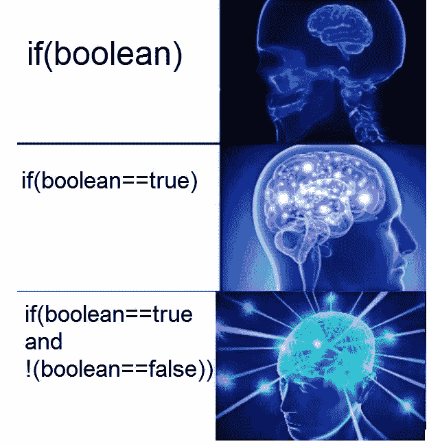

# 快速詹金斯参数清单

> 原文：<https://medium.com/geekculture/quick-jenkins-parameter-cheatsheet-2f80f503b295?source=collection_archive---------1----------------------->

## 我一直使用参数来设置逻辑条件，并将字符串数据(如版本号)注入到我的构建中，所以我做了一个备忘单。

## 让我们从布尔开始。

[1]

## 布尔参数