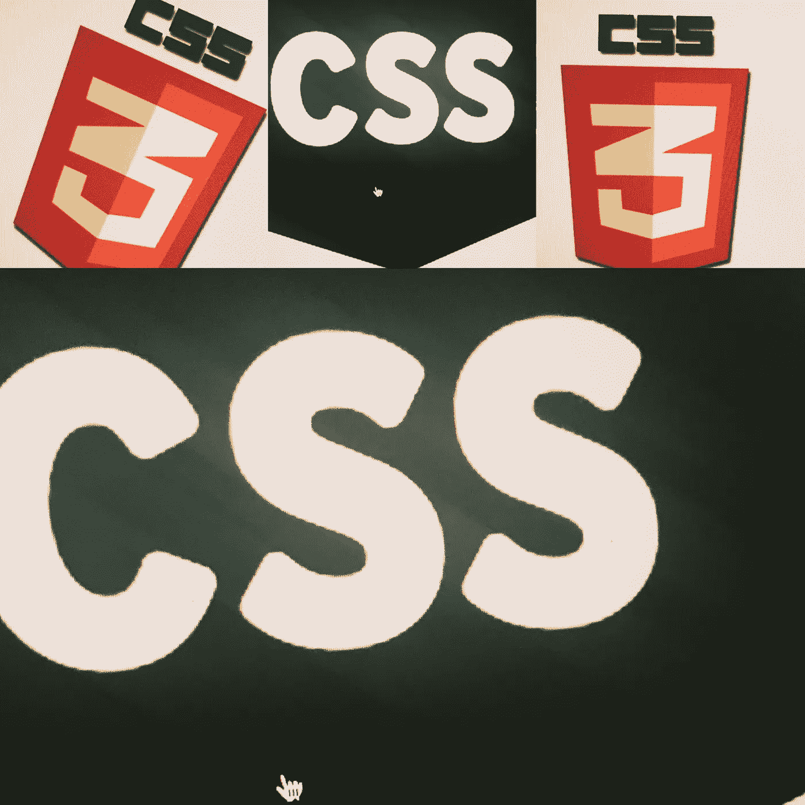
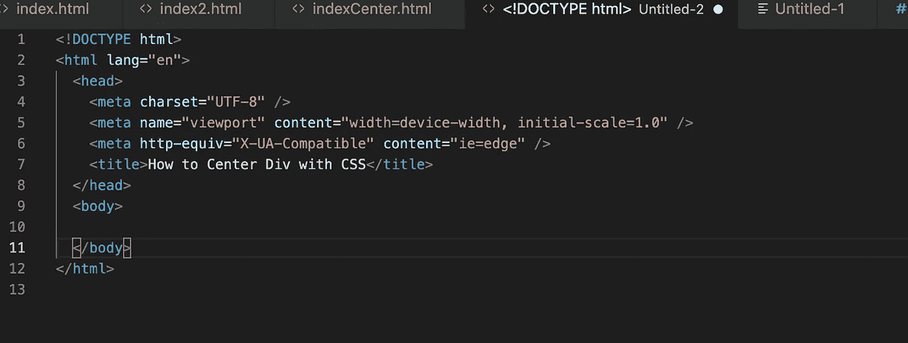
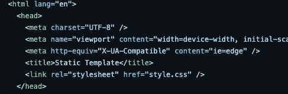
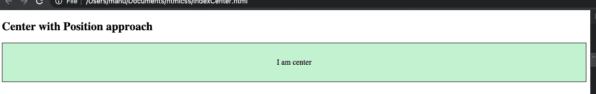
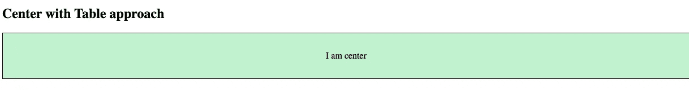
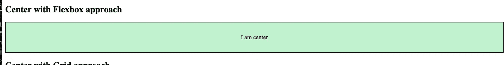
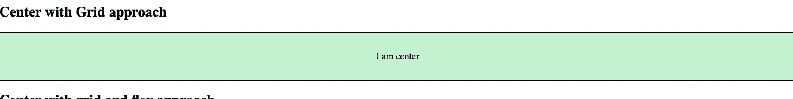
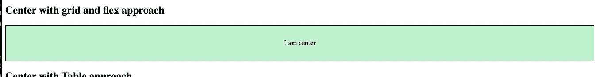

# 用 CSS 将 Div 居中最快的五种方法

> 原文：<https://medium.com/geekculture/quickest-five-way-to-center-div-with-css-5529788d3a2c?source=collection_archive---------21----------------------->

在本教程中，我们将学习如何用 CSS 将 div 居中:)

在我们开始之前，我们应该先了解 CSS 和术语，我们将使用它们来提供解决方案。

# 半铸钢ˌ钢性铸铁(Cast Semi-Steel)

> CSS 代表级联样式表
> 
> 它允许我们创建规则来指定元素的内容应该如何显示
> 
> 它让你的网页更有吸引力
> 
> 它还使用 css 控制元素的设计。

# **a) CSS flexbox**

> 它允许您设计一个灵活的响应布局结构，而不使用 CSS 的任何浮动或定位属性

# b)职位:

> CSS 属性设置元素在文档中的位置。如果你想了解更多，请点击下面的链接【https://developer.mozilla.org/en-US/docs/Web/CSS/position 

**有七种不同的位置值:**

**CSS 语法**

> 位置:静态|绝对|固定|相对|粘性|初始|继承；

# c) CSS 网格布局

**CSS Grid Layout** 擅长将页面划分为主要区域，或者根据大小、位置和层来定义由 HTML 原语构建的控件各部分之间的关系。

> CSS 网格布局是一个网页的二维布局系统
> 
> 网格-网格是水平和垂直线条的集合，创建一个模式，我们可以根据它来排列我们的设计元素
> 
> 如果你想了解更多，请访问下面的链接

[https://developer . Mozilla . org/en-US/docs/Web/CSS/CSS _ Grid _ Layout](https://developer.mozilla.org/en-US/docs/Web/CSS/CSS_Grid_Layout)

# d)。CSS 显示:

> 属性指定了元素的显示行为(呈现框的类型)。

**入门**

1.  打开任意编辑器(visual studio code，sublime，notepad++)等
2.  创建 index.html 和样式
3.  打开 index.html 并添加以下代码

4.创建文件夹 css/style.css

5.并将 css/style.css 链接到 index.html 文件中。确保 css 应该添加到头标签中。

例如

# 让我们从第一个方法开始

# 方法 1-位置居中

a)打开 index.html 文件，在正文标签中添加下面的 html 代码

> ## 位置接近中心
> 
> 我是中锋

b)打开 style.css 并添加以下代码

I)首先，我们将为所有的 div 添加一些通用 css(我们将添加边框、边距、背景色和高度)

ii)我们还会将默认的 p 标签边距设为 0。

**通用 css**

> 部门{
> 
> 高度:80px
> 
> 边距:0px
> 
> 颜色:# 000；
> 
> 边框:1px 纯色# 000；
> 
> 背景色:# C2 F2 cf；
> 
> }
> 
> p {
> 
> 边距:0；/*删除默认边距*/
> 
> }

**iii)只有位置的魔码**

为了使 div 与位置居中，我们将向父 div 和子 div 添加位置

父 div 将只具有位置——相对位置，子 div 将具有绝对位置、左侧位置、顶部位置和变换位置

> /*位置方法*/
> 
> 。绝对{
> 
> 位置:相对；
> 
> }
> 
> 。绝对压力
> 
> 位置:绝对；
> 
> top:50%；
> 
> transform: translate(-50%，-50%)；
> 
> 左:50%；
> 
> }

# 方法 2 —以表格为中心

a)打开 index.html 文件，在正文标签中添加下面的 html 代码

> ## 工作台接近中心
> 
> 我是中锋

b)打开 style.css 并添加以下代码

> /*显示表格*/
> 
> 。表格{
> 
> 显示:表格；
> 
> 宽度:100%；
> 
> }
> 
> 。表 p {
> 
> 显示:表格单元；
> 
> 垂直对齐:居中；
> 
> 文本对齐:居中；
> 
> }

# 方法 3—用 Flexbox 居中

a)打开 index.html 文件，在正文标签中添加下面的 html 代码

> ## 使用柔性盒方法居中
> 
> 我是中锋

b)打开 style.css 并添加以下代码

> 。flexbox {
> 
> 显示器:flex
> 
> 对齐-项目:居中；
> 
> justify-content:居中；
> 
> }

# 方法 4—网格居中

a)打开 index.html 文件，在正文标签中添加下面的 html 代码

b)打开 style.css 并添加以下代码

> 。网格{
> 
> 显示:网格；
> 
> 地点-内容:中心；
> 
> }

或者

> 。网格{
> 
> 显示:网格；
> 
> 对齐-项目:居中；
> 
> justify-content:居中；
> 
> }

# 方法 5-带边距的网格居中

a)打开 index.html 文件，在正文标签中添加下面的 html 代码

b)打开 style.css 并添加以下代码

> /*具有边际方法的 flexbox
> 
> 。边距网格{
> 
> 显示器:flex
> 
> }
> 
> 。marginsgrid p {
> 
> 边距:自动；
> 
> }

Github 链接下载代码—

[***点击此处下载***](https://github.com/kirti/how-to-center-div-with-css)

# 结论:

这是用 CSS 最快五种方式居中 Div 的中间故事，如果你有任何疑问，请在 kirtikau@gmail.com 上给我发邮件

关注我下面的文章:

 [## 如何添加 Docker 来创建 React 应用程序(CRA) +运行单元测试

### 在本教程中，我们将学习如何添加 docker 来创建-反应应用程序并运行单元测试。

medium.com](/geekculture/how-to-add-docker-to-create-react-app-cra-run-unit-tests-439b3b25bd2c)  [## 工具:屏幕阅读器、浏览器扩展、用于网站可访问性的色彩契约工具

### 网站无障碍工具-

kirtikau.medium.com](https://kirtikau.medium.com/tools-screen-readers-browser-extension-color-contract-tools-for-website-accessibility-1f09480c5f4)  [## 如何用 Express.js 和 Node.js 创建 REST API

### 在本教程中，我们将通过构建一个简单的 crud 用户来学习如何在 Node.js 和 Express.js 中构建一个 Rest API

medium.com](/weekly-webtips/how-to-create-a-rest-api-with-express-js-and-node-js-3de5c5f9691c)  [## Android React 原生窗口设置

### 如何为 React 原生应用设置 Android 环境

levelup.gitconnected.com](https://levelup.gitconnected.com/android-react-native-window-setup-how-to-setup-android-environment-for-react-native-app-588aaa13c3a6)  [## 如何将 Swagger UI 添加到现有 Node.js 和 Express.js 项目中

### 在本教程中，我们将学习如何向现有的 Node Js 和 Express.js 添加 swagger

levelup.gitconnected.com](https://levelup.gitconnected.com/how-to-add-swagger-ui-to-existing-node-js-and-express-js-project-2c8bad9364ce) 

**快乐学习:)**