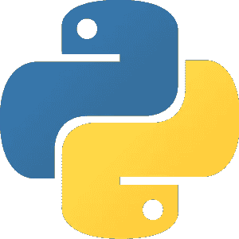

# Quickie Dev #12:一步一步的定制 Python 列表显示教程

> 原文：<https://medium.com/geekculture/quickie-dev-12-a-step-by-step-custom-python-list-displayer-3a0604491656?source=collection_archive---------15----------------------->

## 列表是 Python 中最常用的数据结构之一…那么我们如何以一种漂亮的方式打印它们呢？:)

当你写一个 Python 程序时，你必然会在某一点上创建 [**一个列表**](https://docs.python.org/3/tutorial/datastructures.html) 。列表只是这种语言最基本的特征之一:它们非常容易使用