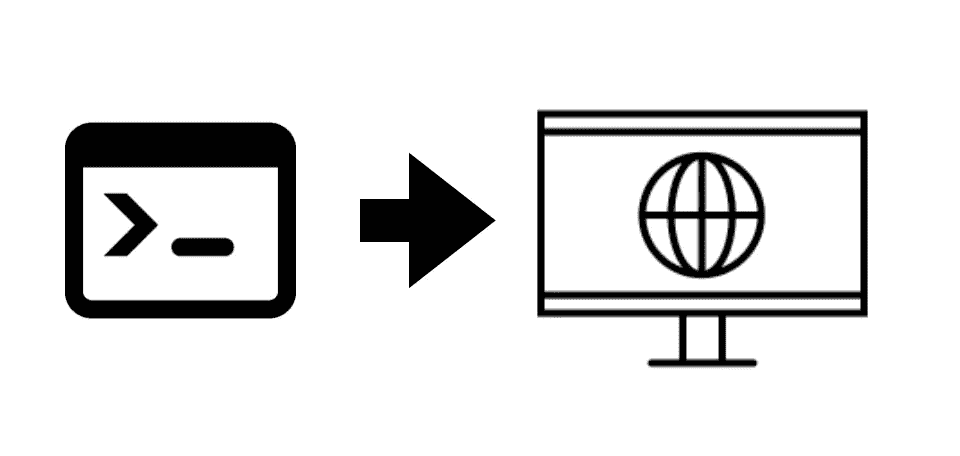
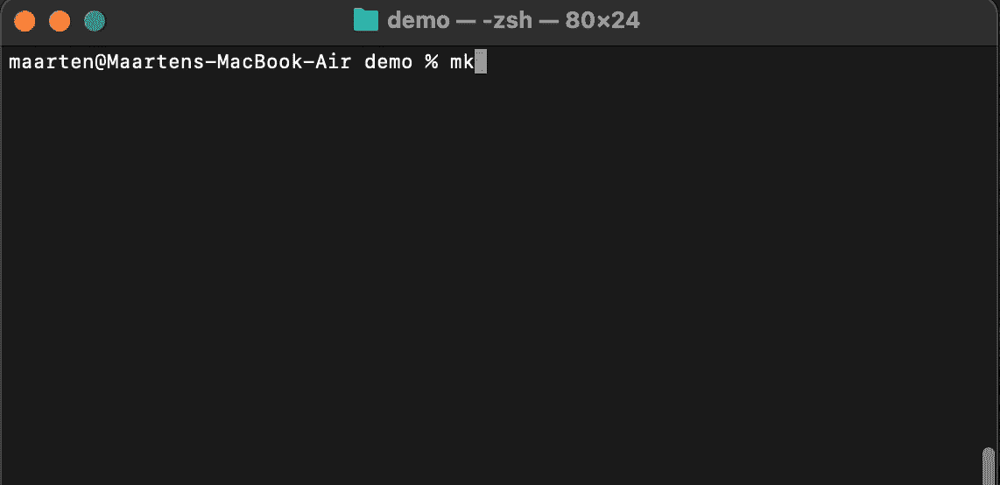
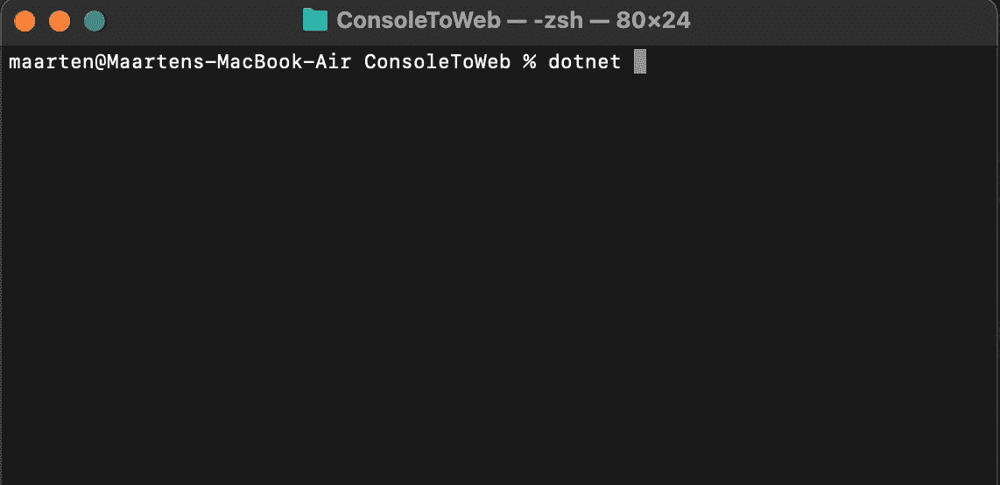
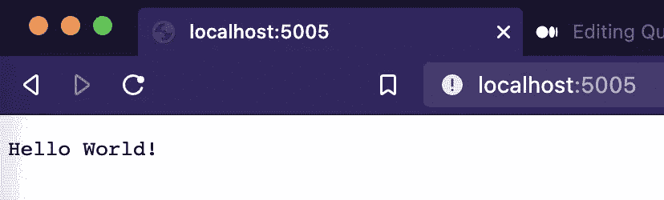
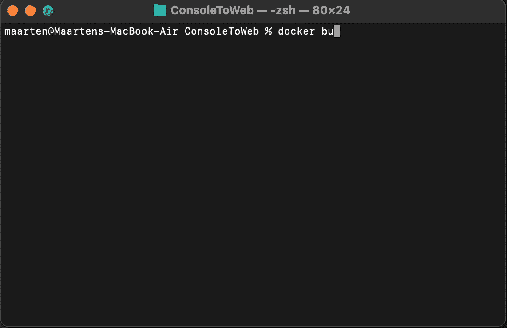
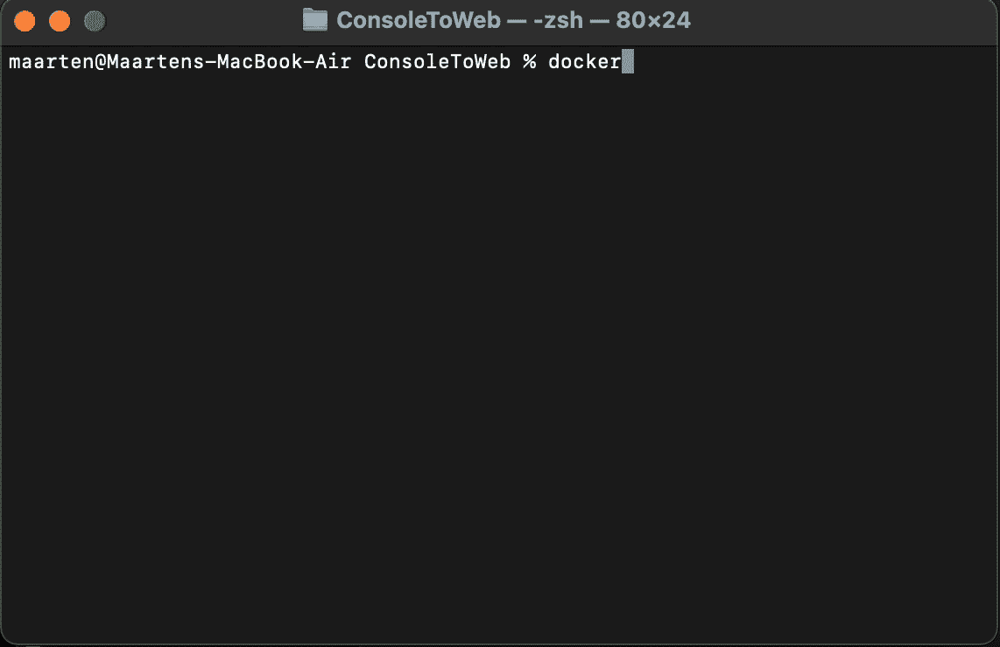
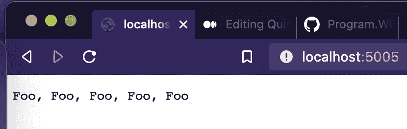

# 用 C#将控制台应用程序快速转换成单点 Web 应用程序

> 原文：<https://medium.com/geekculture/quickly-convert-a-console-app-into-a-single-point-web-app-in-c-29187d555823?source=collection_archive---------2----------------------->



我发现自己需要快速地将我的 C#控制台应用程序转换成 Web 应用程序，主要是，我被要求通过 API 公开我们的控制台应用程序的逻辑，而管理它的时间很少。

本文将介绍我最终如何在本地主机(我们的内部网络)的端口 5005 上公开我们的控制台应用程序，为了奖励，我还将附上应用程序的容器 Docker 版本！

让我们从一个简单的控制台应用程序开始:

```
mkdir ConsoleToWeb
cd ConsoleToWeb
dotnet new console
dotnet run
```



这个应用程序的源代码看起来会像这样:

要将它转换成 ASP.NET 网络应用，我们需要做 3 件事:

*   将控制台项目转换为 web 项目(csproj)
*   引入一个[通用主机](https://docs.microsoft.com/en-us/dotnet/core/extensions/generic-host)来托管我们的 Web 应用
*   重写 Main 方法来运行我们的 WebHost

## 将控制台 csproj 转换为 Web csproj

我们最初的控制台 csproj 如下所示:

对于一个 Web 项目，我们需要针对不同的**SDK**；[微软。NET.Sdk.Web](https://docs.microsoft.com/en-us/dotnet/core/project-sdk/overview)

另外，**输出类型**不需要是 **Exe。**

修改 **csproj** 文件，如下所示:

## 引入一个通用主机来托管我们的 Web 应用

IHost 类是为. NET 的新应用程序托管系统设计的一个类。它处理核心功能，如依赖注入、配置、日志记录等

我们将使用 HostBuilder 创建一个**普通 Web 主机**，它将有一个 Run 方法，该方法将从我们的控制台应用程序调用代码。

将以下代码添加到 Program.cs 文件中:

不要忘记必要的 using 语句:

```
using Microsoft.Extensions.Hosting;using Microsoft.AspNetCore.Builder;using Microsoft.AspNetCore.Hosting;using Microsoft.AspNetCore.Http;
```

## 重写 Main 方法来运行我们的 WebHost

我们就快成功了，我们只需要把它绑定到程序的主方法中。cs:

让我们检查完整的工作示例:

就是这样！现在，您可以使用`dotnet run`运行应用程序，并在浏览器中查看结果，网址为 [http://localhost:5005](http://localhost:5005)



# 把它归档！

既然我们已经开始了，让我们快速地将这个应用程序归档，这样我们就可以打包并发货了。

将一个 **Dockerfile** 添加到 ConsoleToWeb 目录的根目录。

```
touch Dockerfile
```

docker 文件的内容应该类似于:

现在已经完成了，我们可以在本地构建我们的映像并标记它:

```
docker build . -t consoletoweb
```



构建 Docker 映像后，我们可以使用`docker run -p 5005:5005 consoletoweb`在容器中运行该映像



而且在 [http://localhost:5005](http://localhost:5005) 上效果应该是一样的


# **使用 FuncR 快速添加服务**

现在仍然很强大，让我们引入一个服务，添加一些小的实现，并使用依赖注入将该服务注入到我们的 Web 应用程序中！

介绍 **IFooService** :

现在，我们可以使用一个新的类来实现这个服务，或者我们可以编写**我们需要的代码**让*string Foo(int number of foos)*方法使用带有 [**FuncR**](/geekculture/c-interfaces-to-functions-with-funcr-e7ea897ce39) 的**函数**工作。


FuncR 是一个小的。NET 标准库，使您能够在 C#中针对**接口**注册**函数**。

首先，我们需要将 FuncR 添加到项目中

```
dotnet add package FuncR
```

若要使用 FuncR，请将 ConfigureServices 方法添加到 Program.cs 文件中:

在这个 **ConfigureServices** 方法中，你可以针对 ASP.NET 的 DI 容器注册任何服务，更具体地说，上面的代码为 ***IFooService*** 注册了一个**代理**，并将*字符串 Foo(int numberOfFoos)* 方法与第 **7 行和第**8 行提供的**函数**挂钩，酷吧！？

现在我们只需要告诉 **HostBuilder** 使用这个方法来配置它的服务，我们已经准备好注入这个服务了:

如果我们现在`dotnet run`并导航到 [http://localhost:5005](http://localhost:5005) ，我们最终会看到一些不同的输出:



那是一大堆傻瓜。

当然，Docker 示例在重新构建并运行后仍然有效:

```
 docker build . --no-cache -t consoletoweb
docker run -p 5005:5005 consoletoweb
```

# 包扎

在本文中，我们看到了如何简单快速地将一个控制台应用程序转换成一个 ASP.NET web 应用程序，并介绍了 FuncR 来加速我们的服务实现。完整的代码以及更多内容可通过 GitHub 获得:

[https://github.com/merken/ConsoleToWeb](https://github.com/merken/ConsoleToWeb)