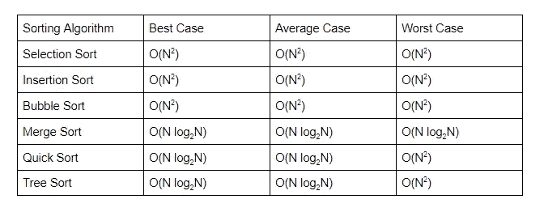

# Python 中的快速排序

> 原文：<https://medium.com/geekculture/quicksort-in-python-abf3881b3cca?source=collection_archive---------31----------------------->

## 我们都为此感到内疚。每当我们遇到需要对数组排序的问题时，我们默认实现冒泡排序。我知道我们可以做得更好！

作为快速复习，这里有一个不同排序算法及其大 O 符号的表格。

