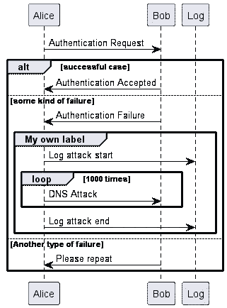

# 停止绘图——让我们编码一个 UML 图

> 原文：<https://medium.com/geekculture/quit-drawing-lets-code-a-uml-diagram-22b5a853a8c0?source=collection_archive---------2----------------------->

> 作为开发人员，绘制 UML 图有助于我们更好地传达开发逻辑。

我一直使用可视化范例来绘制 UML 图，直到我发现了这个插件— *PlantUML* ，在这个插件中，我们可以使用非常简单的语法来编写 UML 图。

Sample Diagram Using PlantUML